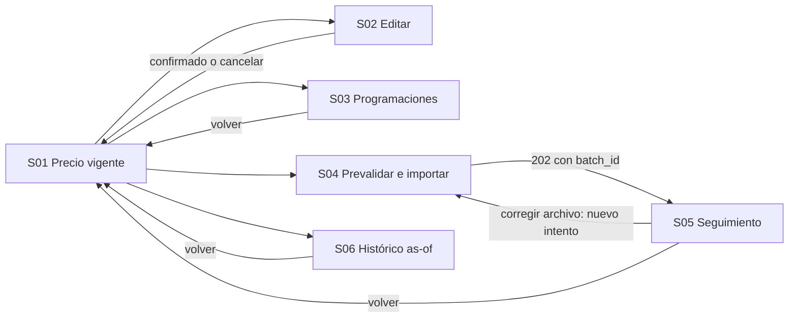

# MK-013 — Component Spec: gestión de precios individuales y masivos

## 1. Identificación y estado

| Campo | Valor |
|---|---|
| Issue / coordinación | #66; ejecución general #61; entradas transversales #59 y #60 |
| Responsable / rama | Leonardo Vera Rodríguez (`LeonardoVera`) / `vera` |
| Versión / fecha | 1.0.0 / 2026-10-02 |
| Estado documental | En revisión; no acredita aprobación funcional, implementación ni visto bueno para Figma |
| Funcionalidad | Pricing: precio base del producto, override por SKU, canal, vigencias e importación local |
| Plataforma | Web desktop; revisión a 1440 × 900 px, con scroll vertical |

Este documento define el resultado esperado. [Plan](plan.md) establece cómo construirlo y [Tasks](tasks.md) contiene las verificaciones. La especificación se basa en la revisión `ea9c4f1` de `vera`; las cuatro fuentes transversales coinciden con `origin/master` en esa revisión. Disponibilidad documental no equivale a aprobación de estas pantallas.

## 2. Fuentes y trazabilidad

| Fuente | Alcance consumido |
|---|---|
| [SPEC-013](../../specs/SPEC-013-gestion-precios-individuales-masivos.md) | §§1–7: ownership, resolución por SKU, inicialización, edición, vigencias, importación y auditoría |
| [HU-013](../../hu/HU-013-gestion-precios-individuales-masivos.md) | CA-01 a CA-10; cobertura visible y límites de validación backend en §14 |
| [WF-013](../../wireframes/flows/WF-013-gestion-precios-individuales-masivos.md) | Las seis pantallas, herencia y ausencia de mensajes del broker en UI |
| [FLOW-013](../../flujos/FLOW-013-gestion-precios-individuales-masivos.md) | §4.1 inicialización automática; §4.2 consulta/histórico; §4.3 edición/programación; §4.4 importación |
| [OpenAPI 0.5.0](../../api/openapi.yaml) | `Precio`, `PrecioProducto`, `PrecioUpdateRequest`, programaciones, prevalidación y lote; incluye aliases YAML de paginación |
| [AsyncAPI](../../asyncapi/asyncapi.yaml), [Contrato API](../../Contrato_Api.md) | Hechos postcommit y límites de ownership; no comandos manuales de inicialización |
| [Propuesta UX](../ux/propuesta-ux.md), [UX Decisions](../ux/ux-decisions.md), [UX Guidelines](../ux/ux-guidelines.md) | UX 2.0; UXD-001 a 012 y reglas aplicables de §14 |
| [Design System](../DESIGN.md) | Versión 1.0.0: foundations, catálogo DS-C, desktop y semántica de estados |
| [Pipeline](../README.md), [Prototipo](../prototipo/README.md), [Gobernanza](../../EQUIPO_Y_RESPONSABILIDADES.md) | Rutas, estructura, autovalidación, revisión transversal y Figma posterior |
| [Plantilla Component Spec](../_plantillas/mockup/component-spec.template.md) | Estructura instanciada y decisiones locales |

El contrato ejecutable vigente prevalece para nombres de campos y respuestas. Las referencias del FLOW a una versión anterior de OpenAPI no congelan esa versión. Una ruta `provisional-internal` sirve de referencia del prototipo, sin presentarla como interfaz estable productiva.

## 3. Objetivo, alcance y éxito

El Gestor Comercial identifica qué precio usa un producto/SKU, modifica el alcance correcto con motivo, programa vigencias futuras y verifica resultados de una carga exclusiva de Pricing. Éxito significa reconocer precio base frente a override, confirmar cambios con su respuesta real y localizar filas rechazadas sin atribuir a Pricing cambios en Catálogo o Inventario.

Incluye consulta vigente, edición regular/oferta, conservación/establecimiento/retiro de oferta, programación, prevalidación/importación, seguimiento/reporte y consulta histórica as-of. Excluye CRUD de productos/variantes, activación del producto, inicialización manual, reanudación de lotes, rollback entre dominios, cancelación de programaciones y edición de auditoría. El histórico de vigencias de MK-013 y los asientos de MK-014 son consultas diferentes.

## 4. Inventario completo de pantallas P0

| ID | Propósito y entrada | Acción principal / salida | Ruta directa |
|---|---|---|---|
| MK-013-S01 | Precio vigente; contexto de producto y SKU explícitamente seleccionado | Consultar; abrir edición/programación/histórico o carga | `/MK013/S01` |
| MK-013-S02 | Editar precio; lectura previa del objetivo y su versión | Guardar cambios; resultado confirmado o revisión del conflicto | `/MK013/S02` |
| MK-013-S03 | Consultar programaciones y crear vigencia futura para el objetivo | Programar precio; programación creada, sin declarar precio vigente | `/MK013/S03` |
| MK-013-S04 | Seleccionar archivo, prevalidar y revisar política parcial | Confirmar importación; aceptación hacia S05 | `/MK013/S04` |
| MK-013-S05 | Seguimiento y resultado del lote identificado | Consultar estado / descargar reporte disponible / corregir archivo en S04 | `/MK013/S05` |
| MK-013-S06 | Histórico por SKU/canal e instante, desde S01 | Consultar precio en ese instante; volver con contexto | `/MK013/S06` |

Cada ruta carga un contexto fixture válido sin recorrido previo. Estados de §12 se reproducirán con `?fixture=<ID>`, solo en el prototipo; no son parámetros del API. Si no hay contexto real, se solicita seleccionar producto/SKU antes de mutar. No se selecciona automáticamente la primera variante.

## 5. Navegación y jerarquía



Primaria: objetivo, alcance efectivo, precio/moneda y acción de la pantalla. Secundaria: oferta, vigencias, estado, versión para comparación y resultados por fila. Complementaria: identificadores de seguimiento y reporte. Retorno conserva selección, canal e instante de consulta; cambiar objetivo con cambios sin guardar requiere conservar o descartar explícitamente. El shell utiliza el grupo «Precios» y nombres de tareas, sin IDs MK/WF visibles.

## 6. Datos y operaciones admitidas

Base HTTP del contrato: `/api/v1`. Los paths de la tabla se añaden a esa base; no son rutas de navegación del prototipo.

| Uso | Operación / datos | Regla de representación |
|---|---|---|
| Precio efectivo SKU | `GET /precios/skus/{sku}`; `canal`, `at` opcionales; respuesta `Precio` | `origen=PRODUCTO` identifica base/herencia; `SKU_OVERRIDE` identifica específico. `channel_id=null` significa alcance global efectivo, incluso si se solicitó un canal |
| Precio base del producto | `GET /precios/productos/{productoId}` → `PrecioProducto` | No añadir `at` ni filtro de canal al GET de producto. Leer el objetivo de escritura, no reutilizar suposiciones de otra consulta |
| Editar | `PATCH /precios/productos/{productoId}` o `/precios/skus/{sku}` → 200 | `PrecioUpdateRequest`: `accionPrecioOferta`, `moneda`, `motivoCambio`, `priceVersion` obligatorios; `precioRegular`, `precioOferta`, `channelId` según intención |
| Programaciones | `GET` de `/precios/productos/{productoId}/programaciones` o `/precios/skus/{sku}/programaciones`; `pagina`, `tamanio` | Páginas con `items` y `PageMeta`. No añadir búsqueda, orden o filtro de canal que el GET no declara |
| Crear vigencia | `POST` de esos paths → 201 | `ProgramacionPrecioRequest`: `tipoPrecio`, `importe`, `moneda`, `validFrom`, `motivoCambio`; `channelId` y `validUntil` opcionales. No inventar `priceVersion` en esta solicitud |
| Prevalidar | `POST /precios/importaciones/prevalidar` → 200 | Multipart `archivo` requerido y `allow_partial` opcional; respuesta `valid`, `total_rows`, `errors`. No incluye catálogo completo de filas válidas |
| Importar | `POST /precios/importaciones` → 202 | Mismo multipart; fijar explícitamente la política elegida, sin asumir default del servidor. Respuesta `batch_id`, `status=QUEUED`, `allow_partial`, `correlation_id` |
| Seguimiento | `GET /precios/importaciones/{batchId}` | `QUEUED`, `PROCESSING`, `COMPLETED`, `PARTIAL`, `FAILED`; contadores publicados y `rows` si se incluyen |
| Reporte | `GET /precios/importaciones/{batchId}/reporte` → CSV | Descarga contractual; manejar rechazo/fallo sin generar reporte ficticio |
| Histórico | `GET /precios/skus/{sku}?at=…`, con canal opcional | `Precio.vigencia_id`, `valid_from`, `valid_until` y origen efectivo; un precio resuelto as-of, sin inventar endpoint de timeline completo |

### Reglas de formulario y seguridad

- Precio regular positivo; oferta, cuando se establece, positiva y menor que el regular pertinente. No imponer precisión monetaria o longitud de motivo no publicada; formato de lectura puede usar dos decimales sin alterar el valor enviado.
- «Conservar oferta» → `CONSERVAR`; «Establecer oferta» → `ESTABLECER` con importe; «Retirar oferta» → `ELIMINAR`, sin enviar un cero como ausencia. Al cambiar opción se conserva o descarta con aviso el importe introducido.
- Moneda de tres caracteres en el request, inicializada desde la lectura; canal global se serializa `null`. Opciones canónicas conocidas: Marketplace, Chatbot, Retail y Ventas; sin crear canales desde el formulario.
- «Precio del producto» afecta el precio base que pueden heredar variantes; «Precio específico del SKU» afecta el SKU seleccionado. La confirmación describe alcance, canal y propuesta sin contar variantes afectadas si esa cantidad no está disponible.
- Para un PATCH, `priceVersion` procede de la lectura del mismo objetivo/alcance. `VERSION_CONFLICT` conserva propuesta; releer, comparar y confirmar una nueva intención. La versión se muestra en comparación, no como campo editable.
- Fecha futura respecto al reloj de escenario; fin opcional posterior al inicio. Superposición del mismo objetivo/canal se presenta con error persistente. No afirmar que la comprobación local sustituye la validación del servidor.
- `GESTOR_COMERCIAL` es el actor. 401 detiene escritura y explica sesión; 403 explica permiso. Validación de token/introspección pertenece al servidor; no mostrar JWT, scopes, brokers o nombres de mensajes.
- Timeout de escritura no equivale a rechazo. Releer precio o consultar lote/programación si hay referencia disponible; una lectura coincidente no prueba autoría del cambio. Sin referencia tras un POST ambiguo, no ofrecer reenvío automático ni «Reanudar».

## 7. Componentes compartidos

| Componentes del Design System | Pantallas | Uso y variantes |
|---|---|---|
| DS-C01 Button, C02 ActionIcon, C28 Breadcrumbs | S01–S06 | Principal md 40 px, secundaria/terciaria, retorno y cerrar con nombre accesible |
| DS-C03 TextInput, C04 NumberInput, C05 Textarea, C06 Select, C09 RadioGroup, C11 DateField | S01–S04, S06 | Etiquetas, moneda/alcance, motivo y fechas; estados filled/error/focus/loading según operación |
| DS-C13 FilterBar, C15 Pill | S01, S06 | Contexto aplicado y consulta admitida; diferenciar selección pendiente de consulta aplicada |
| DS-C17 Table, C18 Pagination | S01, S03, S04, S05 | Tabla semántica; paginar programaciones con meta; sin checkbox de edición masiva de filas |
| DS-C14 Badge, C19 Card, C22 Alert/Result | S01–S06 | Origen, alcance, resultado persistente y comparación; éxito solo confirmado |
| DS-C21 Modal | S02–S04 | Confirmación breve 480 px, sin modales encadenados; formulario extenso en página |
| DS-C24 Skeleton/Loader, C25 EmptyState | S01–S06 | Lectura inicial, envío localizado, ausencia o indisponibilidad diferenciada |
| DS-C26 Stepper | S04 | Dos etapas dependientes: «Archivo y validación» → «Revisión y confirmación»; corregir invalida prevalidación anterior |

El selector de archivo se compone con control nativo etiquetado y estos componentes; no inventa tokens, extensiones aceptadas, plantilla CSV ni límite de MB. No usar Switch para confirmar una importación o retirar una oferta.

## 8. Componentes locales y contratos de presentación

Los tipos siguientes son props del prototipo; no amplían el DTO del API. `contexto` y estado de UI se mantienen separados de `payload`.

| ID | Pantallas / propósito | Props y restricciones | Estados, interacción y accesibilidad |
|---|---|---|---|
| MK-013-C01 ContextoPrecio | S01–S03, S06; objetivo y resolución | `contexto:{productId:string,sku:string,tipo:'simple'\|'variante',nombre?:string}`; `payload:Precio` o `PrecioProducto`; `canalSolicitado?:Canal`. Nombre/tipo son fixture contextual de Catálogo, no datos inventados del DTO Pricing | Carga/confirmado/no encontrado/error; etiqueta «Hereda precio del producto» solo para variante y `origen=PRODUCTO`; global efectivo separado del canal solicitado |
| MK-013-C02 FormularioPrecio | S02; precio actual y propuesta | `objetivo:'producto'\|'sku'`, lectura del objetivo, borrador `PrecioUpdateRequest`, `busy:boolean`, errores por campo | Conserva/establece/retira oferta; agrupa objetivo → importes → motivo → revisión; primer error recibe foco al envío inválido |
| MK-013-C03 ComparacionConflicto | S02; versión obsoleta | `leido`, `propuesto`, `actual?:Precio\|PrecioProducto`; actuales solo después de GET exitoso | «El precio cambió desde tu consulta»; releer, revisar o cancelar. No sustituir versión silenciosamente ni habilitar guardado hasta revisar |
| MK-013-C04 ProgramacionesPrecio | S03; lista + nueva vigencia | `objetivo`, `items`, `meta`, `borrador:ProgramacionPrecioRequest`; sin props de cancelar/editar programación | Vacío/lista/creando/creada/superposición/error; formulario visible independiente del listado; paginación etiquetada y foco de error |
| MK-013-C05 RevisionImportacion | S04; archivo y política explícita | `archivo:File\|null`, `allowPartial:boolean`, `prevalidacion?:PrevalidacionPrecio`; no columnas supuestas de archivo | Archivo seleccionado/prevalidando/errores/revisión/enviando/rechazo; cambio de archivo o política exige nueva revisión; errores por `row_id` y texto humano |
| MK-013-C06 ResultadoImportacion | S05; admisión, contadores y filas | `aceptacion?:ImportacionPrecioAceptada`, `resultado?:EstadoImportacionPrecio`, `fechaConsulta?:string`; `rows` ausente no se convierte en lista de éxitos | Recibido/procesando/terminal/desactualizado; «Consultar estado», descarga contractual, corrección hacia nuevo intento. Estado anunciable sin robar foco |
| MK-013-C07 PrecioEnInstante | S06; histórico as-of | `sku`, `canal?:Canal`, `at:string`, `payload?:Precio`; contexto histórico independiente del vigente | Consulta/resultado/no encontrado/error; fecha con zona, no controles de mutación sobre un precio histórico |

## 9. Especificación de cada pantalla

### MK-013-S01 — Precio vigente

Breadcrumbs → título «Precios» → selección explícita de producto/SKU y canal de consulta → card de contexto y tabla de precio regular, oferta, moneda, alcance efectivo, vigencia y origen → acciones «Editar precio», «Programar precio», «Consultar histórico» y acceso «Importar precios». Componente C01 y DS de §7. Un SKU conocido puede consultarse sin agregar un listado administrativo de todos los precios. Si el nombre no está disponible, identificar por SKU; el productId se conserva como contexto técnico.

Estados: inicial, simple/base, variante heredada, override, canal solicitado con fallback global, sin precio (404), error y refresco fallido conservando última consulta marcada. «Sin oferta» corresponde a null, nunca a precio cero. Sin precio no ofrece reinicializar producto ni fingir que Pricing está preparado. Acciones de edición requieren lectura correcta del objetivo.

### MK-013-S02 — Editar precio

Título y retorno → C01 con alcance de escritura → C02 con precio regular, acción de oferta e importe condicional, moneda/canal y motivo → resumen antes/después → «Guardar cambios» y «Cancelar». Revisión crítica mediante confirmación DS-C21, sin incluir un segundo formulario modal. Motivo vacío produce «Indica el motivo del cambio»; oferta inválida identifica la relación con el regular. Un 200 permite «Precio actualizado» y usar datos devueltos.

Conflicto 409 despliega C03 persistente y relee el mismo objetivo; no reenvía con versión nueva automáticamente. Superposición y rechazo de negocio conservan el borrador. Carga/error de la lectura bloquea mutación con explicación. Cancelar con cambios pide seguir editando o descartar; Escape no pierde propuesta.

### MK-013-S03 — Programaciones y vigencia futura

Título «Programaciones de precio» y C01 → C04: tabla de tipo, importe, moneda, canal, inicio/fin y estado, seguida del formulario de nueva vigencia → «Programar precio». `SCHEDULED` se traduce «Programado», `ACTIVE` «Vigente», `HISTORICAL` «Histórico» y `CANCELLED` «Cancelado» solo como lectura. Tipo regular/oferta controla etiqueta del importe; inicio con fecha/hora/zona, fin opcional y motivo obligatorio.

Éxito 201: «Precio programado» con intervalo retornado, sin reemplazar precio vigente. Errores de fecha/importe y 409 superposición son persistentes; fallo del listado no fabrica programaciones ni oculta el formulario si su lectura de objetivo sigue siendo válida. No ofrecer «Cancelar programación» por la mera existencia del enum.

### MK-013-S04 — Carga masiva de precios

Título «Importar precios» → aviso de alcance exclusivamente Pricing → etapa archivo/prevalidación (C05) → revisión de nombre de archivo, total de filas publicado, errores y política `allow_partial` → confirmación «Confirmar importación». Selector de política: «Rechazar el lote si hay errores» / «Permitir resultados parciales». Explicar que no constituye una transacción con Catálogo/Inventario.

La decisión de habilitar confirmación con errores prevalidables depende de Q-013-02, no se deduce únicamente de `valid=false`. Error de transporte/archivo no pasa a revisión. 202 con batchId navega a S05 con «Solicitud recibida». Rechazo 400/413/422 mantiene archivo/contexto sin lote ficticio. Formato, cabeceras y preview de filas válidas quedan sujetos a Q-013-01; el mockup no ofrece una plantilla descargable sin fuente.

### MK-013-S05 — Resultado de carga

Título «Resultado de importación» → referencia de lote → C06 con estado persistente → contadores total/confirmadas/fallidas publicados → tabla de filas disponibles → «Consultar estado», «Descargar reporte» cuando corresponde al resultado y «Corregir archivo» tras fallos. `PARTIAL` se traduce «Completado parcialmente» y conserva filas confirmadas; nunca «Todo actualizado».

Mientras se procesa se informa estado, no porcentaje inventado ni conteo de pendientes sin datos fiables. Ausencia de `rows` se explica como «Detalle de filas no disponible»; no es éxito de todas. Un fallo de actualización conserva resultado con antigüedad. Corrección genera un nuevo intento a partir del archivo corregido; no reenvía automáticamente filas ya confirmadas ni mantiene batchId como si fuera reanudación.

### MK-013-S06 — Histórico de vigencias

Título «Precio en una fecha» → SKU/canal e instante requerido → «Consultar precio» → C07 con regular/oferta, moneda, origen, alcance, intervalo y referencia de vigencia si ayuda a seguimiento → «Volver a precios». Un 404 significa «No encontramos un precio para este SKU en la fecha consultada». No presenta un timeline completo ni «quién cambió»: esa auditoría corresponde a MK-014. Precio anterior a la consulta no se presenta como vigente hoy.

## 10. Decisiones locales

| ID | Problema / alternativas | Elección, fuente y trade-off | Validación |
|---|---|---|---|
| LUX-013-01 | Editar base o override puede afectar un objetivo distinto; formulario único ambiguo frente a alcance explícito | Selección y lectura del objetivo antes de editar; resumen de alcance fijo durante propuesta. SPEC §§2–5 y FLOW §4.3. Añade una decisión, evita aplicar versión del SKU al producto | Fixtures heredado/override y confirmación con objetivo correcto |
| LUX-013-02 | Programar no equivale a editar inmediatamente; modal aislado frente a lista + formulario | Página S03 con programaciones y formulario, preservando contexto. WF y POST 201. Ocupa espacio vertical pero hace visibles intervalos/estados y evita anidar modales | Crear programación conserva precio vigente y muestra intervalo futuro |
| LUX-013-03 | Importar depende de prevalidación; formulario plano frente a dos etapas reales | S04 usa dos etapas con revisión de política, sin pasos ficticios para cada campo. FLOW §4.4. Exige revalidar archivo/política cambiados | No confirmar resultados de otro archivo; corrección vuelve a etapa válida |
| LUX-013-04 | «Histórico» podría sugerir asientos o listado temporal inexistente | S06 consulta un instante mediante `at`; no timeline inventado. FLOW §4.2 y `Precio.vigencia_id`. Requiere elegir instante, mantiene evidencia disponible | Resultado identifica vigencia; no editar ni restaurar histórico |

Estas decisiones no agregan negocio ni sustituyen UXD. Patrones compartidos con otros MK se consumen del Design System, no se redefinen como decisión local.

## 11. Composición desktop y accesibilidad

Shell: header 64 px, sidebar 240 px, padding 32 px; ancho útil 1136 px. Grid interior 12 columnas/gutter 24 px. Formularios hasta 880 px, dos campos equivalentes por fila; motivo y comparaciones ocupan ancho disponible. Tabla de vigentes: SKU/origen, regular, oferta, moneda, alcance e intervalo; datos auxiliares en card o detalle para evitar comprimir celdas. Programaciones y resultados envuelven texto; no scroll horizontal de página.

Aplicar tokens y tipografías de [DESIGN](../DESIGN.md), no defaults de Mantine ni estilo gris de wireframe. Botones/inputs md 40 px; filas mínimo 48 px; tablas semánticas con headers; números alineados a derecha, estados textuales. Tabler 16/20/24 px, stroke 2. Foco visible, label/error asociados, región live para consulta/envío, foco contenido y restituido en confirmaciones. Fecha/hora indican zona; fixtures usan UTC para comparación determinista y pueden mostrarse en America/Bogota manteniendo el instante.

## 12. Fixtures deterministas requeridos

Todos son datos ficticios de revisión; no existen todavía archivos JSON ni código que los ejecute. Reloj de escenario `2026-10-02T12:00:00Z`. Contexto base: producto `prd-013-01`, nombre «Camiseta de entrenamiento», SKU base `CAM-BASE`, variante `CAM-AZ-M`; actor ficticio `usr-fixture-01`. El contexto de Catálogo está separado de los payloads Pricing.

### Payloads de referencia

Precio heredado confirmado (schema `Precio`; para simple cambiar contexto/SKU):

```json
{"sku":"CAM-AZ-M","precio_regular":100,"precio_oferta":90,"currency":"PEN","channel_id":null,"valid_from":"2026-09-01T00:00:00Z","valid_until":null,"price_version":4,"vigencia_id":"vig-013-base-04","origen":"PRODUCTO"}
```

Propuesta de edición del objetivo cuya lectura devuelve versión 4:

```json
{"precioRegular":120,"precioOferta":100,"accionPrecioOferta":"ESTABLECER","moneda":"PEN","channelId":null,"motivoCambio":"Actualización de tarifa de temporada","priceVersion":4}
```

Programación futura (request sin versión artificial):

```json
{"tipoPrecio":"REGULAR","importe":130,"moneda":"PEN","channelId":null,"validFrom":"2026-12-01T00:00:00Z","validUntil":"2027-01-01T00:00:00Z","motivoCambio":"Tarifa de temporada siguiente"}
```

Lote parcial confirmado (schema `EstadoImportacionPrecio`):

```json
{"batch_id":"batch-013-01","status":"PARTIAL","allow_partial":true,"total_rows":3,"completed_rows":2,"failed_rows":1,"rows":[{"row_id":"1","sku":"CAM-BASE","status":"COMPLETED","code":null,"detail":null},{"row_id":"2","sku":"CAM-AZ-M","status":"COMPLETED","code":null,"detail":null},{"row_id":"3","sku":"CAM-RO-L","status":"FAILED","code":"OFERTA_INVALIDA","detail":"La oferta debe ser menor que el precio regular"}]}
```

### Matriz de escenarios

| Fixture | Pantalla | Datos / transición / comprobación |
|---|---|---|
| FX-013-01 | S01 | Simple `CAM-BASE`, origen PRODUCTO, regular 100 PEN, oferta null, versión 1; «Precio del producto» / «Sin oferta», sin botón de inicialización |
| FX-013-02 | S01, S02 | Variante heredada, payload anterior; «Hereda precio del producto». Editar base relee `PrecioProducto` de `prd-013-01`; override relee SKU, sin inferirlo por ausencia de dato |
| FX-013-03 | S01, S02 | Variante con `SKU_OVERRIDE`, regular 115, oferta 105, versión 6 y vigencia propia; propuesta confirmada usa respuesta con versión retornada distinta de la anterior |
| FX-013-04 | S01 | Canal solicitado RETAIL, respuesta global `channel_id=null`; explicar fallback, no rotular como precio exclusivo Retail |
| FX-013-05 | S01, S03, S06 | Carga inicial, 404 de precio, 503 de consulta y refresco fallido en variantes separadas; error no es vacío |
| FX-013-06 | S02 | Motivo vacío / regular 0 / oferta 130 con regular 120 en variantes; no enviar; texto junto al campo, borrador conservado |
| FX-013-07 | S02 | Edición válida → 200; oferta CONSERVAR / ESTABLECER / ELIMINAR en variantes; no cero como retiro y éxito solo tras respuesta |
| FX-013-08 | S02 | Lectura versión 4, propuesta 120, 409 VERSION_CONFLICT, nueva lectura versión 5 regular 110; comparar leída/actual/propuesta, confirmar versión revisada |
| FX-013-09 | S03 | Lista paginada con estado SCHEDULED y futuro request anterior → 201; precio vigente permanece 100. Empty: `items=[]`, meta total 0 / totalPaginas 0 |
| FX-013-10 | S02, S03 | 409 VIGENCIA_SUPERPUESTA; en S03 variantes inicio pasado y fin anterior; propuesta y contexto conservados |
| FX-013-11 | S04 | Prevalidación `{"valid":true,"total_rows":3,"errors":[]}`; multipart `archivo` + política elegida. Bytes/columnas pendientes Q-013-01 |
| FX-013-12 | S04 | `valid=false`, total 3, error fila 3 status FAILED/code OFERTA_INVALIDA; aceptación con errores no se habilita hasta resolver Q-013-02. Variantes 413/422 sin batchId |
| FX-013-13 | S04, S05 | 202: batch-013-01, QUEUED, allow_partial true, correlation_id `00000000-0000-4000-8000-000000000013`; después PROCESSING, no éxito anticipado |
| FX-013-14 | S05 | Payload parcial anterior; éxito 2/fallo 1, descarga CSV y corrección a nuevo intento; no rollback ni reanudación |
| FX-013-15 | S05 | Variantes COMPLETED (3/3/0), FAILED (3/0/3), sin rows y fallo de refresco; sin detalles inventados ni porcentaje de tiempo |
| FX-013-16 | S06 | `at=2026-09-10T12:00:00Z`, precio regular 100 PEN, vigencia/origen explícitos; instante sin precio → 404, no tabla vacía de auditoría |
| FX-013-17 | S02–S05 | Variantes 401/403 y timeout de escritura; bloquear acción incompatible, conservar propuesta, consultar solo con referencia/lectura admitida |
| FX-013-18 | S02–S04 | Salida con cambios: seguir editando conserva valores; descartar explícito permite retorno con foco/contexto |

## 13. Hallazgos, supuestos y condiciones de habilitación

| ID | Evidencia / impacto | Tratamiento y responsable | Estado |
|---|---|---|---|
| Q-013-01 | SPEC/FLOW describen carga; multipart solo define archivo, no cabeceras, formatos, tamaño máximo o versión por fila. No existe schema del contenido del archivo | Leonardo Vera como owner propone contrato de archivo; revisión técnica de Miguel Ángel Taco según gobernanza. Bloquea fixtures de archivo válidos, preview/plantilla y reglas del parser; no bloquea shell ni representación de respuestas publicadas | ABIERTO, bloqueante para ese alcance |
| Q-013-02 | Prevalidación ofrece valid/errors y allow_partial, sin precisar qué errores permiten continuar bajo política parcial | Owner de Pricing debe precisar rechazo global vs filas rechazables y habilitación de confirmar. No asumir que toda prevalidación false puede importarse ni que todo error siempre lo impide | ABIERTO, bloqueante para confirmación con errores |
| A-013-01 | Nombre/tipo/productId son contexto ficticio de Catálogo para revisar Pricing | Props separadas, sin nuevo endpoint ni modificación de MK-003/004; integración productiva de selector fuera de esta entrega | Supuesto local explícito |
| A-013-02 | Rutas producto/programación/importación marcadas provisional-internal | Prototipo representa contrato publicado con esa condición; no las promociona a stable ni valida backend real | Límite de integración |

No se corrigen aquí fuentes de negocio/API. Cuando se resuelva un hallazgo se registra referencia a cambio revisado y se actualizan spec → plan → tasks → fixtures. Un POST sin ID tras timeout conserva resultado desconocido y bloquea reenvío automático; no se inventa reconciliación por un endpoint ausente.

## 14. Matriz de cobertura y aceptación

| Regla funcional | Pantallas / componentes | UX aplicable | Fixtures / evidencia futura |
|---|---|---|---|
| CA-01, CA-06, CA-07; ownership y herencia | S01–S02 / C01–C02 | UXD-002,010,012; UXG-003,005,017,020,022 | FX-013-01 a 04; objetivo/origen visibles, sin inicialización por variante |
| CA-02 a 05; preparación e inicialización automática postcommit | Contexto S01, sin comando manual | UXD-007,010; UXG-009,010,017 | FX-013-01,05; solo verifica ausencia de falsas promesas. Publicación/commit requieren evidencia backend, no prueba de pantalla |
| CA-08; versión obsoleta | S02 / C03 | UXD-001,005,009; UXG-002,011,013,014 | FX-013-06 a 08,17,18; preservar, releer y revisar |
| CA-09; precios y vigencias | S02–S03, S06 / C02,C04,C07 | UXD-002,005,006; UXG-003,006,011,017 | FX-013-07,09,10,16; validación local y rechazo del servidor diferenciados |
| CA-10; carga Pricing local y parcial | S04–S05 / C05–C06 | UXD-007,008,009,011; UXG-004,009,012,013,015,018 | FX-013-11 a 15; Q-013-01/02 pendientes, sin simular política no definida |
| Contexto, carga y teclado | Todas | UXD-001,003,004,012; UXG-001,005,007,008,020,021,022 | FX-013-05,17,18 y recorridos de teclado/1440 px |

Aceptación futura, todavía pendiente:

- [ ] Q-013-01/02 resueltos con fuente revisada y documentos consistentes.
- [ ] Seis pantallas P0 con ruta directa y todos los escenarios aplicables reproducibles.
- [ ] Objetivo, herencia, canal efectivo, moneda y vigencia proceden de datos disponibles.
- [ ] Guardado/programación/admisión/terminal se distinguen; conflictos conservan propuesta.
- [ ] Importación conserva parciales y no ofrece reanudación ni transacción entre dominios.
- [ ] Layout 1440 px, tema compartido, copy, foco y navegación cumplen DESIGN/UX.
- [ ] Autovalidación y revisión UX transversal registradas por separado; visto bueno explícito antes de Figma.
- [ ] Figma fiel y reporte de validación APROBADO con evidencia; no probado por estos documentos.
