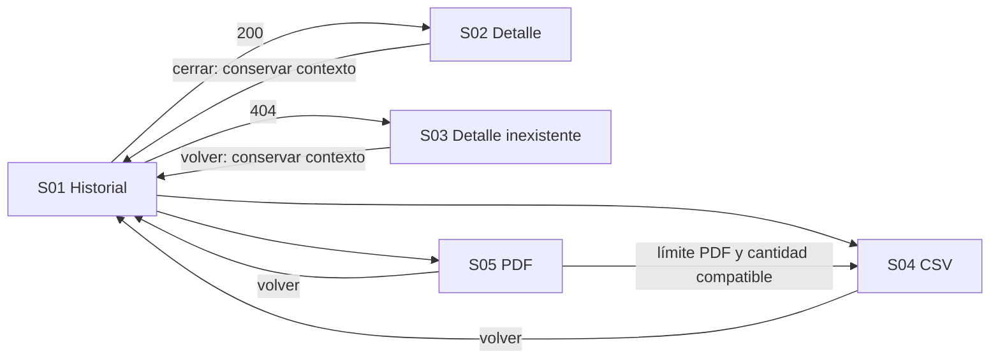

# MK-014 — Component Spec: historial de auditoría de precios

## 1. Identificación y estado

| Campo | Valor |
|---|---|
| Issue / coordinación | #66; ejecución general #61; entradas transversales #59 y #60 |
| Responsable / rama | Leonardo Vera Rodríguez (`LeonardoVera`) / `vera` |
| Versión / fecha | 1.0.0 / 2026-10-02 |
| Estado documental | En revisión; no acredita aprobación funcional, implementación ni visto bueno para Figma |
| Funcionalidad / actor | Historial append-only de precios / Gestor Comercial autorizado |
| Plataforma | Web desktop; revisión a 1440 × 900 px, con scroll vertical |

Este documento define el resultado esperado. [Plan](plan.md) deriva su construcción y [Tasks](tasks.md) define tareas con evidencia. Revisión base `ea9c4f1` de `vera`: DESIGN y los tres documentos UX coinciden con `origin/master`. La disponibilidad de esas entradas no aprueba estas pantallas.

## 2. Fuentes y trazabilidad

| Fuente | Alcance consumido |
|---|---|
| [SPEC-014](../../specs/SPEC-014-historial-auditoria-precios.md) | Contrato append-only, filtros, exportaciones, autorización, retención y archivado |
| [HU-014](../../hu/HU-014-historial-auditoria-precios.md) | CA-01 a CA-13; separar cobertura UI de obligaciones backend (§14) |
| [WF-014](../../wireframes/flows/WF-014-historial-auditoria-precios.md) | S-01 listado; S-02 detalle; S-02-N inexistente; S-03 CSV; S-04 PDF; labels/null/permisos |
| [FLOW-014](../../flujos/FLOW-014-historial-auditoria-precios.md) | §4.1 registro automático; §4.2 consulta; §4.3 exportación; §4.4 archivado interno |
| [OpenAPI 0.5.0](../../api/openapi.yaml) | `RegistroAuditoriaPrecio`, `PaginaAuditoriaPrecios`, `ExportacionAuditoriaRequest`, `TrabajoExportacion`, errores y descarga |
| [AsyncAPI](../../asyncapi/asyncapi.yaml), [Contrato API](../../Contrato_Api.md) | Consumo postcommit/deduplicación; no edición, borrado o generación manual de asientos |
| [Propuesta UX](../ux/propuesta-ux.md), [UX Decisions](../ux/ux-decisions.md), [UX Guidelines](../ux/ux-guidelines.md) | UX 2.0; consulta contextual, solo lectura, rechazo por límites y estados verificables |
| [Design System](../DESIGN.md) | 1.0.0; sustituye estilo monocromático del WF para alta fidelidad sin cambiar negocio |
| [Pipeline](../README.md), [Prototipo](../prototipo/README.md), [Gobernanza](../../EQUIPO_Y_RESPONSABILIDADES.md) | Rutas y gates de aprobación, autovalidación y revisión transversal |
| [Plantilla Component Spec](../_plantillas/mockup/component-spec.template.md) | Estructura instanciada |

Los parámetros de paginación están publicados mediante aliases YAML `id226/id227` a `Pagina/Tamanio`; no son una capacidad ausente. Se consume el contrato vigente, aunque el FLOW cite una versión anterior. Exportación/seguimiento provisional-internal no se presenta como interfaz estable productiva.

## 3. Objetivo y alcance

El Gestor Comercial busca cambios de precio, comprende antes/después y origen, abre el asiento sin perder filtros y exporta el conjunto filtrado dentro de límites. Éxito: identifica qué ocurrió, distingue ausencia de precio de cero/error y puede seguir una exportación admitida hasta su descarga confirmada.

Incluye listado paginado, filtros oficiales, detalle completo autorizado, detalle inexistente, exportación CSV/PDF y estados de generación/descarga. Excluye modificar/borrar/restaurar asientos o precios, crear auditoría manualmente, rol humano Auditor independiente, exportar XLSX, gestionar retención, forzar archivado, descargar almacenamiento frío sin contrato y presentar garantías criptográficas no definidas. El histórico as-of de MK-013 no sustituye estos asientos.

## 4. Inventario completo de pantallas P0

| ID | Correspondencia WF / propósito | Entrada y acción principal / salida | Ruta directa |
|---|---|---|---|
| MK-014-S01 | WF S-01; listado y filtros | Consulta; «Aplicar filtros» / abrir asiento o exportación | `/MK014/S01` |
| MK-014-S02 | WF S-02; detalle de asiento en modal | auditId con respuesta 200; «Volver al historial» / mismo contexto | `/MK014/S02` |
| MK-014-S03 | WF S-02-N; detalle no encontrado | auditId con 404; «Volver al historial» / mismo contexto | `/MK014/S03` |
| MK-014-S04 | WF S-03; exportar CSV | Filtros aplicados y formato fijo CSV; solicitar/seguir/descargar | `/MK014/S04` |
| MK-014-S05 | WF S-04; exportar PDF | Filtros aplicados y formato fijo PDF; solicitar/seguir/descargar | `/MK014/S05` |

S03 tiene ID propio por inventariarse en WF; permisos, sesión y límite son variantes, no pantallas nuevas. S02/S03 directas cargan el listado contextual fixture y su modal sin recorrido previo. Cada estado de §12 se reproducirá con `?fixture=<ID>` en el prototipo, nunca como parámetro del API.

## 5. Navegación y jerarquía



Primaria: filtros aplicados, SKU, fecha, operación y valores. Secundaria: motivo, origen, usuario y lote en detalle. Complementaria: referencias de auditoría/exportación y datos personales autorizados. El grupo «Precios» del shell ofrece «Historial de precios»; no identifica al actor como «Auditor» ni muestra MK, scopes o capacidades internas.

## 6. Datos, filtros y operaciones

Base HTTP `/api/v1`; estos paths son endpoints, distintos de rutas del prototipo.

| Uso | Contrato | Comportamiento |
|---|---|---|
| Listado | `GET /auditoria-precios` → `PaginaAuditoriaPrecios` | Filtros `sku`, `desde`, `hasta`, `usuarioId`, `canal`, `batchId`; `pagina`, `tamanio` (default 1/20, máximo 200). `items` + meta pagina/tamanio/total/totalPaginas |
| Detalle | `GET /auditoria-precios/{auditId}` → `RegistroAuditoriaPrecio` | 404 `AUDITORIA_PRECIO_NO_ENCONTRADA` abre S03; no interpretar como listado vacío |
| Solicitud de exportación | `POST /auditoria-precios/exportaciones` → 202 `TrabajoExportacion` | Body `formato` CSV/PDF y mismos seis filtros; exporta todo el resultado filtrado, no solo página actual. No enviar pagina/tamanio |
| Rechazo por límite | POST anterior → 422 `LIMITE_EXPORTACION_AUDITORIA_EXCEDIDO` | No crea `export_id`; conservar filtros y formato, explicar límite, no mostrar trabajo fallido |
| Seguimiento | `GET /auditoria-precios/exportaciones/{exportId}` | `QUEUED`, `PROCESSING`, `COMPLETED`, `FAILED_GENERAL`; no porcentaje ni cantidad procesada inexistentes |
| Descarga | `GET /auditoria-precios/exportaciones/{exportId}/archivo` o `download_url` de resultado válido | CSV/PDF solo después de COMPLETED y recurso disponible; un fallo de archivo no borra resultado de generación |

Filtros se editan y aplican explícitamente; limpiar quita condiciones y vuelve a página 1. Rango exige desde ≤ hasta y conserva instantes con zona. Respuesta tardía de filtros anteriores no sustituye consulta vigente. Orden descendente por fecha según SPEC, sin control de orden arbitrario no publicado. Usuario se filtra por `usuarioId`, no email; canal se envía como `canal`, no `canal_origen`. El contrato de auditoría lo declara string: no suponer catálogo cerrado ni crear endpoint de autocomplete; puede introducirse referencia conocida con etiqueta «Usuario (identificador)» y «Lote».

### Campos visibles y semántica

| Campo del asiento | Listado / detalle | Formato y condición |
|---|---|---|
| `sku`, `timestamp`, `tipo_operacion`, `tipo_precio` | Ambos | SKU, fecha/hora/zona, labels de operación/tipo |
| `precio_anterior`, `precio_nuevo`, `variacion_porcentual` | Ambos | CREACION: «Sin precio anterior», «No aplicable»; RETIRO_OFERTA: «Sin oferta», «No aplicable»; modificación 100→120: 20 %. No convertir null en 0 |
| `motivo_cambio`, `canal_origen` | Detalle; origen puede resumirse en listado si cabe | Texto completo de motivo; BACKOFFICE «Gestión interna», BULK_IMPORT «Carga masiva», API «Integración externa» |
| `id_auditoria`, `product_id`, `batch_id` | Detalle | Referencias seleccionables para trazabilidad; batch null «Sin lote», productId sin inventar nombre de catálogo |
| `usuario_id`, `usuario_email`, `ip_origen` | Detalle autorizado | No inventar identidad si null/ausente; mostrar «No informado». Email/IP solo si usuario autorizado y dato disponible; no agregar rol ni flujo de elevación |

Operaciones: CREACION «Creación de precio», MODIFICACION «Modificación de precio», RETIRO_OFERTA «Retiro de oferta»; tipos REGULAR «Precio regular» y OFERTA «Oferta». Los valores internos se preservan en payload pero se traducen en UI. Origen no reconocido se representa «Origen no identificado», sin exponer código como copy ni atribuirlo a un canal ficticio.

`RegistroAuditoriaPrecio` no informa moneda: Q-014-01 bloquea representar importes con una unidad monetaria afirmada. En revisión se muestra el número acompañado por «Moneda no informada»; no añadir PEN/S/ desde el precio vigente. Un cero realmente recibido permanece cero; no representa ausencia.

### Exportación y seguridad

- CSV admite hasta 100 000 registros; PDF hasta 500, inclusive. Conteo de `meta.total` informa alcance de consulta, pero servidor vuelve a evaluarlo al solicitar; no prometer que nunca cambiará.
- Antes de solicitar, mostrar filtros aplicados y formato/límite. Consultas grandes se reducen con filtros; PDF puede pasar a CSV solo si el resultado conocido cabe en CSV. Si no se conoce la cantidad, consultar historial antes de ofrecer compatibilidad asegurada.
- 202 significa «Solicitud recibida», seguido de «Generando archivo» mientras procesa. COMPLETED significa «Archivo generado»; habilitar descarga solo con recurso admitido. No ofrecer XLSX porque aparezca en schema genérico `TrabajoExportacion`.
- 401 explica sesión; 403 en consulta: «No tienes permiso para consultar esta información»; en exportación explica falta de permiso para exportar. No exponer datos del asiento como última consulta después de una denegación de acceso.
- Timeout de POST sin exportId mantiene «No pudimos confirmar la solicitud», sin botón de reenvío automático ni trabajo inventado. Con ID conocido, consultar estado. Error corregible de GET puede reconsultarse conservando contexto seguro; ningún fallo se representa como ausencia global de asientos.

## 7. Componentes compartidos

| Componentes del Design System | Pantallas | Uso y variantes |
|---|---|---|
| DS-C01 Button, C02 ActionIcon, C28 Breadcrumbs | S01–S05 | Consultar, exportar, descargar, volver y cerrar; md 40 px, nombre accesible |
| DS-C03 TextInput, C11 DateField, C13 FilterBar, C15 Pill | S01 | Seis filtros permitidos, rango/zona y condiciones aplicadas; sin email como query |
| DS-C17 Table, C18 Pagination | S01 | Lectura semántica, filas mínimo 48 px, sin selección/mutación; paginación desde meta |
| DS-C21 Modal | S02–S03 | Detalle 640 px y max-height del DS; fondo bloqueado, cuerpo con scroll y foco contenido |
| DS-C14 Badge, C19 Card, C22 Alert/Result | S01–S05 | Operación, estado de exportación, null contextual, límites/error persistentes |
| DS-C24 Skeleton/Loader, C25 EmptyState | S01–S05 | Consulta inicial, sin registros/coincidencias y errores diferenciados; no spinner por tiempo fijo |

No se instancian Checkbox de selección, botón crear asiento ni menú de mutaciones. No usar toast como único seguimiento de exportación ni stepper para filtros o detalle.

## 8. Componentes locales y props

Props de UI se mantienen separadas de DTOs, sin agregar moneda ni roles al contrato.

| ID | Pantallas / función | Props y restricciones | Estado, interacción y accesibilidad |
|---|---|---|---|
| MK-014-C01 FiltrosAuditoria | S01; condiciones de consulta | `borrador` y `aplicados` con seis parámetros publicados; `pagina:number`, `tamanio:number`; `busy:boolean` | Aplicar/limpiar/error; labels persistentes, error asociado al rango, reset página al cambiar condiciones |
| MK-014-C02 TablaAuditoria | S01; resumen de cambios | `items:RegistroAuditoriaPrecio[]`, `meta:PageMeta`, `estadoConsulta`, `consultaAplicada`; ninguna prop onEdit/onDelete | Carga/lista/vacío/sin coincidencias/error/refresco; acción «Ver detalle» por fila, headers y cifras alineadas |
| MK-014-C03 DetalleAuditoria | S02–S03; lectura contextual | `auditId:string`, `registro?:RegistroAuditoriaPrecio`, `estado:'cargando'\|'listo'\|'noEncontrado'\|'error'\|'sinPermiso'`, contexto de retorno | Modal con grupos Identificación/Cambio/Origen y actor; S03 sin asiento ficticio, Escape/cerrar devuelve foco y filtros |
| MK-014-C04 ValoresCambio | S01–S02; antes/después/variación | `tipoOperacion`, `tipoPrecio`, tres valores nullable; moneda ausente no se rellena | CREACION/RETIRO/MODIFICACION, cero real y dato ausente; texto contextual, no solo color o guiones ambiguos |
| MK-014-C05 ExportacionAuditoria | S04–S05; solicitud y seguimiento | `formato:'CSV'\|'PDF'`, filtros aplicados, `totalConsultado?:number`, `trabajo?:TrabajoExportacion`, estado de solicitud separado | Revisión/enviando/recibida/procesando/generada/fallida/límite/desconocida/descarga fallida; conservar alcance, live region y consulta por ID conocido |

## 9. Especificación de pantallas

### MK-014-S01 — Historial y filtros

Breadcrumbs → título «Historial de precios» → acciones secundarias «Exportar CSV» / «Exportar PDF» → C01 con SKU, desde/hasta, usuario, canal y lote → condiciones aplicadas y cantidad conocida → C02 con fecha, SKU, operación/tipo, anterior/nuevo/variación y «Ver detalle» → paginación. No forzar todos los 15 campos a columnas del listado; detalle muestra contrato completo.

Estados: consulta inicial; lista; vacío sin condiciones («No hay registros de auditoría disponibles», sin crear asiento); sin coincidencias («No encontramos cambios con estos filtros», limpiar); 503/error persistente; refresco con último dato seguro marcado; 401/403 sin datos protegidos. Rango inválido no consulta ni borra filtros. Primera página predeterminada tamaño 20; meta establece total/páginas. Respuesta anterior tardía se ignora.

### MK-014-S02 — Detalle de asiento

Modal C03 sobre listado contextual, título «Detalle del cambio de precio»; identificación SKU/asiento/producto/fecha → C04 antes/después y variación → motivo/origen/lote → actor y datos autorizados → «Volver al historial». No formulario editable; valores read-only legibles y seleccionables. Nulos muestran su significado; email/IP ausentes no se deducen del usuarioId. Carga de detalle no cambia filtros del fondo; error localizado ofrece consultar de nuevo cuando sea seguro. Cerrar y Escape restituyen foco al activador; en entrada directa, al título del listado.

### MK-014-S03 — Detalle inexistente

Mismo contenedor/contexto que S02; alerta «No encontramos este registro de auditoría» → explicación de asiento no disponible → «Volver al historial». 404 no fabrica fecha, valores ni motivo; no mostrar el código técnico como título. Regresar mantiene filtros/página. Si ocurre 403/503, utilizar variante correspondiente, no este mensaje de inexistencia.

### MK-014-S04 — Exportar CSV

Vista completa, título «Exportar historial en CSV» → filtros aplicados y alcance de todo el resultado → límite 100 000 → C05 → «Solicitar CSV» y retorno. POST 202 sustituye revisión por panel persistente de seguimiento con referencia. Consultar estado conserva ID; COMPLETED permite descarga contractual. FAILED_GENERAL ofrece explicación y regreso/revisión; no promete reanudar o regenerar el mismo trabajo. 422 exceso permanece en revisión, sin ID ni panel de trabajo fallido.

### MK-014-S05 — Exportar PDF

Misma composición/C05 con formato fijo PDF, límite 500 y «Solicitar PDF». Al superar límite: «El PDF admite hasta 500 registros. Reduce los filtros»; opción «Exportar CSV» únicamente dentro del límite CSV conocido. Mantener los filtros al cambiar formato. Rechazo por límite se diferencia de error de generación después de 202. La descarga fallida conserva «Archivo generado» con aviso de que no se pudo descargar, sin decir que generación falló.

## 10. Decisiones locales

| ID | Problema / alternativas | Elección, fuente y trade-off | Validación |
|---|---|---|---|
| LUX-014-01 | Detalle completo puede saturar tabla; página separada vs modal contextual | Modal 640 px, cuerpo con scroll y ruta directa S02/S03; FLOW §4.2 y WF. Preserva búsqueda pero requiere gestionar foco y contexto del fondo | Abrir/cerrar desde página 2 conserva filtros; directo no necesita recorrido |
| LUX-014-02 | CSV/PDF comparten lógica pero tienen límites distintos; selector genérico vs rutas explícitas | Dos pantallas WF con componente C05 reutilizado, formato fijo y límite visible. Mantiene inventario/rutas y evita duplicar lógica | PDF 501 no crea ID; CSV 501 puede admitirse sin cambiar filtros |
| LUX-014-03 | Contrato completo tiene más datos que espacio de listado | Tabla resumida del cambio; motivo, referencias y datos del actor en grupos de detalle. SPEC/HU CA-02. Un paso adicional para campos secundarios, conserva lectura a 1440 px | Los 15 campos tienen destino; no información recortada o dato personal en tooltip exclusivo |

La traducción de null, feedback, foco y estados asíncronos son reglas transversales existentes, no nuevas LUX. Moneda ausente se registra como hallazgo contractual, no decisión estética.

## 11. Layout y accesibilidad

Shell: header 64 px, sidebar 240 px, padding 32 px, área útil 1136 px, grid 12 columnas/gutter 24. FilterBar envuelve; rango agrupa inicio/fin, acciones pasan a segunda línea si hace falta. Tabla agrupa tipo/operación en una celda con dos líneas, mantiene números a derecha y motivo en detalle para evitar overflow horizontal de página. Modal 640 px, max-height `calc(100vh - 64px)`, padding 24, cuerpo desplazable y salida visible. Exportación hasta 880 px en lectura vertical.

Consumir [DESIGN](../DESIGN.md), Oswald/Inter, tokens de estado y Tabler; no conservar estilo monocromático del wireframe. Controls md 40 px, filas mínimo 48 px, badges textuales; color no es único indicador. Labels/headers, foco visible, modal con foco contenido y retorno; estado anunciado con live region sin robar foco. Moneda no informada y zona horaria se leen explícitamente; no se certifica WCAG por redactar esta especificación.

## 12. Fixtures deterministas

Datos exclusivamente ficticios de revisión, todavía sin archivos JSON/código. Reloj `2026-10-02T12:00:00Z`, actor fixture `usr-fixture-01`. Los importes de los payloads carecen de moneda porque el DTO carece de ella; no completar con un atributo oculto inventado.

### Registro de referencia completo

```json
{"id_auditoria":"aud-014-mod-01","sku":"CAM-BASE","product_id":"prd-013-01","tipo_precio":"REGULAR","precio_anterior":100,"precio_nuevo":120,"variacion_porcentual":20,"tipo_operacion":"MODIFICACION","canal_origen":"BACKOFFICE","motivo_cambio":"Actualización de tarifa de temporada","batch_id":null,"usuario_id":"usr-fixture-01","usuario_email":"gestor@example.test","ip_origen":"192.0.2.14","timestamp":"2026-10-02T11:00:00Z"}
```

Variantes CREACION: id `aud-014-alta-01`, anterior null, nuevo 100, variación null, motivo ALTA_PRODUCTO traducido «Alta de producto», timestamp `2026-09-01T00:00:00Z`. RETIRO_OFERTA: id `aud-014-retiro-01`, tipo OFERTA, anterior 90, nuevo null, variación null, motivo «Fin de oferta», timestamp `2026-10-02T10:00:00Z`. El resto de campos mantiene datos explícitos del fixture, sin transformar null en cero.

Listado: `{"items":[<registros del escenario>],"meta":{"pagina":1,"tamanio":20,"total":3,"totalPaginas":1}}`. Es notación de composición, no JSON ejecutable; al materializar fixtures se insertan objetos completos. Empty: items vacío, total 0 y totalPaginas 0. Escenario de página 2 usa total 25/totalPaginas 2 y cinco registros completos con IDs distintos y timestamps descendentes.

Solicitud y aceptación de exportación:

```json
{"formato":"CSV","sku":"CAM-BASE","desde":"2026-09-01T00:00:00Z","hasta":"2026-10-02T12:00:00Z","usuarioId":null,"canal":null,"batchId":null}
```

```json
{"export_id":"exp-014-csv-01","status":"QUEUED","formato":"CSV","download_url":null,"created_at":"2026-10-02T12:00:00Z","completed_at":null}
```

Al completar: status COMPLETED, completed_at posterior, download_url absoluto fixture `https://example.test/auditoria/exp-014-csv-01.csv`; el prototipo no contacta ese dominio, usa un recurso local de revisión. Variante PDF cambia formato y extensión, nunca XLSX.

| Fixture | Pantalla | Datos y resultado comprobable |
|---|---|---|
| FX-014-01 | S01–S02 | MODIFICACION 100→120, 20 %, detalle completo anterior; números sin moneda atribuida (Q-014-01) |
| FX-014-02 | S01–S02 | CREACION, anterior null/variación null; «Sin precio anterior» / «No aplicable» |
| FX-014-03 | S01–S02 | RETIRO_OFERTA, nuevo null/variación null; «Sin oferta» / «No aplicable» |
| FX-014-04 | S01–S02 | Origen BULK_IMPORT, batch-013-01; usuario/email/IP null → «No informado», lote visible; variante API → «Integración externa» |
| FX-014-05 | S01 | Sin filtros/items vacío vs filtros aplicados/items vacío; acciones distintas, ninguno es error o permite crear asiento |
| FX-014-06 | S01–S02 | Página 2 de 25 resultados, tamaño 20; abrir/cerrar conserva página 2/filtros. Dos consultas con respuestas invertidas no aplican resultado obsoleto |
| FX-014-07 | S01 | Rango invertido, no envío; seis filtros serializados con nombres del contrato; limpiar vuelve a página 1 |
| FX-014-08 | S01–S03 | Carga inicial / 503 consulta / 503 detalle / refresco fallido en variantes; datos previos solo con acceso válido y marca de última consulta |
| FX-014-09 | S03 | GET detalle 404 AUDITORIA_PRECIO_NO_ENCONTRADA; copy humano, volver conserva contexto |
| FX-014-10 | S04 | CSV total 100 000 → 202 QUEUED → PROCESSING → COMPLETED → descarga; límite inclusive, sin porcentaje ni descarga previa |
| FX-014-11 | S04 | CSV total 100 001 → 422 LIMITE_EXPORTACION_AUDITORIA_EXCEDIDO; sin exportId, mantener filtros y reducir consulta |
| FX-014-12 | S05 | PDF total 500 → 202/procesamiento/COMPLETED; límite inclusive |
| FX-014-13 | S05, S04 | PDF total 501 → 422 sin trabajo; CSV compatible manteniendo filtros. Total 100 001 no ofrece CSV como solución suficiente |
| FX-014-14 | S04–S05 | FAILED_GENERAL tras admisión; variante COMPLETED con fallo de archivo; generación fallida y descarga fallida distinguibles |
| FX-014-15 | S01–S05 | 401/403 consulta/exportación en variantes; no datos personales ni scopes visibles, no mutación ni roles inventados |
| FX-014-16 | S04–S05 | Timeout de POST sin ID vs GET de trabajo conocido que falla; no creación ficticia ni reenvío automático, seguimiento solo con ID |
| FX-014-17 | S01–S02 | Valor cero explícito recibido frente a null y atributo opcional ausente; cero permanece 0,00, no «Sin oferta» |
| FX-014-18 | S04–S05 | meta.total previo 500, servidor reevaluado 501 para PDF → 422; no asumir que conteo de revisión garantiza admisión |

Los totales de exportación son meta del escenario, no arrays artificiales de 100 000 objetos ni un campo inventado de `TrabajoExportacion`. Fixtures UI no demuestran integridad, deduplicación, retención o contenido de archivos reales generados por el backend.

## 13. Hallazgos y límites

| ID | Evidencia / impacto | Tratamiento y responsable | Estado |
|---|---|---|---|
| Q-014-01 | `RegistroAuditoriaPrecio` y contrato de asientos no publican moneda. DESIGN/UXG-017 prohíben inventar unidad; el precio vigente no determina moneda histórica | Leonardo Vera como owner propone cómo informar moneda histórica o una garantía de unidad explícita; Miguel Ángel Taco revisa cambio contractual. Bloquea validación final de importes con moneda y formatos monetarios de archivos, no la consulta/estructura ni pruebas de null | ABIERTO, bloqueante para esa representación |
| A-014-01 | Solo existe identidad GESTOR_COMERCIAL con capacidades internas | Fixture autorizado/no autorizado sin roles globales nuevos ni UI de permisos; datos personales solo cuando respuesta y autorización lo permitan | Límite normativo |
| A-014-02 | No hay API de administración de retención/archivado frío | CA-09/11/12 se documentan como obligaciones backend; no se inventan botones de archivado ni panel administrativo | Fuera de superficie UI |
| A-014-03 | TrabajoExportacion reutilizado incluye XLSX, pero request de auditoría solo CSV/PDF | Filtrar formatos por solicitud específica, no por enum genérico. Rutas de exportación son provisional-internal | Límite de contrato |

No se modifica negocio/API en esta entrega. Resuelto Q-014-01 con referencia revisada, actualizar documentación y fixtures dependientes. No asociar `message_id` de deduplicación con `operation_id` ni afirmar prueba de backend usando mockups.

## 14. Cobertura y criterios de aceptación

| HU / regla | Pantallas y componentes | UX aplicable | Fixtures / alcance de evidencia |
|---|---|---|---|
| CA-02,04,08; lectura, contrato y autorización | S01–S03 / C02–C04 | UXD-003,010,012; UXG-005,017,020,021,022 | FX-014-01 a 04,15,17; 15 campos con destino y cero controles de mutación; Q-014-01 abierto |
| CA-05,06; filtros/paginación/vacíos | S01 / C01–C02 | UXD-001,004,006,010; UXG-001,006,007,008,017 | FX-014-05 a 08; serialización, rango, página y respuesta tardía |
| CA-07; exportación y límites | S04–S05 / C05 | UXD-005,007,009,011; UXG-009,011,013,016,018 | FX-014-10 a 14,16,18; límites inclusive y rechazo sin ID |
| CA-10,13; null y detalle inexistente | S01–S03 / C03–C04 | UXD-005,010,012; UXG-011,017,020 | FX-014-02,03,09,17; 404 distinto de vacío/error |
| CA-01,03,11; postcommit, fallos sin asiento, deduplicación | Contexto de registros, sin comando UI | UXD-003,012; UXG-005,022 | Fixtures representan hechos confirmados; comprobar publicación/deduplicación requiere evidencia backend externa al mockup |
| CA-09,12; retención y archivado verificado | Sin pantalla administrativa | UXD-012; UXG-020,022 | No prueba UI de retención/checksum; no prometer regla legal ni archivado manual |

Aceptación futura, todavía pendiente:

- [ ] Q-014-01 resuelto con fuente aprobada antes de validar representación monetaria final.
- [ ] Cinco pantallas P0 directas y todos los estados aplicables reproducibles.
- [ ] Listado/detalle solo lectura; filtros, paginación y retorno conservan contexto.
- [ ] Nulos, cero, vacío, error y detalle 404 mantienen significados distintos.
- [ ] CSV/PDF respetan límites; 422 no crea trabajo; 202 no habilita descarga anticipada.
- [ ] No roles/scopes internos, datos personales no autorizados ni controles de archivado inventados.
- [ ] Desktop 1440 px, tema compartido, teclado y foco verificados con evidencia.
- [ ] Autovalidación y revisión transversal por separado; APROBADO PARA FIGMA explícito, fidelidad y reporte APROBADO posteriores.
