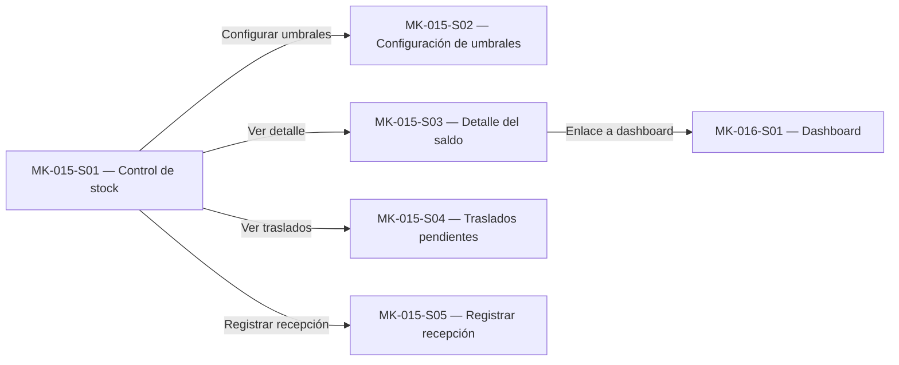

# Component Spec — MK-015

> **Propósito y rol documental:**
> Este documento es la especificación principal del resultado esperado del mockup (qué debe existir).
> Subordinado a las fuentes de verdad (SPEC, HU, WF, FLOW, API Contract y Design System), define formalmente: qué pantallas existen, el propósito de cada pantalla, estructura de cada pantalla, componentes (compartidos y específicos), acciones, estados, contenido, jerarquía de información, decisiones UX locales (`LUX-XX`), fixtures y criterios de aceptación.
> Consume la UX del módulo y las fuentes oficiales; no crea una propuesta UX nueva ni paralela.

> **Nota conceptual:**
> Este documento especifica el resultado esperado.
> No define el orden de ejecución ni descompone el trabajo en tareas (responsabilidad de `plan.md` y `tasks.md`).
> No contiene instrucciones procedimentales de implementación paso a paso.

## 1. Identificación

- **Mockup:** MK-015
- **Funcionalidad:** Control de stock y disponibilidad
- **Responsable:** Miguel Ángel Taco Zavala
- **Versión:** 1.0.0
- **Estado:** Listo para Raw (DoR Cumplido)

## 2. Trazabilidad

Define las fuentes oficiales de verdad consumidas por esta funcionalidad. Cualquier discrepancia funcional debe resolverse contra estas fuentes antes de proceder.

| Fuente | Referencia | Alcance |
|---|---|---|
| SPEC | [SPEC-015](../../specs/SPEC-015-control-stock-disponibilidad.md) | §1‑38 Reglas de negocio, invariantes, SKU/ubicación, reservas, consumos, liberaciones, expiraciones, ajustes, concurrencia, eventos, integraciones |
| HU | [HU-015](../../hu/HU-015-control-stock-disponibilidad.md) | CA‑01…CA‑42 Criterios de aceptación, historias de usuario |
| WF | [WF-015](../../wireframes/flows/WF-015-control-stock-disponibilidad.md) | S‑01…S‑05 Pantallas, columnas, detalle de saldo, recepción, umbrales |
| Flow | [FLOW-015](../../flujos/FLOW-015-control-stock-disponibilidad.md) | §4.2‑4.9 Reserva, consumo, liberación, expiración, Bulk, incidencia, reintegro, conciliación, traslado |
| Propuesta UX módulo | `mockups/ux/propuesta-ux.md` | §3‑5 UX‑P01, UX‑P02, UX‑P03; matriz 015 |
| UX Decisions | `mockups/ux/ux-decisions.md` | UXD‑001, UXD‑011 decisiones de interacción |
| UX Guidelines | `mockups/ux/ux-guidelines.md` | UXG‑001…UXG‑022 reglas operativas |
| API Contract | [OpenAPI](../../api/openapi.yaml) / [Contrato_Api.md](../../Contrato_Api.md) | Endpoints `/inventario/disponibilidad`, `/inventario/umbrales`, `/inventario/traslados`, `/inventario/traslados/{id}/recepciones`; HTTP 0.5.0 |
| Design System | [mockups/DESIGN.md](../DESIGN.md), versión 1.0.0 | Tokens, componentes DS‑C01‑DS‑C29, layout 1440 px, estados de interacción |

## 3. Objetivo funcional

- **Usuario:** Gestor comercial (`GESTOR_COMERCIAL`) con capacidades de gestión de inventario.
- **Objetivo:** Consultar saldos por SKU/ubicación y entender qué parte está física, reservada, bloqueada y disponible.
- **Contexto:** Operación en web desktop, viewport canónico 1440 px, mouse y teclado.
- **Resultado exitoso:** El usuario consulta disponibilidad, distingue Físico/Reservado/Bloqueado/Disponible/Estado, y puede registrar recepciones de traslado sin sobreventa.

## 4. Alcance

### Incluido

- Consultar disponibilidad por SKU y ubicación (`GET /api/v1/inventario/disponibilidad?skus=…&location_id=…`).
- Mostrar `on_hand`, `reserved`, `blocked`, `available`, `estado`, `umbral_stock_bajo_resuelto`, `stock_version`.
- Cálculo autoritativo `available = max(on_hand - reserved - blocked, 0)`.
- Determinar estado comercial: `AGOTADO` (available = 0), `STOCK_BAJO` (0 < available ≤ umbral), `DISPONIBLE` (available > umbral).
- Configurar umbrales mediante los endpoints correctos:
  - `GET /api/v1/inventario/umbrales` para obtener la configuración actual global y por SKU.
  - `PUT /api/v1/inventario/umbrales/global` para definir el umbral global por defecto.
  - `PUT /api/v1/inventario/umbrales/skus/{sku}` para definir el umbral específico por SKU.
- Listar traslados pendientes (`GET /api/v1/inventario/traslados`).
- Registrar recepción de traslado con cantidad recibida, disposición (`REINGRESAR_DISPONIBLE`, `MANTENER_BLOQUEADO`, `CONFIRMAR_MERMA`), marca de recepción final y nota opcional (`POST /api/v1/inventario/traslados/{id}/recepciones`).
- Mostrar badges de estado (DISPONIBLE / STOCK_BAJO / AGOTADO) con ícono según DS‑C14.

### Fuera de alcance

- Creación de pedidos o procesamiento de pagos.
- Reserva o consumo de stock (orquestado por Ventas/Postventa).
- Liberación de reservas.
- Reintegro de unidades físicas.
- Conciliación offline de venta Retail.
- Mutación de saldos desde Marketplace/Chatbot/Retail.
- UI que muestre `on_hand`, `reserved`, `blocked`, `available` como etiquetas de interfaz (no mostrados por WF‑015).
- Botones visibles para ejecutar operaciones de reserva/consumo/liberación.

## 5. Inventario de pantallas

Define qué pantallas existen y su propósito dentro de la funcionalidad (ordenadas estrictamente según WF-015).

| ID | Pantalla | Propósito | Entrada | Acción principal | Salida | Prioridad | Ruta del prototipo |
|---|---|---|---|---|---|---|---|
| MK‑015‑S01 | Control de stock | Consultar disponibilidad por SKU/ubicación | `GET /api/v1/inventario/disponibilidad?skus=…&location_id=…` | Filtrar, agrupar | Tabla con Físico/Reservado/Bloqueado/Disponible/Estado/Umbral | P0 | `/MK015/S01` |
| MK‑015‑S02 | Configuración de umbrales | Definir umbral_stock_bajo a nivel global o por SKU | `GET /api/v1/inventario/umbrales`, `PUT /api/v1/inventario/umbrales/global`, `PUT /api/v1/inventario/umbrales/skus/{sku}` | Aplicar umbral | Confirmación de actualización | P1 | `/MK015/S02` |
| MK‑015‑S03 | Detalle del saldo | Ver desglose auditado de un SKU/ubicación | misma llamada, drawer lateral 640 px | — | Ficha con Físico/Reservado/Bloqueado/Disponible/Umbral/Estado | P0 | `/MK015/S03` |
| MK‑015‑S04 | Traslados pendientes | Listar traslados sin recibir | `GET /api/v1/inventario/traslados?estado&target_location_id&pagina&tamanio` | — | Lista con SKU/origen/destino/cantidad pendiente/estado | P0 | `/MK015/S04` |
| MK‑015‑S05 | Registrar recepción | Confirmar recepción física y registrar faltantes/discrepancias | `POST /api/v1/inventario/traslados/{id}/recepciones` | Registrar recepción final | Estado COMPLETADO / COMPLETADO_CON_DISCREPANCIA | P0 | `/MK015/S05` |

**Reglas de acceso y enrutamiento:**

- Toda pantalla inventariada formalmente como `MK‑015‑SXX` debe disponer de una ruta individual relativa dentro del entorno de prototipado.
- La prioridad (`P0`, `P1`, `P2`, etc.) define la criticidad y obligatoriedad de alcance, mientras que la ruta directa garantiza accesibilidad, trazabilidad, revisión y reproducibilidad independientemente de la prioridad.
- La ruta debe permitir inspeccionarla directamente sin requerir transitar previamente por un flujo.
- El identificador de pantalla (`MK‑015‑SXX`) y la ruta del prototipo (`/MK015/SXX`) deben mantenerse estrictamente sincronizados.
- Cualquier cambio, alta o baja en el inventario de pantallas exige revisar y actualizar las rutas correspondientes.

## 6. Relación entre pantallas

## 7. Jerarquía de información

1. **Primaria:** Información y acciones críticas inmediatamente visibles (Físico, Disponible, Estado).
2. **Secundaria:** Información de soporte o acciones secundarias (Reservado, Bloqueado, Umbral).
3. **Complementaria:** Detalles periféricos, metadatos o ayuda contextual (SKU, Producto, Ubicación).

## 8. Componentes compartidos

Componentes transversales del Design System reutilizados entre pantallas.

| Componente | Pantallas | Uso | Variante | Estados |
|---|---|---|---|---|
| DS‑C17 PO/Table | S01, S04 | Tabla de stock y tabla de traslados | md por defecto; cabecera cloud-subtle | default/hover/focus/loading/empty/error |
| DS‑C14 PO/Badge | S01, S03, S04 | Badges de estado de inventario y traslados | sm mín 24 px / md 28 px | success (Disponible), warning (Stock bajo), error (Agotado) |
| DS‑C13 PO/FilterBar | S01, S04 | Filtros por producto/categoría/marca/SKU/ubicación/estado | Integrada con buscador y selects | default, active, disabled |
| DS‑C03 PO/TextInput | S02, S03, S05 | Inputs de SKU, nota y datos en solo lectura | md 40 px, padding 12 px, label superior | default/focus/read-only/disabled/error |
| DS‑C04 PO/NumberInput | S02, S05 | Input numérico para umbral y cantidad recibida | precisión entera, min 0, label superior | default/focus/error |
| DS‑C02 PO/ActionIcon | S01, S03, S04, S05 | Botones de acción, cierre de drawer y navegación | área 32×32 o 40×40 px con tooltip | default/hover/active |
| DS‑C08 PO/Checkbox | S05 | Casilla “Esta es la recepción final” | caja 20 px con label clicable | unchecked/checked |
| DS‑C15 PO/Alert/Notice | S02, S05 | Alerta inline de discrepancia (LUX-03) y feedback | contenedor con borde reforzado e ícono Tabler | default, warning, error, success |
| DS‑C20 PO/Drawer | S03 | Contenedor lateral de 640 px para detalle de saldo | ancho 640 px, overlay accesible (LUX-02) | default, loading, error |

## 9. Componentes específicos

### MK‑015‑C01 — Componente fila tabla stock

**Propósito:** Mostrar una fila de la tabla de stock con SKU, Producto, Ubicación y los valores Físico/Reservado/Bloqueado/Disponible/Umbral/Estado.

**Pantallas en las que participa:** MK‑015‑S01, MK‑015‑S03.

**Contenido estructurado:**
- **Fila:** `{[DS‑C03 TextInput SKU], [Producto], [Ubicación], [Físico], [Reservado], [Bloqueado], [Disponible], [Umbral], [DS‑C14 Badge Estado], [acción Ver detalle]}`.

**Propiedades conceptuales:**

| Propiedad | Tipo | Obligatoria | Regla / Restricción |
|---|---|---|---|
| sku | Texto | Sí | Debe coincidir con un SKU vendible activo |
| producto | Texto | Sí | Nombre comercial del producto |
| ubicacion | Texto | Sí | Nombre de la tienda/almacén |
| fisico | Número | Sí | `on_hand` ≥ 0 |
| reservado | Número | Sí | `reserved` ≥ 0, `reserved ≤ on_hand` |
| bloqueado | Número | Sí | `blocked` ≥ 0, `blocked ≤ on_hand` |
| disponible | Número | Sí | `available = max(on_hand - reserved - blocked, 0)` |
| umbral | Número | No | `umbral_stock_bajo_resuelto` por SKU |
| estado | Texto | Sí | `DISPONIBLE` / `STOCK_BAJO` / `AGOTADO` |

**Estados:**

| Estado | Disparador | Representación visual | Acción permitida |
|---|---|---|---|
| Default | Datos cargados | Fila con todos los valores y badges | Ver detalle (S03), configurar umbral (S02), traslados (S04) |
| Loading | Carga asíncrona | Skeleton DS‑C24 + texto “Cargando…” | Bloquear interacción |
| Error | Fallo controlado | Mensaje error junto al campo | Reintentar consulta |

### MK‑015‑C02 — Componente configuración de umbral

**Propósito:** Input numérico con selector de alcance para configurar el umbral de stock bajo a nivel global o por SKU específico.

**Pantallas en las que participa:** MK‑015‑S02.

**Contenido estructurado:**
- **Selector de alcance:** Alternar entre umbral global y override por SKU.
- **Input:** `DS‑C04 NumberInput` con campo “Umbral de stock bajo”.
- **Botón:** “Aplicar umbral” — ejecuta `PUT /api/v1/inventario/umbrales/global` o `PUT /api/v1/inventario/umbrales/skus/{sku}`.

**Propiedades conceptuales:**

| Propiedad | Tipo | Obligatoria | Regla / Restricción |
|---|---|---|---|
| sku | Texto | Condicional | Obligatorio solo si el alcance es override por SKU |
| umbral | Número | Sí | Debe ser entero ≥ 0; valida `umbral_stock_bajo_resuelto = override SKU ?? umbral global` |

**Estados:**

| Estado | Disparador | Representación visual | Acción permitida |
|---|---|---|---|
| Default | Valor cargado | Input con valor actual y botón Aplicar | Aplicar umbral |
| Loading | Guardado en curso | Botón con spinner y campos deshabilitados | Esperar confirmación |
| Error | Valor inválido (< 0) | Input con borde error + mensaje explicativo | Corregir valor |

## 10. Especificación por pantalla

Define la estructura, componentes, acciones, estados y contenido clave de cada pantalla (S01 a S05 alineadas con WF-015).

### MK‑015‑S01 — Control de stock

**Propósito y objetivo:** Consultar disponibilidad autoritativa de un SKU por ubicación y mostrar tabla con saldos y estado sin botones de débito manual.

**Estructura y layout:**
1. **Zona 1 — Cabecera:** Título “Control de stock”, subtítulo “SKU y ubicación”, barra de filtros (`DS‑C13 FilterBar`).
2. **Zona 2 — Área principal:** Tabla `DS‑C17 PO/Table` con columnas SKU, Producto, Ubicación, **Físico**, **Reservado**, **Bloqueado**, **Disponible**, **Umbral**, **Estado**. Filas crecen al envolver texto; no cortan controles.
3. **Zona 3 — Barra de acciones:** Filtros aplicados, contador de filas, botón "Configurar umbrales" (conduce a S02) y botón “Ver traslados pendientes” (conduce a S04).

**Componentes presentes:**
- `DS‑C17 PO/Table` — tabla principal de inventario.
- `DS‑C13 PO/FilterBar` — filtros por SKU, producto, categoría, marca, ubicación, estado.
- `DS‑C14 PO/Badge` — badges de estado por fila (Disponible, Stock bajo, Agotado).
- `DS‑C03 PO/TextInput` — campo de filtro SKU.
- `DS‑C02 PO/ActionIcon` — botón de acciones rápidas por fila.

**Acción primaria:** Aplicar filtros y visualizar la tabla de stock disponible.

**Acciones secundarias:**
- Filtrar por SKU/producto/categoría/marca/ubicación/estado.
- Abrir S02 (Configuración de umbrales) desde el botón de cabecera o acción contextual.
- Abrir S03 (Detalle del saldo) en drawer lateral de 640 px haciendo clic en una fila o en su botón de detalle.
- Abrir S04 (Traslados pendientes) para gestionar recepciones físicas.

**Estados requeridos:**
- **Default:** Tabla con valores completos, badges de estado visibles y cálculos exactos.
- **Loading:** Skeleton `DS‑C24` + texto accesible “Cargando…”.
- **Empty:** `DS‑C25 EmptyState` “Sin coincidencias con estos filtros” + acción “Limpiar filtros”.
- **Error:** Alerta de error con mensaje accionable y opción "Reintentar".

**Contenido clave y microtexto:**

| Elemento | Texto / Patrón | Fuente de procedencia |
|---|---|---|
| H1 / Título | “Control de stock” | WF‑015 S‑01 |
| CTA Primario | “Configurar umbrales” | WF‑015 S‑02 |
| CTA Secundario | “Ver traslados pendientes” | WF‑015 S‑04 |
| Mensaje de ayuda | “Las unidades reservadas están comprometidas en pedidos. Las bloqueadas permanecen físicamente en la ubicación, pero temporalmente no se ofrecen para venta.” | WF‑015 literal |

---

### MK‑015‑S02 — Configuración de umbrales

**Propósito y objetivo:** Definir o actualizar el umbral de stock bajo a nivel global o por SKU específico, permitiendo reclasificar la disponibilidad comercial en Disponible, Stock bajo o Agotado.

**Estructura y layout:**
1. **Zona 1 — Cabecera:** Título “Configuración de umbrales”, bajada descriptiva: “Configura el umbral global por defecto o define un umbral específico para un SKU.” Botón de retorno a S01.
2. **Zona 2 — Formulario de umbrales:**
   - Selector de modo: Radio buttons para elegir “Umbral global por defecto” o “Override por SKU”.
   - Campo SKU: `DS‑C03 PO/TextInput` habilitado únicamente si se selecciona el modo override por SKU.
   - Campo Umbral: `DS‑C04 PO/NumberInput` precargado con el valor vigente consultado mediante `GET /api/v1/inventario/umbrales`.
3. **Zona 3 — Barra de acciones y feedback:**
   - Botón primario: “Aplicar umbral” (ejecuta `PUT /api/v1/inventario/umbrales/global` si es global o `PUT /api/v1/inventario/umbrales/skus/{sku}` si es por SKU).
   - Botón secundario: “Cancelar” (retorna a S01 sin mutar datos).
   - Feedback inline: `DS‑C15 Alert` con mensaje de éxito tras confirmación o mensaje de error de validación.

**Componentes presentes:**
- `DS‑C04 PO/NumberInput` — entrada numérica del umbral con validación de enteros ≥ 0.
- `DS‑C03 PO/TextInput` — campo de texto para identificar el SKU en modo override.
- `DS‑C15 PO/Alert/Notice` — mensajes de alerta y confirmación inline.
- `DS‑C02 PO/ActionIcon` / Botones Mantine — botones de aplicar y cancelar.

**Acción primaria:** Guardar el umbral presionando “Aplicar umbral” enviando `PUT /api/v1/inventario/umbrales/global` (global) o `PUT /api/v1/inventario/umbrales/skus/{sku}` (por SKU).

**Acciones secundarias:**
- Consultar la configuración vigente mediante `GET /api/v1/inventario/umbrales`.
- Conmutar entre configuración global y por SKU individual.
- Cancelar y retornar a la tabla de control de stock S01.

**Estados requeridos:**
- **Default:** Formulario con los valores actuales precargados y botón habilitado.
- **Loading:** Indicador de carga / spinner mientras se consulta `GET` o se procesa la mutación `PUT`.
- **Empty:** No aplica (siempre existe un valor numérico asignado, mínimo 0).
- **Error:** Alerta inline si el valor es negativo (< 0), si el SKU no existe, o si falla la red.

**Contenido clave y microtexto:**

| Elemento | Texto / Patrón | Fuente de procedencia |
|---|---|---|
| H1 / Título | “Configuración de umbrales” | WF‑015 S‑02 |
| Subtítulo | “Define el umbral global por defecto o un override individual por SKU.” | SPEC‑015 §12 |
| Label Umbral | “Umbral de stock bajo” | WF‑015 S‑02 |
| CTA Primario | “Aplicar umbral” | WF‑015 S‑02 |
| CTA Secundario | “Cancelar” | UX Guidelines |
| Feedback éxito | “Umbral actualizado exitosamente. Los estados de stock se han recalculado.” | UX Guidelines |
| Error validación | “El valor del umbral debe ser un número entero mayor o igual a 0.” | SPEC‑015 §12 |

---

### MK‑015‑S03 — Detalle del saldo

**Propósito y objetivo:** Inspeccionar el desglose completo del saldo de un SKU y ubicación seleccionados dentro de un Drawer lateral de 640 px (`DS‑C20`), verificando Físico, Reservado, Bloqueado, Disponible, Umbral resuelto y Estado sin mutar saldos.

**Estructura y layout:**
1. **Zona 1 — Cabecera del Drawer:** Título “Detalle del saldo”, identificador de SKU y botón de cierre (`DS‑C02 PO/ActionIcon`).
2. **Zona 2 — Ficha de desglose auditado:** Panel vertical en drawer de 640 px con campos de solo lectura (`DS‑C03 PO/TextInput`):
   - SKU y Producto.
   - Ubicación (tienda o almacén).
   - Físico (unidades totales contabilizadas).
   - Reservado (unidades comprometidas en pedidos activos).
   - Bloqueado (unidades temporalmente no vendibles por cuarentena/incidencia).
   - Disponible (unidades calculadas: `max(Físico - Reservado - Bloqueado, 0)`).
   - Umbral de alerta efectivo (`umbral_stock_bajo_resuelto`).
   - Estado comercial con badge semántico (`DS‑C14 PO/Badge`).
3. **Zona 3 — Microtexto explicativo y cierre:**
   - Texto auxiliar literal de WF‑015 explicando la naturaleza de reservadas y bloqueadas.
   - Botón “Cerrar” para replegar el drawer y volver a la tabla S01 conservando los filtros activos.

**Componentes presentes:**
- `DS‑C20 PO/Drawer` — contenedor lateral superpuesto de 640 px (LUX‑02).
- `DS‑C03 PO/TextInput` — campos de solo lectura para cada atributo de inventario.
- `DS‑C14 PO/Badge` — etiqueta visual de estado (Disponible / Stock bajo / Agotado).
- `DS‑C02 PO/ActionIcon` — botón de cierre superior y botón “Cerrar”.

**Acción primaria:** Visualizar la composición exacta del disponible y verificar que `disponible = max(físico - reservado - bloqueado, 0)`.

**Acciones secundarias:**
- Cerrar el drawer mediante el botón de cierre, clic fuera del contenedor o tecla `Escape`.
- Enlazar al Dashboard analítico `MK‑016‑S01` para métricas globales agregadas.

**Estados requeridos:**
- **Default:** Drawer desplegado con todos los valores poblados fielmente según el fixture del SKU.
- **Loading:** Skeleton en el cuerpo del drawer mientras se resuelven los datos del saldo.
- **Empty:** No aplica (se invoca desde una fila existente en la tabla S01).
- **Error:** Alerta localizada en el cuerpo del drawer si falla la obtención del detalle puntual.

**Contenido clave y microtexto:**

| Elemento | Texto / Patrón | Fuente de procedencia |
|---|---|---|
| H2 / Título | “Detalle del saldo” | WF‑015 S‑03 |
| Microtexto explicativo | “Las unidades reservadas están comprometidas en pedidos. Las bloqueadas permanecen físicamente en la ubicación, pero temporalmente no se ofrecen para venta.” | WF‑015 S‑03 literal |
| Badge Estado | “Disponible” / “Stock bajo” / “Agotado” | WF‑015 / DESIGN.md §4.1 |
| CTA Cierre | “Cerrar” | UX Guidelines |

---

### MK‑015‑S04 — Traslados pendientes

**Propósito y objetivo:** Listar las transferencias de inventario entre almacenes y tiendas que se encuentran pendientes de recepción, permitiendo revisar cantidades enviadas/recibidas y acceder al registro de recepción física.

**Estructura y layout:**
1. **Zona 1 — Cabecera y filtros:** Título “Traslados pendientes”, subtítulo informativo y barra de filtros (`DS‑C13 FilterBar`) por SKU, ubicación destino y estado del traslado (`EN_TRANSITO`, `RECIBIDO_PARCIAL`).
2. **Zona 2 — Tabla de traslados (`DS‑C17 PO/Table`):** Columnas normativas de WF‑015:
   - SKU del producto.
   - Ubicación de origen.
   - Ubicación de destino.
   - Cantidad enviada.
   - Cantidad recibida.
   - Cantidad pendiente (enviada - recibida).
   - Estado del traslado (Badge `DS‑C14`: En tránsito, Recibido parcial, Con discrepancia).
   - Acción por fila: Botón “Registrar recepción” que navega a S05.
3. **Zona 3 — Barra inferior:** Resumen de traslados en tránsito y controles de paginación.

**Componentes presentes:**
- `DS‑C17 PO/Table` — tabla de traslados.
- `DS‑C13 PO/FilterBar` — filtros de búsqueda y refinamiento.
- `DS‑C14 PO/Badge` — badges de estado de traslado.
- `DS‑C02 PO/ActionIcon` / Botón — acción “Registrar recepción” por fila.

**Acción primaria:** Seleccionar un traslado pendiente y pulsar “Registrar recepción” para navegar a la pantalla S05.

**Acciones secundarias:**
- Filtrar traslados por SKU, ubicación de destino o estado.
- Retornar al control de stock S01 mediante breadcrumb o enlace de navegación.

**Estados requeridos:**
- **Default:** Tabla con transferencias en tránsito y cantidades pendientes legibles.
- **Loading:** Skeleton en la tabla durante la consulta a `GET /api/v1/inventario/traslados`.
- **Empty:** `DS‑C25 EmptyState` con mensaje “No se encontraron traslados pendientes para los criterios seleccionados.”
- **Error:** Alerta de fallo de comunicación con el servicio con botón “Reintentar”.

**Contenido clave y microtexto:**

| Elemento | Texto / Patrón | Fuente de procedencia |
|---|---|---|
| H1 / Título | “Traslados pendientes” | WF‑015 S‑04 |
| Columna Acción | “Registrar recepción” | WF‑015 S‑04 |
| Estado En tránsito | “En tránsito” | SPEC‑015 §15 / WF‑015 |
| Estado Recibido parcial | “Recibido parcialmente” | SPEC‑015 §15 / WF‑015 |
| Estado Con discrepancia | “Con discrepancia” | SPEC‑015 §15 / WF‑015 |
| Empty state | “No se encontraron traslados pendientes para esta ubicación.” | UX Guidelines |

---

### MK‑015‑S05 — Registrar recepción

**Propósito y objetivo:** Registrar la recepción física de un traslado en destino capturando cantidad recibida real, disposición de las unidades, casilla de recepción final y notas, alertando discrepancias sin inventar unidades disponibles.

**Estructura y layout:**
1. **Zona 1 — Cabecera de contexto:** Título “Registrar recepción”, código de traslado, SKU, almacén de origen, almacén de destino y cantidad esperada en solo lectura (`DS‑C03 TextInput`).
2. **Zona 2 — Formulario de recepción física:**
   - Cantidad recibida: `DS‑C04 PO/NumberInput` (entero mayor a 0).
   - Disposición de unidades: Selector (`DS‑C06 Select` o RadioGroup) con las 3 opciones de negocio de WF‑015:
     - *Reingresar como disponible* (`REINGRESAR_DISPONIBLE`)
     - *Mantener bloqueado* (`MANTENER_BLOQUEADO`)
     - *Confirmar merma* (`CONFIRMAR_MERMA`)
   - Casilla de verificación: `DS‑C08 PO/Checkbox` con etiqueta literal: “Esta es la recepción final”.
   - Nota operativa: `DS‑C03 PO/TextInput` multilínea para observaciones del operador (opcional).
3. **Zona 3 — Confirmación inline de discrepancia (LUX‑03) y botones:**
   - Alerta inline condicional (`DS‑C15 Alert` warning) mostrada cuando se marca “Esta es la recepción final” y la cantidad recibida acumulada es menor a la cantidad enviada:
     > “El traslado se cerrará con una discrepancia. Las unidades faltantes no se agregarán al inventario.”
   - Botón primario: “Confirmar recepción” (ejecuta `POST /api/v1/inventario/traslados/{id}/recepciones`).
   - Botón secundario: “Cancelar” (retorna a S04 sin mutar datos).

**Componentes presentes:**
- `DS‑C04 PO/NumberInput` — campo numérico para cantidad recibida.
- `DS‑C03 PO/TextInput` — campos de contexto en solo lectura y campo de nota opcional.
- `DS‑C08 PO/Checkbox` — casilla “Esta es la recepción final”.
- `DS‑C15 PO/Alert/Notice` — alerta inline con texto oficial de discrepancia (LUX‑03, sin modales anidados según DESIGN.md §4.5).
- Botones Mantine — botones “Confirmar recepción” y “Cancelar”.

**Acción primaria:** Enviar el formulario presionando “Confirmar recepción” para invocar `POST /api/v1/inventario/traslados/{id}/recepciones`.

**Acciones secundarias:**
- Cancelar el registro y retornar al listado de traslados pendientes S04.
- Cambiar la disposición asignada a las unidades (disponible, bloqueado o merma).

**Estados requeridos:**
- **Default:** Formulario precargado con el detalle del traslado y cantidad recibida lista para captura.
- **Loading:** Botón "Confirmar recepción" con spinner mientras viaja la solicitud HTTP `POST`.
- **Empty:** No aplica (pantalla contextual invocada para un traslado existente).
- **Error:** Alerta inline si la cantidad recibida es inválida (≤ 0), excede el pendiente no admitido o si el servidor retorna error.

**Contenido clave y microtexto:**

| Elemento | Texto / Patrón | Fuente de procedencia |
|---|---|---|
| H1 / Título | “Registrar recepción” | WF‑015 S‑05 |
| Label Cantidad | “Cantidad recibida” | WF‑015 S‑05 |
| Disposición 1 | “Reingresar como disponible” | WF‑015 S‑05 literal |
| Disposición 2 | “Mantener bloqueado” | WF‑015 S‑05 literal |
| Disposición 3 | “Confirmar merma” | WF‑015 S‑05 literal |
| Checkbox Cierre | “Esta es la recepción final” | WF‑015 S‑05 literal |
| Alerta Discrepancia | “El traslado se cerrará con una discrepancia. Las unidades faltantes no se agregarán al inventario.” | WF‑015 S‑05 literal |
| CTA Primario | “Confirmar recepción” | WF‑015 S‑05 |
| CTA Secundario | “Cancelar” | UX Guidelines |

## 11. Decisiones UX locales

Solo registrar decisiones específicas de diseño exclusivas de esta funcionalidad.

### LUX‑01 — Mapeo de badge de estado

**Problema:** Determinar visualBadge `DISPONIBLE`/`STOCK_BAJO`/`AGOTADO` sin usar `volt`/`signal` como stock confirmado.

**Alternativas consideradas:**
- Alternativa A: Usar `color/success/default` (`#2F9E44`) como indicador principal de stock confirmado.
- Alternativa B: Usar `color/accent/signal` (`#4361EE`) para “stock en proceso”.

**Decisión adoptada:** Mapear `DISPONIBLE` → `DS‑C14 PO/Badge` con variante `success`; `STOCK_BAJO` → variante `warning`; `AGOTADO` → variante `error`. La paleta y contraste están verificados en DESIGN.md §4.1 (ratios 6.12:1, 6.42:1). No usar `volt`/`signal` como stock confirmado (DESIGN.md prohíbe).

**Justificación:** El Design System v1.0.0 (DATE 2026‑10‑02) define roles semánticos; las decisiones visuales deben basarse en tokens, no en inferencias.

**Trade‑off:** Richer visual feedback requiere consistencia con el Design System global; fuera del alcance actual no se añaden nuevas variantes de color.

**Criterio de validación:** Los badges de estado en S01 y S03 renderizan con los tokens `color/success/default`, `color/warning/default`, `color/error/default` y cumplen los ratios de contraste verificados.

### LUX‑02 — Detalle de saldo en drawer vs vista completa

**Problema:** S03 “Detalle del saldo” debe mostrarse en un espacio contenido para consultar atributos sin perder de vista la tabla principal ni sus filtros.

**Alternativas consideradas:**
- Alternativa A: Vista completa en página separada (navegación independiente con retorno costoso).
- Alternativa B: Drawer lateral de 640 px (`DS‑C20 PO/Drawer` según DESIGN.md §5.2).

**Decisión adoptada:** Usar `DS‑C20 PO/Drawer` de ancho 640 px con detalle del saldo, manteniendo los filtros y contexto en la pantalla padre S01. Al cerrarse el drawer, los filtros aplicados y la paginación de S01 se preservan intactos.

**Justificación:** WF‑015 define “detalle breve” y UXD‑001/UXG‑001 recomiendan drawer para inspección contextual sin desorientar al usuario.

**Trade‑off:** El drawer de 640 px limita el espacio horizontal a una sola columna de desglose; si se necesita comparar múltiples SKUs simultáneamente, el gestor debe apoyarse en la tabla principal S01.

**Criterio de validación:** S03 se abre como `DS‑C20 PO/Drawer` de 640 px sobre S01, preserva filtros y muestra Físico, Reservado, Bloqueado, Disponible, Umbral y Estado.

### LUX‑03 — Confirmación de recepción final inline (sin modal anidado)

**Problema:** S05 “Registrar recepción” debe advertir al usuario del cierre con faltantes sin encadenar ventanas modales (DESIGN.md §4.5: “No encadenar modales”).

**Alternativas consideradas:**
- Alternativa A: Modal emergente dentro de otro modal o diálogo superpuesto.
- Alternativa B: Confirmación inline persistente en el cuerpo del formulario antes de presionar el botón primario.

**Decisión adoptada:** La confirmación de discrepancia ante la casilla “Esta es la recepción final” se presenta **inline** mediante `DS‑C15 PO/Alert/Notice` con el texto literal de WF‑015: “El traslado se cerrará con una discrepancia. Las unidades faltantes no se agregarán al inventario.” No se utiliza modal anidado.

**Justificación:** Cumple estrictamente DESIGN.md §4.5; la recepción final es una acción de cierre de flujo dentro del formulario, no una nueva operación asíncrona no solicitada.

**Trade‑off:** Requiere que el usuario lea la advertencia inline antes de pulsar confirmar; se refuerza con borde visible de advertencia y contraste semántico oficial.

**Criterio de validación:** S05 presenta la advertencia inline con el texto literal de WF‑015 cuando la recepción final deja unidades pendientes; no se genera ningún modal emergente adicional.

## 12. Reglas de layout PC

- Entorno exclusivo: Web desktop.
- Viewport canónico de generación y revisión: 1440 px de ancho (utilizado como estándar de verificación, sin implicar un diseño de ancho rígido).
- Usar grid, contenedores y ancho de contenido alineados al Design System y Mantine.
- No implementar adaptaciones mobile ni tablet.
- Evitar overflow horizontal involuntario en todas las pantallas y estados.

## 13. Fixtures

Conjunto de datos deterministas requeridos para reproducir de forma predecible cada estado en el entorno de prototipado.

| Fixture | Caso de negocio | Pantalla / Estado asociado | Datos representativos |
|---|---|---|---|
| default | Caso éxito con datos estándar válidos | S01 / Default | on_hand = 10, reserved = 2, blocked = 1, disponible = 7 |
| loading | Simulación de estado asíncrono en curso | S01 / Loading | skeleton + texto “Cargando…” |
| empty | Sin registros o catálogo vacío | S01 / Empty | `[]` / lista vacía + “Sin coincidencias con estos filtros” |
| error | Fallo controlado de validación o red | S01 / Error | código y mensaje de error |

## 14. Preguntas y supuestos

### Preguntas abiertas

| ID | Pregunta | Bloquea ejecución | Responsable | Estado |
|---|---|---|---|---|
| Q‑01 | ¿El umbral de stock bajo se configura por SKU individual, a nivel global, o ambos? | No | Miguel Taco | Resuelta — Respuesta concreta: Se configura a nivel global por defecto y admite override individual por SKU. Endpoints: `GET /api/v1/inventario/umbrales` (lectura), `PUT /api/v1/inventario/umbrales/global` (global) y `PUT /api/v1/inventario/umbrales/skus/{sku}` (por SKU). El valor resuelto es `umbral_stock_bajo_resuelto = override SKU ?? umbral global`. Fuente: SPEC‑015 §12, WF‑015 y Contrato_Api.md. |

### Supuestos adoptados

| ID | Supuesto | Riesgo asociado | Condición de revisión |
|---|---|---|---|
| A‑01 | El umbral `umbral_stock_bajo` es opcional por SKU y global por defecto. | Si el supuesto es inválido, la clasificación de estados puede ser incorrecta. | Fecha o evento de confirmación del equipo de Backend. |

## 15. Criterios de aceptación

Checklist declarativo que define cuándo la especificación del mockup está completa y lista para ser tomada por el plan de ejecución:

- [ ] Todas las pantallas P0 están identificadas e inventariadas con su ruta única en el prototipo.
- [ ] El propósito, estructura y jerarquía de cada pantalla están claramente definidos.
- [ ] El Flow de navegación entre pantallas respeta las fuentes oficiales sin caminos huérfanos.
- [ ] No existen acciones, campos ni reglas de negocio inventadas fuera de las SPEC/HU.
- [ ] La Propuesta UX Integral y las UX Guidelines del módulo se aplican rigurosamente.
- [ ] Las UX Decisions aplicables (`UXD‑XXX`) están consideradas e integradas.
- [ ] Las decisiones locales (`LUX‑XX`) están debidamente justificadas con trade‑offs claros.
- [ ] Los componentes compartidos se reutilizan del Design System sin duplicación.
- [ ] Las propiedades y estados de los componentes específicos están especificados.
- [ ] Las reglas de layout PC (viewport canónico 1440 px, sin overflow horizontal) están establecidas.
- [ ] Los fixtures deterministas para estados P0 (default, loading, empty, error) están definidos.
- [ ] La accesibilidad básica (foco visible, nombres accesibles, navegación por teclado) está contemplada.