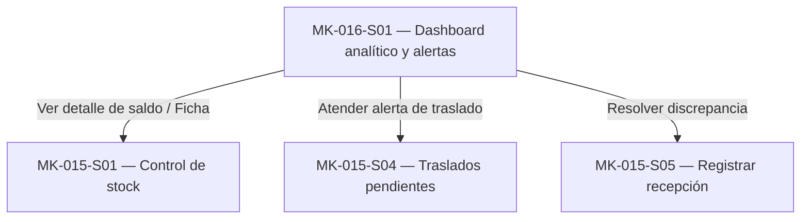

# Component Spec — MK-016

> **Instanciación:** Copiar a `mockups/MK-016/component-spec.md`. Los enlaces relativos de esta plantilla se interpretan desde ese destino; el Design System está en `../DESIGN.md`.

> **Propósito y rol documental:**
> Este documento es la especificación principal del resultado esperado del mockup (qué debe existir).
> Subordinado a las fuentes de verdad (SPEC, HU, WF, FLOW, API Contract y Design System), define formalmente: qué pantallas existen, el propósito de cada pantalla, estructura de cada pantalla, componentes (compartidos y específicos), acciones, estados, contenido, jerarquía de información, decisiones UX locales (`LUX-XX`), fixtures y criterios de aceptación.
> Consume la UX del módulo y las fuentes oficiales; no crea una propuesta UX nueva ni paralela.
>
> **Nota conceptual:**
> Este documento especifica el resultado esperado.
> No define el orden de ejecución ni descompone el trabajo en tareas (responsabilidad de `plan.md` y `tasks.md`).
> No contiene instrucciones procedimentales de implementación paso a paso.

## 1. Identificación

- **Mockup:** MK-016
- **Funcionalidad:** Dashboard analítico y alertas de stock
- **Responsable:** Miguel Ángel Taco Zavala
- **Versión:** 1.0.0
- **Estado:** Aprobado

## 2. Trazabilidad

Define las fuentes oficiales de verdad consumidas por esta funcionalidad. Cualquier discrepancia funcional debe resolverse contra estas fuentes antes de proceder.

| Fuente | Referencia | Alcance |
|---|---|---|
| SPEC | [SPEC-016](../../specs/SPEC-016-dashboard-alertas-stock.md) | §1–8 Indicadores, estados de disponibilidad, actualización reactiva, distribución por ubicación, traslados y filtros |
| HU | [HU-016](../../hu/HU-016-dashboard-alertas-stock.md) | CA-01…CA-11 Criterios de aceptación, visualización de indicadores y alertas de inventario |
| WF | [WF-016](../../wireframes/flows/WF-016-dashboard-alertas-stock.md) | Distribución de KPIs, tabla principal, paneles de alertas y distribución por ubicación |
| Flow | [FLOW-016](../../flujos/FLOW-016-dashboard-alertas-stock.md) | Navegación analítica, filtros y actualización reactiva por evento de inventario |
| Propuesta UX módulo | `mockups/ux/propuesta-ux.md` | §3–5 Matriz de aplicabilidad 016, UX-P01, UX-P02, UX-P03 |
| UX Decisions | `mockups/ux/ux-decisions.md` | UXD-001 (estructura y densidad desktop), UXD-011 (feedback operacional) |
| UX Guidelines | `mockups/ux/ux-guidelines.md` | UXG-001…UXG-022 Reglas normativas operativas y de layout |
| API Contract | [Contrato_Api.md](../../Contrato_Api.md) / [OpenAPI](../../api/openapi.yaml) / [AsyncAPI](../../asyncapi/asyncapi.yaml) | Endpoint `GET /api/v1/inventario/dashboard` (consulta de KPIs y distribución) y evento reactivo `inventory.stock.changed` |
| Design System | [mockups/DESIGN.md](../DESIGN.md), versión 1.0.0 | §9 (Grid de 3 cards por fila, gap 24 px), tokens y componentes DS-C19 (KPIs), DS-C17 (Table), DS-C13 (FilterBar), DS-C14 (Badge), DS-C15 (Alert) |

## 3. Objetivo funcional

- **Usuario:** Gestor comercial (`GESTOR_COMERCIAL`) con capacidades de consulta de inventario.
- **Objetivo:** Monitorear en tiempo real la disponibilidad, bloqueos y traslados por ubicación y SKU sin alterar saldos ni exponer terminología técnica interna.
- **Contexto:** Operación en Web Desktop, viewport canónico de 1440 px, mouse y teclado.
- **Resultado exitoso:** El usuario identifica inmediatamente el nivel de disponibilidad, detecta unidades bloqueadas o en riesgo de quiebre de stock, supervisa traslados con discrepancia y filtra rápidamente por SKU o ubicación sin desbordamiento visual.

## 4. Alcance

### Incluido

- Panel de KPIs principales (12 indicadores organizados en un grid de 3 cards por fila con gap 24 px según DESIGN.md §9):
  1. Total de SKUs vendibles
  2. Unidades físicas totales
  3. Unidades reservadas
  4. Unidades bloqueadas
  5. Unidades disponibles
  6. SKUs Disponibles
  7. SKUs con Stock bajo
  8. SKUs Agotados
  9. Traslados en tránsito
  10. Traslados recibidos parcialmente
  11. Traslados pendientes totales
  12. Traslados con discrepancia
- Cálculo de disponibilidad conforme a la regla autoritativa de negocio: `available = max(on_hand - reserved - blocked, 0)`.
- Clasificación de estados comerciales por SKU: `DISPONIBLE` (available > umbral), `STOCK_BAJO` (0 < available ≤ umbral) y `AGOTADO` (available = 0).
- Panel de distribución de saldos y disponibilidad por ubicación (tienda/almacén) con desglose de Físico, Reservado, Bloqueado, Disponible y conteo de SKUs por estado.
- Panel de alertas críticas de riesgo: SKUs con stock bajo y traslados completados con discrepancia.
- Tabla detallada de inventario por SKU con columnas: SKU, Producto, Ubicación, Físico, Reservado, Bloqueado, Disponible, Umbral y Estado (Badge DS-C14).
- Barra de filtros reactiva (`DS-C13 FilterBar`):
  - Búsqueda por texto libre (SKU o nombre de producto / `productoId`, `sku`).
  - Filtro por categoría (`categoriaId`).
  - Filtro por marca (`marcaId`).
  - Filtro por ubicación (`locationId`).
  - Filtro por estado comercial (`estado`: `DISPONIBLE`, `STOCK_BAJO`, `AGOTADO`).
- Enlaces contextuales hacia `MK-015` (Control de stock y Registrar recepción) para la atención operativa de las alertas sin incrustar formularios de mutación en el dashboard.
- Actualización reactiva ante eventos de cambio de stock (`inventory.stock.changed`) preservando los filtros aplicados por el usuario.

### Fuera de alcance

- Modificación o edición directa de saldos desde el dashboard (operación estrictamente de solo lectura según SPEC-016 §1).
- Creación, cancelación o liberación de reservas de inventario.
- Registro o mutación directa de recepciones de traslado desde el dashboard (se delega a `MK-015-S05`).
- Métricas o reportes de ventas, facturación o ranking financiero de productos.
- Decisiones de picking, packing, logística o despacho.
- Exposición de identificadores y nombres técnicos internos (`on_hand`, `reserved`, `blocked`, `available`, `routing_key`, `message_id`, etc.).

## 5. Inventario de pantallas

Define qué pantallas existen y su propósito dentro de la funcionalidad.

| ID | Pantalla | Propósito | Entrada | Acción principal | Salida | Prioridad | Ruta del prototipo |
|---|---|---|---|---|---|---|---|
| MK-016-S01 | Dashboard analítico y alertas de stock | Monitoreo integral de saldos, alertas y traslados por SKU y ubicación | `GET /api/v1/inventario/dashboard?productoId=&categoriaId=&marcaId=&sku=&locationId=&estado=` + evento `inventory.stock.changed` | Filtrar por categoría/marca/ubicación/estado, buscar por SKU/producto, inspeccionar alertas | Vista consolidada de solo lectura con 12 KPIs (grid 3x), alertas, distribución geográfica y tabla de inventario | P0 | `/MK016/S01` |

**Reglas de acceso y enrutamiento:**

- Toda pantalla inventariada formalmente como `MK-016-SXX` dispone de una ruta individual relativa dentro del entorno de prototipado.
- La ruta `/MK016/S01` permite la inspección directa e independiente del dashboard sin forzar navegación previa.
- La pantalla responde a parámetros de consulta deterministas para verificar estados de prueba (`/MK016/S01?estado=default`, `/MK016/S01?estado=loading`, `/MK016/S01?estado=empty`, `/MK016/S01?estado=error`).

## 6. Relación entre pantallas

## 7. Jerarquía de información

1. **Primaria (Crítica):** Indicadores clave de disponibilidad global (`Unidades disponibles`, `Unidades bloqueadas`, `Stock bajo`, `Agotados`) y alertas activas de discrepancias en traslados.
2. **Secundaria (Operativa):** Panel de distribución por ubicación geográfica y tabla detallada de saldos por SKU con cálculo de disponible y badges de estado.
3. **Complementaria (Contextual):** Metadatos de última sincronización reactiva, umbrales configurados y enlaces a flujos de acción en MK-015.

## 8. Componentes compartidos

Componentes transversales del Design System reutilizados en el dashboard conforme a DESIGN.md §9.

| Componente | Pantallas | Uso | Variante | Estados |
|---|---|---|---|---|
| DS-C19 PO/Card/KPI | S01 | Tarjetas de métricas de disponibilidad, salud de catálogo y traslados (Grid 3 cards por fila, gap 24 px) | Padding 20 px, radio 8 px, cifra destacada 28 px | default, loading (skeleton) |
| DS-C17 PO/Table | S01 | Tabla principal de inventario (9 columnas) y tabla de distribución por ubicación (6 columnas) | Variante con bordes neutros y cabecera en neutral-10 | default, hover, empty, loading |
| DS-C14 PO/Badge | S01 | Etiquetas visuales de estado (Disponible, Stock bajo, Agotado) | Altura mínima 28 px, texto explícito e ícono | success (Disponible), warning (Stock bajo), error (Agotado) |
| DS-C13 PO/FilterBar | S01 | Barra de herramientas y filtros integrados multidimensionales | Buscador por texto + 4 selectores + botón Limpiar | default, active, disabled |
| DS-C15 PO/Alert/Notice | S01 | Tarjetas de alertas críticas de stock y traslados con discrepancia | Contenedor con borde reforzado, ícono de advertencia | default, warning, error |
| DS-C03 PO/TextInput | S01 | Campo de búsqueda de SKU y nombre de producto | Altura 44 px, padding 12 px, etiqueta superior | default, focus, filled |
| DS-C06 PO/Select | S01 | Selectores de Categoría, Marca, Ubicación y Estado | Altura 44 px con opciones predefinidas | default, focus, active |

## 9. Componentes específicos

### MK-016-C01 — Resumen de KPIs de disponibilidad (Grid 3 cards por fila)

**Propósito:** Agrupar en una cuadrícula destacada los 12 indicadores oficiales de SPEC-016 §2 y WF-016, organizados estrictamente en un grid de 3 tarjetas por fila a 1440 px con gap 24 px según DESIGN.md §9 ("Grid de 3 cards por fila a 1440 px como composición base, gap 24").

**Pantallas en las que participa:** MK-016-S01.

**Contenido estructurado:**
- **Fila 1 — Disponibilidad y saldos físicos:**
  1. `DS-C19` Unidades disponibles (128) — Cifra destacada, badge verde informativo.
  2. `DS-C19` Unidades bloqueadas (9) — Cifra destacada, advertencia operativa.
  3. `DS-C19` Unidades físicas totales (145) — Cifra destacada, total inventariado.
- **Fila 2 — Salud del catálogo por SKU:**
  4. `DS-C19` Total SKUs vendibles (24) — Cifra destacada del universo activo.
  5. `DS-C19` SKUs Disponibles (15) — Cifra destacada con stock suficiente.
  6. `DS-C19` SKUs con Stock bajo (6) — Cifra destacada, estado de atención preventiva.
- **Fila 3 — Riesgos de quiebre y reservas:**
  7. `DS-C19` SKUs Agotados (3) — Cifra destacada, alerta crítica de quiebre.
  8. `DS-C19` Unidades reservadas (8) — Cifra destacada comprometida en órdenes.
  9. `DS-C19` Traslados pendientes totales (6) — Suma de en tránsito y parciales.
- **Fila 4 — Flujo logístico de traslados:**
  10. `DS-C19` Traslados en tránsito (4) — Envíos confirmados en ruta.
  11. `DS-C19` Traslados recibidos parcialmente (2) — Recepciones incompletas en curso.
  12. `DS-C19` Traslados con discrepancia (1) — Alerta crítica de merma o faltante.

### MK-016-C02 — Panel de alertas críticas

**Propósito:** Listar los eventos de riesgo de disponibilidad y logística que requieren atención prioritaria por parte del gestor comercial, enlazando hacia MK-015 sin mutar datos.

**Pantallas en las que participa:** MK-016-S01.

**Contenido estructurado:**
- Alertas de Stock Bajo: SKU, producto, unidades disponibles actuales y ubicación afectada, con enlace contextual “Revisar saldo” hacia `MK-015-S01`.
- Alertas de Discrepancia: Identificador de traslado, unidades faltantes no ingresadas a inventario y estado de cierre, con enlace contextual “Ver traslado” hacia `MK-015-S04` / `MK-015-S05`.

## 10. Especificación de la pantalla MK-016-S01

### MK-016-S01 — Dashboard analítico y alertas de stock

**Propósito y objetivo:** Monitorear en tiempo real el inventario físico, reservado, bloqueado y disponible por SKU y ubicación, supervisando alertas de quiebre y traslados sin mutar saldos ni ejecutar recepciones desde esta pantalla (operación estricta de solo lectura según SPEC-016 §1).

**Estructura y layout por zonas:**

1. **Zona 1 — Cabecera de página:**
   - Breadcrumb (`Inventario / Dashboard`).
   - H1: “Dashboard analítico y alertas de stock”.
   - Bajada explicativa: “Monitorea disponibilidad, bloqueos y traslados por ubicación sin modificar los saldos desde el dashboard.”
   - Metadato de sincronización reactiva: “Última actualización: Hace un momento (Reactivo ante eventos de stock)”.
2. **Zona 2 — Grilla de KPIs principales (Grid 3 cards por fila, gap 24 px según DESIGN.md §9):**
   - Fila 1: Unidades disponibles (128) | Unidades bloqueadas (9) | Total unidades físicas (145)
   - Fila 2: Total SKUs vendibles (24) | SKUs disponibles (15) | SKUs con stock bajo (6)
   - Fila 3: SKUs agotados (3) | Unidades reservadas (8) | Traslados pendientes totales (6)
   - Fila 4: Traslados en tránsito (4) | Recibidos parcialmente (2) | Con discrepancia (1)
3. **Zona 3 — Barra de filtros multidimensional (`DS-C13 FilterBar`):**
   - Campo de búsqueda por texto (`DS-C03`): “Buscar SKU o producto” (`productoId`, `sku`).
   - Selector de categoría (`DS-C06`): “Todas las categorías”, “Calzado”, “Vestimenta”, “Accesorios” (`categoriaId`).
   - Selector de marca (`DS-C06`): “Todas las marcas”, “UrbanStep”, “EcoWear”, “TechSport” (`marcaId`).
   - Selector de ubicación (`DS-C06`): “Todas las ubicaciones”, “Tienda Miraflores”, “Almacén Central” (`locationId`).
   - Selector de estado comercial (`DS-C06`): “Todos los estados”, “Disponible”, “Stock bajo”, “Agotado” (`estado`).
   - Botón secundario: “Limpiar filtros”.
4. **Zona 4 — Grilla analítica de dos columnas (50% / 50%, gap 24 px):**
   - **Columna izquierda — Card “Alertas críticas” (`DS-C15`):**
     - Aviso de stock bajo (ZAP-URB-42: 1 disponible vs umbral 2 en Tienda Miraflores). Enlace: “Revisar saldo”.
     - Aviso de traslado con discrepancia (TR-2026-088: 2 unidades faltantes no agregadas a inventario). Enlace: “Ver traslado”.
   - **Columna derecha — Card “Distribución por ubicación” (`DS-C17`):**
     - Tabla con totales por ubicación: Ubicación, Físico, Reservado, Bloqueado, Disponible, SKUs por estado (Disponibles / Stock bajo / Agotados).
5. **Zona 5 — Tabla principal de inventario por SKU (`DS-C17`):**
   - Cabecera de sección: H2 “Inventario por SKU” con contador de registros coincidentes.
   - 9 columnas normativas: **SKU**, **Producto**, **Ubicación**, **Físico**, **Reservado**, **Bloqueado**, **Disponible**, **Umbral**, **Estado**.
   - Columna Estado con badges semánticos (`DS-C14 PO/Badge`): `Disponible` (verde), `Stock bajo` (ámbar), `Agotado` (gris/rojo neutro) según LUX-01.
   - Acción contextual en cada fila: Enlace “Ver detalle” que abre `MK-015-S03` en drawer.

**Componentes presentes:**
- `DS-C19 PO/Card/KPI` (12 tarjetas distribuidas en 4 filas de 3 columnas).
- `DS-C17 PO/Table` (tabla de distribución por ubicación y tabla de inventario por SKU).
- `DS-C13 PO/FilterBar` (contenedor integrado de filtrado reactivo).
- `DS-C03 PO/TextInput` (input de búsqueda).
- `DS-C06 PO/Select` (selectores de categoría, marca, ubicación y estado).
- `DS-C14 PO/Badge` (etiquetas de estado DISPONIBLE, STOCK_BAJO, AGOTADO).
- `DS-C15 PO/Alert/Notice` (avisos de alertas críticas).
- `DS-C25 PO/EmptyState` (estado sin resultados).
- `DS-C24 PO/Skeleton` (marcadores de posición durante la carga).

**Acción primaria:** Monitorear en tiempo real los saldos, alertas y traslados aplicando filtros multidimensionales para detectar riesgos operativos sin alterar inventario.

**Acciones secundarias:**
- Filtrar la tabla y KPIs por categoría (`categoriaId`), marca (`marcaId`), ubicación (`locationId`) o estado comercial (`estado`).
- Buscar un SKU o producto específico mediante texto libre.
- Limpiar todos los filtros activos para regresar a la vista global predeterminada.
- Navegar mediante enlace contextual “Revisar saldo” hacia el detalle de saldo (`MK-015-S03`) o control de stock (`MK-015-S01`).
- Navegar mediante enlace contextual “Ver traslado” hacia la bandeja de traslados (`MK-015-S04`) o recepción (`MK-015-S05`).

**Estados requeridos:**
- **Default:** Dashboard poblado con datos representativos y consistentes (128 disponibles, 9 bloqueadas, 6 bajo stock, 3 agotados).
- **Loading:** Tarjetas KPI, tabla de distribución y tabla de inventario con estados skeleton (`DS-C24`).
- **Empty:** Estado sin coincidencias para los filtros aplicados (`DS-C25` EmptyState con ilustración, microtexto informativo y botón “Limpiar filtros”).
- **Error:** Alerta de fallo en servicio de inventario (`DS-C15` error) con opción interactiva “Reintentar consulta”.

**Contenido clave y microtexto:**

| Elemento | Texto / Patrón | Fuente de procedencia |
|---|---|---|
| H1 / Título | “Dashboard analítico y alertas de stock” | WF-016 |
| Bajada explicativa | “Monitorea disponibilidad, bloqueos y traslados por ubicación sin modificar los saldos desde el dashboard.” | WF-016 / SPEC-016 §1 |
| KPI 1 | “Unidades disponibles” | SPEC-016 §2 / WF-016 |
| KPI 2 | “Unidades bloqueadas” | SPEC-016 §2 / WF-016 |
| KPI 3 | “Unidades físicas totales” | SPEC-016 §2 / WF-016 |
| KPI 4 | “Total SKUs vendibles” | SPEC-016 §2 / WF-016 |
| KPI 5 | “SKUs Disponibles” | SPEC-016 §2 / WF-016 |
| KPI 6 | “SKUs con Stock bajo” | SPEC-016 §2 / WF-016 |
| KPI 7 | “SKUs Agotados” | SPEC-016 §2 / WF-016 |
| KPI 8 | “Unidades reservadas” | SPEC-016 §2 / WF-016 |
| KPI 9 | “Traslados pendientes totales” | SPEC-016 §2 / WF-016 |
| KPI 10 | “Traslados en tránsito” | SPEC-016 §6 / WF-016 |
| KPI 11 | “Traslados recibidos parcialmente” | SPEC-016 §6 / WF-016 |
| KPI 12 | “Traslados con discrepancia” | SPEC-016 §2, §6 / WF-016 |
| Filtro Búsqueda | “Buscar SKU o producto” | SPEC-016 §7 |
| Filtro Categoría | “Todas las categorías” | SPEC-016 §7 / OpenAPI |
| Filtro Marca | “Todas las marcas” | SPEC-016 §7 / OpenAPI |
| Filtro Ubicación | “Todas las ubicaciones” | SPEC-016 §7 / OpenAPI |
| Filtro Estado | “Todos los estados” | SPEC-016 §7 / OpenAPI |
| CTA Limpiar | “Limpiar filtros” | UX Guidelines |
| Columna 1 | “SKU” | WF-016 |
| Columna 2 | “Producto” | WF-016 |
| Columna 3 | “Ubicación” | WF-016 |
| Columna 4 | “Físico” | WF-016 |
| Columna 5 | “Reservado” | WF-016 |
| Columna 6 | “Bloqueado” | WF-016 |
| Columna 7 | “Disponible” | WF-016 |
| Columna 8 | “Umbral” | WF-016 |
| Columna 9 | “Estado” | WF-016 |
| EmptyState | “No se encontraron SKUs para los criterios seleccionados.” | UX Guidelines / DS-C25 |
| Alerta Discrepancia | “Traslado TR-2026-088 cerrado con discrepancia (2 unidades faltantes no ingresadas a inventario).” | HU-016 CA-11 / SPEC-016 §6 |

## 11. Decisiones UX locales

Solo registrar decisiones específicas de diseño exclusivas de esta funcionalidad.

### LUX-01 — Mapeo semántico de Badges de Estado

**Problema:** Determinar el mapeo de variantes para los estados comerciales `DISPONIBLE`, `STOCK_BAJO` y `AGOTADO` en la tabla y paneles analíticos sin recurrir a variantes de acento `volt` o `signal` para saldos confirmados, asegurando ratios de contraste accesibles y coherencia visual total con MK-015 y DESIGN.md §4.1.

**Alternativas consideradas:**
- **Alternativa A:** Utilizar los roles semánticos normativos del Design System: `color/success/default` (`#2F9E44`) para disponible, `color/warning/default` (`#F08C00`) para stock bajo y `color/error/default` (`#E03131`) para agotado, acompañados siempre de texto explícito e íconos SVG de soporte.
- **Alternativa B:** Utilizar tonos de acento dinámicos `accent/signal` (`#4361EE`) para unidades disponibles y `accent/volt` para stock en alerta, diferenciando visualmente el dashboard de las tablas transaccionales.

**Decisión adoptada:** Adoptar la **Alternativa A**. Mapear `DISPONIBLE` → `DS-C14 PO/Badge` con variante `success`; `STOCK_BAJO` → variante `warning`; `AGOTADO` → variante `error`. La paleta y contraste están formalmente verificados en DESIGN.md §4.1 (ratios de 6.12:1 y 6.42:1 frente a fondos neutros). Se prohíbe terminantemente usar `volt` o `signal` para saldos de inventario confirmados.

**Justificación:** El Design System v1.0.0 establece roles semánticos estrictos. Introducir una paleta paralela en el dashboard desorientaría al gestor comercial al navegar entre el control de stock (MK-015) y el dashboard analítico (MK-016). La certeza semántica y la accesibilidad priman sobre ornamentaciones ad hoc.

**Trade-off:** Limita la diferenciación cromática del dashboard a la escala semántica canónica del sistema de diseño, impidiendo esquemas de color exóticos, pero asegurando uniformidad operativa y cumplimiento normativo WCAG AA.

**Criterio de validación:** Los badges en la tabla principal y en el panel de distribución renderizan exclusivamente con tokens canónicos `color/success/default`, `color/warning/default` y `color/error/default`, con texto legible e ícono accesible.

### LUX-04 — Alertas operativas con enlace contextual de navegación

**Problema:** Resolver la atención oportuna de traslados con discrepancia y quiebres de stock detectados en el dashboard sin convertir la vista analítica en un formulario transaccional recargado.

**Alternativas consideradas:**
- **Alternativa A:** Embeber modales o drawers de edición directa de traslados y ajustes de umbrales dentro de MK-016.
- **Alternativa B:** Ofrecer enlaces de salto contextual hacia los flujos especializados de gestión en `MK-015` (`MK-015-S01` para detalle de saldos y `MK-015-S05` para registro de recepciones con discrepancia).

**Decisión adoptada:** Adoptar la **Alternativa B**. Las alertas de stock bajo y discrepancias en traslados incluyen enlaces de salto directo hacia `MK-015-S01` o `MK-015-S05`, manteniendo el dashboard estrictamente como una herramienta analítica de solo lectura.

**Justificación:** El dashboard es de monitoreo y consulta conforme a SPEC-016 §1 y §8. Incorporar lógica de mutación en esta pantalla violaría el principio de responsabilidad única y duplicaría indebidamente el flujo de resolución de recepciones formalizado en MK-015.

**Trade-off:** Requiere que el usuario navegue a otra vista para actuar sobre una incidencia, pero preserva la ligereza, claridad conceptual y aislamiento de estados del dashboard.

**Criterio de validación:** Los botones/enlaces “Revisar saldo” y “Ver traslado” ejecutan navegación hacia las rutas `/MK015/S01` y `/MK015/S05` respectivamente, sin alterar datos dentro de `/MK016/S01`.

## 12. Reglas de layout PC

- Entorno exclusivo: Web Desktop.
- Viewport canónico: 1440 px de ancho.
- Contenedor principal centrado con ancho máximo de 1200 px a 1440 px y gutters de 24 px.
- Grilla modular de 12 columnas; sin desbordamiento horizontal en resoluciones desktop estándar.
- Controles interactivos con altura mínima de 44 px y áreas de clic accesibles.

## 13. Fixtures

| Fixture | Caso de negocio | Pantalla / Estado asociado | Datos representativos |
|---|---|---|---|
| default | Caso estándar con inventario multitienda | S01 / Default | 128 disponibles, 9 bloqueadas, 6 bajo stock, 3 agotados; 2 ubicaciones (Miraflores y Almacén Central) |
| loading | Simulación de carga reactiva o inicial | S01 / Loading | Skeletons en tarjetas KPI, tabla de distribución y tabla de inventario |
| empty | Filtros sin resultados coincidentes | S01 / Empty | Lista vacía `[]` con componente DS-C25 "No se encontraron SKUs para los criterios seleccionados" |
| error | Fallo de conexión con servicio de stock | S01 / Error | Mensaje de error controlado con opción "Reintentar consulta" |

## 14. Preguntas y supuestos

### Preguntas abiertas
- No existen preguntas abiertas bloqueantes. El alcance de solo lectura está formalizado en SPEC-016.

### Supuestos adoptados
- **A-01:** La recepción de traslados con discrepancia no afecta directamente el disponible del SKU hasta que se cierre formalmente la recepción en MK-015. (Alineado con SPEC-016 §6 y HU-016 CA-11).

## 15. Criterios de aceptación

- [ ] La pantalla P0 `MK-016-S01` está identificada con su ruta `/MK016/S01`.
- [ ] El propósito, layout y jerarquía de información reflejan fielmente SPEC-016, WF-016 y DESIGN.md §9 (grid de 3 cards por fila, gap 24 px).
- [ ] No existen acciones de mutación ni botones para editar saldos directamente (solo lectura estricta).
- [ ] Se respetan rigurosamente las UX Guidelines y el Design System (`DESIGN.md`).
- [ ] Las decisiones locales `LUX-01` y `LUX-04` están completamente documentadas y justificadas con estructura formal.
- [ ] Se prohíben términos técnicos crudos en las etiquetas de interfaz (`on_hand`, `reserved`, `blocked`, `available`).
- [ ] Los fixtures deterministas cubren los estados default, loading, empty y error.
- [ ] Accesibilidad básica garantizada (foco visible, nombres accesibles, no dependencia exclusiva del color).
