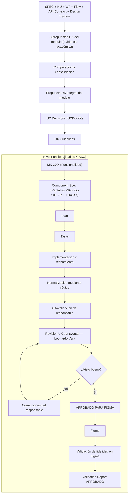

# Mockups — Productos y Ofertas

## 1. Propósito

Esta carpeta contiene la documentación permanente y la arquitectura base de la etapa de mockups para el módulo **Productos y Ofertas**.

La experiencia de usuario (UX) se establece transversalmente a nivel del módulo y orienta de forma consistente la construcción de todas las funcionalidades:

$$\text{3 propuestas UX del módulo} \longrightarrow \text{comparación y consolidación} \longrightarrow \text{Propuesta UX Integral Adoptada} \longrightarrow \text{UX Decisions} \longrightarrow \text{UX Guidelines} \longrightarrow \text{16 funcionalidades} \longrightarrow \text{N pantallas por funcionalidad}$$

## 2. Estructura del Directorio

```text
mockups/
├── README.md                                  # Guía del pipeline académico, DoD, DoR y trazabilidad
├── ux/                                        # UX transversal a nivel de módulo
│   ├── propuesta-ux.md                        # 3 propuestas UX preservadas, comparativa y Propuesta UX Integral Adoptada
│   ├── ux-decisions.md                        # Decisiones UX justificadas (UXD-XXX)
│   └── ux-guidelines.md                       # Reglas UX normativas obligatorias
├── _plantillas/                               # Plantillas estandarizadas del módulo y funcionalidades
│   ├── modulo/
│   │   ├── propuesta-ux.template.md
│   │   ├── ux-decisions.template.md
│   │   └── ux-guidelines.template.md
│   └── mockup/
│       ├── component-spec.template.md
│       ├── plan.template.md
│       ├── tasks.template.md
│       └── validation-report.template.md
├── prototipo/                                 # Entorno interactivo de prototipado
│   └── README.md                              # Propósito, estructura y normas del código de prototipado
├── MK-001/                                    # Carpetas por funcionalidad (MK-001 a MK-016)
│   ├── component-spec.md
│   ├── plan.md
│   ├── tasks.md
│   └── validation-report.md
└── ...
```

## 3. Niveles Documentales

### Nivel Módulo (Transversal)
Define lineamientos que aplican obligatoriamente a todas las funcionalidades:
- **`propuesta-ux.md`**: Integra las 3 propuestas UX originales preservadas como evidencia académica, su comparación transversal con análisis de trade-offs y la **Propuesta UX Integral Adoptada**.
- **`ux-decisions.md`**: Registro formal de decisiones justificadas (`UXD-XXX`) derivadas de la propuesta integral.
- **`ux-guidelines.md`**: Reglas normativas operativas derivadas estrictamente de las decisiones en `ux-decisions.md`.

### Nivel Funcionalidad / Mockup (`MK-XXX`)
Cada funcionalidad concreta (`MK-001` a `MK-016`) consume la UX del módulo y define:
- **`component-spec.md`**: Especificación de componentes, inventario de pantallas (`MK-XXX-S01`, `S02`, etc.) y decisiones locales (`LUX-XX`).
- **`plan.md`**: Estrategia de implementación incremental.
- **`tasks.md`**: Desglose de tareas verificables.
- **`validation-report.md`**: Reporte formal de validación funcional, UI y accesibilidad en PC.

## 4. Nomenclatura

- `MK-XXX`: Mockup representativo de una funcionalidad (ej. `MK-001`).
- `MK-XXX-SXX`: Pantalla específica dentro de la funcionalidad (ej. `MK-001-S01`).
- `MK-XXX-CXX`: Componente específico de la funcionalidad (ej. `MK-001-C01`).
- `MK-XXX-TXX`: Tarea de implementación o verificación (ej. `MK-001-T01`).
- `UXD-XXX`: Decisión UX transversal del módulo registrada en `ux-decisions.md`.
- `LUX-XX`: Decisión UX local justificada en `component-spec.md` (específica de una funcionalidad).

## 5. Pipeline Académico Oficial



## 6. Fuentes de Verdad

| Fuente | Define |
|---|---|
| SPEC | Reglas y validaciones del negocio |
| HU | Necesidades del usuario e intenciones |
| WF | Estructura base de distribución |
| Flow | Navegación, transiciones y flujos alternativos |
| API Contract | Esquema de datos y modelos de integración |
| Design System | Foundations, tokens y componentes base |
| Propuesta UX del módulo | Enfoque global de experiencia y consolidación |
| UX Decisions | Justificación estructurada de patrones transversales |
| UX Guidelines | Reglas normativas de interacción y consistencia |
| Component Spec | Contenido técnico y pantallas por funcionalidad |
| Plan | Fases e hitos de construcción |
| Tasks | Unidades de trabajo atómicas |

## 7. Regla de Decisiones UX Locales

Si surge una decisión de diseño aplicable exclusivamente a una funcionalidad:
1. Se registra en `component-spec.md` bajo la nomenclatura `LUX-XX` con su justificación y trade-offs.
2. Si la solución se generaliza a dos o más funcionalidades, se promueve formalmente a `mockups/ux/ux-decisions.md` como `UXD-XXX`.

## 8. Alcance de Plataforma

- **Entorno:** Web Desktop exclusivamente.
- **Viewport canónico de generación y revisión:** 1440 px de ancho (utilizado como estándar de verificación, sin implicar un diseño de ancho rígido).
- **Restricciones:** No se incluyen variantes mobile ni tablet en esta etapa académica. Operabilidad completa garantizada mediante mouse y teclado sin overflow horizontal involuntario.

## 9. Definition of Ready (DoR)

Una funcionalidad `MK-XXX` está lista para implementación cuando:
- [ ] SPEC, HU, WF y Flow correspondientes están identificados y aprobados.
- [ ] La Propuesta UX Integral del módulo está aprobada y vigente.
- [ ] Las UX Decisions y UX Guidelines aplicables están consolidadas.
- [ ] El `component-spec.md` está redactado e inventaría todas las pantallas P0.
- [ ] El `plan.md` e hitos están definidos.
- [ ] Las tareas en `tasks.md` son atómicas y ejecutables.

## 10. Definition of Done (DoD)

Una funcionalidad `MK-XXX` se considera terminada cuando:
- [ ] Todas las pantallas P0 (`MK-XXX-S01`... `Sn`) existen y respetan el Flow.
- [ ] Las reglas funcionales de las SPEC están reflejadas con trazabilidad.
- [ ] La UX integral del módulo y las UX Guidelines han sido rigurosamente respetadas.
- [ ] Las decisiones locales `LUX-XX` están debidamente justificadas.
- [ ] El código normalizado reside en `prototipo/src/pantallas/MKXXX`.
- [ ] El responsable completó la autovalidación.
- [ ] No existen hallazgos bloqueantes ni hallazgos importantes requeridos abiertos.
- [ ] Leonardo Vera Rodríguez realizó la revisión transversal final.
- [ ] Leonardo Vera Rodríguez otorgó visto bueno para pasar a Figma.
- [ ] La versión con visto bueno fue reflejada en Figma.
- [ ] Se verificó la fidelidad entre el mockup aprobado para Figma y el diseño en Figma.
- [ ] El enlace de Figma está registrado.
- [ ] `validation-report.md` registra el resultado general **APROBADO**.

## 11. Matriz de Trazabilidad e Índice Canónico de Funcionalidades

Fuente de verdad canónica: [`wireframes/INDEX.md`](../wireframes/INDEX.md).

| Mockup | Funcionalidad | Rama | Responsable | Pantallas | Spec | Plan | Tasks | Validación | Figma | Estado |
|---|---|---|---|:---:|---|---|---|---|---|---|
| MK-001 | Carga y exportación masiva de productos | `castilla` | Marco Renato Castilla Huanca | Pendiente | Pendiente | Pendiente | Pendiente | Pendiente | — | Borrador |
| MK-002 | Gestión de combos de productos | `castilla` | Marco Renato Castilla Huanca | Pendiente | Pendiente | Pendiente | Pendiente | Pendiente | — | Borrador |
| MK-003 | Gestión de productos (CRUD principal) | `poma` | Gabriel Poma Gutierrez | Pendiente | Pendiente | Pendiente | Pendiente | Pendiente | — | Borrador |
| MK-004 | Gestión avanzada de variantes (SKUs) | `poma` | Gabriel Poma Gutierrez | Pendiente | Pendiente | Pendiente | Pendiente | Pendiente | — | Borrador |
| MK-005 | Gestión de cupones de descuento | `cueva` | Axel Andree Cueva Alcalá | Pendiente | Pendiente | Pendiente | Pendiente | Pendiente | — | Borrador |
| MK-006 | Gestión de ofertas y promociones | `cueva` | Axel Andree Cueva Alcalá | Pendiente | Pendiente | Pendiente | Pendiente | Pendiente | — | Borrador |
| MK-007 | Reglas de venta cruzada y upselling | `cueva` | Axel Andree Cueva Alcalá | Pendiente | Pendiente | Pendiente | Pendiente | Pendiente | — | Borrador |
| MK-008 | Gestión de categorías y subcategorías | `lopez` | Leonardo Lopez | Pendiente | Pendiente | Pendiente | Pendiente | Pendiente | — | Borrador |
| MK-009 | Gestión de características y sus valores | `lopez` | Leonardo Lopez | Pendiente | Pendiente | Pendiente | Pendiente | Pendiente | — | Borrador |
| MK-010 | Asociación entre tipos de producto y características | `lopez` | Leonardo Lopez | Pendiente | Pendiente | Pendiente | Pendiente | Pendiente | — | Borrador |
| MK-011 | Gestión de marcas | `lopez` | Leonardo Lopez | Pendiente | Pendiente | Pendiente | Pendiente | Pendiente | — | Borrador |
| MK-012 | Gestión de SEO y metadatos | `lopez` | Leonardo Lopez | Pendiente | Pendiente | Pendiente | Pendiente | Pendiente | — | Borrador |
| MK-013 | Gestión de precios individuales y masivos | `vera` | Leonardo Vera Rodríguez | Pendiente | Pendiente | Pendiente | Pendiente | Pendiente | — | Borrador |
| MK-014 | Historial de auditoría de precios | `vera` | Leonardo Vera Rodríguez | Pendiente | Pendiente | Pendiente | Pendiente | Pendiente | — | Borrador |
| MK-015 | Control de stock y disponibilidad | `taco` | Miguel Ángel Taco Zavala | Pendiente | Pendiente | Pendiente | Pendiente | Pendiente | — | Borrador |
| MK-016 | Dashboard analítico y alertas de stock | `taco` | Miguel Ángel Taco Zavala | Pendiente | Pendiente | Pendiente | Pendiente | Pendiente | — | Borrador |
