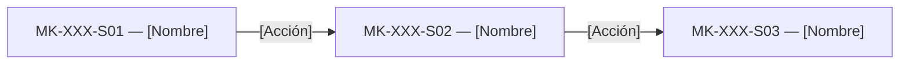

# Component Spec — MK-XXX

> **Instanciación:** Copiar a `mockups/MK-XXX/component-spec.md`. Los enlaces relativos de esta plantilla se interpretan desde ese destino; el Design System está en `../DESIGN.md`.

> **Propósito y rol documental:**
> Este documento es la especificación principal del resultado esperado del mockup (qué debe existir).
> Subordinado a las fuentes de verdad (SPEC, HU, WF, FLOW, API Contract y Design System), define formalmente: qué pantallas existen, el propósito de cada pantalla, estructura de cada pantalla, componentes (compartidos y específicos), acciones, estados, contenido, jerarquía de información, decisiones UX locales (`LUX-XX`), fixtures y criterios de aceptación.
> Consume la UX del módulo y las fuentes oficiales; no crea una propuesta UX nueva ni paralela.
>
> **Nota conceptual:**
> Este documento especifica el resultado esperado.
> No define el orden de ejecución ni descompone el trabajo en tareas (responsabilidad de `plan.md` y `tasks.md`).
> No contiene instrucciones procedimentales de implementación paso a paso.

## 1. Identificación

- **Mockup:** MK-XXX
- **Funcionalidad:** [Nombre de la funcionalidad]
- **Responsable:** [Nombre del owner funcional]
- **Versión:** [vX.Y]
- **Estado:** Borrador | En revisión | Aprobado | Bloqueado

## 2. Trazabilidad

Define las fuentes oficiales de verdad consumidas por esta funcionalidad. Cualquier discrepancia funcional debe resolverse contra estas fuentes antes de proceder.

| Fuente | Referencia | Alcance |
|---|---|---|
| SPEC | [SPEC-XXX] | [Sección / Reglas de negocio] |
| HU | [HU-XXX] | [Sección / Criterios] |
| WF | [WF-XXX] | [Sección / Distribución] |
| Flow | [FLOW-XXX] | [Camino / Nodos de navegación] |
| Propuesta UX módulo | `mockups/ux/propuesta-ux.md` | [Sección aplicable] |
| UX Decisions | [UXD-XXX] | [Decisión transversal] |
| UX Guidelines | `mockups/ux/ux-guidelines.md` | [Sección normativa] |
| API Contract | [Ruta a Contrato_Api.md / OpenAPI] | [Endpoints y esquemas] |
| Design System | [mockups/DESIGN.md](../DESIGN.md), versión [versión consumida] | [Apartados, tokens y componentes DS-CXX aplicables] |

## 3. Objetivo funcional

- **Usuario:** [Rol o perfil de usuario].
- **Objetivo:** [Resultado que el usuario busca alcanzar].
- **Contexto:** [Situación o disparador de negocio].
- **Resultado exitoso:** [Condición objetiva de éxito].

## 4. Alcance

### Incluido
- [Elemento funcional o pantalla incluida].
- [Interacción o flujo incluido].
- [Estados requeridos incluidos].

### Fuera de alcance
- [Elemento o flujo explícitamente excluido].

## 5. Inventario de pantallas

Define qué pantallas existen y su propósito dentro de la funcionalidad.

| ID | Pantalla | Propósito | Entrada | Acción principal | Salida | Prioridad | Ruta del prototipo |
|---|---|---|---|---|---|---|---|
| MK-XXX-S01 | [Nombre] | [Propósito] | [Origen] | [Acción] | [Destino] | P0 | `/MKXXX/S01` |
| MK-XXX-S02 | [Nombre] | [Propósito] | [Origen] | [Acción] | [Destino] | P0 | `/MKXXX/S02` |

**Reglas de acceso y enrutamiento:**
- Toda pantalla inventariada formalmente como `MK-XXX-SXX` debe disponer de una ruta individual relativa dentro del entorno de prototipado.
- La prioridad (`P0`, `P1`, `P2`, etc.) define la criticidad y obligatoriedad de alcance, mientras que la ruta directa garantiza accesibilidad, trazabilidad, revisión y reproducibilidad independientemente de la prioridad.
- La ruta debe permitir inspeccionarla directamente sin requerir transitar previamente por un flujo.
- El identificador de pantalla (`MK-XXX-SXX`) y la ruta del prototipo (`/MKXXX/SXX`) deben mantenerse estrictamente sincronizados.
- Cualquier cambio, alta o baja en el inventario de pantallas exige revisar y actualizar las rutas correspondientes.

## 6. Relación entre pantallas

Ajustar al Flow real de navegación.

## 7. Jerarquía de información

1. **Primaria:** [Información y acciones críticas inmediatamente visibles].
2. **Secundaria:** [Información de soporte o acciones secundarias].
3. **Complementaria:** [Detalles periféricos, metadatos o ayuda contextual].

Debe mantenerse alineada con la Propuesta UX y las UX Guidelines del módulo.

## 8. Componentes compartidos

Componentes transversales del Design System o reutilizados entre pantallas. No redefinir componentes existentes del Design System.

| Componente | Pantallas | Uso | Variante | Estados |
|---|---|---|---|---|
| [DS-C01 / PO/Button] | S01, S02 | [Uso concreto] | [Variante, intent y size de DESIGN.md] | [Estados requeridos] |

## 9. Componentes específicos

Componentes particulares requeridos exclusivamente por esta funcionalidad.

### MK-XXX-C01 — [Nombre del componente]

**Propósito**  
[Descripción del rol y objetivo del componente.]

**Pantallas en las que participa**  
- MK-XXX-S01.

**Contenido estructurado**
- [Dato o campo].
- [Acción disponible].

**Propiedades conceptuales**

| Propiedad | Tipo | Obligatoria | Regla / Restricción |
|---|---|---:|---|
| [nombrePropiedad] | Texto / Número / Booleano | Sí / No | [Regla de negocio o formato] |

**Estados**

| Estado | Disparador | Representación visual | Acción permitida |
|---|---|---|---|
| Default | [Condición inicial o datos cargados] | [Descripción visual] | [Acción disponible] |
| Loading | [Condición de carga o espera] | [Descripción visual] | [Acción o bloqueo] |
| Error | [Condición de fallo controlado] | [Descripción visual] | [Acción de reintento] |

**Interacciones**

| Acción del usuario | Respuesta de interfaz | Resultado / Efecto | Flow relacionado |
|---|---|---|---|
| [Acción] | [Feedback inmediato] | [Destino o cambio de estado] | [Ref FLOW-XXX] |

**Accesibilidad**
- Nombre accesible: [Regla o aria-label].
- Foco: [Comportamiento del indicador de foco].
- Teclado: [Atajos o navegación tabular].

## 10. Especificación por pantalla

Define la estructura, componentes, acciones, estados y contenido clave de cada pantalla.

### MK-XXX-S01 — [Nombre de pantalla]

**Propósito y objetivo**  
[Qué resuelve el usuario en esta pantalla concreta.]

**Estructura y layout**
1. [Zona 1 — Cabecera / Título de página / Breadcrumbs].
2. [Zona 2 — Área principal de contenido / Tabla / Formulario / Filtros].
3. [Zona 3 — Barra de acciones / Paginación / Resumen lateral].

**Componentes presentes**
- [Componente compartido / específico].
- [Componente compartido / específico].

**Acción primaria**  
[Acción principal esperada en la pantalla.]

**Acciones secundarias**
- [Acción secundaria 1].
- [Acción secundaria 2].

**Estados requeridos**
- [Default: visualización estándar con datos válidos].
- [Loading: indicador de carga en bloque principal].
- [Empty: estado vacío explicativo y accionable si no hay registros].
- [Error: mensaje de error con feedback claro y posibilidad de recuperación].

**Contenido clave y microtexto**

| Elemento | Texto / Patrón | Fuente de procedencia |
|---|---|---|
| H1 / Título | [Texto del título] | [WF / UX] |
| CTA Primario | [Texto del botón] | [UX Guidelines] |
| Mensaje de ayuda | [Microtexto de orientación] | [SPEC / UX Guidelines] |

*(Repetir la sección 10 por cada pantalla inventariada `MK-XXX-SXX`).*

## 11. Decisiones UX locales

Solo registrar decisiones específicas de diseño exclusivas de esta funcionalidad.

### LUX-01 — [Nombre descriptivo]

**Problema**  
[Descripción del problema de interacción o visualización concreto.]

**Alternativas consideradas**
- Alternativa A: [Descripción y motivo de descarte].
- Alternativa B: [Descripción y motivo de adopción].

**Decisión adoptada**  
[Opción elegida.]

**Justificación**  
[Motivo y alineación con la experiencia del módulo.]

**Trade-off**  
[Compromiso o limitación asumida.]

**Criterio de validación**  
[Condición objetiva para comprobar que la decisión es efectiva.]

> **Regla de escalamiento UX:** Si una decisión local comienza a repetirse o aplicarse en más de una funcionalidad, debe promoverse formalmente a `mockups/ux/ux-decisions.md` como `UXD-XXX`.

## 12. Reglas de layout PC

- Entorno exclusivo: Web desktop.
- Viewport canónico de generación y revisión: 1440 px de ancho (utilizado como estándar de verificación, sin implicar un diseño de ancho rígido).
- Usar grid, contenedores y ancho de contenido alineados al Design System y Mantine.
- No implementar adaptaciones mobile ni tablet.
- Evitar overflow horizontal involuntario en todas las pantallas y estados.

## 13. Fixtures

Conjunto de datos deterministas requeridos para reproducir de forma predecible cada estado en el entorno de prototipado.

| Fixture | Caso de negocio | Pantalla / Estado asociado | Datos representativos |
|---|---|---|---|
| default | Caso de éxito con datos estándar válidos | S01 / Default | [Descripción del dataset] |
| loading | Simulación de estado asíncrono en curso | S01 / Loading | [Estado diferido / skeleton] |
| empty | Sin registros o catálogo vacío | S01 / Empty | `[]` / lista vacía |
| error | Fallo controlado de validación o red | S01 / Error | [Código y mensaje de error] |

## 14. Preguntas y supuestos

### Preguntas abiertas

| ID | Pregunta | Bloquea ejecución | Responsable | Estado |
|---|---|---:|---|---|
| Q-01 | [Pregunta sobre regla de negocio o interfaz] | Sí / No | [Nombre / Rol] | Abierta / Resuelta |

### Supuestos adoptados

| ID | Supuesto | Riesgo asociado | Condición de revisión |
|---|---|---|---|
| A-01 | [Supuesto operativo adoptado] | [Riesgo si el supuesto es inválido] | [Fecha o evento de confirmación] |

## 15. Criterios de aceptación

Checklist declarativo que define cuándo la especificación del mockup está completa y lista para ser tomada por el plan de ejecución:

- [ ] Todas las pantallas P0 están identificadas e inventariadas con su ruta única en el prototipo.
- [ ] El propósito, estructura y jerarquía de cada pantalla están claramente definidos.
- [ ] El Flow de navegación entre pantallas respeta las fuentes oficiales sin caminos huérfanos.
- [ ] No existen acciones, campos ni reglas de negocio inventadas fuera de las SPEC/HU.
- [ ] La Propuesta UX Integral y las UX Guidelines del módulo se aplican rigurosamente.
- [ ] Las UX Decisions aplicables (`UXD-XXX`) están consideradas e integradas.
- [ ] Las decisiones locales (`LUX-XX`) están debidamente justificadas con trade-offs claros.
- [ ] Los componentes compartidos se reutilizan del Design System sin duplicación.
- [ ] Las propiedades y estados de los componentes específicos están especificados.
- [ ] Las reglas de layout PC (viewport canónico 1440 px, sin overflow horizontal) están establecidas.
- [ ] Los fixtures deterministas para estados P0 (default, loading, empty, error) están definidos.
- [ ] La accesibilidad básica (foco visible, nombres accesibles, navegación por teclado) está contemplada.
