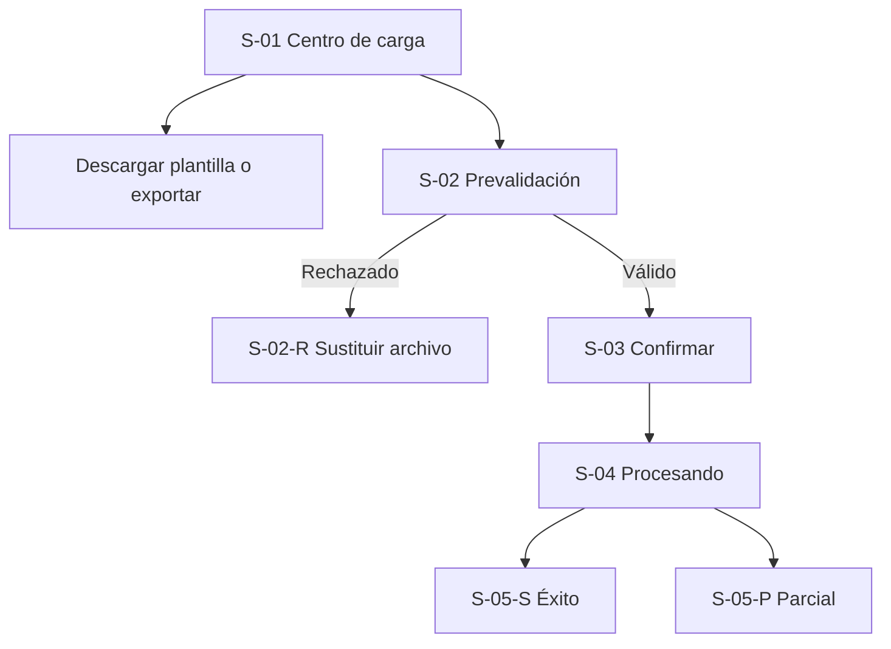

# WF-001 — Carga y exportación masiva de productos

## 0. Instrucciones para el agente

Genera un wireframe detallado, anotado y navegable del flujo descrito en este\
archivo.

Antes de diseñar:

1. Consulta ../../specs/spec\_carga\_exportacion\_masiva\_productos.md.
2. Consulta ../../hu/hu\_carga\_exportacion\_masiva\_productos.md.
3. Consulta ../DESIGN.md.
4. Usa este documento como definición específica de interacción.

Prioridad de fuentes:

1. La especificación define reglas de negocio y restricciones globales.
2. La historia de usuario define criterios de aceptación y escenarios.
3. Este archivo define composición, navegación y comportamiento del flujo.
4. DESIGN.md define la representación visual.

Si existe una contradicción, no inventes una resolución. Identifícala como\
pregunta abierta y señala qué pantalla queda afectada.

Reglas de producción:

- No agregues campos, permisos, endpoints ni reglas no documentadas.
- No diseñes una pantalla de mapeo de columnas.
- No permitas adjuntar o incrustar imágenes; la plantilla solo admite URLs.
- No elijas una librería de UI o estrategia CSS.
- No consumas APIs reales ni uses datos personales reales.
- Numera las anotaciones como A-01, A-02, A-03, etc.
- Representa todos los estados obligatorios indicados en este documento.
- Los eventos de dominio son contexto técnico; no deben exponerse al usuario\
  salvo que una regla funcional lo requiera.
- La concurrencia de inventario es responsabilidad del sistema. El wireframe\
  debe comunicar el resultado del procesamiento, no sus detalles internos.

### Formato del entregable

Genera un prototipo navegable con HTML, CSS y JavaScript estáticos:

- El punto de entrada debe ser index.html.
- Debe funcionar sin proceso de compilación.
- Usa rutas y recursos relativos.
- No uses React ni dependencias del frontend productivo.
- No requieras conexión a servicios externos.
- Usa datos ficticios representativos.
- Simula únicamente las interacciones necesarias para validar el flujo.
- Incluye las anotaciones visibles definidas en cada pantalla.
- Incluye vistas de escritorio, tablet y móvil o controles para inspeccionarlas.
- Mantén el estilo monocromático y de baja fidelidad de DESIGN.md.

### Entregables esperados

1. Pantallas y variantes indicadas en el inventario.
2. Navegación funcional entre los estados simulados.
3. Anotaciones numeradas asociadas a elementos visibles.
4. Estado inicial, prevalidación, procesamiento y resultado.
5. Casos de éxito, rechazo estructural y éxito parcial.
6. Comportamiento responsivo.
7. Lista visible o adjunta de supuestos y preguntas abiertas.

---

## 1. Metadatos

| Campo                | Valor                                   |
| -------------------- | --------------------------------------- |
| ID del wireframe     | WF-001                                  |
| Nombre del flujo     | Carga y exportación masiva de productos |
| Versión              | 0.1                                     |
| Estado               | Borrador                                |
| Responsable          | Por asignar                             |
| Fecha                | 2026-09-16                              |
| Última actualización | 2026-09-16                              |

## 2. Trazabilidad

| Fuente              | Identificador o sección                                       | Aporte al flujo                                               |
| ------------------- | ------------------------------------------------------------- | ------------------------------------------------------------- |
| Spec                | spec\_carga\_exportacion\_masiva\_productos.md, secciones 1–6 | Alcance, límites, reglas, procesamiento asíncrono y seguridad |
| Historia de usuario | hu\_carga\_exportacion\_masiva\_productos.md, CA-01 a CA-10   | Resultados observables y escenarios de aceptación             |
| Diseño              | DESIGN.md                                                     | Lenguaje visual monocromático de baja fidelidad               |
| Backlog             | No proporcionado                                              | No se asignan IDs de backlog                                  |

### Funcionalidades incluidas

- Descargar una plantilla vacía en XLSX o CSV.
- Exportar el catálogo completo a nivel de SKU/variante en XLSX o CSV.
- Seleccionar un archivo XLSX o CSV para importar.
- Prevalidar estructura, tipo, tamaño y límite de filas.
- Confirmar una importación válida.
- Consultar el estado del procesamiento asíncrono sin bloquear la interfaz.
- Mostrar el resultado cuantitativo del lote.
- Descargar un CSV con filas fallidas y causa exacta cuando existan errores\
  parciales.
- Comunicar que las celdas vacías de un SKU existente conservan el valor actual.
- Comunicar que las imágenes deben suministrarse como URLs válidas.

### Fuera de alcance

- Carga de imágenes físicas o incrustadas en XLSX/CSV.
- Mapeo dinámico de columnas.
- Edición manual de productos dentro de este flujo.
- Procesamiento sincrónico que bloquee la interfaz.
- Visualización de RabbitMQ, eventos EDA, Kardex o concurrencia interna.
- Historial de importaciones, cancelación del lote y reintento automático,\
  porque no están confirmados en las fuentes.

## 3. Usuario objetivo

| Aspecto               | Definición                                                                                                     |
| --------------------- | -------------------------------------------------------------------------------------------------------------- |
| Persona               | Gestor comercial responsable del catálogo                                                                      |
| Rol en el sistema     | Gestor comercial autorizado                                                                                    |
| Nivel técnico         | No especificado; diseñar para uso operativo básico/intermedio                                                  |
| Contexto de uso       | Administración frecuente de cientos o miles de SKU mediante herramientas ofimáticas                            |
| Necesidad principal   | Registrar o actualizar productos, variantes, precios y stock sin editar cada registro manualmente              |
| Permisos relevantes   | Debe poder importar y exportar; el código exacto de los permisos está pendiente                                |
| Dispositivo principal | Escritorio como hipótesis por el uso de hojas de cálculo; tablet y móvil deben permitir seguimiento y descarga |

## 4. Objetivo del flujo

El gestor comercial debe poder descargar la estructura oficial, exportar el\
catálogo o importar hasta 5,000 filas o 10 MB para crear o actualizar\
SKU/variantes de forma asíncrona y obtener un resultado verificable.

### Resultado exitoso

El archivo válido queda asociado a un lote, la interfaz deja claro que el\
procesamiento continúa en segundo plano y, al finalizar, presenta cantidades\
procesadas, exitosas y fallidas. Si existen filas fallidas, ofrece un CSV con\
el número de fila y la causa exacta.

### Indicador de finalización

La pantalla cambia del estado En cola o Procesando a un estado final:

- Completado sin errores.
- Completado con errores parciales.
- Fallo general, si el producto define posteriormente este estado.

El usuario recibe una notificación al finalizar. El canal y el comportamiento\
de esa notificación están pendientes de definición.

## 5. Precondiciones y disparador

### Precondiciones

- El usuario tiene una sesión válida.
- El usuario posee autorización para importar o exportar productos.
- Para importar, el archivo respeta la plantilla oficial.
- El archivo no supera 5,000 filas ni 10 MB.
- Las imágenes se expresan mediante URLs; no hay archivos incrustados.

### Punto de entrada

- Ruta propuesta: /productos/carga-masiva.
- Entrada propuesta: opción Carga masiva dentro del módulo de productos.
- Contexto conservado al entrar: ninguno confirmado.

La ruta y ubicación exactas son una propuesta de wireframe y deben confirmarse\
con la arquitectura de navegación.

### Salidas del flujo

| Resultado                         | Destino o comportamiento                            |
| --------------------------------- | --------------------------------------------------- |
| Descarga de plantilla             | Permanece en S-01 y el navegador inicia la descarga |
| Exportación del catálogo          | Permanece en S-01 y el navegador inicia la descarga |
| Archivo estructuralmente inválido | Permanece en S-02-R y permite sustituirlo           |
| Importación confirmada            | Navega a S-04 con estado En cola o Procesando       |
| Procesamiento completo            | Navega o actualiza a S-05                           |
| Cancelación antes de confirmar    | Regresa a S-02 sin crear un lote                    |
| Error de consulta del estado      | Mantiene el lote y permite volver a consultar       |

## 6. Secuencia principal

### Flujo A — Descargar plantilla

1. El gestor entra a Carga y exportación masiva.
2. Selecciona Descargar plantilla.
3. Elige XLSX o CSV mediante el patrón de selección que se apruebe.
4. El sistema inicia la descarga de una plantilla con cabeceras predefinidas y\
   filas de ejemplo eliminables.
5. La interfaz confirma que la descarga fue iniciada.

### Flujo B — Exportar catálogo

1. El gestor entra a Carga y exportación masiva.
2. Selecciona Exportar catálogo.
3. Elige XLSX o CSV mediante el patrón de selección que se apruebe.
4. El sistema genera y descarga el catálogo completo, con una fila por\
   SKU/variante.
5. La interfaz confirma que la descarga fue iniciada o comunica un error\
   recuperable.

### Flujo C — Importar archivo

1. El gestor revisa las reglas de formato y actualización.
2. Selecciona o arrastra un archivo XLSX/CSV.
3. El sistema prevalida extensión, MIME, cabeceras, tamaño, número de filas y\
   contenido potencialmente inseguro.
4. Si la estructura es válida, muestra el resumen del archivo.
5. El gestor revisa el resumen y selecciona Continuar.
6. El sistema muestra la confirmación con las reglas críticas.
7. El gestor selecciona Confirmar importación.
8. El sistema evita envíos duplicados y crea una tarea asíncrona.
9. La interfaz muestra el lote En cola o Procesando y permite abandonar la\
   pantalla sin bloquear el trabajo.
10. Al finalizar, el sistema notifica al gestor.
11. La pantalla muestra totales procesados, exitosos y fallidos.
12. Si existen fallos, el gestor descarga el CSV de errores.

### Flujos alternativos

| ID     | Condición                                 | Comportamiento esperado                                                       | Retorno       |
| ------ | ----------------------------------------- | ----------------------------------------------------------------------------- | ------------- |
| ALT-01 | Extensión o MIME no admitido              | Rechazo total antes de encolar; indicar XLSX/CSV como formatos aceptados      | S-02-R        |
| ALT-02 | Archivo mayor de 10 MB                    | Rechazo total y mensaje con límite exacto                                     | S-02-R        |
| ALT-03 | Más de 5,000 filas                        | Rechazo total y mensaje con límite exacto                                     | S-02-R        |
| ALT-04 | Cabeceras ausentes o estructura distinta  | Rechazo total; orientar a descargar la plantilla oficial                      | S-02-R        |
| ALT-05 | Contenido inseguro o fórmula ejecutable   | Rechazo o saneamiento según política pendiente; nunca ejecutar el contenido   | S-02-R        |
| ALT-06 | Errores de negocio en filas individuales  | Procesar filas válidas, rechazar inválidas y generar CSV detallado            | S-05-P        |
| ALT-07 | Error temporal al consultar el lote       | Mostrar error recuperable sin afirmar que el procesamiento falló              | S-04-E        |
| ALT-08 | Descarga de plantilla o exportación falla | Mostrar error contextual y permitir reintentar la descarga                    | S-01-E        |
| ALT-09 | Sesión expirada                           | Solicitar autenticación y conservar la referencia del lote cuando sea posible | Estado global |
| ALT-10 | Usuario sin permiso                       | Bloquear las acciones y ofrecer retorno seguro                                | Estado global |

## 7. Inventario de pantallas y variantes

| ID     | Pantalla o variante             | Propósito                                                           | Ruta o presentación                    | Obligatoria            |
| ------ | ------------------------------- | ------------------------------------------------------------------- | -------------------------------------- | ---------------------- |
| S-01   | Centro de carga y exportación   | Explicar reglas y ofrecer descargar, exportar o seleccionar archivo | Ruta propuesta /productos/carga-masiva | Sí                     |
| S-01-E | Error de descarga/exportación   | Permitir recuperarse sin abandonar la pantalla                      | Mensaje contextual en S-01             | Sí                     |
| S-02   | Archivo seleccionado y válido   | Mostrar prevalidación y habilitar continuación                      | Misma ruta o paso interno              | Sí                     |
| S-02-R | Archivo rechazado               | Explicar rechazo estructural y permitir sustitución                 | Variante de S-02                       | Sí                     |
| S-03   | Confirmar importación           | Evitar inicio accidental y recordar reglas críticas                 | Diálogo modal                          | Sí                     |
| S-04   | Lote en cola o procesamiento    | Comunicar ejecución asíncrona no bloqueante                         | Ruta de estado por definir             | Sí                     |
| S-04-E | Error al consultar el lote      | Separar un fallo de consulta de un fallo de procesamiento           | Variante de S-04                       | Sí                     |
| S-05-S | Resultado sin errores           | Confirmar que todas las filas fueron aceptadas                      | Variante final                         | Sí                     |
| S-05-P | Resultado con errores parciales | Resumir aceptadas/rechazadas y ofrecer CSV de errores               | Variante final                         | Sí                     |
| S-05-F | Fallo general del lote          | Comunicar un fallo no atribuible a filas concretas                  | Variante final                         | Pendiente de confirmar |

## 8. Mapa de navegación

## 9. Especificación por pantalla

### S-01 — Centro de carga y exportación

#### Propósito

Presentar las tres acciones del flujo y las reglas que el gestor debe conocer\
antes de descargar o importar.

#### Jerarquía de contenido

1. Título Carga y exportación masiva de productos.
2. Área principal de selección de archivo.
3. Acciones Descargar plantilla y Exportar catálogo.
4. Reglas de formato, límites y actualización.

#### Regiones y componentes

| Región      | Componente neutral           | Contenido                                                                | Comportamiento                                            |
| ----------- | ---------------------------- | ------------------------------------------------------------------------ | --------------------------------------------------------- |
| Encabezado  | Título y texto introductorio | Propósito del proceso masivo                                             | Una sola cabecera principal                               |
| Importación | Zona de selección y botón    | Arrastra un archivo o selecciónalo; XLSX/CSV; 10 MB y 5,000 filas máximo | Debe funcionar con botón y teclado, no solo drag-and-drop |
| Descargas   | Dos acciones secundarias     | Descargar plantilla; Exportar catálogo                                   | Solicitan o exponen el formato XLSX/CSV                   |
| Reglas      | Lista o panel informativo    | Plantilla estricta, celdas vacías, URLs de imágenes, proceso asíncrono   | Visible antes de elegir el archivo                        |

#### Acciones

| Prioridad  | Acción                    | Etiqueta visible    | Disponibilidad              | Resultado            |
| ---------- | ------------------------- | ------------------- | --------------------------- | -------------------- |
| Primaria   | Abrir selector de archivo | Seleccionar archivo | Con permiso de importación  | Inicia prevalidación |
| Secundaria | Descargar plantilla       | Descargar plantilla | Con permiso correspondiente | Descarga XLSX o CSV  |
| Secundaria | Exportar catálogo         | Exportar catálogo   | Con permiso correspondiente | Descarga XLSX o CSV  |

#### Datos mostrados

| Dato                   | Fuente           | Formato           | Prioridad | Ausencia  |
| ---------------------- | ---------------- | ----------------- | --------- | --------- |
| Formatos permitidos    | Spec/CA-01/CA-09 | XLSX, CSV         | Alta      | No omitir |
| Tamaño máximo          | Spec/CA-01       | 10 MB             | Alta      | No omitir |
| Filas máximas          | Spec/CA-01       | 5,000             | Alta      | No omitir |
| Regla de celdas vacías | CA-04            | Texto explícito   | Alta      | No omitir |
| Regla de imágenes      | CA-05            | Solo URLs válidas | Alta      | No omitir |

#### Navegación y foco

- Foco inicial: título o primera acción según la convención global.
- Orden: seleccionar archivo, descargar plantilla, exportar catálogo, ayuda.
- El selector nativo devuelve el foco al control que lo abrió.
- Los mensajes de descarga se anuncian sin mover el foco.

#### Anotaciones

| ID   | Elemento                  | Anotación                                                     |
| ---- | ------------------------- | ------------------------------------------------------------- |
| A-01 | Zona de selección         | Acepta un único XLSX o CSV; 10 MB y 5,000 filas máximo        |
| A-02 | Botón Seleccionar archivo | Alternativa accesible obligatoria al arrastre                 |
| A-03 | Reglas                    | Las celdas vacías de SKU existentes conservan el valor actual |
| A-04 | Regla de imágenes         | Solo se aceptan URLs; no archivos ni imágenes incrustadas     |
| A-05 | Descargar plantilla       | Incluye cabeceras oficiales y ejemplos eliminables            |
| A-06 | Exportar catálogo         | Una fila por SKU/variante                                     |
| A-07 | Selector de formato       | Patrón exacto pendiente de decisión Q-03                      |

### S-02 — Archivo seleccionado y prevalidado

#### Propósito

Permitir que el gestor identifique el archivo, conozca el resultado de la\
prevalidación y avance únicamente si la estructura es aceptada.

#### Jerarquía de contenido

1. Resultado de prevalidación.
2. Nombre, tipo, tamaño y filas detectadas.
3. Reglas que se aplicarán a las actualizaciones.
4. Acción Continuar.

#### Regiones y componentes

| Región     | Componente        | Contenido                                  | Comportamiento                       |
| ---------- | ----------------- | ------------------------------------------ | ------------------------------------ |
| Archivo    | Resumen           | Nombre, extensión, tamaño y filas          | No mostrar ruta local completa       |
| Validación | Estado y lista    | Aprobaciones o causas de rechazo           | Texto e icono; no depender del color |
| Reglas     | Panel informativo | Celdas vacías, URLs, procesamiento parcial | Permanece visible antes de confirmar |
| Acciones   | Botones           | Reemplazar archivo; Continuar              | Continuar solo si es válido          |

#### Acciones

| Prioridad  | Acción    | Etiqueta           | Disponibilidad            | Resultado      |
| ---------- | --------- | ------------------ | ------------------------- | -------------- |
| Primaria   | Avanzar   | Continuar          | Solo prevalidación válida | Abre S-03      |
| Secundaria | Sustituir | Reemplazar archivo | Siempre                   | Abre selector  |
| Secundaria | Volver    | Volver             | Siempre                   | Regresa a S-01 |

#### Datos mostrados

| Dato               | Fuente                    | Formato         | Prioridad | Ausencia                            |
| ------------------ | ------------------------- | --------------- | --------- | ----------------------------------- |
| Nombre del archivo | Archivo seleccionado      | Texto saneado   | Alta      | No omitir                           |
| Tamaño             | Metadatos/servidor        | MB              | Alta      | Indicar No disponible               |
| Tipo               | Validación MIME/extensión | XLSX o CSV      | Alta      | Rechazar                            |
| Filas              | Prevalidación             | Número entero   | Alta      | Mantener procesando hasta obtenerlo |
| Estructura         | Validación de cabeceras   | Válida/Inválida | Alta      | No habilitar Continuar              |

#### Anotaciones

| ID   | Elemento                | Anotación                                               |
| ---- | ----------------------- | ------------------------------------------------------- |
| A-08 | Estado de prevalidación | La validación estructural ocurre antes de crear el lote |
| A-09 | Resumen del archivo     | Nunca exponer una ruta local completa                   |
| A-10 | Continuar               | Deshabilitado hasta que la estructura sea válida        |
| A-11 | Mensaje sobre vacíos    | Vacío significa conservar; no significa borrar          |
| A-12 | Ausencia de mapeo       | No agregar controles para asociar columnas              |

### S-02-R — Archivo rechazado

#### Propósito

Explicar por qué el archivo completo no puede procesarse y orientar una\
corrección concreta.

#### Contenido y comportamiento

- Mostrar un encabezado Archivo no válido.
- Enumerar causas concretas: formato, MIME, tamaño, filas, cabeceras o\
  contenido inseguro.
- No crear ni mostrar un lote como Procesando.
- Ofrecer Reemplazar archivo.
- Ofrecer Descargar plantilla cuando el error sea estructural.
- Conservar únicamente metadatos seguros necesarios para explicar el rechazo.

#### Anotaciones

| ID   | Elemento            | Anotación                                                         |
| ---- | ------------------- | ----------------------------------------------------------------- |
| A-13 | Resumen de errores  | Distingue rechazo total estructural de errores parciales por fila |
| A-14 | Reemplazar archivo  | Acción primaria de recuperación                                   |
| A-15 | Descargar plantilla | Acción secundaria cuando las cabeceras no coinciden               |

### S-03 — Confirmar importación

#### Propósito

Obtener confirmación explícita antes de iniciar cambios masivos.

#### Regiones y componentes

| Región     | Componente   | Contenido                                                       | Comportamiento                     |
| ---------- | ------------ | --------------------------------------------------------------- | ---------------------------------- |
| Encabezado | Título modal | Confirmar importación                                           | Asociado semánticamente al diálogo |
| Resumen    | Definición   | Archivo, tamaño y filas                                         | Coincide con S-02                  |
| Reglas     | Lista breve  | Filas válidas se aplican; vacíos conservan; ejecución asíncrona | No ocultar tras acordeón           |
| Acciones   | Botones      | Confirmar importación; Volver                                   | Bloqueo tras primer envío          |

#### Acciones

| Prioridad  | Acción                | Etiqueta              | Disponibilidad | Resultado      |
| ---------- | --------------------- | --------------------- | -------------- | -------------- |
| Primaria   | Crear lote            | Confirmar importación | Archivo válido | Navega a S-04  |
| Secundaria | Cancelar confirmación | Volver                | Siempre        | Regresa a S-02 |

#### Prevención de duplicados

- Al confirmar, deshabilitar temporalmente ambas acciones.
- Mostrar un estado Enviando.
- Una respuesta repetida no debe crear lotes duplicados.
- El mecanismo técnico de idempotencia debe definirse en el contrato; el\
  wireframe solo representa el bloqueo visible.

#### Navegación y foco

- El foco inicial se sitúa en el título o primer elemento significativo.
- El foco queda contenido en el diálogo.
- Escape o Volver cierra el diálogo antes del envío.
- Tras cerrar, el foco regresa al botón Continuar.

#### Anotaciones

| ID   | Elemento              | Anotación                                                       |
| ---- | --------------------- | --------------------------------------------------------------- |
| A-16 | Resumen               | Repite el archivo para evitar confirmar el documento equivocado |
| A-17 | Reglas                | Explica procesamiento parcial y conservación de celdas vacías   |
| A-18 | Confirmar importación | Un solo envío; mostrar Enviando mientras se crea el lote        |

### S-04 — Lote en cola o procesamiento

#### Propósito

Comunicar que el trabajo continúa en segundo plano y permitir al gestor dejar\
la pantalla sin interpretar la navegación como cancelación.

#### Jerarquía de contenido

1. Estado En cola o Procesando.
2. Mensaje Puede salir de esta pantalla; le notificaremos al finalizar.
3. Archivo y referencia del lote, si el contrato la expone.
4. Última actualización y recuperación ante error de consulta.

#### Datos mostrados

| Dato            | Fuente            | Formato            | Prioridad | Ausencia                           |
| --------------- | ----------------- | ------------------ | --------- | ---------------------------------- |
| Estado          | Consulta del lote | En cola/Procesando | Alta      | Mostrar No disponible y reintentar |
| Archivo         | Lote              | Nombre saneado     | Media     | No omitir si se conserva           |
| Batch ID        | Lote/auditoría    | Identificador      | Media     | Ocultar si no se expone            |
| Inicio          | Lote              | Fecha y hora local | Media     | Indicar Pendiente                  |
| Última consulta | Cliente           | Hora               | Baja      | Omitir                             |

No mostrar un porcentaje de progreso salvo que el backend proporcione una\
métrica fiable. Una animación indeterminada es preferible a inventar progreso.

#### Acciones

| Prioridad  | Acción              | Etiqueta           | Disponibilidad           | Resultado          |
| ---------- | ------------------- | ------------------ | ------------------------ | ------------------ |
| Secundaria | Abandonar pantalla  | Volver a productos | Siempre                  | El lote continúa   |
| Secundaria | Reintentar consulta | Actualizar estado  | Cuando falla la consulta | Recupera el estado |

No mostrar Cancelar procesamiento hasta que exista una regla y contrato\
explícitos de cancelación.

#### Anotaciones

| ID   | Elemento              | Anotación                                                   |
| ---- | --------------------- | ----------------------------------------------------------- |
| A-19 | Estado                | Diferenciar En cola de Procesando si el contrato lo permite |
| A-20 | Mensaje no bloqueante | Salir de la pantalla no cancela el lote                     |
| A-21 | Progreso              | No representar porcentaje ficticio                          |
| A-22 | Error de consulta     | No equivale a un fallo del lote                             |

### S-05 — Resultado del procesamiento

#### Propósito

Presentar un resultado verificable y permitir obtener el detalle de filas\
rechazadas.

#### Jerarquía de contenido

1. Estado final: Completado o Completado con errores.
2. Totales procesados, exitosos y fallidos.
3. Descarga del reporte de errores cuando fallidos sea mayor que cero.
4. Archivo, referencia y fecha del lote.

#### Regiones y componentes

| Región    | Componente           | Contenido                         | Comportamiento                     |
| --------- | -------------------- | --------------------------------- | ---------------------------------- |
| Resultado | Encabezado de estado | Completado/Completado con errores | Texto e icono, no solo color       |
| Resumen   | Tres métricas        | Total, exitosos, fallidos         | La suma debe ser coherente         |
| Errores   | Acción contextual    | Descargar CSV de errores          | Solo si fallidos es mayor que cero |
| Contexto  | Detalle del lote     | Archivo, batch ID y finalización  | Batch ID solo si se expone         |
| Cierre    | Acciones             | Importar otro archivo; volver     | Reinicia o abandona el flujo       |

#### Acciones

| Prioridad            | Acción            | Etiqueta              | Disponibilidad  | Resultado              |
| -------------------- | ----------------- | --------------------- | --------------- | ---------------------- |
| Primaria condicional | Descargar reporte | Descargar errores CSV | Si fallidos > 0 | Descarga fila y motivo |
| Secundaria           | Reiniciar flujo   | Importar otro archivo | Estado final    | Regresa a S-01         |
| Secundaria           | Salir             | Volver a productos    | Estado final    | Sale del flujo         |

#### Datos mostrados

| Dato               | Fuente             | Formato             | Prioridad          | Ausencia                          |
| ------------------ | ------------------ | ------------------- | ------------------ | --------------------------------- |
| Total procesado    | Resultado del lote | Entero              | Alta               | Mostrar error de datos            |
| Exitosos           | Resultado del lote | Entero              | Alta               | Mostrar error de datos            |
| Fallidos           | Resultado del lote | Entero              | Alta               | Mostrar error de datos            |
| Reporte de errores | Artefacto del lote | CSV                 | Alta si hay fallos | Explicar si no está disponible    |
| Motivos detallados | CSV descargado     | Fila + causa exacta | Alta               | No sustituir por mensaje genérico |

#### Anotaciones

| ID   | Elemento              | Anotación                                                                     |
| ---- | --------------------- | ----------------------------------------------------------------------------- |
| A-23 | Métricas              | Total procesado debe coincidir con exitosos más fallidos                      |
| A-24 | Estado parcial        | Filas válidas ya fueron aplicadas; no presentar el lote completo como fallido |
| A-25 | Descargar errores CSV | Solo aparece cuando existen filas rechazadas                                  |
| A-26 | Reimportación         | No afirmar que solo reintentará fallidos; inicia un nuevo flujo               |

## 10. Estados de interfaz

| Estado                 | Aplica        | Representación                         | Acciones                         | Recuperación                      |
| ---------------------- | ------------- | -------------------------------------- | -------------------------------- | --------------------------------- |
| Inicial                | Sí            | S-01 con acciones y reglas             | Seleccionar, plantilla, exportar | N/A                               |
| Descargando            | Sí            | Indicador junto a la acción activada   | Evitar doble activación          | Esperar o reintentar              |
| Prevalidando           | Sí            | Estado indeterminado sobre el archivo  | Reemplazar según contrato        | Esperar                           |
| Archivo válido         | Sí            | S-02 con comprobaciones aprobadas      | Continuar o reemplazar           | N/A                               |
| Rechazo estructural    | Sí            | S-02-R con causas                      | Reemplazar o plantilla           | Corregir archivo                  |
| Enviando               | Sí            | Acción Confirmar deshabilitada         | Ninguna repetida                 | Esperar respuesta                 |
| En cola                | Sí            | S-04 con estado textual                | Volver a productos               | Notificación posterior            |
| Procesando             | Sí            | S-04 sin porcentaje ficticio           | Volver a productos               | Notificación posterior            |
| Éxito total            | Sí            | S-05-S y métricas                      | Importar otro/volver             | N/A                               |
| Éxito parcial          | Sí            | S-05-P y reporte CSV                   | Descargar reporte                | Corregir y crear nuevo lote       |
| Error de descarga      | Sí            | Mensaje contextual                     | Reintentar                       | Repetir acción                    |
| Error de consulta      | Sí            | Aviso sin cambiar estado real del lote | Actualizar estado                | Reconsultar                       |
| Fallo general del lote | Por confirmar | S-05-F                                 | Acción según política            | Q-05                              |
| Sin conexión           | Sí            | Aviso persistente                      | Reintentar consulta              | Conservar referencia del lote     |
| Sin permisos           | Sí            | Explicación segura                     | Volver                           | Solicitar acceso fuera del flujo  |
| Sesión expirada        | Sí            | Aviso/autenticación                    | Iniciar sesión                   | Recuperar lote cuando sea posible |

### Reglas para datos remotos

- No se definen acciones optimistas para importación o exportación.
- La creación del lote debe ser idempotente frente a doble activación.
- La consulta del estado puede reintentarse sin crear otro lote.
- Un error de consulta no debe reemplazar un estado final previamente conocido.
- Al finalizar se deben invalidar o refrescar las consultas de catálogo,\
  precios e inventario que el frontend tenga activas.
- Debe preservarse la referencia del lote al recargar si el contrato y la ruta\
  final lo permiten.

## 11. Comportamiento responsivo

DESIGN.md define 12 columnas para escritorio y 4 para móvil, pero no define\
tablet ni breakpoints exactos. El prototipo debe demostrar los tres tamaños sin\
convertir estos valores en una decisión definitiva de implementación.

| Aspecto             | Escritorio                                   | Tablet                         | Móvil                                   |
| ------------------- | -------------------------------------------- | ------------------------------ | --------------------------------------- |
| Navegación          | Navegación completa                          | Navegación condensada          | Patrón global móvil                     |
| Distribución        | Importación principal y descargas auxiliares | Regiones apiladas parcialmente | Una columna                             |
| Selector de archivo | Área amplia + botón                          | Área compacta + botón          | Botón como mecanismo principal          |
| Resumen del archivo | Datos en una fila o tarjeta                  | Tarjeta flexible               | Lista vertical                          |
| Métricas finales    | Tres tarjetas alineadas                      | Dos + una o fila flexible      | Tres bloques apilados                   |
| Acciones            | Agrupadas por prioridad                      | Ajuste de línea permitido      | Ancho disponible y 44 px mínimo         |
| Modal               | Ancho contenido                              | Margen lateral                 | Diálogo casi completo sin desbordar     |
| Anotaciones         | Panel lateral                                | Panel debajo                   | Lista colapsable o debajo del wireframe |
| Contenido omitido   | Ninguno                                      | Ninguno                        | Ninguno; reorganizar                    |

### Condiciones críticas

- Verificar 320 px de ancho sin desplazamiento horizontal de la página.
- Los nombres de archivo largos deben truncarse visualmente sin perder acceso\
  al nombre completo.
- El selector de archivos debe funcionar sin arrastrar.
- El reporte final debe seguir siendo comprensible con zoom de 200%.

## 12. Accesibilidad

- Objetivo: WCAG 2.2 AA.
- Cada pantalla tiene un encabezado principal único.
- La zona de arrastre cuenta con un botón de selección accesible.
- Los controles tienen etiquetas visibles y nombres accesibles coherentes.
- Los estados de validación se expresan con texto e icono, no solo color.
- Los cambios Prevalidando, Procesando y Completado se anuncian de forma no\
  intrusiva; los errores se anuncian inmediatamente.
- El diálogo de confirmación contiene el foco y lo devuelve al activador.
- El orden de teclado coincide con la jerarquía visual.
- Los botones móviles respetan el mínimo de 44 por 44 px definido en DESIGN.md.
- Los mensajes identifican el problema y la acción necesaria para corregirlo.
- El nombre completo del archivo permanece disponible mediante texto accesible\
  aunque visualmente se trunque.
- Las anotaciones del prototipo no deben incorporarse al árbol accesible como\
  parte de la interfaz del producto.

## 13. Tono visual y contenido

Aplicar DESIGN.md como fuente de representación visual.

### Consideraciones específicas

- Densidad: media; hay información técnica crítica, pero se presenta por etapas.
- Sensación buscada: control, claridad y seguridad antes de una operación masiva.
- Elemento dominante en S-01: selección del archivo.
- Elemento dominante en S-04: estado asíncrono.
- Elemento dominante en S-05: resultado cuantitativo.
- Los eventos EDA, nombres de servicios y detalles de concurrencia permanecen\
  fuera de la interfaz de usuario.

### Microcopy crítica

| Contexto            | Texto propuesto                                                 | Observación                           |
| ------------------- | --------------------------------------------------------------- | ------------------------------------- |
| Acción principal    | Seleccionar archivo                                             | No depende del arrastre               |
| Regla de vacíos     | En SKU existentes, las celdas vacías conservan el valor actual. | Previene borrados accidentales        |
| Regla de imágenes   | Usa URLs válidas; no adjuntes ni incrustes imágenes.            | Refleja CA-05                         |
| Confirmación        | Confirmar importación                                           | Expresa inicio de cambios             |
| Estado asíncrono    | Puede salir de esta pantalla. Le notificaremos cuando termine.  | Evita percepción de bloqueo           |
| Rechazo por tamaño  | El archivo supera el límite de 10 MB.                           | Incluye límite exacto                 |
| Rechazo por filas   | El archivo supera el límite de 5,000 filas.                     | Incluye límite exacto                 |
| Rechazo estructural | Las columnas no coinciden con la plantilla oficial.             | Ofrece descargar plantilla            |
| Éxito total         | Se procesaron correctamente todas las filas.                    | Confirmación verificable              |
| Éxito parcial       | La importación terminó con filas rechazadas.                    | No presenta todo el lote como fallido |
| Descarga de detalle | Descargar errores CSV                                           | Indica formato y contenido            |

## 14. Restricciones técnicas relevantes

- Aplicación objetivo: React, TypeScript y Vite.
- Navegación productiva: React Router; las rutas exactas están pendientes.
- Estado remoto: TanStack Query para creación/consulta del lote, reintentos e\
  invalidación posterior.
- Estado local: Zustand solo si el estado del flujo debe compartirse entre\
  rutas; no es una obligación del wireframe.
- Formularios/validación: React Hook Form y Zod cuando se implemente el selector\
  y sus validaciones de cliente.
- Contratos HTTP: OpenAPI/Swagger.
- Eventos: AsyncAPI para catalog.product.upserted, pricing.price.changed e\
  inventory.stock.adjusted.
- La librería de componentes y estrategia CSS están pendientes.
- El prototipo de wireframe es HTML/CSS/JS estático y no prescribe la\
  implementación del frontend.

### Dependencias o contratos

| Tipo    | Operación o referencia                               | Impacto visible                                        |
| ------- | ---------------------------------------------------- | ------------------------------------------------------ |
| HTTP    | Descargar plantilla; método/ruta pendientes          | Inicia XLSX o CSV                                      |
| HTTP    | Exportar catálogo; método/ruta pendientes            | Inicia XLSX o CSV                                      |
| HTTP    | Prevalidar/subir archivo; método/ruta pendientes     | Devuelve válido o rechazo                              |
| HTTP    | Confirmar/crear lote; método/ruta pendientes         | Devuelve referencia y estado                           |
| HTTP    | Consultar lote; método/ruta pendientes               | Actualiza S-04/S-05                                    |
| HTTP    | Descargar reporte de errores; método/ruta pendientes | Disponible si hay fallos                               |
| Evento  | catalog.product.upserted                             | Actualiza producto/variante; no mostrar nombre técnico |
| Evento  | pricing.price.changed                                | Actualiza precio; no mostrar nombre técnico            |
| Evento  | inventory.stock.adjusted                             | Ajusta stock/Kardex; no mostrar nombre técnico         |
| Permiso | Importar productos; código pendiente                 | Habilita selección y confirmación                      |
| Permiso | Exportar productos; código pendiente                 | Habilita descargas                                     |

## 15. Privacidad, seguridad y acciones sensibles

- Validar extensión y MIME en servidor; la validación del navegador no basta.
- Rechazar o sanear contenido que pueda producir CSV/Excel Formula Injection,\
  según la política técnica que se defina.
- No ejecutar fórmulas, macros ni contenido activo en el prototipo.
- No mostrar la ruta local completa del archivo.
- Usar nombres de archivo y mensajes saneados.
- Registrar usuario, timestamp, batch ID y archivo en auditoría.
- No exponer detalles internos de servicios, colas, stack traces o eventos en\
  mensajes de error.
- Confirmar explícitamente antes de crear el lote.
- El documento no exige reautenticación para esta operación.

## 16. Criterios de aceptación del wireframe

- [ ] Representa descarga de plantilla en XLSX/CSV.
- [ ] Representa exportación del catálogo a nivel de SKU/variante.
- [ ] Comunica los límites de 5,000 filas y 10 MB antes de seleccionar.
- [ ] Rechaza completamente archivos con estructura inválida antes de encolar.
- [ ] No incluye mapeo dinámico de columnas.
- [ ] Explica que cada fila representa un SKU/variante.
- [ ] Explica que las celdas vacías de SKU existentes conservan el valor.
- [ ] Explica que solo se admiten URLs de imágenes.
- [ ] Representa procesamiento asíncrono sin bloquear la navegación.
- [ ] No muestra porcentajes de avance sin una fuente fiable.
- [ ] Diferencia rechazo estructural de errores parciales de negocio.
- [ ] Muestra total, exitosos y fallidos.
- [ ] Ofrece CSV detallado cuando existen filas fallidas.
- [ ] Incluye estados de carga, error de consulta, permisos y sesión.
- [ ] El flujo funciona con teclado y no depende del color.
- [ ] El prototipo funciona con HTML/CSS/JS estáticos.
- [ ] No selecciona una librería de UI no aprobada.
- [ ] Es consistente con DESIGN.md.

### Cobertura de la historia de usuario

| Criterio | Cobertura                                               |
| -------- | ------------------------------------------------------- |
| CA-01    | S-01, flujos A/B y límites visibles                     |
| CA-02    | S-02-R y ALT-04; sin pantalla de mapeo                  |
| CA-03    | Reglas de S-01/S-03 y procesamiento del lote            |
| CA-04    | A-03, A-11, A-17 y microcopy de celdas vacías           |
| CA-05    | A-04 y microcopy de URLs                                |
| CA-06    | S-05-P y descarga de errores CSV                        |
| CA-07    | S-04, notificación y finalización                       |
| CA-08    | Restricción técnica sin exposición de detalles internos |
| CA-09    | S-02/S-02-R y controles de seguridad                    |
| CA-10    | Batch ID y auditoría; visibilidad al usuario pendiente  |

## 17. Supuestos

| ID     | Supuesto                                                               | Motivo                                      | Impacto si es incorrecto            | Validar |
| ------ | ---------------------------------------------------------------------- | ------------------------------------------- | ----------------------------------- | ------- |
| SUP-01 | WF-001 es un identificador disponible                                  | No se proporcionó INDEX.md                  | Renombrar archivo y referencias     | Sí      |
| SUP-02 | La ruta será /productos/carga-masiva                                   | No se entregó mapa de navegación            | Cambiar ruta y entrada              | Sí      |
| SUP-03 | Escritorio es el dispositivo principal                                 | Trabajo intensivo con Excel/CSV             | Cambiar prioridad responsive        | Sí      |
| SUP-04 | El batch ID puede mostrarse como referencia                            | Existe en auditoría, no se exige en UI      | Ocultarlo si es interno             | Sí      |
| SUP-05 | El formato se elige antes de descargar                                 | Deben ofrecerse XLSX y CSV                  | Cambiar por botones o menú aprobado | Sí      |
| SUP-06 | El estado puede consultarse mediante una ruta o referencia persistente | Necesario para salir sin perder seguimiento | Definir otro mecanismo              | Sí      |

## 18. Preguntas y decisiones pendientes

| ID   | Pregunta o decisión                                                                              | Responsable        | Bloquea wireframe                         | Estado    |
| ---- | ------------------------------------------------------------------------------------------------ | ------------------ | ----------------------------------------- | --------- |
| Q-01 | ¿Cuáles son las cabeceras exactas, orden, tipos, campos obligatorios y ejemplos de la plantilla? | Producto/Backend   | Sí para copy y ejemplo definitivo         | Abierta   |
| Q-02 | ¿Cuál es la ruta, ubicación en navegación y código de permisos de importar/exportar?             | Frontend/Seguridad | No para estructura                        | Abierta   |
| Q-03 | ¿El formato XLSX/CSV se elige con selector, menú o botones separados?                            | Producto/UX        | No                                        | Abierta   |
| Q-04 | ¿Qué canal notifica la finalización y a dónde dirige al usuario?                                 | Producto/Frontend  | No                                        | Abierta   |
| Q-05 | ¿Qué ocurre ante un fallo general del Worker: reintento, nuevo archivo o soporte?                | Backend/Producto   | Sí para S-05-F                            | Abierta   |
| Q-06 | ¿Existe historial de lotes o solo seguimiento del lote actual?                                   | Producto           | No; historial queda fuera                 | Abierta   |
| Q-07 | ¿El archivo de errores tiene vencimiento o puede regenerarse?                                    | Backend/Producto   | No                                        | Abierta   |
| Q-08 | ¿El contenido con fórmula se rechaza o se sanea y continúa?                                      | Seguridad/Backend  | Sí para ALT-05                            | Abierta   |
| Q-09 | ¿La exportación se descarga inmediatamente o también se procesa en segundo plano?                | Backend/Producto   | Sí para el estado de exportación          | Abierta   |
| D-01 | Selección de librería UI y estrategia CSS                                                        | Frontend           | No para wireframe; sí para implementación | Pendiente |

## 19. Registro de revisiones

| Versión | Fecha      | Autor     | Cambio                                                    | Aprobado por |
| ------- | ---------- | --------- | --------------------------------------------------------- | ------------ |
| 0.1     | 2026-09-16 | Asistente | Borrador inicial basado en spec, HU, template y DESIGN.md | Pendiente    |

---

## Lista de control antes de generar el HTML

- [x] Las fuentes funcionales están identificadas.
- [x] El alcance y lo que queda fuera están claros.
- [x] Las pantallas y variantes están inventariadas.
- [x] Las reglas críticas están trazadas a la spec/HU.
- [x] Los supuestos y preguntas están registrados.
- [x] El formato HTML está definido.
- [ ] Confirmar el ID WF-001 contra INDEX.md.
- [ ] Resolver Q-01 antes de representar una plantilla definitiva.
- [ ] Confirmar ruta y permisos antes de implementar el frontend.
- [ ] Confirmar la política de fallo general y de fórmula insegura.
