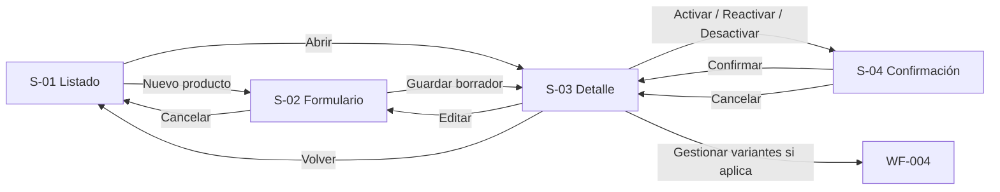

# WF-003 — Gestión de productos (CRUD principal)

> **Fuente normativa de esta revisión:** `specs_consolidado_final.md` y `hu_consolidado_final.md` (18-09-2026). Los nombres/eventos de Ventas y Postventa son contratos **provisionales no homologados**; el prototipo no debe simular pagos realizados ni confirmaciones externas como si estuvieran implementadas. Las anotaciones, supuestos, preguntas y referencias técnicas permanecen en este documento y no se muestran como elementos de la interfaz simulada.

## 0. Instrucciones para el agente

Genera un wireframe detallado, anotado y navegable para la gestión del ciclo de
vida de productos descrita en este archivo.

Antes de diseñar:

1. Consulta `../../specs/SPEC-003-gestion-productos-crud.md`.
2. Consulta `../../hu/HU-003-gestion-productos-crud.md`.
3. Consulta `../DESIGN.md`.
4. Consulta `../INDEX.md` para conservar el ID `WF-003`, el nombre del flujo y
   las rutas reservadas de sus artefactos.
5. Usa este documento como definición específica de composición, navegación,
   interacción y estados de interfaz.
6. Consulta `WF-004-gestion-variantes-skus.md` únicamente para representar el
   enlace y la condición de activación de productos con variantes; no mezcles
   ambos alcances en una sola interfaz.

Prioridad de fuentes:

1. La especificación define las reglas de negocio, restricciones globales y
   límites de responsabilidad del CRUD de productos.
2. La historia de usuario define los criterios de aceptación, escenarios y
   necesidades del gestor comercial.
3. Este documento define la composición, navegación y comportamiento visible
   del flujo.
4. `DESIGN.md` define la representación visual compartida.
5. `INDEX.md` define el identificador y la ubicación de los artefactos.

Si las fuentes se contradicen, un contrato no está definido o una decisión no
puede deducirse de forma inequívoca, no inventes una resolución. Registra la
cuestión en **Preguntas y decisiones pendientes**, identifica las pantallas
afectadas y conserva en el prototipo el comportamiento más neutral que no
contradiga las fuentes.

Reglas de producción:

- No agregues campos, permisos, endpoints, transiciones de estado ni reglas de
  validación que no estén documentadas.
- Diferencia claramente **guardar un borrador** de **activar un producto**. La
  creación exige nombre, descripción, categoría, marca, precio base
  referencial, `sku_base` y `tiene_variantes`; no exige imagen ni
  característica.
- Para activar o reactivar, representa la revalidación de categoría y marca
  activas, todos los valores de las características obligatorias efectivas de la categoría y al menos una imagen.
- Cuando `tiene_variantes = true`, representa además que el producto necesita
  al menos una variante activa con SKU e imagen válidos para poder activarse.
  La creación y edición de esas variantes pertenece a `WF-004`.
- `tiene_variantes` se selecciona durante la creación y es inmutable. En
  edición debe mostrarse como información de solo lectura, con una explicación
  clara, no como un control que parezca temporalmente deshabilitado.
- El `slug` lo genera y mantiene el sistema. No agregues un campo editable para
  introducirlo manualmente mientras no exista un contrato que lo permita.
- Valida la unicidad global de `sku_base` y la unicidad de la combinación
  nombre + marca. Distingue visualmente cuál de las dos reglas falló.
- Los cambios válidos de un producto activo se publican inmediatamente. Si una
  edición rompe una condición de activación, representa el rechazo completo
  del guardado y conserva la última versión válida.
- La desactivación es una baja lógica. No incluyas eliminación física y no
  sugieras que se borran pedidos, referencias ni historial.
- La reactivación debe volver a validar todas las condiciones de activación;
  no la representes como un cambio de estado incondicional.
- El precio base se captura al crear el producto y puede mostrarse como dato de
  solo lectura posteriormente. No agregues edición posterior de precios; esa
  responsabilidad pertenece a Pricing.
- No muestres controles para editar stock. Inventario es responsable de la
  disponibilidad y solo inicializa en 0 el SKU vendible de un producto simple.
- No incorpores dentro de este flujo la administración de variantes, ofertas,
  promociones, cupones, categorías, marcas, características ni metadatos SEO.
- El evento `catalog.product.deactivated` es contexto técnico. No lo conviertas
  en una acción manual ni expongas su nombre técnico como microcopy para el
  usuario.
- No elijas una librería de UI ni una estrategia CSS.
- No consumas APIs reales ni uses datos personales o comerciales reales.
- Usa datos ficticios coherentes entre listado, detalle, formulario y diálogos.
- Representa todos los estados obligatorios de este documento: carga, datos,
  vacío inicial, filtros sin resultados, validación, error recuperable, sin
  conexión, permisos, sesión expirada, éxito y conflicto de datos.
- Numera las anotaciones como `A-01`, `A-02`, `A-03`, etc. Las anotaciones son
  documentación del wireframe y no deben renderizarse dentro de la interfaz
  del prototipo HTML.
- Los supuestos y preguntas abiertas pertenecen a este documento y no deben
  aparecer como contenido de la interfaz simulada.
- El comportamiento responsivo debe verificarse redimensionando el viewport;
  no agregues controles internos para simular escritorio, tablet o móvil.
- Las rutas, permisos, límites y contratos marcados como propuestos o
  pendientes no deben presentarse como decisiones técnicas confirmadas.

### Formato del entregable

Genera un prototipo navegable con HTML, CSS y JavaScript estáticos:

- Guarda el prototipo en
  `../prototipos/WF-003-gestion-productos-crud/index.html`.
- El punto de entrada debe ser `index.html` y funcionar sin proceso de
  compilación.
- Usa rutas y recursos relativos.
- No uses React ni dependencias del frontend productivo.
- No requieras conexión a servicios externos ni consumas APIs reales.
- Usa datos ficticios representativos y consistentes durante toda la
  navegación.
- Simula únicamente las interacciones necesarias para validar este flujo.
- Implementa navegación funcional entre listado, creación/edición, detalle,
  confirmaciones y estados alternativos.
- Implementa comportamiento responsivo real mediante HTML/CSS para escritorio,
  tablet y móvil; no incluyas un selector de dispositivo.
- Aplica el estilo monocromático, sin sombras y de baja fidelidad definido en
  `DESIGN.md`.
- No muestres anotaciones `A-xx`, supuestos, preguntas abiertas, endpoints,
  eventos ni otra documentación interna dentro de la interfaz simulada.
- El prototipo debe poder recorrerse con teclado y no depender exclusivamente
  del color, de un icono o de una imagen para comunicar estado o acción.

### Entregables esperados

1. Listado administrativo de productos con filtros por categoría, marca y
   estado.
2. Estados diferenciados de catálogo vacío, filtros sin resultados y error de
   carga.
3. Formulario de creación que guarde un producto en borrador con los campos
   mínimos documentados.
4. Formulario de edición con `tiene_variantes` de solo lectura y precio sin
   edición posterior.
5. Detalle del producto con estado, datos generales, requisitos de activación
   y acceso contextual a `WF-004` cuando corresponda.
6. Activación de borrador con validación de requisitos y variante de rechazo
   por información incompleta.
7. Desactivación mediante confirmación de baja lógica.
8. Reactivación con revalidación y variante de rechazo por relaciones o datos
   que dejaron de ser válidos.
9. Errores de unicidad de `sku_base` y nombre + marca, error de relación y
   conflicto de datos desactualizados.
10. Estados de carga, error, sin conexión, permisos, sesión expirada y éxito.
11. Navegación funcional con conservación simulada de filtros y retorno de
    foco/contexto.
12. Comportamiento responsivo verificable al redimensionar el viewport.

---

## 1. Metadatos

| Campo | Valor |
|---|---|
| ID del wireframe | `WF-003` |
| Nombre del flujo | Gestión de productos (CRUD principal) |
| Versión | 0.1 |
| Estado | Borrador |
| Responsable | Gabriel Poma Gutierrez |
| Rama | `poma` |
| Fecha | 2026-09-17 |
| Última actualización | 2026-09-18 |

## 2. Trazabilidad

| Fuente | Identificador o sección | Qué aporta al flujo |
|---|---|---|
| [`SPEC-003-gestion-productos-crud.md`](../../specs/SPEC-003-gestion-productos-crud.md) | Requisitos 1–4; secciones 5 y 6 | Ciclo de vida, reglas de integridad, seguridad y fuera de alcance |
| [`HU-003-gestion-productos-crud.md`](../../hu/HU-003-gestion-productos-crud.md) | MDPYO-6; CA-01–CA-12; escenarios 1–10 | Necesidad del gestor y resultados verificables |
| [`DESIGN.md`](../DESIGN.md) | Layout, componentes, contraste y accesibilidad | Lenguaje visual neutral de baja fidelidad |
| [`INDEX.md`](../INDEX.md) | Fila WF-003 | ID, nombre, responsable y rutas reservadas |

### Funcionalidades incluidas

- Crear un producto en estado borrador con sus datos mínimos.
- Consultar el listado con filtros por categoría, marca y estado, y acceder al detalle.
- Editar atributos permitidos conservando las reglas del estado actual.
- Activar, desactivar y reactivar un producto mediante baja lógica.
- Mostrar slug generado, estado y trazabilidad administrativa relevante.
- Comunicar las notificaciones iniciales a Pricing e Inventario como resultados del guardado, sin ofrecer controles sobre esos módulos.

### Fuera de alcance

- Gestión de variantes o SKU derivados; corresponde a `WF-004`.
- Cambios de precio posteriores a la creación, stock, ofertas, promociones o cupones.
- Creación o mantenimiento de categorías, marcas y características.
- Metadatos SEO adicionales; este flujo solo muestra el slug generado.
- Eliminación física, edición de eventos o acceso a detalles técnicos de auditoría.

## 3. Usuario objetivo

| Aspecto | Definición |
|---|---|
| Persona | Gestor comercial |
| Rol en el sistema | Administrador operativo del catálogo |
| Nivel técnico | Intermedio |
| Contexto de uso | Backoffice web, uso frecuente y orientado a escritorio |
| Necesidad principal | Mantener productos íntegros y controlar cuándo son visibles para venta |
| Permisos relevantes | Consultar según autorización; crear, editar y cambiar estado solo con permisos correspondientes |
| Dispositivo principal | Escritorio; tablet y móvil como soporte |

## 4. Objetivo del flujo

**El usuario debe poder** crear, localizar, revisar, editar y cambiar el estado de un producto **para** mantener el catálogo central consistente y publicar únicamente productos válidos.

### Resultado exitoso

El producto queda creado en borrador, actualizado o en el estado solicitado; la interfaz muestra el estado vigente y confirma la operación. Al crear, se generan identificador y slug. Los cambios válidos sobre un producto activo se publican inmediatamente.

### Indicadores de finalización

- Confirmación no bloqueante con el nombre y la operación realizada.
- Redirección al detalle o actualización del detalle/listado conservando el contexto.
- Estado textual actualizado: `Borrador`, `Activo` o `Inactivo`.
- Si la operación falla, no se presenta un estado nuevo ni se pierden datos editados.

## 5. Precondiciones y disparador

### Precondiciones

- Sesión autenticada y autorización para la acción solicitada.
- Catálogos de categorías y marcas disponibles y con estado vigente.
- Para activar o reactivar: categoría y marca activas, al menos una característica y una imagen.

### Puntos de entrada

- Ruta propuesta del listado: `/productos`.
- Creación: botón **Nuevo producto**; ruta propuesta `/productos/nuevo`.
- Detalle: selección de una fila; ruta propuesta `/productos/:id`.
- Edición: acción **Editar**; ruta propuesta `/productos/:id/editar`.
- Se conservan filtros, orden y página al volver al listado.

### Salidas del flujo

| Resultado | Destino o comportamiento |
|---|---|
| Éxito de creación | Detalle del nuevo borrador con confirmación |
| Éxito de edición | Detalle actualizado; conserva estado vigente |
| Éxito de cambio de estado | Detalle y fila del listado reflejan el nuevo estado |
| Cancelación | Regresa al origen; si había cambios, solicita confirmar descarte |
| Error recuperable | Permanece en pantalla, conserva datos y permite corregir o reintentar |
| Sin permisos | Explicación segura y retorno a una ubicación permitida |
| Sesión expirada | Solicita autenticación y procura retornar al contexto anterior |

## 6. Secuencia principal

### Flujo A — Consultar productos

1. El usuario entra al listado.
2. El sistema carga productos administrativos y filtros disponibles.
3. El usuario filtra por categoría, marca o estado.
4. El sistema actualiza resultados y cantidad encontrada.
5. El usuario abre el detalle de un producto y puede volver sin perder contexto.

### Flujo B — Crear producto en borrador

1. El usuario selecciona **Nuevo producto**.
2. Completa nombre, descripción, categoría, marca, precio base referencial, `sku_base` y `tiene_variantes`.
3. El sistema valida campos, relaciones activas y reglas de unicidad.
4. El usuario selecciona **Guardar borrador**.
5. El sistema crea identificador y slug, guarda el producto como `Borrador` y confirma.

### Flujo C — Editar producto

1. Desde el detalle, el usuario selecciona **Editar**.
2. El sistema carga los datos; `tiene_variantes` se muestra solo lectura.
3. El usuario modifica datos generales, características o imágenes permitidas.
4. El sistema valida según el estado del producto.
5. Guarda y muestra los datos vigentes; si estaba activo, el cambio válido se publica inmediatamente.

### Flujo D — Activar o reactivar

1. El usuario solicita activar un borrador o reactivar un inactivo.
2. El sistema revalida categoría, marca, características e imágenes.
3. Si `tiene_variantes = true`, además verifica que exista al menos una variante activa con SKU e imagen válidos, según WF-004.
4. Se presenta confirmación con el efecto de visibilidad en canales.
5. El sistema cambia a `Activo` y confirma.

### Flujo E — Desactivar

1. El usuario selecciona **Desactivar** sobre un producto activo.
2. Un diálogo explica que dejará de estar disponible para nuevas ventas sin eliminar historial.
3. El usuario confirma.
4. El sistema cambia a `Inactivo`, emite `catalog.product.deactivated` y actualiza la interfaz.

### Flujos alternativos

| ID | Condición | Comportamiento esperado | Retorno |
|---|---|---|---|
| `ALT-01` | `sku_base` duplicado | Error asociado al campo; conserva el formulario | Flujo B, paso 2 |
| `ALT-02` | Nombre + marca duplicados | Mensaje identifica la combinación en conflicto | Flujo B, paso 2 |
| `ALT-03` | Categoría o marca inactiva | Bloquea guardado e indica relación inválida | Flujo B/C |
| `ALT-04` | Activación incompleta | Lista requisitos faltantes y conserva el estado | Flujo D, paso 1 |
| `ALT-05` | Edición invalida un producto activo | Rechaza el guardado y conserva última versión válida | Flujo C, paso 3 |
| `ALT-06` | Producto ya inactivo | Informa que no hay cambios por aplicar | Detalle |
| `ALT-07` | Producto no encontrado o dato desactualizado | Ofrece recargar o volver al listado | Origen seguro |
| `ALT-08` | Filtros sin coincidencias | Estado contextual con **Limpiar filtros** | Listado |

## 7. Inventario de pantallas y variantes

| ID | Pantalla o variante | Propósito | Presentación | Obligatoria |
|---|---|---|---|---|
| `S-01` | Listado de productos | Consultar, filtrar y acceder a acciones | `/productos` propuesta | Sí |
| `S-01-E` | Vacío, sin resultados o error | Diferenciar ausencia de datos, filtros y fallo | Variante de S-01 | Sí |
| `S-02` | Crear o editar producto | Capturar y validar datos | Ruta dedicada propuesta | Sí |
| `S-02-V` | Validación o conflicto | Corregir relaciones, duplicados o datos obsoletos | Variante de S-02 | Sí |
| `S-03` | Detalle de producto | Comprender datos, estado y acciones disponibles | `/productos/:id` propuesta | Sí |
| `S-03-B` | Borrador incompleto | Orientar requisitos para activar | Variante de S-03 | Sí |
| `S-04` | Confirmar cambio de estado | Evitar activación/desactivación accidental | Diálogo modal | Sí |
| `S-04-E` | Cambio de estado rechazado | Explicar requisitos faltantes o conflicto | Diálogo/alerta | Sí |

## 8. Mapa de navegación

## 9. Especificación por pantalla

### `S-01` — Listado de productos

#### Propósito y jerarquía

1. **Primario:** título, cantidad de resultados y **Nuevo producto**.
2. **Secundario:** filtros por categoría, marca y estado; tabla de productos.
3. **Terciario:** paginación, actualización y acciones por fila.

#### Regiones y componentes

| Región | Componente | Contenido | Comportamiento |
|---|---|---|---|
| Encabezado | Título + botón | Productos; Nuevo producto | Botón condicionado por permiso |
| Filtros | Selectores | Categoría, marca, estado | Actualizan listado y son limpiables |
| Resultados | Tabla/listado | Producto, `sku_base`, categoría, marca, estado, tipo | Fila abre detalle; encabezados claros |
| Acciones | Menú por fila | Ver, editar, activar/reactivar/desactivar según estado | No incluye eliminar |
| Pie | Paginación | Página y total | Conserva filtros |

#### Datos mostrados

| Dato | Fuente | Formato | Ausencia |
|---|---|---|---|
| Nombre | Producto | Texto | No aplica |
| `sku_base` | Producto | Código monoespaciado | No aplica |
| Categoría y marca | Relaciones de catálogo | Nombre | “No disponible” si falla referencia |
| Estado | Producto | Texto + indicador no basado solo en color | No aplica |
| Tipo | `tiene_variantes` | “Simple” / “Con variantes” | No aplica |

#### Navegación y foco

- Foco inicial en el título; acción principal a continuación.
- Al aplicar filtros, anunciar cantidad de resultados sin mover foco.
- Al regresar del detalle, restaurar fila, filtros y página.

#### Anotaciones

| ID | Elemento | Anotación |
|---|---|---|
| `A-01` | Nuevo producto | Visible solo para quien puede crear |
| `A-02` | Estado | Siempre textual: Borrador, Activo o Inactivo |
| `A-03` | Tipo | Deriva de `tiene_variantes`; no se modifica desde el listado |
| `A-04` | Acciones | Cambian por estado y permiso; nunca incluyen borrado físico |
| `A-05` | Filtros | Solo categoría, marca y estado están confirmados |

### `S-01-E` — Vacío, sin resultados o error

| Variante | Mensaje | Acción primaria |
|---|---|---|
| Catálogo vacío | “Aún no hay productos registrados.” | Nuevo producto, si tiene permiso |
| Sin resultados | “No hay productos que coincidan con estos filtros.” | Limpiar filtros |
| Error de carga | “No pudimos cargar los productos.” | Reintentar |

### `S-02` — Crear o editar producto

#### Jerarquía y regiones

1. Título contextual: **Nuevo producto** o **Editar producto**.
2. Datos generales y relaciones del catálogo.
3. Características e imágenes; su obligatoriedad depende del objetivo de activación.
4. Acciones persistentes **Guardar borrador/Guardar cambios** y **Cancelar**.

| Región | Componente | Contenido | Comportamiento |
|---|---|---|---|
| Datos generales | Formulario | Nombre, descripción, `sku_base`, precio base referencial | Precio editable solo durante creación dentro de este flujo |
| Clasificación | Selectores | Categoría y marca | Solo opciones existentes y activas |
| Tipo | Control binario | Tiene variantes | Obligatorio al crear; solo lectura al editar |
| Complementos | Selectores/carga | Características e imágenes | Pueden faltar en borrador; requeridos para activar |
| Ayuda | Texto contextual | Diferencia entre guardar y activar | No promete publicación al guardar borrador |

#### Formulario y validaciones

| Campo | Tipo | Obligatorio al crear | Valor inicial | Validación | Mensaje propuesto |
|---|---|---|---|---|---|
| Nombre | Texto | Sí | Vacío | Requerido; unicidad con marca | “Ya existe un producto con este nombre y marca.” |
| Descripción | Área de texto | Sí | Vacío | Requerida | “Ingresa una descripción.” |
| Categoría | Selector | Sí | Sin selección | Debe existir y estar activa | “Selecciona una categoría activa.” |
| Marca | Selector | Sí | Sin selección | Debe existir y estar activa | “Selecciona una marca activa.” |
| Precio base referencial | Decimal/moneda | Sí | Vacío | Contrato numérico por confirmar | “Ingresa un precio base válido.” |
| `sku_base` | Texto | Sí | Vacío | Requerido y único globalmente | “Este SKU base ya está en uso.” |
| Tiene variantes | Control binario | Sí | Sin selección | Selección obligatoria e inmutable | “Indica si el producto tendrá variantes.” |
| Características | Selector múltiple | No para borrador | Ninguna | Al menos una para activar | “Agrega al menos una característica para activar.” |
| Imágenes | Carga | No para borrador | Ninguna | Al menos una para activar; formato/límite pendientes | “Agrega al menos una imagen para activar.” |

- Validar al salir del campo y al enviar; las reglas remotas de unicidad se confirman al guardar.
- Conservar todos los datos ante errores recuperables.
- Deshabilitar el envío durante la solicitud para prevenir duplicados.
- Si hay cambios sin guardar, confirmar antes de salir.
- En edición, `tiene_variantes` se muestra bloqueado con explicación; el precio vigente puede mostrarse, pero no editarse aquí.

#### Anotaciones

| ID | Elemento | Anotación |
|---|---|---|
| `A-06` | Guardar borrador | No exige imagen ni característica |
| `A-07` | Precio base | Solo captura el valor inicial; cambios futuros pertenecen a Pricing |
| `A-08` | `sku_base` | Es único; para producto simple también identifica el SKU vendible |
| `A-09` | Tiene variantes | Su elección es irreversible en el alcance actual |
| `A-10` | Imágenes/características | Indicar que la imagen y las características obligatorias efectivas son necesarias para activar, no para crear; si no hay obligatorias, no exigir una característica solo por activar |
| `A-11` | Slug | Se genera por el sistema; no agregar edición manual sin contrato |

### `S-02-V` — Validación o conflicto

- Mostrar resumen superior enlazado a cada campo inválido.
- Ante unicidad remota, asociar el error a `sku_base` o a nombre/marca.
- Ante dato desactualizado, explicar que el producto cambió y ofrecer **Recargar datos**; no sobrescribir silenciosamente.
- Foco en el resumen y luego en el primer campo inválido.

### `S-03` — Detalle de producto

#### Regiones y componentes

| Región | Contenido | Comportamiento |
|---|---|---|
| Encabezado | Nombre, estado, `sku_base`, acciones | Acción primaria depende del estado |
| Datos generales | Descripción, categoría, marca, precio base, slug | Solo lectura |
| Configuración | Tipo, características e imágenes | Expone faltantes con texto |
| Variantes | Resumen y acceso a WF-004 | Solo si `tiene_variantes = true` |
| Metadatos | Identificador y última modificación | Prioridad visual baja |

#### Acciones por estado

| Estado | Primaria | Secundarias | Destructiva |
|---|---|---|---|
| Borrador | Activar, si cumple requisitos | Editar; gestionar variantes si aplica | N/A |
| Activo | Editar | N/A | Desactivar |
| Inactivo | Reactivar | Editar | N/A |

#### Anotaciones

| ID | Elemento | Anotación |
|---|---|---|
| `A-12` | Requisitos de activación | Enumera faltantes verificables sin ocultarlos tras un botón deshabilitado |
| `A-13` | Producto activo | Los cambios válidos se publican inmediatamente |
| `A-14` | Gestionar variantes | Solo aparece para productos configurados con variantes |
| `A-15` | Precio | Es informativo en detalle; no agregar acción de edición |
| `A-16` | Historial | Mostrar metadatos disponibles, sin inventar una pantalla de auditoría |

### `S-04` — Confirmar cambio de estado

| Operación | Título | Mensaje esencial | Confirmación |
|---|---|---|---|
| Activar | Activar producto | Será visible para los canales de venta | Activar producto |
| Desactivar | Desactivar producto | Dejará de admitirse en nuevas ventas; se conserva el historial | Desactivar producto |
| Reactivar | Reactivar producto | Se volverán a validar todos los requisitos | Reactivar producto |

- Foco inicial en el título; luego descripción, cancelar y confirmar.
- Al cerrar, devolver foco al control que abrió el diálogo.
- Durante el envío, bloquear repetición y anunciar el resultado.

## 10. Estados de interfaz

| Estado | ¿Aplica? | Representación | Recuperación |
|---|---|---|---|
| Inicial | Sí | Listado o formulario listo | N/A |
| Cargando inicial | Sí | Estructura reservada sin datos ficticios | Esperar/reintentar |
| Actualizando en segundo plano | Sí | Indicador no bloqueante | Mantener contenido previo |
| Con datos | Sí | Tabla, detalle o formulario | N/A |
| Vacío inicial | Sí | Mensaje + CTA autorizado | Crear producto |
| Sin resultados por filtros | Sí | Mensaje contextual | Limpiar filtros |
| Error recuperable | Sí | Mensaje seguro | Reintentar |
| Error de validación | Sí | Resumen + campos | Corregir sin perder datos |
| Sin conexión | Sí | Aviso; no asumir guardado | Reintentar |
| Sin permisos | Sí | Explicación y navegación segura | Volver |
| Sesión expirada | Sí | Solicitud de inicio de sesión | Retornar al contexto |
| Éxito | Sí | Confirmación y estado actualizado | N/A |
| Conflicto/dato desactualizado | Sí | Aviso explícito | Recargar y conciliar |

### Reglas para datos remotos

- El listado previo puede mantenerse durante revalidación, marcándolo como actualizando.
- Refrescar detalle y listado después de crear, editar o cambiar estado.
- No aplicar optimismo a activación, desactivación, reactivación ni creación.
- Preservar filtros, página y datos de formulario tras errores recuperables.

## 11. Comportamiento responsivo

| Aspecto | Escritorio | Tablet | Móvil |
|---|---|---|---|
| Navegación | Encabezado y retorno visibles | Igual, con acciones compactas | Acción principal visible; secundarias en menú etiquetado |
| Distribución | Cuadrícula de 12 columnas | Secciones reducidas | Cuadrícula de 4 columnas y apilado |
| Listado | Tabla completa | Priorizar nombre, SKU y estado | Tarjetas o tabla desplazable con encabezado accesible |
| Formulario | Una o dos columnas lógicas | Dos/una según espacio | Una columna |
| Acciones | Pie de formulario | Pie | Controles de mínimo 44×44 px; sin tapar errores |
| Contenido omitido | Ninguno | Metadatos contraíbles | Metadatos secundarios contraíbles, nunca requisitos |

### Condiciones críticas

- Nombres, descripciones, SKU y mensajes largos a 200 % de zoom.
- Teclado móvil no debe ocultar el campo ni las acciones.
- El diálogo debe tener reflow sin desplazamiento horizontal.

## 12. Accesibilidad

- Objetivo **WCAG 2.2 AA**; contraste de `DESIGN.md` y foco visible.
- Un único `h1` por pantalla; regiones de navegación, principal, filtros y resultados.
- Etiquetas persistentes para todos los campos; no depender del placeholder.
- Errores asociados programáticamente y resumen enlazado a campos.
- Cambios de resultados, carga, éxito y error anunciados en región viva adecuada.
- Estado y validación no dependen solo del color ni de iconos.
- Diálogos con foco contenido, cierre por Escape cuando no se procesa y retorno de foco.
- Imágenes informativas con alternativa; placeholders/decoraciones ignorados por tecnologías de asistencia.

## 13. Tono visual y contenido

- Densidad: media-alta en listado; media en formularios y detalle.
- Sensación: confiable, clara y operativa.
- Dominante: estado del producto y acción válida siguiente.
- Discretos: ID interno, timestamps y metadatos técnicos.
- Escala de grises, bordes de 1 px, sin sombras ni fotografías reales; controles móviles de mínimo 44×44 px.

| Contexto | Texto propuesto | Observación |
|---|---|---|
| Creación | “Guardar borrador” | No promete publicación |
| Activación incompleta | “Este producto aún no puede activarse. Revisa los requisitos pendientes.” | Orienta recuperación |
| Desactivación | “El producto dejará de estar disponible para nuevas ventas. Su historial se conservará.” | Explica impacto |
| Duplicado | “Este SKU base ya está en uso.” | Identifica regla violada |
| Vacío | “Aún no hay productos registrados.” | Ofrece el siguiente paso permitido |

## 14. Restricciones técnicas relevantes

- SPA con React, TypeScript, Vite y React Router; preservar contexto de navegación.
- TanStack Query debe representar carga, revalidación, error y conflicto visibles.
- Formularios con React Hook Form y Zod; el wireframe no define esquemas no documentados.
- No prescribir librería de componentes ni estrategia CSS.
- Las interacciones críticas deben ser comprobables con React Testing Library y Playwright.

### Dependencias o contratos

| Tipo | Referencia | Impacto visible |
|---|---|---|
| API | CRUD/listado de productos; rutas por confirmar en OpenAPI | Carga, guardado, validación y errores |
| API | Catálogos de categorías, marcas y características | Opciones y validación de estado activo |
| Evento | `catalog.product.deactivated` | Confirmación de baja; no es un control editable |
| Integración | Pricing: precio inicial | Resultado de creación; no edición posterior |
| Integración | Inventario: inicialización en 0 para producto simple | Resultado de creación; no muestra ni edita stock |
| Permiso | Gestor comercial / permiso específico por confirmar | Visibilidad y disponibilidad de acciones |

## 15. Privacidad, seguridad y acciones sensibles

- No se muestran datos personales; la trazabilidad puede mostrar usuario responsable si el contrato lo permite.
- Activar, desactivar y reactivar requieren confirmación y autorización en servidor.
- Los errores no exponen tokens, consultas, trazas ni nombres internos de servicios.
- No confiar solo en ocultar botones: el backend valida permisos y reglas.
- La baja es lógica y recuperable mediante reactivación; no existe eliminación física.

## 16. Criterios de aceptación del wireframe

- [ ] Permite crear un borrador con los siete datos mínimos sin exigir imagen ni característica.
- [ ] Representa unicidad de `sku_base` y de nombre + marca.
- [ ] Valida categoría y marca activas al crear, editar y reactivar.
- [ ] Representa listado, filtros y detalle administrativo.
- [ ] `tiene_variantes` es obligatorio al crear e inmutable después.
- [ ] Activación exige al menos una imagen y todos los valores de las características obligatorias efectivas de la categoría; si no existen obligatorias, no exige una característica solo para activar. Para productos con variantes integra la condición de WF-004.
- [ ] Los cambios inválidos sobre un producto activo no sustituyen la última versión válida.
- [ ] Desactivar es baja lógica, conserva historial y no ofrece eliminación.
- [ ] Reactivar vuelve a validar las condiciones de activación.
- [ ] El slug es generado por el sistema.
- [ ] El precio solo se captura al crear; stock y precio posterior no se editan aquí.
- [ ] Incluye carga, vacío, error, permisos, sesión, éxito y conflicto.
- [ ] Funciona con teclado, zoom y sin depender del color.
- [ ] No selecciona una librería de UI y es consistente con `DESIGN.md`.

### Cobertura de la historia de usuario

| Criterio HU | Cobertura |
|---|---|
| CA-01 | Permisos en S-01–S-04 y estado sin permisos |
| CA-02–CA-05 | S-02, S-02-V y activación en S-04 |
| CA-06 | S-01 y S-03 |
| CA-07 | Edición y conflicto en S-02/S-02-V |
| CA-08–CA-09 | Cambio de estado en S-03/S-04 |
| CA-10–CA-11 | Slug y límites de precio en S-02/S-03 |
| CA-12 | Confirmación y metadatos de trazabilidad |

## 17. Supuestos

| ID | Supuesto | Motivo | Impacto si es incorrecto | Validar |
|---|---|---|---|---|
| `SUP-01` | El backoffice usa rutas dedicadas para listado, detalle y formulario | Coherencia con SPA | Cambia navegación, no reglas | Sí |
| `SUP-02` | Las características e imágenes se asocian dentro del formulario de producto | La HU permite modificarlas | Puede requerir subflujo separado | Sí |
| `SUP-03` | Se muestra el precio base vigente como solo lectura al editar | El CRUD no posee cambios posteriores | Ajustar fuente y copy | Sí |

## 18. Preguntas y decisiones pendientes

| ID | Pregunta o decisión | Responsable | Bloquea wireframe | Estado |
|---|---|---|---|---|
| `Q-01` | ¿Cuáles son rutas y métodos exactos de OpenAPI? | Backend / Arquitectura | No; sí implementación | Abierta |
| `Q-02` | ¿Cuáles son límites y formatos de nombre, descripción, SKU, precio e imágenes? | Producto / Backend | No; sí validación final | Abierta |
| `Q-03` | ¿Qué permisos granulares corresponden a consultar, crear, editar y cambiar estado? | Seguridad | No; sí implementación | Abierta |
| `Q-04` | ¿El slug cambia al editar el nombre y cómo se preservan enlaces anteriores? | Producto / Backend | No | Abierta |
| `Q-05` | ¿Cuál es la estrategia de concurrencia para evitar sobrescritura? | Backend | No; sí conflicto final | Abierta |
| `D-01` | Selección de librería UI y estrategia CSS | Equipo frontend | No para wireframe; sí implementación | Pendiente |

### Alineación definitiva de Productos CRUD

- El producto simple utiliza su `sku_base` como único SKU vendible; Inventario es propietario de stock y lo inicializa en **0**, con `stock_version` inicial. Productos no modifica stock mediante su CRUD.
- Si `tiene_variantes=true`, el producto padre no tiene stock y necesita al menos una variante `ACTIVA` para poder activarse. Una variante activa con padre `BORRADOR` **no** es comercialmente vendible; desactivar la última variante activa inactiva al padre.
- La activación comercial requiere que los dominios propietarios hayan confirmado la preparación mínima de precio y registro de inventario. Mientras tanto, mostrar «Pendiente de preparación», no «Producto activo/disponible» por asumir que los eventos se entregaron al instante.
- Al mover una categoría, Taxonomía revalida las características efectivas; un nuevo atributo obligatorio no desactiva productos existentes, pero se exige al próximo guardado según Spec de Asociación.

### Selección de características identificadoras antes de crear variantes
Si el gestor elige «Con variantes» (`tiene_variantes=true`), la pantalla permite elegir uno o más `caracteristica_id` LISTA activos y efectivos de la categoría antes de crear la primera variante; los valores específicos se eligen después en WF-004. El conjunto queda solo lectura desde la primera variante, incluso si esta termina inactiva. Cambiar categoría revalida la aplicabilidad sin regenerar ni alterar SKU históricos. Un producto simple no presenta el selector.

## 19. Registro de revisiones

| Versión | Fecha | Autor | Cambio | Aprobado por |
|---|---|---|---|---|
| 0.1 | 2026-09-17 | Gabriel Poma Gutierrez | Borrador inicial del flow WF-003 | — |
| 0.3 | 2026-09-18 | Asistente | Alineación de wireframe con Specs/HU definitivos y contratos externos provisionales; ver registro de cambios. | Pendiente de revisión del equipo |

## Lista de control antes de generar el HTML

- [x] ID y responsable confirmados contra `INDEX.md`.
- [x] Spec, HU y diseño están trazados.
- [x] Alcance, pantallas, estados, navegación y responsividad están definidos.
- [x] Los criterios CA-01–CA-12 tienen cobertura.
- [x] Supuestos y preguntas están separados de los datos confirmados.
- [ ] Resolver contratos, límites, permisos y concurrencia antes de implementar.

---
