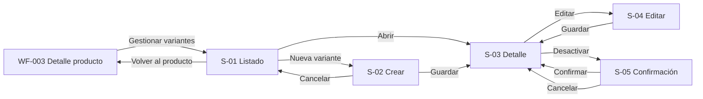

# WF-004 — Gestión avanzada de variantes (SKUs)

## 0. Instrucciones para el agente

Genera un wireframe detallado, anotado y navegable para la gestión avanzada de
variantes y SKUs descrita en este archivo.

Antes de diseñar:

1. Consulta `../../specs/spec_gestion_variantes_skus.md`.
2. Consulta `../../hu/hu_gestion_variantes_skus.md`.
3. Consulta `../DESIGN.md`.
4. Consulta `../INDEX.md` para conservar el ID `WF-004`, el nombre del flujo y
   las rutas reservadas de sus artefactos.
5. Consulta `WF-003-gestion-productos-crud.md` para mantener coherencia con el
   producto padre, su bandera `tiene_variantes` y sus reglas de activación.
6. Usa este documento como definición específica de composición, navegación,
   interacción y estados de interfaz.

Prioridad de fuentes:

1. La especificación define las reglas de negocio, restricciones globales y
   límites de responsabilidad de la gestión de variantes.
2. La historia de usuario define los criterios de aceptación, escenarios e
   integraciones esperadas.
3. Este documento define la composición, navegación y comportamiento visible
   del flujo.
4. `DESIGN.md` define la representación visual compartida.
5. `INDEX.md` define el identificador y la ubicación de los artefactos.

Si las fuentes se contradicen, un contrato no está definido o una decisión no
puede deducirse de forma inequívoca, no inventes una resolución. Registra la
cuestión en **Preguntas y decisiones pendientes**, identifica las pantallas
afectadas y conserva en el prototipo el comportamiento más neutral que no
contradiga las fuentes. En particular, no inventes transiciones de activación o
reactivación de variantes mientras sus reglas permanezcan pendientes.

Reglas de producción:

- No agregues campos, permisos, endpoints, tipos de atributos, estados ni
  reglas de validación que no estén documentadas.
- Este flujo solo aplica a productos existentes con
  `tiene_variantes = true`. Para un producto simple, muestra el estado
  informativo definido en `S-01-N`, impide la creación y ofrece volver a
  `WF-003`.
- Mantén visible el contexto del producto padre —nombre y `sku_base`— durante
  listado, creación, detalle, edición y desactivación para evitar operar sobre
  el producto equivocado.
- El SKU de la variante se genera automáticamente a partir de `sku_base` y de
  los atributos identificadores. Nunca agregues un campo editable para
  ingresarlo, modificarlo o forzar su regeneración.
- No presentes una vista previa del SKU como resultado contractual si el
  algoritmo exacto no está definido. Antes de guardar basta con explicar que
  será generado; después del éxito se muestra el valor confirmado.
- Cada variante nueva debe definir todos los atributos identificadores
  configurados para el producto y adjuntar al menos una imagen propia.
- Impide registrar dos variantes del mismo producto con la misma combinación
  de atributos identificadores. El error debe distinguirse de una colisión
  excepcional del SKU autogenerado a nivel global.
- Una colisión interna de SKU rechaza toda la creación y no expone la variante.
  No solicites al gestor que escriba un SKU alternativo; muestra un mensaje
  seguro y una vía de recuperación o referencia de soporte si el contrato la
  proporciona.
- Los atributos identificadores y el SKU son inmutables después de crear la
  variante. En edición se muestran como información de solo lectura, con la
  indicación de desactivar la variante y crear otra para corregirlos.
- Solo permite editar la imagen y los atributos no identificadores
  documentados. No incluyas controles de estado dentro del formulario de
  edición.
- Al reemplazar una imagen, conserva la imagen vigente hasta que el nuevo
  archivo haya sido validado y el guardado finalice correctamente.
- Distingue los errores de formato no permitido y tamaño excedido cuando el
  contrato proporcione ese detalle. Nunca muestres la ruta local completa del
  archivo.
- La desactivación es una baja lógica e independiente: no modifica el producto
  padre, las demás variantes ni los snapshots de pedidos confirmados.
- Si se desactiva la última variante activa válida, comunica que el producto
  deja de cumplir la condición necesaria para permanecer o pasar a activo. No
  inventes aquí una transición automática del producto si no está contratada.
- No agregues una acción de reactivación de variante mientras su regla no esté
  documentada.
- Inventario es el único dueño del stock. No muestres controles editables de
  existencias ni conviertas un error de consulta en disponibilidad 0.
- Pricing es el dueño del precio específico por SKU y de la herencia del precio
  base. El precio, si se representa, es únicamente informativo y de solo
  lectura.
- La notificación a Inventario al crear o desactivar es contexto técnico. No la
  conviertas en una acción manual ni expongas nombres técnicos de eventos al
  usuario.
- No incorpores edición avanzada de imágenes, configuración global de nuevos
  tipos de atributos, ofertas, promociones ni combos.
- No elijas una librería de UI ni una estrategia CSS.
- No consumas APIs reales ni uses datos personales o comerciales reales.
- Usa datos ficticios coherentes entre producto, listado, detalle, formularios
  y diálogos.
- Representa todos los estados obligatorios de este documento: carga, datos,
  vacío inicial, filtros sin resultados, producto incompatible, validación,
  archivo inválido, duplicado, colisión, error recuperable, sin conexión,
  permisos, sesión expirada, éxito y conflicto de datos.
- Numera las anotaciones como `A-01`, `A-02`, `A-03`, etc. Las anotaciones son
  documentación del wireframe y no deben renderizarse dentro de la interfaz
  del prototipo HTML.
- Los supuestos y preguntas abiertas pertenecen a este documento y no deben
  aparecer como contenido de la interfaz simulada.
- El comportamiento responsivo debe verificarse redimensionando el viewport;
  no agregues controles internos para simular escritorio, tablet o móvil.
- Las rutas, permisos, formatos, tamaños, estados y contratos marcados como
  propuestos o pendientes no deben presentarse como decisiones confirmadas.

### Formato del entregable

Genera un prototipo navegable con HTML, CSS y JavaScript estáticos:

- Guarda el prototipo en
  `../prototipos/WF-004-gestion-variantes-skus/index.html`.
- El punto de entrada debe ser `index.html` y funcionar sin proceso de
  compilación.
- Usa rutas y recursos relativos.
- No uses React ni dependencias del frontend productivo.
- No requieras conexión a servicios externos ni consumas APIs reales.
- Usa datos ficticios representativos y consistentes durante toda la
  navegación.
- Simula únicamente las interacciones necesarias para validar este flujo.
- Implementa navegación funcional entre listado, creación, detalle, edición,
  confirmación de desactivación y estados alternativos.
- Simula la carga de imagen sin transmitir archivos y sin depender de recursos
  remotos.
- Implementa comportamiento responsivo real mediante HTML/CSS para escritorio,
  tablet y móvil; no incluyas un selector de dispositivo.
- Aplica el estilo monocromático, sin sombras y de baja fidelidad definido en
  `DESIGN.md`; usa placeholders en lugar de fotografías finales.
- No muestres anotaciones `A-xx`, supuestos, preguntas abiertas, endpoints,
  eventos ni otra documentación interna dentro de la interfaz simulada.
- El prototipo debe poder recorrerse con teclado y no depender exclusivamente
  del color, de un icono o de la imagen para identificar una variante.

### Entregables esperados

1. Listado de variantes dentro del contexto de un producto, con filtros por
   característica y estado.
2. Estados diferenciados de listado vacío, filtros sin resultados, error de
   carga y producto con `tiene_variantes = false`.
3. Formulario de creación con atributos identificadores, imagen propia
   obligatoria y explicación de SKU autogenerado.
4. Resultado exitoso que muestre el SKU confirmado y el estado de la nueva
   variante.
5. Rechazo por combinación duplicada y estado independiente de colisión del
   SKU autogenerado.
6. Detalle de variante con combinación, SKU, imagen, estado, datos heredados y
   datos informativos de integraciones cuando correspondan.
7. Edición restringida a imagen y atributos no identificadores, manteniendo
   SKU y atributos identificadores como solo lectura.
8. Errores de archivo y guardado que conserven los datos y la imagen vigente.
9. Desactivación manual con confirmación, alcance independiente y advertencia
   cuando se trate de la última variante activa válida.
10. Estados de carga, error, sin conexión, permisos, sesión expirada, éxito y
    conflicto de datos desactualizados.
11. Navegación funcional con conservación simulada de filtros, producto padre
    y retorno de foco/contexto.
12. Comportamiento responsivo verificable al redimensionar el viewport.

---

## 1. Metadatos

| Campo | Valor |
|---|---|
| ID del wireframe | `WF-004` |
| Nombre del flujo | Gestión avanzada de variantes (SKUs) |
| Versión | 0.1 |
| Estado | Borrador |
| Responsable | Gabriel Poma Gutierrez |
| Rama | `poma` |
| Fecha | 2026-09-17 |
| Última actualización | 2026-09-17 |

## 2. Trazabilidad

| Fuente | Identificador o sección | Qué aporta al flujo |
|---|---|---|
| [`spec_gestion_variantes_skus.md`](../../specs/spec_gestion_variantes_skus.md) | Requisitos 1–5; secciones 5 y 6 | Creación, SKU, imagen, edición, consulta y baja lógica |
| [`hu_gestion_variantes_skus.md`](../../hu/hu_gestion_variantes_skus.md) | CA-01–CA-14; escenarios 1–10 | Permisos, integración y resultados esperados |
| [`DESIGN.md`](../DESIGN.md) | Layout, componentes, contraste y accesibilidad | Lenguaje visual neutral |
| [`INDEX.md`](../INDEX.md) | Fila WF-004 | ID, nombre, responsable y rutas reservadas |
| [`WF-003`](WF-003-gestion-productos-crud.md) | Detalle y activación del producto padre | Entrada y dependencia del ciclo de vida |

### Funcionalidades incluidas

- Consultar variantes activas, inactivas y en borrador de un producto, con filtros por característica o estado.
- Crear una variante con atributos identificadores e imagen propia.
- Mostrar el SKU autogenerado por el sistema después de la creación.
- Editar imagen y atributos no identificadores sin alterar el SKU.
- Desactivar una variante de forma independiente y conservarla para historial.
- Comunicar que Inventario inicializa stock en 0 y que Pricing puede definir un precio, sin ofrecer edición local.

### Fuera de alcance

- Productos con `tiene_variantes = false`.
- Ingreso manual o modificación de SKU y atributos identificadores.
- Gestión, cálculo o ajuste de stock; definición o actualización de precios.
- Parametrización avanzada de nuevos tipos globales de atributos.
- Edición o procesamiento de imágenes, ofertas, promociones y combos.
- Eliminación física y reactivación de variantes, al no estar documentada una regla de reactivación.

## 3. Usuario objetivo

| Aspecto | Definición |
|---|---|
| Persona | Gestor comercial |
| Rol en el sistema | Administrador de variantes vendibles del catálogo |
| Nivel técnico | Intermedio |
| Contexto de uso | Backoffice web, normalmente desde el detalle de un producto |
| Necesidad principal | Definir combinaciones vendibles exactas y mantener su representación |
| Permisos relevantes | Consultar según autorización; crear, editar y desactivar solo con permisos correspondientes |
| Dispositivo principal | Escritorio; tablet y móvil como soporte |

## 4. Objetivo del flujo

**El usuario debe poder** consultar, crear, actualizar y desactivar variantes de un producto habilitado **para** ofrecer en los canales una combinación exacta, identificada por un SKU único y una imagen propia.

### Resultado exitoso

La variante se guarda asociada al producto con combinación única, SKU autogenerado, imagen y estado. En creación queda en `Borrador`, se notifica a Inventario para inicializar stock en 0 y la operación queda trazable. Las ediciones preservan SKU y atributos identificadores.

### Indicadores de finalización

- Confirmación que incluye el SKU generado o la operación realizada.
- Listado y detalle actualizados sin perder filtros ni producto padre.
- La variante desactivada permanece visible administrativamente con estado `Inactiva`.
- Los fallos conservan el formulario y la imagen anterior cuando corresponda.

## 5. Precondiciones y disparador

### Precondiciones

- Sesión autenticada y permiso para la acción.
- Producto existente, en borrador o activo, con `tiene_variantes = true`.
- `sku_base` y características identificadoras disponibles para generar el SKU.
- Servicio de imágenes disponible para crear o reemplazar una imagen.

### Puntos de entrada

- Desde el detalle WF-003 mediante **Gestionar variantes**.
- Ruta propuesta: `/productos/:productoId/variantes`.
- Creación propuesta: `/productos/:productoId/variantes/nueva`.
- Detalle/edición propuesta: `/productos/:productoId/variantes/:varianteId`.
- Se conserva siempre la identidad y el contexto del producto padre.

### Salidas del flujo

| Resultado | Destino o comportamiento |
|---|---|
| Creación exitosa | Detalle o listado con SKU generado y confirmación |
| Edición exitosa | Detalle actualizado sin cambio de SKU |
| Desactivación exitosa | Listado/detalle con estado Inactiva |
| Cancelación | Retorno al origen; confirma descarte si hubo cambios |
| Producto simple | Explicación y retorno a WF-003 |
| Error recuperable | Conserva datos y permite corregir/reintentar |
| Error no recuperable | Retorno seguro al detalle del producto |

## 6. Secuencia principal

### Flujo A — Consultar variantes

1. El usuario abre la gestión desde un producto con variantes.
2. El sistema muestra contexto del producto y carga todas sus variantes.
3. El usuario filtra por característica identificadora o estado.
4. El sistema muestra SKU, combinación, imagen y estado de cada resultado.
5. El usuario abre una variante o inicia una nueva.

### Flujo B — Crear variante

1. El usuario selecciona **Nueva variante**.
2. El sistema muestra el producto y los atributos identificadores configurados.
3. El usuario elige un valor para cada atributo identificador y adjunta una imagen propia.
4. El sistema valida presencia, archivo y unicidad de la combinación.
5. El sistema genera y valida el SKU; el usuario no lo ingresa.
6. Guarda la variante como `Borrador`, notifica a Inventario y confirma con el SKU generado.

### Flujo C — Editar variante

1. El usuario abre el detalle y selecciona **Editar**.
2. SKU y atributos identificadores aparecen solo lectura.
3. El usuario modifica la imagen o atributos no identificadores.
4. El sistema valida los cambios y guarda sin alterar el SKU.
5. La interfaz confirma y actualiza el detalle.

### Flujo D — Desactivar variante

1. El usuario selecciona **Desactivar** sobre una variante activa.
2. Un diálogo aclara que la acción no afecta el producto ni otras variantes y conserva pedidos históricos.
3. El usuario confirma.
4. El sistema marca solo esa variante como `Inactiva` y la retira de nuevas ventas.
5. Si era la última activa, la interfaz advierte que el producto ya no satisface la condición de activación.

### Flujos alternativos

| ID | Condición | Comportamiento esperado | Retorno |
|---|---|---|---|
| `ALT-01` | Producto con `tiene_variantes = false` | Explica que no maneja variantes y enlaza a Gestión de Productos/Inventario | WF-003 |
| `ALT-02` | Sin variantes registradas | Lista vacía válida; orienta a crear la primera | Flujo B |
| `ALT-03` | Combinación duplicada | Rechaza y señala los atributos que ya existen | Flujo B, paso 3 |
| `ALT-04` | Sin imagen | Bloquea guardado y solicita al menos una imagen | Flujo B, paso 3 |
| `ALT-05` | Imagen inválida | Explica formato o tamaño; conserva imagen previa al editar | Flujo B/C |
| `ALT-06` | Colisión del SKU generado | No crea ni expone variante; mensaje seguro y referencia de soporte si existe | Flujo B |
| `ALT-07` | Intento de editar atributo identificador | Campo bloqueado; indica desactivar y crear una nueva | Flujo C |
| `ALT-08` | Usuario sin permiso | Rechaza sin cambios | Ubicación permitida |
| `ALT-09` | Dato desactualizado | Ofrece recargar antes de guardar o desactivar | Pantalla actual |

## 7. Inventario de pantallas y variantes

| ID | Pantalla o variante | Propósito | Presentación | Obligatoria |
|---|---|---|---|---|
| `S-01` | Variantes del producto | Consultar, filtrar y acceder a acciones | Ruta propuesta | Sí |
| `S-01-E` | Vacío, sin resultados o error | Distinguir ausencia, filtros y fallo | Variante de S-01 | Sí |
| `S-01-N` | Producto sin variantes habilitadas | Impedir uso fuera de alcance | Bloqueo informativo | Sí |
| `S-02` | Crear variante | Capturar combinación e imagen | Ruta o panel dedicado | Sí |
| `S-02-D` | Duplicado o colisión | Recuperar de conflicto de combinación/SKU | Variante de S-02 | Sí |
| `S-03` | Detalle de variante | Mostrar identidad, imagen, estado y herencia | Ruta propuesta | Sí |
| `S-04` | Editar variante | Modificar solo datos permitidos | Ruta o modo de S-03 | Sí |
| `S-04-E` | Imagen o guardado inválido | Conservar datos e imagen previa | Variante de S-04 | Sí |
| `S-05` | Confirmar desactivación | Evitar baja accidental | Diálogo modal | Sí |

## 8. Mapa de navegación

## 9. Especificación por pantalla

### `S-01` — Variantes del producto

#### Propósito y jerarquía

1. **Primario:** producto padre, cantidad de variantes y **Nueva variante**.
2. **Secundario:** filtros por característica y estado; listado de variantes.
3. **Terciario:** reglas de activación del producto y acciones por fila.

#### Regiones y componentes

| Región | Componente | Contenido | Comportamiento |
|---|---|---|---|
| Contexto | Resumen del producto | Nombre, `sku_base`, estado | Enlace de retorno a WF-003 |
| Encabezado | Título + acción | Variantes; Nueva variante | Acción condicionada por permiso |
| Filtros | Selectores | Características configuradas y estado | Actualizan resultados |
| Resultados | Tabla/listado | Imagen, combinación, SKU, estado | Fila abre detalle |
| Aviso | Mensaje contextual | Condición de activación del producto | Aparece si no hay variante activa válida |

#### Datos mostrados

| Dato | Fuente | Formato | Ausencia |
|---|---|---|---|
| Imagen | Variante | Miniatura/placeholders en wireframe | “Sin imagen” y estado inválido, si dato heredado inconsistente |
| Combinación | Atributos identificadores | Etiqueta: valor | No aplica |
| SKU | SKU autogenerado | Monoespaciado, solo lectura | “Pendiente” solo durante creación no confirmada |
| Estado | Variante | Borrador/Activa/Inactiva | No aplica |
| Disponibilidad | Inventario, si se consulta | Texto informativo | “No disponible para consulta”; nunca asumir 0 |

#### Acciones

| Prioridad | Acción | Disponibilidad | Resultado |
|---|---|---|---|
| Primaria | Nueva variante | Producto compatible + permiso | S-02 |
| Secundaria | Ver / Editar | Según permiso | S-03/S-04 |
| Destructiva | Desactivar | Solo variante activa + permiso | S-05 |

#### Navegación y foco

- Foco inicial en el título; anunciar cantidad al cambiar filtros.
- Al volver del detalle, restaurar filtros, posición y fila.
- Imagen no es el único enlace ni la única identificación de la variante.

#### Anotaciones

| ID | Elemento | Anotación |
|---|---|---|
| `A-01` | Contexto del producto | Evita crear una variante en el producto equivocado |
| `A-02` | Nueva variante | Solo para `tiene_variantes = true` y usuario autorizado |
| `A-03` | SKU | Siempre solo lectura y generado por el sistema |
| `A-04` | Disponibilidad | Es propiedad de Inventario; fallo de consulta no equivale a stock 0 |
| `A-05` | Filtros | Característica y estado están confirmados; no inventar otros |
| `A-06` | Estado | Debe expresarse con texto y no solo con color |

### `S-01-E` — Vacío, sin resultados o error

| Variante | Mensaje | Acción primaria |
|---|---|---|
| Sin variantes | “Este producto todavía no tiene variantes.” | Crear primera variante |
| Sin resultados | “Ninguna variante coincide con estos filtros.” | Limpiar filtros |
| Error | “No pudimos cargar las variantes.” | Reintentar |

El vacío no es un error, pero debe indicar que el producto no puede activarse hasta contar con al menos una variante activa con SKU e imagen válidos.

### `S-01-N` — Producto simple

- Título: **Este producto no maneja variantes**.
- Explica que `tiene_variantes` se fijó al crear y es inmutable.
- Acción: **Volver al producto**.
- No mostrar botón de creación ni permitir acceder al formulario por URL directa.

### `S-02` — Crear variante

#### Jerarquía y regiones

1. Producto padre y reglas de la combinación.
2. Valores de atributos identificadores.
3. Imagen propia obligatoria.
4. Nota de SKU automático y acción **Crear variante**.

| Región | Componente | Contenido | Comportamiento |
|---|---|---|---|
| Contexto | Resumen | Nombre y `sku_base` | Solo lectura |
| Identidad | Selectores | Un valor por atributo identificador configurado | Todos obligatorios; no repetir combinación |
| Imagen | Selector/carga | Archivo y previsualización | Obligatoria; validación segura |
| SKU | Texto informativo | “Se generará automáticamente” | No es un campo editable ni una vista previa contractual |
| Acciones | Botones | Crear variante; Cancelar | Bloquea doble envío |

#### Formulario y validaciones

| Campo | Tipo | Obligatorio | Valor inicial | Validación | Mensaje propuesto |
|---|---|---|---|---|---|
| Cada atributo identificador | Selector | Sí | Sin selección | Valor válido; combinación única | “Selecciona un valor para {atributo}.” |
| Imagen propia | Carga de archivo | Sí | Ninguna | Formato/tamaño/contenido permitidos | “Agrega una imagen válida para esta variante.” |

- La combinación se valida localmente cuando sea posible y se confirma en servidor al guardar.
- El SKU solo aparece después del éxito; una colisión interna no se resuelve pidiendo otro SKU al usuario.
- Conservar atributos e imagen seleccionada ante errores recuperables, salvo que la seguridad impida conservar el archivo.
- Advertir antes de salir con cambios sin guardar.

#### Anotaciones

| ID | Elemento | Anotación |
|---|---|---|
| `A-07` | Atributos identificadores | La combinación define la identidad y será inmutable |
| `A-08` | Imagen | Es propia de la variante, no sustituye la imagen general del producto |
| `A-09` | SKU automático | No agregar campo manual ni botón para regenerar sin contrato |
| `A-10` | Crear variante | Al éxito queda en borrador y dispara inicialización de Inventario |
| `A-11` | Duplicado | La unicidad de combinación se evalúa dentro del mismo producto |

### `S-02-D` — Duplicado o colisión

| Caso | Representación | Recuperación |
|---|---|---|
| Combinación duplicada | Error junto a los atributos y resumen superior | Cambiar combinación o cancelar |
| Colisión del SKU autogenerado | Mensaje general seguro; no mostrar variante como creada | Reintentar si se indica o contactar soporte con referencia |
| Producto desactualizado/inactivo | Aviso de contexto cambiado | Recargar producto y revisar |

### `S-03` — Detalle de variante

#### Regiones y componentes

| Región | Contenido | Comportamiento |
|---|---|---|
| Encabezado | SKU, combinación, estado, acciones | SKU destacado y copiable sin convertirlo en editable |
| Imagen | Imagen propia | Alternativa textual basada en producto/combinación |
| Identidad | Atributos identificadores | Solo lectura |
| Otros atributos | Atributos no identificadores | Solo lectura; editables en S-04 |
| Herencia | Nombre, categoría y marca del producto | Indica que provienen del padre |
| Integraciones | Precio/disponibilidad si existen | Solo lectura y con fuente señalada |
| Metadatos | Creación y última modificación | Prioridad baja |

#### Acciones

| Acción | Disponibilidad | Resultado |
|---|---|---|
| Editar | Permiso correspondiente | S-04 |
| Desactivar | Variante activa + permiso | S-05 |
| Volver a variantes | Siempre | S-01 con contexto |

#### Anotaciones

| ID | Elemento | Anotación |
|---|---|---|
| `A-12` | SKU | Identidad global, autogenerada e inmutable |
| `A-13` | Atributos identificadores | Para corregirlos se desactiva y crea otra variante |
| `A-14` | Precio | Pricing puede sobrescribirlo; no se edita aquí |
| `A-15` | Stock | Inventario es la única fuente; no se edita aquí |
| `A-16` | Estado inactivo | Conserva registro y puede seguir apareciendo en pedidos históricos |

### `S-04` — Editar variante

#### Formulario y comportamiento

- SKU y atributos identificadores se muestran como información bloqueada, no como controles deshabilitados ambiguos.
- Solo la imagen y atributos no identificadores documentados son editables.
- Al sustituir una imagen, conservar la anterior hasta que el guardado nuevo se complete.
- Si el archivo es inválido o el guardado falla, no eliminar la imagen vigente.
- No agregar controles de estado; la desactivación usa S-05.

| ID | Elemento | Anotación |
|---|---|---|
| `A-17` | Identidad bloqueada | Explica por qué no puede editarse y ofrece el procedimiento correcto |
| `A-18` | Reemplazo de imagen | La imagen anterior permanece hasta confirmar el cambio |
| `A-19` | Guardar cambios | Conserva el SKU y registra trazabilidad |
| `A-20` | Error de archivo | Distingue formato no permitido de tamaño excedido |

### `S-05` — Confirmar desactivación

- Título: **Desactivar variante {SKU}**.
- Muestra combinación y producto para evitar confusión.
- Mensaje: “Dejará de estar disponible para nuevas ventas. El producto, las demás variantes y los pedidos confirmados no se modificarán.”
- Si es la última variante activa, añadir advertencia: el producto dejará de cumplir la condición de activación.
- Acciones: **Cancelar** y **Desactivar variante**.
- Foco vuelve al botón de origen; doble envío bloqueado.

| ID | Elemento | Anotación |
|---|---|---|
| `A-21` | Alcance de baja | Solo afecta la variante seleccionada |
| `A-22` | Historial | No elimina pedidos ni snapshots confirmados |
| `A-23` | Última variante activa | Expone impacto en la elegibilidad del producto |
| `A-24` | Reactivación | No agregar: no existe regla documentada |

## 10. Estados de interfaz

| Estado | ¿Aplica? | Representación | Recuperación |
|---|---|---|---|
| Inicial | Sí | Contexto del producto y listado/formulario | N/A |
| Cargando inicial | Sí | Estructura reservada | Esperar/reintentar |
| Actualizando en segundo plano | Sí | Indicador no bloqueante | Mantener datos previos |
| Con datos | Sí | Variantes y acciones | N/A |
| Vacío inicial | Sí | Lista vacía válida + CTA | Crear primera variante |
| Sin resultados por filtros | Sí | Mensaje contextual | Limpiar filtros |
| Error recuperable | Sí | Mensaje seguro | Reintentar |
| Error de validación | Sí | Resumen y campos | Corregir sin perder datos |
| Archivo inválido | Sí | Motivo específico | Elegir otro archivo |
| Sin conexión | Sí | Guardado no confirmado | Reintentar |
| Sin permisos | Sí | Explicación segura | Volver |
| Sesión expirada | Sí | Inicio de sesión | Retornar al contexto |
| Éxito | Sí | SKU/estado confirmado | N/A |
| Conflicto/dato desactualizado | Sí | Aviso explícito | Recargar |
| Producto no compatible | Sí | Bloqueo informativo | Volver a WF-003 |

### Reglas para datos remotos

- Refrescar listado, detalle y resumen del producto tras crear, editar o desactivar.
- No usar actualización optimista para creación, imagen ni desactivación.
- Diferenciar error de consulta de Inventario de disponibilidad 0.
- Preservar filtros y datos capturados tras errores recuperables.
- No exponer una variante hasta confirmar unicidad y persistencia del SKU.

## 11. Comportamiento responsivo

| Aspecto | Escritorio | Tablet | Móvil |
|---|---|---|---|
| Navegación | Breadcrumb/contexto y retorno | Contexto compacto | Retorno y producto siempre identificables |
| Distribución | Cuadrícula de 12 columnas | Reorganización en bloques | Cuadrícula de 4 columnas y apilado |
| Listado | Tabla completa | Oculta metadatos secundarios | Tarjetas o desplazamiento accesible |
| Formulario | Atributos agrupados; imagen lateral posible | Bloques | Una columna |
| Acciones | Encabezado/pie | Compactas | Mínimo 44×44 px; menú etiquetado para secundarias |
| Contenido omitido | Ninguno | Timestamps contraíbles | Timestamps contraíbles; nunca SKU, combinación o estado |

### Condiciones críticas

- Muchas combinaciones y valores largos sin truncar la identidad esencial.
- Imagen vertical u horizontal y mensajes largos a 200 % de zoom.
- Diálogo y selector de archivo utilizables solo con teclado.

## 12. Accesibilidad

- Objetivo **WCAG 2.2 AA**, foco visible y orden lógico.
- Un único `h1`; regiones de contexto, filtros, resultados y principal.
- Etiquetas persistentes y descripción de que SKU/atributos identificadores son solo lectura.
- Errores asociados a campos y resumen navegable.
- Cambios de resultados, carga, subida, éxito y error anunciados.
- Estados no dependen del color; imagen no es la única identificación.
- Selector de archivos operable con teclado; no exigir arrastrar y soltar.
- Imágenes con texto alternativo informativo; placeholders decorativos ignorados.
- Diálogo con foco contenido y retorno al disparador.

## 13. Tono visual y contenido

- Densidad: media-alta en listado; media en creación y detalle.
- Sensación: precisa, segura y técnica sin jerga innecesaria.
- Dominante: combinación + SKU + estado.
- Discretos: integraciones, ID interno y timestamps.
- Escala de grises, bordes de 1 px, sin sombras ni fotografía real en el wireframe.

| Contexto | Texto propuesto | Observación |
|---|---|---|
| Acción primaria | “Crear variante” | Resultado inequívoco |
| SKU | “El SKU se generará automáticamente al crear la variante.” | Evita ingreso manual |
| Duplicado | “Ya existe una variante con esta combinación.” | Regla recuperable |
| Identidad inmutable | “Para cambiar estos valores, desactiva esta variante y crea una nueva.” | Explica procedimiento |
| Vacío | “Este producto todavía no tiene variantes.” | Ofrece crear la primera |
| Archivo inválido | “La imagen no cumple el formato o tamaño permitido.” | El detalle exacto debe venir de validación |

## 14. Restricciones técnicas relevantes

- SPA con React, TypeScript, Vite y React Router; preservar `productoId` y contexto.
- TanStack Query representa carga, caché, revalidación, error y conflicto.
- React Hook Form y Zod para formulario; no inventar límites no documentados.
- Carga valida tipo y contenido en cliente como ayuda y siempre en servidor.
- No prescribir librería de componentes ni estrategia CSS.
- Interacciones críticas comprobables con React Testing Library y Playwright.

### Dependencias o contratos

| Tipo | Referencia | Impacto visible |
|---|---|---|
| API | Producto padre y `tiene_variantes` | Acceso, contexto y bloqueo de incompatibles |
| API | Listado/CRUD de variantes; rutas por confirmar | Datos, guardado y errores |
| API | Catálogo de características | Selectores de atributos identificadores/no identificadores |
| API | Servicio de imagen | Selección, espera y error de archivo |
| Evento/integración | Inventario: variante creada/desactivada | Confirmación; no edición de stock |
| Integración | Pricing por SKU | Dato opcional de solo lectura |
| Permiso | Gestor comercial / permiso por confirmar | Acciones visibles y autorizadas |

## 15. Privacidad, seguridad y acciones sensibles

- Validar contenido real, tipo y tamaño de archivos; no confiar solo en extensión.
- No mostrar rutas locales completas ni metadatos sensibles del archivo.
- Crear, editar y desactivar requieren autorización en servidor.
- Desactivar requiere confirmación; no existe eliminación física.
- Errores de colisión no exponen detalles internos, stack traces ni reglas explotables.
- La trazabilidad registra usuario, fecha/hora, cambio y resultado, sin ampliar datos visibles sin contrato.

## 16. Criterios de aceptación del wireframe

- [ ] Solo permite entrar y crear para productos con `tiene_variantes = true`.
- [ ] Conserva siempre el contexto del producto padre.
- [ ] Permite consultar y filtrar por característica o estado.
- [ ] Crear exige valores identificadores e imagen propia.
- [ ] No existe campo para ingresar o editar el SKU.
- [ ] Rechaza combinaciones duplicadas dentro del producto.
- [ ] Representa colisión excepcional del SKU sin exponer la variante.
- [ ] Editar bloquea SKU y atributos identificadores.
- [ ] Permite modificar imagen y atributos no identificadores.
- [ ] Una imagen inválida no elimina la imagen previa.
- [ ] Desactivar afecta solo una variante y conserva historial.
- [ ] Representa el impacto de no tener ninguna variante activa válida sobre la activación del producto.
- [ ] Stock y precio son solo lectura o están ausentes; nunca editables.
- [ ] Incluye vacío, filtros sin resultados, carga, error, archivo inválido, permisos, sesión y conflicto.
- [ ] Funciona con teclado, zoom y sin depender del color.
- [ ] No elige librería UI y es consistente con `DESIGN.md`.

### Cobertura de la historia de usuario

| Criterio HU | Cobertura |
|---|---|
| CA-01 | Permisos en S-01–S-05 |
| CA-02–CA-05 | Creación y conflictos en S-02/S-02-D |
| CA-06 | Filtros y listado en S-01 |
| CA-07 | Resultado de creación e integración con Inventario |
| CA-08 | Avisos de elegibilidad y enlace con WF-003 |
| CA-09 | Desactivación en S-05 |
| CA-10 | Solo lectura y procedimiento alternativo en S-03/S-04 |
| CA-11 | Metadatos y confirmaciones de operación |
| CA-12–CA-13 | Límites con Pricing y Combos en detalle/alcance |
| CA-14 | Copy de desactivación y conservación histórica |

## 17. Supuestos

| ID | Supuesto | Motivo | Impacto si es incorrecto | Validar |
|---|---|---|---|---|
| `SUP-01` | La gestión de variantes se abre desde el detalle del producto | Dependencia explícita con producto padre | Cambia punto de entrada | Sí |
| `SUP-02` | La variante creada queda en borrador, según la HU | La spec solo dice disponible por API | Puede cambiar acción posterior y estados | Sí |
| `SUP-03` | Precio y disponibilidad pueden mostrarse solo si sus contratos responden | Ayudan al contexto sin transferir propiedad | Pueden omitirse por completo | Sí |

## 18. Preguntas y decisiones pendientes

| ID | Pregunta o decisión | Responsable | Bloquea wireframe | Estado |
|---|---|---|---|---|
| `Q-01` | ¿Cuáles son rutas, métodos y esquemas exactos de OpenAPI? | Backend / Arquitectura | No; sí implementación | Abierta |
| `Q-02` | ¿Qué formatos, tamaño máximo y cantidad de imágenes se permiten? | Producto / Backend | No; sí validación final | Abierta |
| `Q-03` | ¿Cómo se configuran para cada producto los atributos identificadores y no identificadores? | Producto / Catálogo | Sí para formulario definitivo | Abierta |
| `Q-04` | ¿Existe activación independiente de la variante y cuál es su transición desde borrador? | Producto / Backend | Sí para ciclo de estado completo | Abierta |
| `Q-05` | ¿Se permite reactivar una variante inactiva? | Producto | No; se omite hasta definir | Abierta |
| `Q-06` | ¿Qué permisos granulares existen y cómo se informa una colisión interna de SKU? | Seguridad / Backend | No | Abierta |
| `Q-07` | ¿Cuál es la estrategia de concurrencia para combinaciones y ediciones? | Backend | No; sí conflicto final | Abierta |
| `D-01` | Selección de librería UI y estrategia CSS | Equipo frontend | No para wireframe; sí implementación | Pendiente |

## 19. Registro de revisiones

| Versión | Fecha | Autor | Cambio | Aprobado por |
|---|---|---|---|---|
| 0.1 | 2026-09-17 | Gabriel Poma Gutierrez | Borrador inicial del flow WF-004 | — |

## Lista de control antes de generar el HTML

- [x] ID y responsable confirmados contra `INDEX.md`.
- [x] Spec, HU, WF-003 y diseño están trazados.
- [x] Alcance, pantallas, estados, navegación y responsividad están definidos.
- [x] Los criterios CA-01–CA-14 tienen cobertura.
- [x] Supuestos y preguntas están separados de datos confirmados.
- [ ] Resolver configuración de atributos, estados, contratos, límites y permisos antes de implementar.
