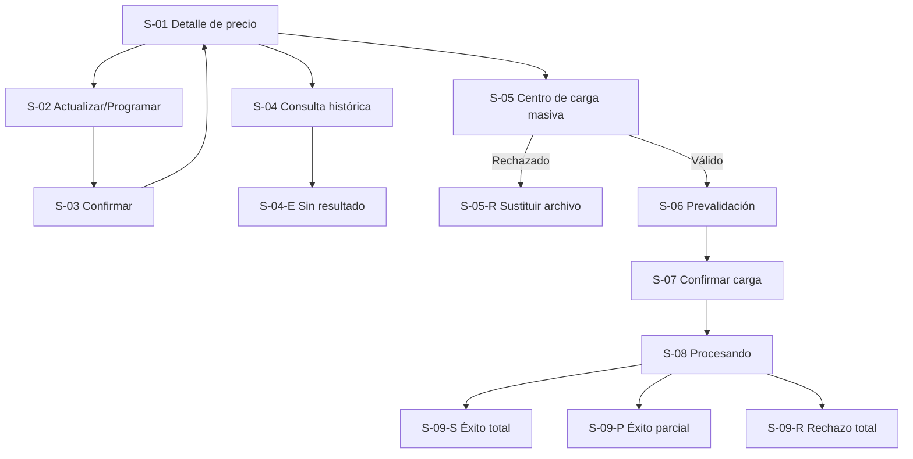

# WF-013 — Gestión de precios individuales y masivos

> **Fuente normativa de esta revisión:** `specs_consolidado_final.md` y `hu_consolidado_final.md` (18-09-2026). Los nombres/eventos de Ventas y Postventa son contratos **provisionales no homologados**; el prototipo no debe simular pagos realizados ni confirmaciones externas como si estuvieran implementadas. Las anotaciones, supuestos, preguntas y referencias técnicas permanecen en este documento y no se muestran como elementos de la interfaz simulada.

## 0. Instrucciones para el agente

Genera un wireframe detallado, anotado y navegable del flujo descrito en este\
archivo.

Antes de diseñar:

1. Consulta ../../specs/SPEC-013-gestion-precios-individuales-masivos.md.
2. Consulta ../../hu/HU-013-gestion-precios-individuales-masivos.md.
3. Consulta ../DESIGN.md.
4. Usa este documento como definición específica de interacción.

Prioridad de fuentes:

1. La especificación define reglas de negocio y restricciones globales.
2. La historia de usuario define criterios de aceptación y escenarios.
3. Este archivo define composición, navegación y comportamiento del flujo.
4. DESIGN.md define la representación visual.

Si existe una contradicción, no inventes una resolución. Identifícala como\
pregunta abierta y señala qué pantalla queda afectada.

Reglas de producción:

- No agregues campos, permisos, endpoints ni reglas no documentadas.
- No diseñes una pantalla de descarga de plantilla ni de exportación de\
  precios; la especificación no las define para este flujo.
- No diseñes una pantalla de mapeo de columnas para la carga masiva.
- No permitas adjuntar o incrustar imágenes; este flujo no gestiona imágenes.
- No elijas una librería de UI o estrategia CSS.
- No consumas APIs reales ni uses datos personales reales.
- Numera las anotaciones como A-01, A-02, A-03, etc.; estas anotaciones\
  pertenecen a la documentación del wireframe y no deben renderizarse dentro\
  de la interfaz del prototipo HTML.
- Los supuestos y las preguntas abiertas pertenecen a este documento de\
  especificación y no deben mostrarse como contenido de la interfaz del\
  producto.
- El comportamiento responsivo debe verificarse cambiando el tamaño real del\
  viewport; no agregues controles internos para simular escritorio, tablet o\
  móvil.
- Representa todos los estados obligatorios indicados en este documento.
- Los eventos de dominio (`pricing.price.changed`) son contexto técnico; no\
  deben exponerse al usuario salvo que una regla funcional lo requiera.
- La jerarquía de resolución de precio (producto base / override de variante)\
  es contexto informativo de solo lectura en este flujo; no diseñes una\
  pantalla de configuración de esa jerarquía, solo su visualización.
- No diseñes pantallas para promociones, cupones, combos, checkout o cálculo\
  de costos logísticos: están fuera de alcance según la especificación.

### Formato del entregable

Genera un prototipo navegable con HTML, CSS y JavaScript estáticos:

- El punto de entrada debe ser index.html.
- Debe funcionar sin proceso de compilación.
- Usa rutas y recursos relativos.
- No uses React ni dependencias del frontend productivo.
- No requieras conexión a servicios externos.
- Usa datos ficticios representativos (SKUs, precios en soles S/, fechas).
- Simula únicamente las interacciones necesarias para validar el flujo.
- No muestres anotaciones A-xx, supuestos, preguntas abiertas ni otra\
  documentación interna dentro de la interfaz simulada.
- Implementa comportamiento responsivo real para escritorio, tablet y móvil\
  mediante HTML/CSS; no incluyas un selector o botón para cambiar de tipo de\
  pantalla.
- Mantén el estilo monocromático y de baja fidelidad de DESIGN.md.

### Entregables esperados

1. Pantallas y variantes indicadas en el inventario.
2. Navegación funcional entre los estados simulados.
3. Anotaciones numeradas documentadas en este archivo y asociadas a elementos\
   visibles del wireframe; no forman parte de la interfaz del prototipo.
4. Estados de formulario, confirmación, procesamiento asíncrono y resultado.
5. Casos de éxito individual, programación futura, consulta histórica, éxito\
   masivo total, éxito masivo parcial y rechazo masivo total.
6. Comportamiento responsivo verificable al redimensionar el viewport, sin\
   controles internos de dispositivo.
7. Supuestos y preguntas abiertas registrados en las secciones documentales\
   correspondientes, fuera de la interfaz del prototipo.

---

## 1. Metadatos

| Campo                | Valor                                       |
| --------------------- | -------------------------------------------- |
| ID del wireframe     | WF-013                                      |
| Nombre del flujo     | Gestión de precios individuales y masivos   |
| Versión              | 0.1                                          |
| Estado               | Borrador                                    |
| Responsable          | Por asignar                                 |
| Fecha                | 2026-09-17                                  |
| Última actualización | 2026-09-18                                  |

## 2. Trazabilidad

| Fuente              | Identificador o sección              | Aporte al flujo                                                          |
| -------------------- | -------------------------------------- | --------------------------------------------------------------------------- |
| Spec                | SPEC-013-gestion-precios-individuales-masivos.md, secciones 1–6 | Alcance, jerarquía de precios, validaciones, atomicidad, seguridad         |
| Historia de usuario | HU-013-gestion-precios-individuales-masivos.md, CA-01 a CA-09   | Resultados observables, escenarios de aceptación y matriz de interacción  |
| Diseño              | DESIGN.md                              | Lenguaje visual monocromático de baja fidelidad                           |
| Backlog             | No proporcionado                       | No se asignan IDs de backlog                                              |

### Funcionalidades incluidas

- Consultar el detalle de precio de un SKU, indicando si es propio (override)
  o heredado del producto, así como su scope de canal (`channel_id`), moneda y `price_version`.
- Actualizar el precio regular y/o el precio de oferta de un SKU, exigiendo
  motivo obligatorio y validación de `price_version` para concurrencia optimista.
- Programar precios con fecha/hora de vigencia (`valid_from` y `valid_until` opcional), canal (`channel_id`) y moneda, validando que no existan intervalos superpuestos.
- Validar rangos comerciales y mostrar advertencias reforzadas ante variaciones porcentuales extraordinarias (guardrails).
- Consultar el precio oficial vigente en una fecha/hora pasada (as-of).
- Cargar un archivo CSV/XLSX con precios en lote, con columnas `sku`,
  `precio_regular`, `motivo_cambio` obligatorias, y opcionales `precio_oferta`, `accion_precio_oferta`, `channel_id`, `valid_from`, `valid_until` y `price_version`.
- Previsualizar la estructura del archivo antes de confirmar la carga.
- Elegir entre el modo atómico por defecto (all-or-nothing dentro de Pricing) y el modo
  tolerante a fallos (`allow_partial=true`).
- Seguir el procesamiento asíncrono del lote sin bloquear la interfaz.
- Mostrar el resultado cuantitativo del lote (total, exitosos, fallidos).
- Descargar un reporte de errores fila por fila cuando existan fallos (incluyendo conflictos de versión o vigencias superpuestas).

### Fuera de alcance

- Configuración de reglas de cupones, combos o promociones 2x1 (corresponde a promociones/ofertas).
- Procesamiento de cobros y checkout.
- Determinación de costos logísticos o tarifas por zona.
- Costeo de productos, margen contable y prevención de márgenes negativos (no existe dominio de costos en el alcance; Pricing no administra costos).
- Descarga de plantilla de carga masiva o exportación del catálogo de
  precios: no están documentadas en la especificación de este flujo.
- Mapeo dinámico de columnas del archivo masivo.
- Edición de la jerarquía producto/variante (creación de overrides fuera de
  la actualización de precio en sí).
- Historial de lotes anteriores, cancelación de un lote en curso o
  cancelación de una programación ya creada, porque no están confirmados en
  las fuentes.

## 3. Usuario objetivo

| Aspecto               | Definición                                                                                     |
| ----------------------- | -------------------------------------------------------------------------------------------------- |
| Persona               | Gestor comercial de un marketplace multicanal de artículos deportivos                          |
| Rol en el sistema     | `GESTOR_COMERCIAL` o `ADMIN_CATALOGO`, autenticado mediante JWT                                |
| Nivel técnico         | No especificado; diseñar para uso operativo básico/intermedio                                  |
| Contexto de uso       | Ajustes de precio frecuentes por campañas, tipo de cambio, liquidaciones o acuerdos con proveedores |
| Necesidad principal   | Mantener precios calibrados en todos los canales, con trazabilidad y sin errores operativos extraordinarios de precio |
| Permisos relevantes   | Debe poder consultar, actualizar, programar y cargar precios; el código exacto del permiso está pendiente |
| Dispositivo principal | Escritorio como hipótesis para la carga masiva por el uso de hojas de cálculo; consulta y edición individual deben permitir tablet/móvil |

## 4. Objetivo del flujo

El gestor comercial debe poder actualizar, programar y consultar precios de
forma individual o masiva, con motivo obligatorio, validaciones de rango y
trazabilidad temporal, para mantener los canales de venta sincronizados y
prevenir errores operativos o de configuración.

### Resultado exitoso

**Actualización individual:** el nuevo precio regular y/o de oferta queda\
persistido en el catálogo operativo, con el motivo registrado, y el sistema\
confirma la operación.

**Programación futura:** el cambio queda registrado en estado `SCHEDULED`\
sin alterar el precio operativo actual; el sistema confirma que quedó\
programado para la fecha indicada.

**Consulta histórica:** el gestor obtiene el precio oficial y la moneda que\
estuvieron vigentes en la fecha/hora consultada.

**Carga masiva:** el archivo válido queda asociado a un lote, la interfaz\
deja claro que el procesamiento continúa en segundo plano y, al finalizar,\
presenta cantidades procesadas, exitosas y fallidas. Si existen filas\
fallidas, ofrece un CSV con el número de fila y la causa exacta. Si el lote\
fue rechazado por completo (modo atómico con errores), ninguna fila se\
aplica y el reporte detalla el motivo del rechazo.

### Indicador de finalización

- Actualización individual: mensaje de confirmación y precio reflejado de\
  inmediato en el detalle del SKU.
- Programación: mensaje de confirmación indicando la fecha de vigencia; el\
  precio operativo no cambia hasta esa fecha.
- Consulta histórica: el resultado se muestra en la misma pantalla sin\
  navegación adicional.
- Carga masiva: la pantalla cambia del estado En cola o Procesando a un\
  estado final (éxito total, éxito parcial o rechazo total) y el gestor\
  recibe una notificación al finalizar; el canal exacto está pendiente.

## 5. Precondiciones y disparador

### Precondiciones

- El usuario tiene una sesión válida.
- El usuario posee el rol `GESTOR_COMERCIAL` o `ADMIN_CATALOGO`.
- El SKU o producto sobre el que se opera existe y está activo en el\
  catálogo.
- Para la carga masiva, el archivo respeta las cabeceras obligatorias y no\
  supera el tamaño máximo de 10 MB.

### Punto de entrada

- Ruta propuesta para el detalle/edición individual: `/productos/{sku}/precio`.
- Ruta propuesta para la carga masiva: `/precios/carga-masiva`.
- Entrada propuesta: acción "Actualizar precio" desde la ficha de producto y\
  opción "Carga masiva de precios" dentro del módulo de precios.
- Contexto conservado al entrar: ninguno confirmado.

Las rutas y ubicaciones exactas son una propuesta de wireframe y deben\
confirmarse con la arquitectura de navegación (ver Q-01).

### Salidas del flujo

| Resultado                              | Destino o comportamiento                                |
| ----------------------------------------- | ------------------------------------------------------------ |
| Actualización individual exitosa         | Permanece en S-01 con el precio y el mensaje actualizados |
| Programación exitosa                     | Permanece en S-01 indicando el precio programado          |
| Consulta histórica resuelta              | Permanece en S-04 mostrando el resultado                  |
| Consulta histórica sin dato para la fecha | Permanece en S-04-E                                        |
| Carga masiva confirmada                  | Navega a S-08 con estado En cola o Procesando              |
| Procesamiento masivo completo            | Navega o actualiza a S-09-S, S-09-P o S-09-R                |
| Cancelación antes de confirmar (individual o masiva) | Regresa a la pantalla anterior sin persistir cambios |
| Error de validación                      | Permanece en el formulario con los campos y errores visibles |
| Error de consulta del lote                | Mantiene el lote y permite volver a consultar               |

## 6. Secuencia principal

### Flujo A — Actualizar precio individual

1. El gestor abre el detalle de precio de un SKU/producto.
2. Revisa el precio regular y de oferta vigentes, y si el precio es propio o\
   heredado del producto.
3. Selecciona Actualizar precio.
4. Ingresa el nuevo precio regular y/o de oferta y el motivo del cambio.
5. El sistema valida los rangos (precio > 0, oferta < regular) y el motivo\
   obligatorio.
6. El gestor confirma la actualización.
7. El sistema persiste el cambio, emite el evento de dominio y confirma con\
   HTTP 200.

### Flujo B — Programar un precio futuro

1. El gestor sigue los pasos 1 a 4 del Flujo A.
2. En lugar de aplicar el cambio de inmediato, indica una fecha/hora de\
   vigencia (`valid_from`) posterior a la actual.
3. El sistema valida los mismos rangos y el motivo obligatorio, además de\
   que la fecha sea futura.
4. El gestor confirma la programación.
5. El sistema registra la programación en estado `SCHEDULED` con HTTP 201,\
   sin alterar el precio operativo actual.
6. Cuando la fecha de vigencia se cumple, un proceso automático activa el\
   precio y emite el evento correspondiente; esto ocurre fuera de la\
   interacción directa del gestor.

### Flujo C — Consultar precio histórico (as-of)

1. El gestor abre la consulta de precio histórico.
2. Ingresa el SKU y la fecha/hora a consultar.
3. El sistema consulta el histórico de vigencias y retorna el precio\
   oficial, la moneda y el identificador de vigencia correspondiente.
4. Si no existe un precio vigente para esa fecha, el sistema lo indica sin\
   asumir un valor.

### Flujo D — Carga masiva de precios

1. El gestor entra a Carga masiva de precios.
2. Revisa las reglas de formato, columnas obligatorias y modo de\
   procesamiento (atómico por defecto o tolerante con `allow_partial=true`).
3. Selecciona o arrastra un archivo XLSX/CSV.
4. El sistema prevalida extensión, MIME, tamaño y cabeceras.
5. Si la estructura es válida, muestra el resumen del archivo y el modo de\
   procesamiento elegido.
6. El gestor revisa el resumen y selecciona Continuar.
7. El sistema muestra la confirmación con las reglas críticas del modo\
   elegido.
8. El gestor selecciona Confirmar carga.
9. El sistema evita envíos duplicados y crea una tarea asíncrona (lote).
10. La interfaz muestra el lote En cola o Procesando y permite abandonar la\
    pantalla sin bloquear el trabajo.
11. Al finalizar, el sistema notifica al gestor.
12. La pantalla muestra el resultado: éxito total, éxito parcial (con\
    reporte de filas rechazadas) o rechazo total (con reporte del motivo).

### Flujos alternativos

| ID     | Condición                                                    | Comportamiento esperado                                                         | Retorno              |
| ------ | --------------------------------------------------------------- | ------------------------------------------------------------------------------------- | ----------------------- |
| ALT-01 | Motivo de cambio vacío o solo espacios                       | Rechazo con HTTP 400; el precio no se modifica; mensaje "El motivo del cambio de precio es mandatorio" | S-02 |
| ALT-02 | Precio regular menor o igual a 0                              | Rechazo con HTTP 400; mensaje "El precio regular debe ser un valor numérico estrictamente mayor a 0" | S-02 |
| ALT-03 | Precio de oferta mayor o igual al precio regular              | Rechazo; mensaje "El precio de oferta no puede ser mayor o igual al precio regular" | S-02 |
| ALT-04 | Fecha de vigencia programada no es posterior a la actual      | Rechazo del formulario de programación                                          | S-02                  |
| ALT-05 | SKU no encontrado al abrir el detalle                          | Mensaje de SKU no encontrado, sin exponer detalles internos                     | S-01-E                |
| ALT-06 | Fecha `at` sin precio vigente en el histórico                 | Mensaje explícito de que no existe un precio registrado para esa fecha           | S-04-E                |
| ALT-07 | Extensión o MIME de archivo no admitido                       | Rechazo total antes de encolar; indicar XLSX/CSV como formatos aceptados         | S-05-R                |
| ALT-08 | Archivo mayor de 10 MB                                         | Rechazo total y mensaje con el límite exacto                                     | S-05-R                |
| ALT-09 | Cabeceras ausentes o distintas a `sku`, `precio_regular`, `motivo_cambio`, `precio_oferta` | Rechazo total; orientar a corregir las cabeceras | S-05-R |
| ALT-10 | Modo atómico (`allow_partial=false`) con al menos una fila inválida | Aborta la transacción completa; ninguna fila se aplica; reporte con la fila y el error | S-09-R |
| ALT-11 | Modo tolerante (`allow_partial=true`) con filas inválidas     | Aplica las filas válidas, descarta las inválidas y entrega reporte descargable   | S-09-P                 |
| ALT-12 | Error temporal al consultar el estado del lote                | Mostrar error recuperable sin afirmar que el procesamiento falló                 | S-08-E                 |
| ALT-13 | Sesión expirada                                                | Solicitar autenticación y conservar la referencia del lote cuando sea posible    | Estado global          |
| ALT-14 | Usuario sin el rol requerido                                    | Bloquear las acciones y ofrecer retorno seguro                                    | Estado global          |

## 7. Inventario de pantallas y variantes

| ID     | Pantalla o variante                        | Propósito                                                       | Ruta o presentación             | Obligatoria            |
| ------ | --------------------------------------------- | -------------------------------------------------------------------- | ---------------------------------- | ----------------------- |
| S-01   | Detalle de precio de SKU/producto           | Mostrar el precio vigente, su origen y las acciones disponibles  | Ruta propuesta /productos/{sku}/precio | Sí                  |
| S-01-E | Error al cargar el detalle de precio        | Comunicar que el SKU no existe o hubo un fallo de consulta        | Variante de S-01                   | Sí                       |
| S-02   | Actualizar o programar precio               | Capturar nuevos valores, motivo y vigencia (inmediata o futura)   | Panel o formulario sobre S-01      | Sí                       |
| S-03   | Confirmar actualización de precio           | Evitar cambios accidentales y recordar reglas críticas            | Diálogo modal                      | Sí                       |
| S-04   | Consulta de precio histórico (as-of)        | Obtener el precio oficial vigente en una fecha pasada              | Ruta propuesta /precios/historico  | Sí                       |
| S-04-E | Sin resultado histórico                     | Explicar que no existe un precio registrado para la fecha indicada | Variante de S-04                   | Sí                       |
| S-05   | Centro de carga masiva de precios           | Explicar reglas, modo de procesamiento y ofrecer seleccionar archivo | Ruta propuesta /precios/carga-masiva | Sí                     |
| S-05-R | Archivo rechazado                            | Explicar rechazo estructural y permitir sustitución                | Variante de S-05                   | Sí                       |
| S-06   | Archivo seleccionado y prevalidado          | Mostrar prevalidación, resumen y modo elegido                      | Misma ruta o paso interno          | Sí                       |
| S-07   | Confirmar carga masiva                       | Obtener confirmación explícita antes de procesar el lote           | Diálogo modal                      | Sí                       |
| S-08   | Lote en cola o procesamiento                 | Comunicar ejecución asíncrona no bloqueante                        | Ruta de estado por definir         | Sí                       |
| S-08-E | Error al consultar el lote                   | Separar un fallo de consulta de un fallo de procesamiento          | Variante de S-08                   | Sí                       |
| S-09-S | Resultado sin errores                        | Confirmar que todas las filas fueron aplicadas                     | Variante final                     | Sí                       |
| S-09-P | Resultado con errores parciales              | Resumir aplicadas/rechazadas y ofrecer reporte de errores          | Variante final                     | Sí                       |
| S-09-R | Rechazo total por errores de fila            | Comunicar que ningún cambio se aplicó y por qué                    | Variante final                     | Sí                       |

## 8. Mapa de navegación

## 9. Especificación por pantalla

### S-01 — Detalle de precio de SKU/producto

#### Propósito

Mostrar el precio regular y de oferta vigentes de un SKU, indicar si el\
precio es propio (override) o heredado del producto, y dar acceso a\
actualizarlo, programarlo o consultar su histórico.

#### Jerarquía de contenido

1. Identificación del SKU/producto y estado de vigencia.
2. Precio regular y precio de oferta actuales, con moneda.
3. Origen del precio (propio del SKU o heredado del producto).
4. Acciones: Actualizar precio y Consultar precio histórico.

#### Regiones y componentes

| Región      | Componente neutral          | Contenido                                                    | Comportamiento                                   |
| ------------ | ------------------------------ | ---------------------------------------------------------------- | ---------------------------------------------------- |
| Encabezado  | Título y datos del SKU       | Nombre de producto, SKU, estado activo                        | Encabezado principal único                        |
| Precio      | Tarjeta de precio             | Precio regular, precio de oferta (si existe), moneda            | Muestra "Sin oferta activa" si no hay precio de oferta |
| Origen      | Etiqueta informativa          | "Precio propio del SKU" o "Heredado del producto"               | Solo lectura                                       |
| Acciones    | Botones                        | Actualizar precio; Consultar precio histórico                   | Habilitados solo con el rol requerido              |

#### Acciones

| Prioridad  | Acción              | Etiqueta visible          | Disponibilidad                    | Resultado      |
| ---------- | --------------------- | ---------------------------- | -------------------------------------- | ---------------- |
| Primaria   | Editar precio         | Actualizar precio            | Con rol `GESTOR_COMERCIAL`/`ADMIN_CATALOGO` | Abre S-02    |
| Secundaria | Ver histórico         | Consultar precio histórico   | Con el mismo rol                       | Abre S-04       |

#### Datos mostrados

| Dato                  | Fuente                  | Formato          | Prioridad | Ausencia                      |
| ------------------------ | -------------------------- | ------------------- | ----------- | ---------------------------------- |
| Precio regular          | Tabla operativa `product_prices` | Moneda + número | Alta | No omitir                        |
| Precio de oferta        | Tabla operativa            | Moneda + número | Alta        | Mostrar "Sin oferta activa"        |
| Origen del precio       | Resolución de jerarquía (R1.1) | Texto           | Alta        | No omitir                         |
| Fecha de última modificación | Registro de la última actualización | Fecha y hora local | Media | Indicar "No disponible"          |
| Programación pendiente  | Registro `SCHEDULED` para el SKU | Fecha de vigencia futura | Media | Omitir si no existe programación |

#### Anotaciones

| ID   | Elemento              | Anotación                                                                   |
| ---- | ------------------------ | -------------------------------------------------------------------------------- |
| A-01 | Origen del precio       | Refleja el Requisito 1.1: producto base, override de SKU o herencia               |
| A-02 | Programación pendiente  | Ver SUP-05/Q-05: cómo evitar programar dos veces el mismo SKU                     |
| A-03 | Precio de oferta ausente | No confundir "sin oferta" con un valor 0 o negativo                              |
| A-04 | Actualizar precio        | Abre S-02 sin alterar el precio operativo hasta confirmar                         |

### S-01-E — Error al cargar el detalle de precio

#### Contenido y comportamiento

- Mostrar un encabezado "No se pudo cargar el precio del SKU".
- Diferenciar SKU inexistente de un fallo temporal de consulta.
- Ofrecer Reintentar cuando el fallo es temporal.
- No exponer detalles internos del servicio o la base de datos.

#### Anotaciones

| ID   | Elemento     | Anotación                                                        |
| ---- | -------------- | ---------------------------------------------------------------- |
| A-05 | Mensaje de error | No debe confundirse un SKU inexistente con un fallo de red      |

### S-02 — Actualizar o programar precio

#### Propósito

Capturar el nuevo precio regular y/o de oferta, el motivo obligatorio del\
cambio y, opcionalmente, una fecha/hora de vigencia futura.

#### Jerarquía de contenido

1. Precio regular actual y campo para el nuevo valor.
2. Precio de oferta actual y campo para el nuevo valor (opcional).
3. Campo obligatorio de motivo del cambio.
4. Selección de vigencia: aplicar ahora o programar para una fecha futura.

#### Regiones y componentes

| Región      | Componente              | Contenido                                           | Comportamiento                                        |
| ------------ | --------------------------- | -------------------------------------------------------- | ------------------------------------------------------- |
| Precios     | Campos numéricos          | Precio regular (obligatorio), precio de oferta (opcional) | Valida > 0 y oferta < regular antes de habilitar Continuar |
| Motivo      | Campo de texto             | Motivo del cambio de precio                              | Obligatorio; no admite solo espacios                    |
| Vigencia    | Selector de modo           | "Aplicar ahora" / "Programar para una fecha"              | Si es "Programar", exige fecha/hora futura               |
| Acciones    | Botones                     | Continuar; Cancelar                                       | Continuar solo si el formulario es válido                |

#### Formulario

| Campo            | Tipo             | Obligatorio | Valor inicial         | Validación                                    | Mensaje de error                                                       |
| ------------------ | -------------------- | ------------- | ------------------------ | -------------------------------------------------- | ----------------------------------------------------------------------------- |
| Precio regular     | Numérico             | Sí            | Precio actual             | Estrictamente mayor a 0                            | "El precio regular debe ser un valor numérico estrictamente mayor a 0"       |
| Precio de oferta   | Numérico             | No            | Precio de oferta actual   | Si se define, mayor a 0 y menor al precio regular   | "El precio de oferta no puede ser mayor o igual al precio regular"           |
| Motivo del cambio  | Texto                | Sí            | Vacío                     | No vacío ni solo espacios                          | "El motivo del cambio de precio es mandatorio"                               |
| Vigencia           | Selector             | Sí            | "Aplicar ahora"           | Si es "Programar", la fecha debe ser posterior a la actual | "La fecha de vigencia debe ser posterior a la fecha y hora actuales"        |

- Momento de validación: al salir de cada campo y al intentar continuar.
- Conservación de datos tras error: los valores ingresados permanecen visibles.
- Prevención de envío duplicado: el botón Continuar se deshabilita tras un\
  primer envío válido hasta que se resuelva la respuesta.
- Cambios sin guardar: al cancelar, se descartan sin confirmación adicional\
  (el cambio aún no fue aplicado).

#### Navegación y foco

- Foco inicial: campo de precio regular.
- Orden de foco: precio regular, precio de oferta, motivo, vigencia,\
  Continuar.
- Foco después de error: primer campo inválido.

#### Anotaciones

| ID   | Elemento              | Anotación                                                                |
| ---- | ------------------------ | -------------------------------------------------------------------------- |
| A-06 | Precio regular          | Regla del Requisito 1: estrictamente mayor a 0                             |
| A-07 | Precio de oferta        | Regla del Requisito 1: menor al precio regular cuando se define             |
| A-08 | Motivo del cambio       | Obligatorio tanto en actualización inmediata como en programación          |
| A-09 | Selector de vigencia    | Diferencia el Requisito 1 (inmediata) del Requisito 2 (programada)          |
| A-10 | Continuar                | Deshabilitado hasta que el formulario cumpla todas las validaciones        |

### S-03 — Confirmar actualización de precio

#### Propósito

Obtener confirmación explícita antes de persistir un cambio de precio o una\
programación.

#### Regiones y componentes

| Región     | Componente     | Contenido                                                       | Comportamiento                       |
| ------------ | ----------------- | -------------------------------------------------------------------- | --------------------------------------- |
| Encabezado | Título modal     | "Confirmar actualización de precio" o "Confirmar programación de precio" | Asociado semánticamente al diálogo    |
| Resumen    | Comparación       | Precio actual frente al nuevo precio regular y de oferta               | Coincide con lo ingresado en S-02       |
| Motivo     | Texto             | Motivo ingresado                                                       | Visible, no editable desde el modal     |
| Vigencia   | Texto             | "Se aplicará de inmediato" o "Entrará en vigencia el {fecha}"          | Coincide con la selección en S-02       |
| Acciones   | Botones           | Confirmar; Volver                                                       | Bloqueo tras el primer envío            |

#### Acciones

| Prioridad  | Acción                | Etiqueta   | Disponibilidad     | Resultado      |
| ---------- | ------------------------ | ------------ | ---------------------- | ---------------- |
| Primaria   | Persistir cambio          | Confirmar    | Formulario válido      | Navega a S-01     |
| Secundaria | Cancelar confirmación     | Volver       | Siempre                 | Regresa a S-02    |

#### Prevención de duplicados

- Al confirmar, deshabilitar temporalmente ambas acciones.
- Mostrar un estado "Enviando".
- Una respuesta repetida no debe crear dos actualizaciones o dos\
  programaciones.

#### Navegación y foco

- El foco inicial se sitúa en el título del diálogo.
- El foco queda contenido en el diálogo.
- Escape o Volver cierra el diálogo antes del envío.
- Tras cerrar, el foco regresa al botón Continuar de S-02.

#### Anotaciones

| ID   | Elemento    | Anotación                                                                  |
| ---- | ------------- | ------------------------------------------------------------------------------ |
| A-11 | Resumen       | Muestra el precio actual y el nuevo para evitar confirmar el valor equivocado |
| A-12 | Vigencia      | Distingue con claridad una aplicación inmediata de una programación futura    |
| A-13 | Confirmar     | Un solo envío; muestra "Enviando" mientras se persiste el cambio               |

### S-04 — Consulta de precio histórico (as-of)

#### Propósito

Permitir al gestor consultar el precio oficial que un SKU tuvo en una\
fecha/hora determinada del pasado.

#### Jerarquía de contenido

1. Campo de SKU a consultar.
2. Campo de fecha/hora (`at`).
3. Resultado: precio regular, moneda e identificador de vigencia.

#### Regiones y componentes

| Región     | Componente          | Contenido                                     | Comportamiento                                |
| ------------ | ------------------------ | ---------------------------------------------- | --------------------------------------------------- |
| Consulta   | Campos de búsqueda       | SKU, fecha y hora                              | Ambos campos son obligatorios para consultar        |
| Resultado  | Tarjeta de resultado      | Precio regular, moneda, identificador de vigencia | Solo aparece tras una consulta exitosa            |

#### Formulario

| Campo      | Tipo        | Obligatorio | Valor inicial | Validación                          | Mensaje de error                             |
| ------------ | -------------- | ------------- | ---------------- | ---------------------------------------- | -------------------------------------------------- |
| SKU          | Texto          | Sí            | Vacío             | Debe existir en el catálogo               | "No se encontró información para este SKU"        |
| Fecha y hora | Selector fecha/hora | Sí       | Vacío             | Fecha/hora válida, no puede ser futura (comportamiento no confirmado, ver Q-07) | "Ingresa una fecha y hora válidas" |

#### Datos mostrados

| Dato                     | Fuente                    | Formato        | Prioridad | Ausencia                                  |
| --------------------------- | ---------------------------- | ------------------ | ----------- | ------------------------------------------- |
| Precio regular consultado  | Tabla de vigencias (SCD Tipo 2) | Moneda + número | Alta       | Mostrar S-04-E                              |
| Moneda oficial              | Tabla de vigencias             | Código de moneda   | Alta       | No omitir                                   |
| Identificador de vigencia  | Tabla de vigencias             | Texto/ID            | Media       | Omitir si no aplica                          |

#### Anotaciones

| ID   | Elemento         | Anotación                                                            |
| ---- | ------------------- | -------------------------------------------------------------------------- |
| A-14 | Consulta            | Implementa el Requisito 3; usa el mismo contrato que `GET /api/v1/pricing/skus/{sku}/price?at=` |
| A-15 | Resultado            | Debe distinguirse claramente del precio vigente actual mostrado en S-01     |

### S-04-E — Sin resultado histórico

#### Contenido y comportamiento

- Mostrar un mensaje explícito: "No existe un precio registrado para el SKU\
  en la fecha indicada".
- No mostrar un valor por defecto ni el precio vigente actual como sustituto.
- Ofrecer modificar la fecha o el SKU consultado.

#### Anotaciones

| ID   | Elemento | Anotación                                                          |
| ---- | ---------- | -------------------------------------------------------------------- |
| A-16 | Mensaje    | Nunca debe inferirse un precio cuando no hay dato histórico          |

### S-05 — Centro de carga masiva de precios

#### Propósito

Explicar las reglas del archivo, el modo de procesamiento disponible y\
permitir seleccionar el archivo a importar.

#### Jerarquía de contenido

1. Título "Carga masiva de precios".
2. Reglas de formato: cabeceras obligatorias, tamaño máximo.
3. Selección del modo de procesamiento: atómico por defecto o tolerante.
4. Zona de selección de archivo.

#### Regiones y componentes

| Región      | Componente neutral      | Contenido                                                                    | Comportamiento                                       |
| ------------ | --------------------------- | --------------------------------------------------------------------------------- | ----------------------------------------------------- |
| Encabezado  | Título y texto introductorio | Propósito de la carga masiva de precios                                          | Una sola cabecera principal                           |
| Reglas      | Lista o panel informativo   | Cabeceras `sku`, `precio_regular`, `motivo_cambio` obligatorias; `precio_oferta` opcional; máx. 10 MB | Visible antes de elegir el archivo |
| Modo        | Selector de dos opciones    | "Todo o nada (recomendado)" / "Aplicar filas válidas y reportar errores"          | Por defecto: "Todo o nada"; equivale a `allow_partial=false` |
| Importación | Zona de selección y botón   | Arrastra un archivo o selecciónalo; XLSX/CSV; 10 MB máximo                        | Debe funcionar con botón y teclado, no solo drag-and-drop |

#### Acciones

| Prioridad  | Acción                    | Etiqueta visible    | Disponibilidad              | Resultado             |
| ---------- | ---------------------------- | ---------------------- | -------------------------------- | ------------------------ |
| Primaria   | Abrir selector de archivo     | Seleccionar archivo    | Con el rol requerido              | Inicia prevalidación      |
| Secundaria | Elegir modo de procesamiento  | Selector de modo        | Antes de seleccionar el archivo  | Define `allow_partial`    |

#### Datos mostrados

| Dato                   | Fuente        | Formato                     | Prioridad | Ausencia   |
| ------------------------- | ---------------- | -------------------------------- | ----------- | ------------ |
| Formatos permitidos       | Spec/CA-06/CA-07 | XLSX, CSV                        | Alta        | No omitir    |
| Tamaño máximo              | Spec NFR         | 10 MB                            | Alta        | No omitir    |
| Cabeceras obligatorias    | Spec/CA-06       | `sku`, `precio_regular`, `motivo_cambio` | Alta | No omitir    |
| Columna opcional           | Spec/CA-06       | `precio_oferta`                  | Media       | No omitir    |
| Modo de procesamiento      | Spec/CA-06/CA-07 | Texto explicativo de ambos modos | Alta        | No omitir    |

#### Navegación y foco

- Foco inicial: título o primera acción según la convención global.
- Orden: selector de modo, seleccionar archivo, ayuda.
- El selector nativo devuelve el foco al control que lo abrió.

#### Anotaciones

| ID   | Elemento                   | Anotación                                                              |
| ---- | ------------------------------ | ------------------------------------------------------------------------- |
| A-17 | Zona de selección              | Acepta un único XLSX o CSV; 10 MB máximo (ver SUP-04 sobre límite de filas) |
| A-18 | Botón Seleccionar archivo      | Alternativa accesible obligatoria al arrastre                             |
| A-19 | Selector de modo                | Por defecto "Todo o nada"; el gestor debe elegir explícitamente el modo tolerante |
| A-20 | Reglas de cabeceras             | Refleja el Requisito 4: `sku`, `precio_regular`, `motivo_cambio` obligatorias |

### S-05-R — Archivo rechazado

#### Propósito

Explicar por qué el archivo completo no puede procesarse y orientar una\
corrección concreta.

#### Contenido y comportamiento

- Mostrar un encabezado "Archivo no válido".
- Enumerar causas concretas: formato, MIME, tamaño o cabeceras incorrectas.
- No crear ni mostrar un lote como Procesando.
- Ofrecer Reemplazar archivo.

#### Anotaciones

| ID   | Elemento            | Anotación                                                                |
| ---- | ---------------------- | -------------------------------------------------------------------------- |
| A-21 | Resumen de errores      | Distingue el rechazo estructural total de los errores parciales por fila (S-09-P/S-09-R) |
| A-22 | Reemplazar archivo      | Acción primaria de recuperación                                           |

### S-06 — Archivo seleccionado y prevalidado

#### Propósito

Mostrar el resultado de la prevalidación estructural, el resumen del\
archivo y el modo de procesamiento elegido, permitiendo avanzar solo si la\
estructura es válida.

#### Jerarquía de contenido

1. Resultado de la prevalidación.
2. Nombre, tipo, tamaño y filas detectadas.
3. Modo de procesamiento elegido.
4. Acción Continuar.

#### Regiones y componentes

| Región     | Componente        | Contenido                                   | Comportamiento                         |
| ------------ | ---------------------- | ---------------------------------------------- | ------------------------------------------ |
| Archivo    | Resumen                | Nombre, extensión, tamaño y filas detectadas    | No mostrar ruta local completa             |
| Validación | Estado y lista          | Aprobaciones o causas de rechazo               | Texto e icono; no depender del color       |
| Modo       | Recordatorio            | Modo de procesamiento seleccionado en S-05      | Puede modificarse volviendo a S-05         |
| Acciones   | Botones                 | Reemplazar archivo; Continuar                   | Continuar solo si es estructuralmente válido |

#### Acciones

| Prioridad  | Acción    | Etiqueta            | Disponibilidad            | Resultado      |
| ---------- | ----------- | ---------------------- | -------------------------- | ---------------- |
| Primaria   | Avanzar     | Continuar               | Solo prevalidación válida  | Abre S-07         |
| Secundaria | Sustituir   | Reemplazar archivo      | Siempre                     | Abre selector     |
| Secundaria | Volver      | Volver                  | Siempre                     | Regresa a S-05    |

#### Datos mostrados

| Dato                  | Fuente                    | Formato          | Prioridad | Ausencia                              |
| ------------------------ | ----------------------------- | -------------------- | ----------- | ---------------------------------------- |
| Nombre del archivo       | Archivo seleccionado           | Texto saneado         | Alta        | No omitir                                |
| Tamaño                    | Metadatos/servidor             | MB                     | Alta        | Indicar "No disponible"                  |
| Tipo                      | Validación MIME/extensión      | XLSX o CSV             | Alta        | Rechazar                                  |
| Filas detectadas          | Prevalidación                   | Número entero          | Alta        | Mantener "Procesando" hasta obtenerlo     |
| Estructura                | Validación de cabeceras         | Válida/Inválida        | Alta        | No habilitar Continuar                    |
| Modo de procesamiento     | Selección previa en S-05        | "Todo o nada" / "Tolerante" | Media | No omitir                              |

#### Anotaciones

| ID   | Elemento                | Anotación                                                        |
| ---- | ---------------------------- | ---------------------------------------------------------------------- |
| A-23 | Estado de prevalidación       | La validación estructural ocurre antes de crear el lote                 |
| A-24 | Resumen del archivo            | Nunca exponer una ruta local completa                                   |
| A-25 | Continuar                      | Deshabilitado hasta que la estructura sea válida                        |
| A-26 | Ausencia de mapeo              | No agregar controles para asociar columnas                              |

### S-07 — Confirmar carga masiva

#### Propósito

Obtener confirmación explícita antes de iniciar el procesamiento masivo del\
lote de precios.

#### Regiones y componentes

| Región     | Componente   | Contenido                                                           | Comportamiento                     |
| ------------ | --------------- | ------------------------------------------------------------------------ | ------------------------------------- |
| Encabezado | Título modal   | "Confirmar carga masiva"                                                  | Asociado semánticamente al diálogo     |
| Resumen    | Definición     | Archivo, tamaño y filas detectadas                                        | Coincide con S-06                      |
| Modo       | Texto           | Explica el efecto del modo elegido: "Todo o nada" o "Filas válidas se aplican; inválidas se reportan" | No ocultar tras acordeón |
| Acciones   | Botones         | Confirmar carga; Volver                                                   | Bloqueo tras el primer envío           |

#### Acciones

| Prioridad  | Acción                | Etiqueta        | Disponibilidad | Resultado      |
| ---------- | ------------------------ | ------------------- | ----------------- | ---------------- |
| Primaria   | Crear lote                | Confirmar carga      | Archivo válido      | Navega a S-08     |
| Secundaria | Cancelar confirmación     | Volver               | Siempre              | Regresa a S-06    |

#### Prevención de duplicados

- Al confirmar, deshabilitar temporalmente ambas acciones.
- Mostrar un estado "Enviando".
- Una respuesta repetida no debe crear lotes duplicados.

#### Navegación y foco

- El foco inicial se sitúa en el título o primer elemento significativo.
- El foco queda contenido en el diálogo.
- Escape o Volver cierra el diálogo antes del envío.
- Tras cerrar, el foco regresa al botón Continuar de S-06.

#### Anotaciones

| ID   | Elemento        | Anotación                                                             |
| ---- | ------------------- | --------------------------------------------------------------------------- |
| A-27 | Resumen              | Repite el archivo para evitar confirmar el documento equivocado             |
| A-28 | Modo                 | Explica con claridad el resultado esperado según `allow_partial`            |
| A-29 | Confirmar carga      | Un solo envío; muestra "Enviando" mientras se crea el lote                  |

### S-08 — Lote en cola o procesamiento

#### Propósito

Comunicar que el procesamiento del lote continúa en segundo plano y\
permitir al gestor dejar la pantalla sin interpretar la navegación como\
cancelación.

#### Jerarquía de contenido

1. Estado "En cola" o "Procesando".
2. Mensaje "Puede salir de esta pantalla; le notificaremos al finalizar".
3. Archivo, modo elegido y referencia del lote, si el contrato la expone.
4. Última actualización y recuperación ante error de consulta.

#### Datos mostrados

| Dato             | Fuente             | Formato               | Prioridad | Ausencia                             |
| ------------------- | --------------------- | -------------------------- | ----------- | ---------------------------------------- |
| Estado               | Consulta del lote      | En cola/Procesando          | Alta        | Mostrar "No disponible" y reintentar     |
| Archivo               | Lote                   | Nombre saneado               | Media       | No omitir si se conserva                 |
| Modo de procesamiento | Lote                   | "Todo o nada" / "Tolerante"  | Media       | No omitir                                |
| Batch ID              | Lote/auditoría          | Identificador                | Media       | Ocultar si no se expone (ver SUP-07)     |
| Inicio                | Lote                   | Fecha y hora local           | Media       | Indicar "Pendiente"                       |

No mostrar un porcentaje de progreso salvo que el backend proporcione una\
métrica fiable. Una animación indeterminada es preferible a inventar\
progreso.

#### Acciones

| Prioridad  | Acción              | Etiqueta           | Disponibilidad           | Resultado          |
| ---------- | ---------------------- | ---------------------- | ----------------------------- | --------------------- |
| Secundaria | Abandonar pantalla      | Volver a precios         | Siempre                        | El lote continúa       |
| Secundaria | Reintentar consulta     | Actualizar estado        | Cuando falla la consulta       | Recupera el estado     |

#### Anotaciones

| ID   | Elemento               | Anotación                                                        |
| ---- | -------------------------- | --------------------------------------------------------------------- |
| A-30 | Estado                      | Diferenciar "En cola" de "Procesando" si el contrato lo permite       |
| A-31 | Mensaje no bloqueante       | Salir de la pantalla no cancela el lote                               |
| A-32 | Progreso                    | No representar porcentaje ficticio                                     |
| A-33 | Error de consulta           | No equivale a un fallo del lote                                        |

### S-08-E — Error al consultar el lote

#### Contenido y comportamiento

- Mostrar un aviso de error recuperable sin cambiar el estado real del lote.
- Ofrecer Reintentar consulta.
- Conservar la referencia del lote para que el gestor pueda volver a\
  consultar más tarde.

#### Anotaciones

| ID   | Elemento | Anotación                                                       |
| ---- | ---------- | ---------------------------------------------------------------- |
| A-34 | Aviso       | No debe interpretarse como que el procesamiento del lote falló   |

### S-09-S — Resultado sin errores

#### Propósito

Confirmar que todas las filas del lote fueron aplicadas correctamente.

#### Jerarquía de contenido

1. Estado final "Completado sin errores".
2. Totales procesados y exitosos (iguales).
3. Archivo, modo y referencia del lote.

#### Regiones y componentes

| Región    | Componente           | Contenido                            | Comportamiento                 |
| ----------- | ------------------------ | ---------------------------------------- | ----------------------------------- |
| Resultado | Encabezado de estado      | "Completado sin errores"                  | Texto e icono, no solo color        |
| Resumen   | Métricas                  | Total procesado, exitosos                  | La suma debe ser coherente          |
| Contexto  | Detalle del lote          | Archivo, modo, batch ID y finalización     | Batch ID solo si se expone          |
| Cierre    | Acciones                  | Cargar otro archivo; volver                | Reinicia o abandona el flujo        |

#### Acciones

| Prioridad  | Acción           | Etiqueta            | Disponibilidad | Resultado       |
| ---------- | ------------------- | ----------------------- | ----------------- | ------------------ |
| Secundaria | Reiniciar flujo      | Cargar otro archivo      | Estado final        | Regresa a S-05       |
| Secundaria | Salir                | Volver a precios          | Estado final        | Sale del flujo       |

#### Anotaciones

| ID   | Elemento | Anotación                                            |
| ---- | ---------- | ------------------------------------------------------- |
| A-35 | Métricas    | Total procesado debe coincidir con el total de exitosos  |

### S-09-P — Resultado con errores parciales

#### Propósito

Presentar un resultado verificable cuando el lote se procesó en modo\
tolerante, distinguiendo filas aplicadas de filas rechazadas y permitiendo\
descargar el detalle.

#### Jerarquía de contenido

1. Estado final "Completado con errores parciales".
2. Totales procesados, exitosos y fallidos.
3. Descarga del reporte de errores.
4. Archivo, modo, batch ID y fecha del lote.

#### Regiones y componentes

| Región    | Componente           | Contenido                          | Comportamiento                      |
| ----------- | ------------------------ | --------------------------------------- | ----------------------------------------- |
| Resultado | Encabezado de estado      | "Completado con errores parciales"        | Texto e icono, no solo color               |
| Resumen   | Tres métricas             | Total, exitosos, fallidos                 | La suma debe ser coherente                  |
| Errores   | Acción contextual         | Descargar CSV de errores                  | Siempre visible en esta variante            |
| Contexto  | Detalle del lote          | Archivo, modo, batch ID y finalización     | Batch ID solo si se expone                  |
| Cierre    | Acciones                  | Cargar otro archivo; volver                | Reinicia o abandona el flujo                |

#### Acciones

| Prioridad             | Acción             | Etiqueta               | Disponibilidad | Resultado                |
| ------------------------ | ---------------------- | --------------------------- | ----------------- | --------------------------- |
| Primaria condicional     | Descargar reporte      | Descargar errores CSV        | Siempre en esta variante | Descarga fila y motivo      |
| Secundaria                | Reiniciar flujo         | Cargar otro archivo           | Estado final        | Regresa a S-05               |
| Secundaria                | Salir                   | Volver a precios               | Estado final        | Sale del flujo                |

#### Datos mostrados

| Dato               | Fuente             | Formato               | Prioridad          | Ausencia                            |
| --------------------- | --------------------- | -------------------------- | --------------------- | ----------------------------------------- |
| Total procesado        | Resultado del lote      | Entero                       | Alta                   | Mostrar error de datos                     |
| Exitosos                | Resultado del lote      | Entero                       | Alta                   | Mostrar error de datos                     |
| Fallidos                | Resultado del lote      | Entero                       | Alta                   | Mostrar error de datos                     |
| Reporte de errores      | Artefacto del lote      | CSV                          | Alta                   | Explicar si no está disponible             |
| Motivos detallados      | CSV descargado          | Fila + causa exacta          | Alta                   | No sustituir por mensaje genérico          |

#### Anotaciones

| ID   | Elemento              | Anotación                                                                       |
| ---- | ------------------------- | -------------------------------------------------------------------------------------- |
| A-36 | Métricas                    | Total procesado debe coincidir con exitosos más fallidos                                |
| A-37 | Estado parcial              | Las filas válidas ya fueron aplicadas; no presentar el lote completo como fallido        |
| A-38 | Descargar errores CSV       | Incluye fila y motivo puntual de cada rechazo                                            |
| A-39 | Reimportación                | No afirmar que solo reintentará las filas fallidas; inicia un nuevo flujo                |

### S-09-R — Rechazo total por errores de fila

#### Propósito

Comunicar que, por operar en modo atómico, ningún cambio fue aplicado\
debido a al menos un error de fila, y permitir descargar el detalle exacto.

#### Jerarquía de contenido

1. Estado final "No se aplicó ningún cambio".
2. Explicación de que el modo "Todo o nada" descarta el lote completo ante\
   cualquier error.
3. Descarga del reporte con la fila y el error exactos.
4. Acción para reintentar con un modo tolerante o un archivo corregido.

#### Regiones y componentes

| Región    | Componente           | Contenido                                          | Comportamiento                    |
| ----------- | ------------------------ | ------------------------------------------------------- | -------------------------------------- |
| Resultado | Encabezado de estado      | "No se aplicó ningún cambio"                              | Texto e icono, no solo color            |
| Explicación | Texto                    | El modo "Todo o nada" no aplica cambios parciales          | Evita interpretar el rechazo como error del sistema |
| Errores   | Acción contextual         | Descargar CSV de errores                                  | Siempre visible en esta variante        |
| Cierre    | Acciones                  | Cargar otro archivo; volver                                | Reinicia o abandona el flujo            |

#### Acciones

| Prioridad             | Acción             | Etiqueta               | Disponibilidad      | Resultado                |
| ------------------------ | ---------------------- | --------------------------- | ----------------------- | --------------------------- |
| Primaria                 | Descargar reporte      | Descargar errores CSV        | Siempre en esta variante | Descarga fila y motivo      |
| Secundaria                | Reiniciar flujo         | Cargar otro archivo           | Estado final              | Regresa a S-05                |

#### Datos mostrados

| Dato               | Fuente             | Formato               | Prioridad | Ausencia                            |
| --------------------- | --------------------- | -------------------------- | ----------- | ----------------------------------------- |
| Fila con error         | Resultado del lote      | Entero                       | Alta        | Mostrar error de datos                     |
| Motivo del rechazo      | Resultado del lote      | Texto exacto                 | Alta        | No sustituir por mensaje genérico          |
| Total de filas del archivo | Metadatos del lote  | Entero                       | Media       | Omitir si no está disponible                |

#### Anotaciones

| ID   | Elemento     | Anotación                                                                        |
| ---- | ---------------- | --------------------------------------------------------------------------------------- |
| A-40 | Explicación       | Deja explícito que el rechazo es por diseño del modo elegido, no un fallo del sistema     |
| A-41 | Descargar errores | Debe incluir la fila y el mensaje de validación exacto, igual que en S-09-P               |

## 10. Estados de interfaz

| Estado                        | Aplica        | Representación                          | Acciones                          | Recuperación                       |
| -------------------------------- | --------------- | ------------------------------------------- | --------------------------------------- | ---------------------------------------- |
| Inicial (detalle de precio)     | Sí              | S-01 con precio y origen                     | Actualizar, consultar histórico          | N/A                                       |
| Cargando detalle                | Sí              | Estado indeterminado sobre S-01               | Ninguna                                  | Esperar                                   |
| Editando                        | Sí              | S-02 con campos habilitados                   | Continuar, cancelar                      | N/A                                       |
| Error de validación             | Sí              | S-02 con mensajes inline                      | Corregir y continuar                     | Conservar datos ingresados                 |
| Enviando actualización          | Sí              | S-03 con acciones deshabilitadas              | Ninguna repetida                          | Esperar respuesta                          |
| Precio actualizado               | Sí              | S-01 con confirmación y precio nuevo          | Volver a actualizar                        | N/A                                        |
| Precio programado                | Sí              | S-01 con aviso de programación pendiente       | Ver programación                          | N/A                                        |
| Consultando histórico            | Sí              | Estado indeterminado sobre S-04                | Ninguna                                  | Esperar                                    |
| Sin resultado histórico          | Sí              | S-04-E                                          | Modificar SKU o fecha                     | Reintentar consulta                        |
| Seleccionando archivo            | Sí              | S-05 con selector activo                        | Elegir modo, seleccionar archivo           | N/A                                        |
| Prevalidando archivo             | Sí              | Estado indeterminado sobre el archivo           | Ninguna                                  | Esperar                                    |
| Archivo válido                   | Sí              | S-06 con comprobaciones aprobadas               | Continuar o reemplazar                     | N/A                                        |
| Rechazo estructural               | Sí              | S-05-R con causas                                | Reemplazar archivo                         | Corregir archivo                            |
| Enviando lote                    | Sí              | S-07 con acción Confirmar deshabilitada          | Ninguna repetida                          | Esperar respuesta                          |
| En cola                          | Sí              | S-08 con estado textual                          | Volver a precios                            | Notificación posterior                     |
| Procesando                       | Sí              | S-08 sin porcentaje ficticio                     | Volver a precios                            | Notificación posterior                     |
| Éxito total (masivo)             | Sí              | S-09-S y métricas                                 | Cargar otro/volver                         | N/A                                        |
| Éxito parcial (masivo)           | Sí              | S-09-P y reporte CSV                              | Descargar reporte                          | Corregir y crear nuevo lote                 |
| Rechazo total (masivo)           | Sí              | S-09-R y reporte CSV                              | Descargar reporte                          | Corregir archivo o cambiar de modo          |
| Error de consulta del lote       | Sí              | S-08-E, sin cambiar el estado real del lote       | Actualizar estado                           | Reconsultar                                 |
| Sin conexión                     | Sí              | Aviso persistente                                 | Reintentar consulta                         | Conservar referencia del lote                |
| Sin permisos                     | Sí              | Explicación segura                                | Volver                                     | Solicitar acceso fuera del flujo             |
| Sesión expirada                  | Sí              | Aviso/autenticación                               | Iniciar sesión                              | Recuperar contexto cuando sea posible         |

### Reglas para datos remotos

- No se definen acciones optimistas para actualización, programación ni\
  carga masiva de precios: toda mutación espera confirmación del backend\
  antes de reflejarse como aplicada.
- La creación del lote y la actualización individual deben ser idempotentes\
  frente a doble activación.
- La consulta del estado del lote puede reintentarse sin crear otro lote.
- Un error de consulta no debe reemplazar un estado final previamente\
  conocido.
- Al finalizar una actualización, programación o carga masiva, deben\
  invalidarse o refrescarse las consultas de precio que el frontend tenga\
  activas para el/los SKU afectados.
- Debe preservarse la referencia del lote al recargar si el contrato y la\
  ruta final lo permiten.

## 11. Comportamiento responsivo

DESIGN.md define 12 columnas para escritorio y 4 para móvil, pero no define\
tablet ni breakpoints exactos. El prototipo debe responder correctamente a\
los tres tamaños al cambiar el viewport real, sin incluir controles internos\
para simular dispositivos.

| Aspecto             | Escritorio                                    | Tablet                          | Móvil                                |
| ---------------------- | ------------------------------------------------- | ------------------------------------ | ---------------------------------------- |
| Navegación            | Navegación completa                                 | Navegación condensada                  | Patrón global móvil                        |
| Distribución           | Precio, origen y acciones en columnas               | Regiones apiladas parcialmente         | Una columna                                 |
| Formulario (S-02)      | Campos en fila con etiquetas visibles                | Dos columnas cuando el ancho lo permite | Una columna                                 |
| Selector de archivo    | Área amplia + botón                                 | Área compacta + botón                  | Botón como mecanismo principal             |
| Resumen del archivo    | Datos en una fila o tarjeta                         | Tarjeta flexible                       | Lista vertical                             |
| Métricas finales       | Tres tarjetas alineadas                             | Dos + una o fila flexible              | Tres bloques apilados                      |
| Acciones               | Agrupadas por prioridad                             | Ajuste de línea permitido              | Ancho disponible y 44 px mínimo             |
| Modal                  | Ancho contenido                                     | Margen lateral                         | Diálogo casi completo sin desbordar         |
| Contenido omitido      | Ninguno                                              | Ninguno                                 | Ninguno; reorganizar                        |

### Condiciones críticas

- Verificar 320 px de ancho sin desplazamiento horizontal de la página.
- Los precios deben mostrarse con la moneda visible en cualquier ancho.
- El selector de archivos debe funcionar sin arrastrar.
- El reporte final debe seguir siendo comprensible con zoom de 200%.

## 12. Accesibilidad

- Objetivo: WCAG 2.2 AA.
- Cada pantalla tiene un encabezado principal único.
- Los controles tienen etiquetas visibles y nombres accesibles coherentes.
- Los estados de validación (precio inválido, motivo faltante, oferta mayor\
  al regular) se expresan con texto e icono, no solo color.
- Los errores de formulario se asocian programáticamente a sus campos.
- Los cambios "Prevalidando", "Procesando" y "Completado" se anuncian de\
  forma no intrusiva; los errores se anuncian inmediatamente.
- El diálogo de confirmación contiene el foco y lo devuelve al activador.
- El orden de teclado coincide con la jerarquía visual.
- Los botones móviles respetan el mínimo de 44 por 44 px definido en\
  DESIGN.md.
- Los mensajes identifican el problema y la acción necesaria para\
  corregirlo (por ejemplo, el límite exacto de precio o de tamaño de\
  archivo).
- La zona de arrastre cuenta con un botón de selección accesible.
- Las anotaciones, supuestos y preguntas del documento no deben renderizarse\
  como parte de la interfaz del producto.

## 13. Tono visual y contenido

Aplicar DESIGN.md como fuente de representación visual.

### Consideraciones específicas

- Densidad: media; hay reglas de negocio críticas (rangos de precio,\
  motivo obligatorio) que se presentan por etapas.
- Sensación buscada: control, precisión y seguridad ante una operación
  que actualiza los precios oficiales del catálogo y canales (Pricing valida reglas comerciales y rangos, sin gestionar costos o márgenes contables).
- Elemento dominante en S-01: el precio vigente y su origen.
- Elemento dominante en S-02/S-03: la comparación entre el precio actual y\
  el nuevo precio.
- Elemento dominante en S-08: el estado asíncrono del lote.
- Elemento dominante en S-09-S/S-09-P/S-09-R: el resultado cuantitativo.
- Los eventos de dominio, nombres de colas o detalles de concurrencia\
  permanecen fuera de la interfaz de usuario.

### Microcopy crítica

| Contexto                     | Texto propuesto                                                       | Observación                              |
| -------------------------------- | -------------------------------------------------------------------------- | ---------------------------------------------- |
| Motivo obligatorio               | "El motivo del cambio de precio es mandatorio."                            | Cita textual de la spec (Requisito 1)          |
| Precio regular inválido          | "El precio regular debe ser un valor numérico estrictamente mayor a 0."    | Cita textual de la spec (Requisito 1)          |
| Precio de oferta inválido        | "El precio de oferta no puede ser mayor o igual al precio regular."        | Cita textual de la spec (Requisito 1)          |
| Confirmación individual          | "Precio actualizado exitosamente."                                          | Cita textual de la spec (Requisito 1)          |
| Programación creada              | "El precio quedó programado para el {fecha}."                              | Refleja el Requisito 2                          |
| Estado asíncrono                 | "Puede salir de esta pantalla. Le notificaremos cuando termine."           | Evita percepción de bloqueo                     |
| Rechazo por tamaño                | "El archivo supera el límite de 10 MB."                                    | Incluye el límite exacto                        |
| Rechazo estructural               | "Las columnas no coinciden con las cabeceras requeridas."                  | Orienta a corregir el archivo                    |
| Éxito total masivo                | "Se procesaron correctamente todas las filas."                             | Confirmación verificable                        |
| Éxito parcial masivo              | "La carga terminó con filas rechazadas; las válidas ya fueron aplicadas."  | No presenta todo el lote como fallido            |
| Rechazo total masivo              | "No se aplicó ningún cambio porque el modo Todo o nada encontró errores."  | Evita que se interprete como fallo del sistema   |
| Descarga de detalle               | "Descargar errores CSV"                                                    | Indica formato y contenido                       |

## 14. Restricciones técnicas relevantes

- Aplicación objetivo: React, TypeScript y Vite.
- Navegación productiva: React Router; las rutas exactas están pendientes.
- Estado remoto: TanStack Query para actualización, programación, consulta\
  histórica y ciclo de vida del lote (creación/consulta, reintentos e\
  invalidación posterior).
- Estado local: Zustand solo si el estado del flujo debe compartirse entre\
  rutas; no es una obligación del wireframe.
- Formularios/validación: React Hook Form y Zod para los formularios de\
  precio y carga masiva.
- Contratos HTTP: OpenAPI/Swagger.
- Eventos: AsyncAPI para `pricing.price.changed`.
- La librería de componentes y estrategia CSS están pendientes.
- El prototipo de wireframe es HTML/CSS/JS estático y no prescribe la\
  implementación del frontend.

### Dependencias o contratos

| Tipo    | Operación o referencia                                          | Impacto visible                                       |
| ------- | -------------------------------------------------------------------- | ------------------------------------------------------------ |
| HTTP    | Actualizar/programar precio individual; método/ruta pendientes        | Devuelve HTTP 200/201 o error de validación con HTTP 400      |
| HTTP    | `GET /api/v1/pricing/skus/{sku}/price?at={timestamp}`                | Devuelve precio, moneda y vigencia en S-04                    |
| HTTP    | Prevalidar/subir archivo masivo; método/ruta pendientes               | Devuelve válido o rechazo estructural                          |
| HTTP    | Confirmar/crear lote masivo; método/ruta pendientes                   | Devuelve referencia y estado (HTTP 201/207/422)                |
| HTTP    | Consultar lote; método/ruta pendientes                                | Actualiza S-08/S-09-S/S-09-P/S-09-R                             |
| HTTP    | Descargar reporte de errores del lote; método/ruta pendientes         | Disponible si hay filas fallidas o rechazo total                |
| Evento | `pricing.price.changed` | Notifica precio ya persistido; canales y auditoría actualizan sus lecturas sin exponer nombre técnico |
| Permiso | Actualizar/programar precios; código pendiente                        | Habilita S-02/S-03                                              |
| Permiso | Cargar precios en lote; código pendiente                              | Habilita S-05 en adelante                                       |
| Permiso | Consultar precio histórico; código pendiente                          | Habilita S-04                                                    |

## 15. Privacidad, seguridad y acciones sensibles

- Validar extensión y MIME en servidor; la validación del navegador no basta.
- No ejecutar fórmulas, macros ni contenido activo del archivo en el\
  prototipo.
- No mostrar la ruta local completa del archivo seleccionado.
- Usar nombres de archivo y mensajes saneados.
- Registrar usuario, timestamp, batch ID y motivo en auditoría para cada\
  mutación de precio (individual o masiva).
- No exponer detalles internos de servicios, colas, stack traces o eventos\
  en mensajes de error.
- Confirmar explícitamente antes de aplicar un cambio de precio, programarlo\
  o crear un lote masivo.
- El documento no exige reautenticación para estas operaciones.
- Los endpoints requieren token JWT con rol `GESTOR_COMERCIAL` o\
  `ADMIN_CATALOGO`; una petición sin autorización se rechaza con HTTP 401 o\
  403 y la interfaz debe reflejarlo como estado "Sin permisos".

## 16. Criterios de aceptación del wireframe

- [ ] Representa la consulta y actualización individual del precio regular\
      y de oferta con motivo obligatorio.
- [ ] Muestra el origen del precio (propio del SKU o heredado del producto).
- [ ] Rechaza precios menores o iguales a 0 y ofertas mayores o iguales al\
      regular con los mensajes exactos de la especificación.
- [ ] Representa la programación de precios futuros en estado `SCHEDULED`\
      sin alterar el precio operativo.
- [ ] Representa la consulta de precio histórico (as-of) con su resultado y\
      el caso sin resultado.
- [ ] Representa la carga masiva con cabeceras obligatorias y columna\
      opcional de precio de oferta.
- [ ] No incluye una pantalla de mapeo dinámico de columnas.
- [ ] No incluye descarga de plantilla ni exportación de precios.
- [ ] Diferencia el modo atómico por defecto del modo tolerante\
      (`allow_partial=true`).
- [ ] Representa el procesamiento asíncrono del lote sin bloquear la\
      navegación.
- [ ] No muestra porcentajes de avance sin una fuente fiable.
- [ ] Diferencia el rechazo total (modo atómico) del éxito parcial (modo\
      tolerante).
- [ ] Muestra total, exitosos y fallidos cuando corresponde.
- [ ] Ofrece un CSV detallado cuando existen filas fallidas o un rechazo\
      total.
- [ ] Incluye estados de carga, error de consulta, permisos y sesión.
- [ ] El flujo funciona con teclado y no depende del color.
- [ ] El prototipo funciona con HTML/CSS/JS estáticos.
- [ ] No selecciona una librería de UI no aprobada.
- [ ] Es consistente con DESIGN.md.

### Cobertura de la historia de usuario

| Criterio | Cobertura                                                     |
| ---------- | ------------------------------------------------------------------ |
| CA-01    | Estado global "Sin permisos"/"Sesión expirada" en todas las pantallas |
| CA-02    | S-02, validaciones de precio regular y de oferta                     |
| CA-03    | S-02/S-03, motivo obligatorio y confirmación con HTTP 200            |
| CA-04    | S-02 (selector de vigencia)/S-03, estado `SCHEDULED` en S-01          |
| CA-05    | S-04/S-04-E                                                           |
| CA-06    | S-05/S-06/S-07/S-09-R, modo atómico por defecto                       |
| CA-07    | S-05 (selector de modo)/S-09-P, modo tolerante                        |
| CA-08    | Fuera de alcance del flujo; sin pantallas de promociones/cupones      |
| CA-09    | S-01, anotación A-01 sobre origen del precio                          |

## 17. Supuestos

| ID     | Supuesto                                                                    | Motivo                                              | Impacto si es incorrecto                | Validar |
| ------ | -------------------------------------------------------------------------------- | ---------------------------------------------------------- | ---------------------------------------------- | ------- |
| SUP-01 | La ruta de detalle de precio es `/productos/{sku}/precio`                        | No se entregó mapa de navegación                            | Cambiar ruta y punto de entrada                  | Sí      |
| SUP-02 | La ruta de carga masiva es `/precios/carga-masiva`                                | No se entregó mapa de navegación                            | Cambiar ruta y punto de entrada                  | Sí      |
| SUP-03 | Resuelto: existe una pantalla administrativa dedicada para la consulta as-of (S-04) que consume el contrato oficial de Pricing. | Decisión de producto | Mantener S-04 | No |
| SUP-04 | El límite de 5,000 filas es un benchmark de rendimiento, no una regla de rechazo estructural explícita | La spec solo lo menciona en requisitos no funcionales      | Podría requerirse un rechazo explícito por exceso de filas | Sí |
| SUP-05 | Se muestra en S-01 si existe una programación `SCHEDULED` pendiente para el SKU | Necesario para evitar programaciones duplicadas             | Ocultar si no está expuesto por el contrato      | Sí      |
| SUP-06 | Resuelto: oferta vacía y acción omitida equivalen a CONSERVAR; ELIMINAR exige acción explícita | Spec/HU Pricing, Requisito 4.1/CA-14 | Reflejado en copia y validación | No |
| SUP-07 | El batch ID puede mostrarse como referencia visible al gestor                    | Existe en auditoría, no se exige explícitamente en UI        | Ocultarlo si es interno                          | Sí      |
| SUP-08 | Escritorio es el dispositivo principal para la carga masiva; la actualización individual y la consulta histórica deben funcionar también en tablet/móvil | Uso intensivo de hojas de cálculo solo en el flujo masivo   | Cambiar prioridad responsive de algunas pantallas | Sí |

## 18. Preguntas y decisiones pendientes

| ID   | Pregunta o decisión                                                                                  | Responsable          | Bloquea wireframe                          | Estado    |
| ---- | ----------------------------------------------------------------------------------------------------------- | ----------------------- | ------------------------------------------------ | ---------- |
| Q-01 | ¿Cuáles son las rutas exactas y la ubicación en navegación de detalle, edición, consulta histórica y carga masiva? | Frontend/Seguridad    | No para estructura; sí para navegación final       | Abierta    |
| Q-02 | ¿Cuáles son los códigos exactos de permisos más allá de los roles `GESTOR_COMERCIAL`/`ADMIN_CATALOGO`?        | Backend/Seguridad     | No                                                 | Abierta    |
| Q-03 | ¿Existe un límite máximo de filas para la carga masiva de precios, o solo aplica el benchmark de 5,000 registros? | Backend/Producto     | Sí para el mensaje de rechazo de ALT-08            | Abierta    |
| Q-04 | Resuelto: blanco/acción omitida = CONSERVAR; ESTABLECER exige oferta válida; ELIMINAR retira con celda vacía y motivo. | Spec/HU Pricing | No | Resuelta |
| Q-05 | ¿Cómo debe representarse una programación `SCHEDULED` existente para evitar que el gestor programe dos veces el mismo SKU? | Producto/UX          | No                                                  | Abierta    |
| Q-06 | ¿Qué canal notifica la finalización del procesamiento masivo y a dónde dirige al gestor?                     | Producto/Frontend     | No                                                  | Abierta    |
| Q-07 | Resuelto: existe una pantalla propia S-04 para consulta as-of, de solo lectura, además del contrato API. | Decisión de producto | No | Resuelta |
| Q-08 | ¿Se permite cancelar una programación de precio (`SCHEDULED`) antes de que se active?                          | Producto/Backend      | No; queda fuera de alcance hasta confirmarse         | Abierta    |
| Q-09 | ¿Qué ocurre si el archivo contiene fórmulas o contenido potencialmente inseguro?                                | Seguridad/Backend     | No; el wireframe solo prohíbe ejecutar contenido activo | Abierta |
| Q-10 | ¿El reporte de errores de la carga masiva tiene vencimiento o puede regenerarse?                                | Backend/Producto      | No                                                  | Abierta    |
| Q-11 | ¿Qué código HTTP corresponde cuando `allow_partial=true` pero todas las filas son válidas?                     | Backend                | No; se asume el mismo resultado que S-09-S           | Abierta    |
| D-01 | Selección de librería UI y estrategia CSS                                                                      | Frontend               | No para wireframe; sí para implementación            | Pendiente  |

### Alineación definitiva de Pricing y sus dos flujos masivos

- Pricing es propietario de precio base del producto y overrides opcionales por SKU. El detalle debe mostrar **precio regular vigente, precio de oferta opcional, scope de canal (`channel_id`), vigencia (`valid_from`/`valid_until`), versión (`price_version`) y origen heredado/override** sin tratarlos como una sola cifra. Se aplican guardrails con advertencias ante variaciones porcentuales extraordinarias sin inferir costos de producto.
- No se permiten intervalos temporales superpuestos para un mismo SKU, tipo de precio, canal y moneda.
- `pricing.price.changed` es emitido **por Pricing tras un cambio persistido**; no es un comando que Bulk le envía para cambiar precios. Para la importación general de WF-001 se usa `pricing.bulk.price.apply.requested` y su resultado correlacionado. La carga de precios propia de Pricing continúa como flujo diferenciado, con **All-or-Nothing por defecto** y `allow_partial=true` como alternativa aprobada.
- La **oferta de Pricing es alternativa** a promociones automáticas/cupones, no su base acumulativa. Los descuentos de Promociones se calculan sobre el regular vigente por SKU; al comparar totales finales de una misma cesta, oferta Pricing gana en empate con promociones o cupones.
- Auditoría registra primer precio como CREACION con `precio_anterior=null` y `variacion_porcentual=null`; mostrar «Sin precio anterior» en lugar de 0 o de una variación inventada.
- El importador exclusivo de Pricing utiliza `accion_precio_oferta`: celda vacía sin acción conserva; `ESTABLECER` exige importe; `ELIMINAR` con oferta vacía la retira explícitamente. No se admite borrar oferta mediante un blanco accidental.

### Microcopy obligatorio de oferta en archivo
«Si dejas vacía la oferta, se conservará. Para establecer una oferta, selecciona ESTABLECER y escribe el importe. Para quitar una oferta, selecciona ELIMINAR y deja vacío el importe. Si el regular nuevo invalida la oferta conservada, la fila se rechazará». El archivo exclusivo de precios incluye `accion_precio_oferta` como columna opcional y acepta CONSERVAR/ESTABLECER/ELIMINAR.

## 19. Registro de revisiones

| Versión | Fecha      | Autor     | Cambio                                                              | Aprobado por |
| ------- | ---------- | --------- | -------------------------------------------------------------------- | ------------ |
| 0.1     | 2026-09-17 | Asistente | Borrador inicial basado en SPEC-013-gestion-precios-individuales-masivos.md, HU-013-gestion-precios-individuales-masivos.md, DESIGN.md y WF-001 como guía de formato | Pendiente    |
| 0.3 | 2026-09-18 | Asistente | Alineación de wireframe con Specs/HU definitivos y contratos externos provisionales; ver registro de cambios. | Pendiente de revisión del equipo |

---

## Lista de control antes de generar el HTML

- [x] Las fuentes funcionales están identificadas.
- [x] El alcance y lo que queda fuera están claros.
- [x] Las pantallas y variantes están inventariadas.
- [x] Las reglas críticas están trazadas a la spec/HU.
- [x] Los supuestos y preguntas están registrados.
- [x] El formato HTML está definido.
- [ ] Confirmar ID WF-013 contra INDEX.md (no se proporcionó en esta tarea).
- [ ] Resolver Q-01 antes de confirmar rutas definitivas.
- [ ] Resolver Q-03 antes de finalizar los límites de carga masiva; Q-04 ya está resuelta y el copy debe explicar CONSERVAR/ESTABLECER/ELIMINAR.
- [ ] Confirmar Q-07 antes de tratar S-04 como pantalla obligatoria en vez de solo un contrato de API.

---
