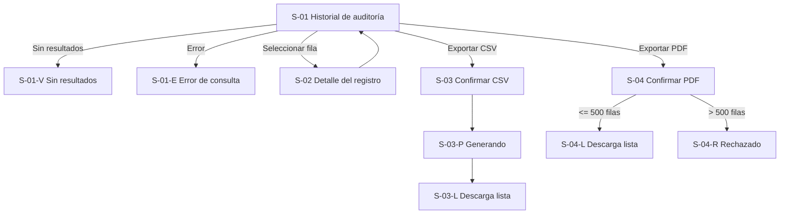

# WF-014 — Historial de auditoría de precios

## 0. Instrucciones para el agente

Genera un wireframe detallado, anotado y navegable del flujo descrito en este\
archivo.

Antes de diseñar:

1. Consulta ../../specs/spec_auditoria_precios.md.
2. Consulta ../../hu/hu_auditoria_precios.md.
3. Consulta ../DESIGN.md.
4. Usa este documento como definición específica de interacción.

Prioridad de fuentes:

1. La especificación define reglas de negocio y restricciones globales.
2. La historia de usuario define criterios de aceptación y escenarios.
3. Este archivo define composición, navegación y comportamiento del flujo.
4. DESIGN.md define la representación visual.

Si existe una contradicción, no inventes una resolución. Identifícala como\
pregunta abierta y señala qué pantalla queda afectada. En particular, ya se\
detectó una contradicción de roles entre la HU y la spec (ver Q-01); no la\
resuelvas por tu cuenta.

Reglas de producción:

- No agregues campos, filtros, permisos ni endpoints no documentados.
- No diseñes ninguna acción de edición, corrección o borrado sobre un\
  registro de auditoría; el almacén es estrictamente de solo lectura y\
  adición (Append-Only). No representes botones de "Editar" ni "Eliminar"\
  en ninguna pantalla de este flujo.
- No diseñes una pantalla de reversión ("rollback") de precios desde\
  auditoría; cualquier corrección se hace desde el flujo formal de gestión\
  de precios (WF-013), fuera de este flujo.
- No diseñes una pantalla para consultar registros archivados en frío\
  (Parquet/S3) más allá de los 24 meses en caliente; no está documentada.
- No agregues un filtro por `tipo_precio`; la especificación solo define\
  filtros por SKU, rango de fechas, usuario, canal de origen y lote.
- No elijas una librería de UI o estrategia CSS.
- No consumas APIs reales ni uses datos personales reales.
- Numera las anotaciones como A-01, A-02, A-03, etc.; estas anotaciones\
  pertenecen a la documentación del wireframe y no deben renderizarse dentro\
  de la interfaz del prototipo HTML.
- Los supuestos y las preguntas abiertas pertenecen a este documento de\
  especificación y no deben mostrarse como contenido de la interfaz del\
  producto.
- El comportamiento responsivo debe verificarse cambiando el tamaño real del\
  viewport; no agregues controles internos para simular escritorio, tablet o\
  móvil.
- Representa todos los estados obligatorios indicados en este documento.
- Los eventos de dominio (`pricing.price.changed`) son contexto técnico; no\
  deben exponerse al usuario.
- La captura de auditoría es asíncrona y ocurre fuera de este flujo; el\
  wireframe solo representa la consulta, el detalle y la exportación, no la\
  captura.

### Formato del entregable

Genera un prototipo navegable con HTML, CSS y JavaScript estáticos:

- El punto de entrada debe ser index.html.
- Debe funcionar sin proceso de compilación.
- Usa rutas y recursos relativos.
- No uses React ni dependencias del frontend productivo.
- No requieras conexión a servicios externos.
- Usa datos ficticios representativos (SKUs, usuarios, IPs, timestamps UTC).
- Simula únicamente las interacciones necesarias para validar el flujo.
- No muestres anotaciones A-xx, supuestos, preguntas abiertas ni otra\
  documentación interna dentro de la interfaz simulada.
- Implementa comportamiento responsivo real para escritorio, tablet y móvil\
  mediante HTML/CSS; no incluyas un selector o botón para cambiar de tipo de\
  pantalla.
- Mantén el estilo monocromático y de baja fidelidad de DESIGN.md.

### Entregables esperados

1. Pantallas y variantes indicadas en el inventario.
2. Navegación funcional entre los estados simulados.
3. Anotaciones numeradas documentadas en este archivo y asociadas a elementos\
   visibles del wireframe; no forman parte de la interfaz del prototipo.
4. Estados de carga, filtrado, vacío, error, detalle y exportación.
5. Casos de éxito de consulta, consulta sin resultados, exportación CSV,\
   exportación PDF válida y exportación PDF rechazada por exceso de filas.
6. Comportamiento responsivo verificable al redimensionar el viewport, sin\
   controles internos de dispositivo.
7. Supuestos y preguntas abiertas registrados en las secciones documentales\
   correspondientes, fuera de la interfaz del prototipo.

---

## 1. Metadatos

| Campo                | Valor                                     |
| --------------------- | -------------------------------------------- |
| ID del wireframe     | WF-014                                       |
| Nombre del flujo     | Historial de auditoría de precios            |
| Versión              | 0.1                                           |
| Estado               | Borrador                                     |
| Responsable          | Por asignar                                  |
| Fecha                | 2026-09-17                                    |
| Última actualización | 2026-09-17                                    |

## 2. Trazabilidad

| Fuente              | Identificador o sección                | Aporte al flujo                                                      |
| -------------------- | ----------------------------------------- | --------------------------------------------------------------------------- |
| Spec                | spec_auditoria_precios.md, secciones 1–6  | Contrato de auditoría, inmutabilidad, retención, exportación y seguridad     |
| Historia de usuario | hu_auditoria_precios.md, CA-01 a CA-09    | Resultados observables, escenarios de aceptación y matriz de interacción     |
| Diseño              | DESIGN.md                                 | Lenguaje visual monocromático de baja fidelidad                             |
| Backlog             | No proporcionado                          | No se asignan IDs de backlog                                                |

### Funcionalidades incluidas

- Consultar cronológicamente (orden descendente) el historial de cambios de\
  precio, paginado.
- Filtrar el historial por SKU, rango de fechas/horas, usuario (ID o email),\
  canal de origen (`BACKOFFICE`, `BULK_IMPORT`, `API`) y `batch_id`.
- Ver el detalle completo de un registro individual de auditoría.
- Exportar los registros consultados a CSV (hasta 100,000 filas).
- Exportar los registros consultados a PDF (hasta 500 filas, con rechazo\
  explícito si se excede el límite).
- Comunicar de forma clara cuándo no existen registros para los filtros\
  aplicados.

### Fuera de alcance

- Auditoría de inicios de sesión o autenticación de usuarios.
- Auditoría de cambios sobre imágenes, títulos o descripciones de catálogo.
- Edición, corrección o borrado de un registro de auditoría desde la\
  interfaz: el almacén es Append-Only.
- Reversión ("rollback") de precios desde la interfaz de auditoría.
- Consulta de registros archivados en almacenamiento en frío (Parquet/S3)\
  más allá de los 24 meses en línea.
- Captura o emisión del evento `pricing.price.changed`: ocurre en el flujo\
  de gestión de precios (WF-013), no en este.

## 3. Usuario objetivo

| Aspecto               | Definición                                                                                    |
| ----------------------- | ------------------------------------------------------------------------------------------------- |
| Persona               | Auditor interno o gestor comercial responsable del control de precios                          |
| Rol en el sistema     | `AUDITOR_COMERCIAL` o `ADMIN_SISTEMA` (ver contradicción de roles en Q-01)                      |
| Nivel técnico         | No especificado; diseñar para uso operativo básico/intermedio                                   |
| Contexto de uso       | Investigación de reclamos, control interno, auditorías periódicas y cumplimiento normativo       |
| Necesidad principal   | Reconstruir quién, cuándo y por qué cambió un precio, y exportar evidencia estructurada          |
| Permisos relevantes   | Solo consulta y exportación; nunca edición ni borrado                                            |
| Dispositivo principal | Escritorio como hipótesis por el volumen de datos y la exportación; consulta puntual también en tablet |

## 4. Objetivo del flujo

El auditor o gestor comercial debe poder consultar, filtrar y exportar el\
historial inmutable de cambios de precio, con trazabilidad completa de cada\
mutación, para resolver contingencias y sustentar controles internos o\
legales.

### Resultado exitoso

**Consulta:** el sistema entrega una lista paginada y ordenada\
descendentemente de los registros que cumplen los filtros, en menos de\
800 ms.

**Detalle:** el sistema muestra el contrato completo del registro\
seleccionado (usuario, IP, valores previo y nuevo, variación %, motivo,\
canal, lote y timestamp).

**Exportación CSV:** el sistema genera de forma asíncrona un archivo con\
todas las columnas del contrato y entrega un enlace de descarga.

**Exportación PDF:** el sistema genera un documento formateado con membrete\
de control interno cuando el conjunto filtrado no supera 500 registros; si\
lo supera, bloquea la exportación con un mensaje explícito.

### Indicador de finalización

- Consulta: la tabla se actualiza con los resultados o con el mensaje de\
  "sin resultados".
- Exportación CSV: el estado cambia de "Generando" a un enlace de descarga\
  disponible.
- Exportación PDF: el estado cambia de "Generando" a la descarga disponible,\
  o se muestra el bloqueo por exceso de registros.

## 5. Precondiciones y disparador

### Precondiciones

- El usuario tiene una sesión válida.
- El usuario posee el rol `AUDITOR_COMERCIAL` o `ADMIN_SISTEMA` (o\
  `ADMINISTRADOR`, según la fuente; ver Q-01).
- Existen registros de auditoría generados previamente por el flujo de\
  gestión de precios (WF-013); este flujo no los crea.

### Punto de entrada

- Ruta propuesta: `/auditoria-precios`.
- Entrada propuesta: opción "Historial de auditoría" dentro del módulo de\
  precios o de control interno.
- Contexto conservado al entrar: ninguno confirmado.

Las rutas y ubicaciones exactas son una propuesta de wireframe y deben\
confirmarse con la arquitectura de navegación (ver Q-02).

### Salidas del flujo

| Resultado                              | Destino o comportamiento                                |
| ----------------------------------------- | ------------------------------------------------------------ |
| Consulta con resultados                  | Permanece en S-01 con la tabla poblada                     |
| Consulta sin resultados                  | Permanece en S-01-V con el mensaje exacto de la spec       |
| Error temporal de consulta                | Permanece en S-01-E y permite reintentar                    |
| Apertura de detalle                       | Abre S-02 sobre la fila seleccionada                          |
| Exportación CSV confirmada                | Navega a S-03-P y luego a S-03-L                              |
| Exportación PDF confirmada (≤ 500 filas)  | Navega a S-04-P y luego a S-04-L                              |
| Exportación PDF rechazada (> 500 filas)   | Permanece en S-04-R sin generar el archivo                   |
| Cancelación de exportación antes de confirmar | Regresa a S-01 sin generar archivo                        |

## 6. Secuencia principal

### Flujo A — Consultar y filtrar el historial

1. El auditor o gestor abre el historial de auditoría de precios.
2. El sistema muestra la lista paginada más reciente, sin filtros aplicados.
3. El usuario aplica uno o varios filtros: SKU, rango de fechas, usuario,\
   canal de origen o `batch_id`.
4. El sistema consulta y actualiza la tabla en menos de 800 ms.
5. Si no hay registros para los filtros, el sistema muestra el mensaje de\
   ausencia de resultados.

### Flujo B — Ver el detalle de un registro

1. El usuario selecciona una fila de la tabla de resultados.
2. El sistema muestra el contrato completo del registro (incluyendo\
   `usuario_id`, `ip_origen`, `id_auditoria` y `product_id`).
3. El usuario cierra el detalle y regresa a la lista con los filtros\
   conservados.

### Flujo C — Exportar a CSV

1. El usuario aplica los filtros deseados en S-01.
2. Selecciona "Exportar a CSV".
3. El sistema confirma el alcance de la exportación (cantidad de registros).
4. El usuario confirma.
5. El sistema genera el archivo de forma asíncrona y muestra el estado\
   "Generando".
6. Al finalizar, ofrece el enlace de descarga.

### Flujo D — Exportar a PDF

1. El usuario aplica los filtros deseados en S-01.
2. Selecciona "Exportar a PDF".
3. El sistema evalúa la cantidad de registros filtrados.
4. Si son 500 o menos, solicita confirmación, genera el documento y ofrece\
   la descarga.
5. Si son más de 500, bloquea la exportación con el mensaje exacto de la\
   spec y sugiere acotar el filtro o usar CSV.

### Flujos alternativos

| ID     | Condición                                                     | Comportamiento esperado                                                                    | Retorno   |
| ------ | ------------------------------------------------------------------ | ---------------------------------------------------------------------------------------------- | ----------- |
| ALT-01 | Filtros sin coincidencias                                     | HTTP 200 con arreglo vacío; muestra "No se registraron cambios de precio bajo los criterios seleccionados" | S-01-V |
| ALT-02 | Error temporal al consultar el historial                       | Mensaje de error recuperable, sin afirmar ausencia de datos                                     | S-01-E     |
| ALT-03 | Exportación PDF con más de 500 registros filtrados              | Bloqueo con el mensaje "La exportación en PDF admite un máximo de 500 registros. Por favor acote el rango de búsqueda o utilice la exportación en CSV" | S-04-R |
| ALT-04 | Exportación CSV de un volumen muy alto (cercano a 100,000 filas) | Procesamiento asíncrono más prolongado; el usuario puede abandonar la pantalla                  | S-03-P     |
| ALT-05 | Rango de fechas inválido (`fecha_desde` posterior a `fecha_hasta`) | Rechazo del filtro con mensaje de corrección, sin ejecutar la consulta                          | S-01       |
| ALT-06 | Sesión expirada                                                  | Solicitar autenticación y conservar los filtros aplicados cuando sea posible                    | Estado global |
| ALT-07 | Usuario sin el rol requerido                                     | Bloquear el acceso a la consulta y exportación; ofrecer retorno seguro                          | Estado global |
| ALT-08 | Intento de `DELETE`, `PUT` o `PATCH` sobre un registro (vía API) | Rechazo inmediato con HTTP 405/403; no hay superficie de UI que lo permita                       | N/A (solo API) |

## 7. Inventario de pantallas y variantes

| ID     | Pantalla o variante                       | Propósito                                                          | Ruta o presentación                | Obligatoria |
| ------ | --------------------------------------------- | ------------------------------------------------------------------------ | -------------------------------------- | ------------- |
| S-01   | Historial de auditoría de precios            | Listar, filtrar y ordenar cronológicamente los registros de auditoría     | Ruta propuesta /auditoria-precios       | Sí            |
| S-01-V | Sin resultados                                | Comunicar que no hay registros para los filtros aplicados                 | Variante de S-01                        | Sí            |
| S-01-E | Error de consulta                             | Comunicar un fallo recuperable en la consulta                             | Variante de S-01                        | Sí            |
| S-02   | Detalle de un registro de auditoría          | Mostrar el contrato completo del registro seleccionado                    | Panel o modal sobre S-01                | Sí            |
| S-03   | Exportar a CSV (confirmar)                   | Confirmar el alcance antes de generar el archivo                          | Diálogo modal                           | Sí            |
| S-03-P | Generando exportación CSV                    | Comunicar que el archivo se genera en segundo plano                       | Variante de S-03                        | Sí            |
| S-03-L | Exportación CSV lista                        | Ofrecer el enlace de descarga del archivo generado                        | Variante de S-03                        | Sí            |
| S-04   | Exportar a PDF (confirmar)                   | Confirmar el alcance antes de generar el documento                        | Diálogo modal                           | Sí            |
| S-04-R | Exportación PDF rechazada                    | Comunicar el límite de 500 registros y sugerir alternativas               | Variante de S-04                        | Sí            |
| S-04-L | Exportación PDF lista                        | Ofrecer la descarga del documento generado                                | Variante de S-04                        | Sí            |

## 8. Mapa de navegación

## 9. Especificación por pantalla

### S-01 — Historial de auditoría de precios

#### Propósito

Permitir consultar cronológicamente, filtrar y exportar el historial\
inmutable de cambios de precio.

#### Jerarquía de contenido

1. Título "Historial de auditoría de precios".
2. Panel de filtros.
3. Tabla de resultados, ordenada del más reciente al más antiguo.
4. Acciones de exportación.

#### Regiones y componentes

| Región     | Componente neutral      | Contenido                                                              | Comportamiento                                          |
| ------------ | --------------------------- | ---------------------------------------------------------------------------- | -------------------------------------------------------- |
| Encabezado | Título                       | "Historial de auditoría de precios"                                           | Encabezado principal único                                |
| Filtros    | Campos de filtro             | SKU, fecha desde, fecha hasta, usuario (ID o email), canal de origen, batch_id | Todos opcionales; se pueden combinar                      |
| Resultados | Tabla                        | Timestamp, SKU, tipo de precio, precio anterior → nuevo, variación %, usuario, canal, motivo, batch_id | Orden fijo descendente por timestamp; no reordenable por el usuario |
| Paginación | Control de páginas           | Página actual, total de registros                                             | Se conserva al aplicar o limpiar filtros                  |
| Exportación | Botones                     | Exportar a CSV; Exportar a PDF                                                | Aplican sobre el resultado filtrado actual                |

#### Acciones

| Prioridad  | Acción            | Etiqueta visible   | Disponibilidad                                | Resultado             |
| ---------- | -------------------- | ---------------------- | ---------------------------------------------------- | ------------------------ |
| Primaria   | Aplicar filtros       | Buscar                  | Con rol `AUDITOR_COMERCIAL`/`ADMIN_SISTEMA`            | Actualiza la tabla        |
| Secundaria | Limpiar filtros       | Limpiar filtros         | Cuando hay algún filtro activo                        | Restaura la vista inicial |
| Secundaria | Ver detalle           | (clic en la fila)       | Siempre que existan resultados                        | Abre S-02                 |
| Secundaria | Exportar a CSV        | Exportar a CSV          | Con rol requerido y al menos 1 registro filtrado       | Abre S-03                 |
| Secundaria | Exportar a PDF        | Exportar a PDF          | Con rol requerido y al menos 1 registro filtrado       | Abre S-04                 |

#### Formulario (filtros)

| Campo          | Tipo               | Obligatorio | Valor inicial | Validación                                     | Mensaje de error                                  |
| ---------------- | --------------------- | ------------- | ---------------- | ---------------------------------------------------- | -------------------------------------------------------- |
| SKU              | Texto                  | No            | Vacío             | Ninguna adicional a la búsqueda exacta o parcial (ver Q-03) | —                                                    |
| Fecha desde      | Selector de fecha/hora | No            | Vacío             | Debe ser anterior o igual a "Fecha hasta"              | "La fecha inicial no puede ser posterior a la fecha final" |
| Fecha hasta      | Selector de fecha/hora | No            | Vacío             | Debe ser posterior o igual a "Fecha desde"              | "La fecha final no puede ser anterior a la fecha inicial"  |
| Usuario          | Texto                  | No            | Vacío             | Acepta ID o email (ver Q-04 sobre coincidencia exacta o parcial) | —                                          |
| Canal de origen  | Selector                | No            | "Todos"           | Valores: Todos, `BACKOFFICE`, `BULK_IMPORT`, `API`      | —                                                          |
| Batch ID         | Texto                  | No            | Vacío             | Coincidencia exacta                                     | —                                                          |

- Momento de validación: al aplicar filtros.
- Conservación de datos tras error: los filtros ingresados permanecen\
  visibles.
- Los filtros se combinan con lógica "Y" (todos los criterios aplicados\
  deben cumplirse).

#### Datos mostrados

| Dato                | Fuente                    | Formato                        | Prioridad | Ausencia            |
| ---------------------- | ------------------------------ | ------------------------------------ | ----------- | ---------------------- |
| Timestamp               | Registro de auditoría (UTC)      | Fecha y hora local del visor          | Alta        | No omitir              |
| SKU                     | Registro de auditoría            | Texto                                 | Alta        | No omitir              |
| Tipo de precio          | Registro de auditoría            | "Regular" u "Oferta"                  | Alta        | No omitir              |
| Precio anterior → nuevo | Registro de auditoría            | Moneda + número                       | Alta        | No omitir              |
| Variación %             | Registro de auditoría            | Porcentaje con signo                  | Alta        | No omitir              |
| Usuario                 | Registro de auditoría            | Email (con ID disponible en detalle)  | Alta        | No omitir              |
| Canal de origen         | Registro de auditoría            | Backoffice / Carga masiva / API       | Media       | No omitir              |
| Motivo del cambio       | Registro de auditoría            | Texto (truncado en tabla)             | Media       | No omitir              |
| Batch ID                | Registro de auditoría            | Identificador o "—" si es individual  | Media       | Mostrar "—" si es null |

#### Navegación y foco

- Foco inicial: campo de filtro SKU.
- Orden de foco: filtros en el orden mostrado, Buscar, Limpiar filtros,\
  tabla, exportaciones.
- Los cambios de página conservan el foco en el control de paginación.

#### Anotaciones

| ID   | Elemento           | Anotación                                                                       |
| ---- | ---------------------- | -------------------------------------------------------------------------------------- |
| A-01 | Orden de la tabla       | Siempre descendente por timestamp; no es un criterio configurable (Requisito 2/CA-05)    |
| A-02 | Batch ID en tabla       | Muestra "—" cuando el cambio fue individual (`batch_id: null`)                          |
| A-03 | Variación %             | Se muestra con signo (+/-) según incremento o disminución                               |
| A-04 | Exportar a CSV/PDF      | Operan sobre el conjunto ya filtrado, no sobre toda la bitácora                          |
| A-05 | Filtros combinables     | Todos los filtros son opcionales y se combinan entre sí (Requisito 2/CA-05)              |

### S-01-V — Sin resultados

#### Contenido y comportamiento

- Mostrar el mensaje exacto: "No se registraron cambios de precio bajo los\
  criterios seleccionados".
- Mantener visibles los filtros aplicados para que el usuario pueda\
  ajustarlos.
- No mostrar acciones de exportación mientras no haya registros.

#### Anotaciones

| ID   | Elemento | Anotación                                                        |
| ---- | ---------- | -------------------------------------------------------------------- |
| A-06 | Mensaje     | Cita textual de CA-06; no debe reemplazarse por un mensaje genérico   |

### S-01-E — Error de consulta

#### Contenido y comportamiento

- Mostrar un aviso de error recuperable, sin exponer detalles internos del\
  servicio o de la base de datos.
- Ofrecer Reintentar sin perder los filtros aplicados.

#### Anotaciones

| ID   | Elemento | Anotación                                          |
| ---- | ---------- | --------------------------------------------------- |
| A-07 | Aviso       | No debe confundirse con "sin resultados" (S-01-V)    |

### S-02 — Detalle de un registro de auditoría

#### Propósito

Mostrar el contrato completo de auditoría de un registro individual,\
incluyendo los campos que no caben en la vista de tabla.

#### Jerarquía de contenido

1. Identificación: SKU, producto, tipo de precio y timestamp.
2. Cambio de valor: precio anterior, precio nuevo, variación %.
3. Trazabilidad: usuario (ID y email), IP de origen, canal, batch_id,\
   motivo del cambio.
4. Identificador del registro (`id_auditoria`).

#### Regiones y componentes

| Región        | Componente     | Contenido                                                                 | Comportamiento                    |
| --------------- | ----------------- | -------------------------------------------------------------------------------- | -------------------------------------- |
| Encabezado    | Título del panel   | "Detalle del registro de auditoría"                                                | Asociado semánticamente al panel/modal   |
| Cambio        | Comparación        | Precio anterior, precio nuevo, variación %                                        | Solo lectura                             |
| Trazabilidad  | Lista de datos     | `usuario_id`, `usuario_email`, `ip_origen`, `canal_origen`, `batch_id`, `motivo_cambio` | Solo lectura                        |
| Identificador | Texto secundario   | `id_auditoria`, `product_id`, `sku`                                               | Solo lectura                             |
| Acciones      | Botón              | Cerrar                                                                             | Regresa a S-01 con los filtros intactos  |

#### Datos mostrados

| Dato               | Fuente                | Formato                | Prioridad | Ausencia          |
| --------------------- | -------------------------- | ---------------------------- | ----------- | -------------------- |
| id_auditoria           | Registro de auditoría        | Identificador                  | Media       | No omitir            |
| product_id             | Registro de auditoría        | Identificador                  | Media       | No omitir            |
| usuario_id              | Registro de auditoría        | Identificador                  | Alta        | No omitir            |
| usuario_email           | Registro de auditoría        | Correo                          | Alta        | No omitir            |
| ip_origen               | Registro de auditoría        | Dirección IP                   | Alta        | No omitir            |
| canal_origen            | Registro de auditoría        | Backoffice / Carga masiva / API | Alta       | No omitir            |
| batch_id                | Registro de auditoría        | Identificador o "No aplica"    | Alta        | Mostrar "No aplica"  |
| motivo_cambio           | Registro de auditoría        | Texto completo, sin truncar    | Alta        | No omitir            |

#### Navegación y foco

- Si se presenta como panel/modal: el foco inicial se sitúa en el título;\
  el foco queda contenido y Escape/Cerrar lo regresa a la fila activada en\
  S-01.

#### Anotaciones

| ID   | Elemento         | Anotación                                                              |
| ---- | -------------------- | ------------------------------------------------------------------------------ |
| A-08 | Solo lectura          | Ningún campo de este panel es editable; refleja el Requisito 3 (Append-Only)     |
| A-09 | IP de origen          | Debe reflejar la IP evaluada por el backend (`X-Forwarded-For`/`X-Real-IP`), no la IP del navegador del visor |
| A-10 | Batch ID ausente      | Se muestra "No aplica" cuando el cambio fue individual                          |

### S-03 — Exportar a CSV (confirmar)

#### Propósito

Confirmar el alcance de la exportación antes de generarla de forma\
asíncrona.

#### Regiones y componentes

| Región     | Componente   | Contenido                                                | Comportamiento                |
| ------------ | --------------- | --------------------------------------------------------------- | ----------------------------------- |
| Encabezado | Título modal    | "Exportar a CSV"                                                   | Asociado semánticamente al diálogo    |
| Resumen    | Texto            | Cantidad de registros que se exportarán, según filtros actuales    | Coincide con el total mostrado en S-01 |
| Límite     | Nota informativa | "El formato CSV admite hasta 100,000 registros"                    | Visible siempre                       |
| Acciones   | Botones          | Confirmar exportación; Cancelar                                     | Bloqueo tras el primer envío          |

#### Acciones

| Prioridad  | Acción             | Etiqueta               | Disponibilidad          | Resultado    |
| ---------- | ---------------------- | --------------------------- | ----------------------------- | --------------- |
| Primaria   | Iniciar generación      | Confirmar exportación        | Al menos 1 registro filtrado   | Navega a S-03-P  |
| Secundaria | Cancelar                | Cancelar                     | Siempre                        | Regresa a S-01   |

#### Anotaciones

| ID   | Elemento | Anotación                                                                |
| ---- | ---------- | -------------------------------------------------------------------------- |
| A-11 | Resumen     | Refleja el alcance real que se exportará (registros filtrados, no todos)    |
| A-12 | Límite      | Cita el límite de 100,000 filas del Requisito 2/CA-07                       |

### S-03-P — Generando exportación CSV

#### Contenido y comportamiento

- Mostrar el estado "Generando archivo CSV" de forma indeterminada.
- Mostrar el mensaje "Puede salir de esta pantalla; le notificaremos cuando\
  esté listo" para exportaciones de gran volumen.
- Permitir abandonar la pantalla sin cancelar la generación.

#### Anotaciones

| ID   | Elemento           | Anotación                                                     |
| ---- | ----------------------- | -------------------------------------------------------------------- |
| A-13 | Estado no bloqueante     | Salir de la pantalla no cancela la generación del archivo             |
| A-14 | Progreso                 | No representar un porcentaje ficticio de avance                       |

### S-03-L — Exportación CSV lista

#### Contenido y comportamiento

- Mostrar confirmación "El archivo CSV está listo" y el enlace de descarga.
- Mostrar la cantidad de registros exportados y los filtros aplicados como\
  referencia.
- Ofrecer volver al historial.

#### Anotaciones

| ID   | Elemento         | Anotación                                                |
| ---- | -------------------- | ------------------------------------------------------------- |
| A-15 | Enlace de descarga     | Debe permanecer accesible mientras el archivo esté disponible (ver Q-05 sobre vencimiento) |

### S-04 — Exportar a PDF (confirmar)

#### Propósito

Confirmar el alcance de la exportación en PDF, sujeta al límite de 500\
registros.

#### Regiones y componentes

| Región     | Componente   | Contenido                                                     | Comportamiento                              |
| ------------ | --------------- | ------------------------------------------------------------------- | ------------------------------------------------ |
| Encabezado | Título modal    | "Exportar a PDF"                                                       | Asociado semánticamente al diálogo                  |
| Resumen    | Texto            | Cantidad de registros que se exportarán, según filtros actuales        | Si excede 500, no ofrece Confirmar; ver S-04-R      |
| Límite     | Nota informativa | "El formato PDF admite hasta 500 registros para reportes ejecutivos"   | Visible siempre                                      |
| Acciones   | Botones          | Confirmar exportación; Cancelar                                        | Confirmar deshabilitado si el total excede 500       |

#### Acciones

| Prioridad  | Acción             | Etiqueta               | Disponibilidad                 | Resultado    |
| ---------- | ---------------------- | --------------------------- | ------------------------------------ | --------------- |
| Primaria   | Iniciar generación      | Confirmar exportación        | Registros filtrados ≤ 500 y ≥ 1        | Navega a S-04-L o S-04-P |
| Secundaria | Cancelar                | Cancelar                     | Siempre                               | Regresa a S-01   |

#### Anotaciones

| ID   | Elemento | Anotación                                                                       |
| ---- | ---------- | -------------------------------------------------------------------------------------- |
| A-16 | Límite      | Cita el límite de 500 filas del Requisito 2/CA-07                                        |
| A-17 | Confirmar   | Se deshabilita automáticamente cuando el resumen supera 500 registros; ver S-04-R         |

### S-04-R — Exportación PDF rechazada

#### Contenido y comportamiento

- Mostrar el mensaje exacto: "La exportación en PDF admite un máximo de\
  500 registros. Por favor acote el rango de búsqueda o utilice la\
  exportación en CSV".
- No generar ningún archivo.
- Ofrecer dos salidas: ajustar filtros (regresa a S-01) o exportar a CSV en\
  su lugar (abre S-03).

#### Anotaciones

| ID   | Elemento | Anotación                                                    |
| ---- | ---------- | ------------------------------------------------------------------ |
| A-18 | Mensaje     | Cita textual del Escenario 5 de la HU y del Requisito 2 de la spec   |
| A-19 | Alternativa | Ofrece exportar a CSV como salida directa desde el rechazo            |

### S-04-L — Exportación PDF lista

#### Contenido y comportamiento

- Mostrar confirmación "El documento PDF está listo" y el enlace de\
  descarga.
- Mostrar la cantidad de registros incluidos y los filtros aplicados como\
  referencia.
- Ofrecer volver al historial.

#### Anotaciones

| ID   | Elemento     | Anotación                                                             |
| ---- | ---------------- | ------------------------------------------------------------------------------ |
| A-20 | Documento generado | Incluye membrete de control interno y marcas temporales auditadas, según CA-07  |

## 10. Estados de interfaz

| Estado                          | Aplica | Representación                                | Acciones                            | Recuperación                     |
| ---------------------------------- | -------- | --------------------------------------------------- | ---------------------------------------- | --------------------------------------- |
| Inicial (sin filtros)              | Sí       | S-01 con la página más reciente                       | Filtrar, exportar                          | N/A                                       |
| Cargando resultados                | Sí       | Estado indeterminado sobre la tabla                    | Ninguna                                    | Esperar                                   |
| Con datos                          | Sí       | S-01 con la tabla poblada                              | Filtrar, ver detalle, exportar             | N/A                                       |
| Sin resultados                     | Sí       | S-01-V con el mensaje exacto                            | Ajustar filtros                            | Modificar criterios                       |
| Error de consulta                  | Sí       | S-01-E                                                  | Reintentar                                 | Repetir consulta                          |
| Viendo detalle                     | Sí       | S-02 con el contrato completo                           | Cerrar                                     | N/A                                       |
| Confirmando exportación CSV        | Sí       | S-03 con el resumen del alcance                          | Confirmar, cancelar                        | N/A                                       |
| Generando CSV                      | Sí       | S-03-P sin porcentaje ficticio                          | Abandonar sin cancelar                     | Notificación posterior                    |
| CSV listo                          | Sí       | S-03-L con enlace de descarga                            | Descargar, volver                          | N/A                                       |
| Confirmando exportación PDF        | Sí       | S-04 con el resumen del alcance                          | Confirmar (si ≤ 500), cancelar             | N/A                                       |
| Generando PDF                      | Sí       | S-04-P (si se requiere un paso intermedio, ver SUP-05)   | Abandonar sin cancelar                     | Notificación posterior                    |
| PDF listo                          | Sí       | S-04-L con enlace de descarga                            | Descargar, volver                          | N/A                                       |
| PDF rechazado por exceso de filas  | Sí       | S-04-R con el mensaje exacto                             | Ajustar filtros, exportar a CSV            | Acotar el rango                            |
| Sin conexión                       | Sí       | Aviso persistente                                       | Reintentar                                 | Conservar filtros aplicados               |
| Sin permisos                       | Sí       | Explicación segura, sin exponer datos                   | Volver                                     | Solicitar acceso fuera del flujo           |
| Sesión expirada                    | Sí       | Aviso/autenticación                                     | Iniciar sesión                             | Recuperar filtros cuando sea posible        |

### Reglas para datos remotos

- La consulta del historial no admite acciones optimistas: siempre refleja\
  lo que el backend confirma, dado que el origen es un almacén inmutable.
- La paginación y los filtros pueden reintentarse sin efectos secundarios\
  (operación de solo lectura).
- Un error de consulta no debe interpretarse ni mostrarse como "sin\
  resultados".
- Las exportaciones (CSV y PDF) no deben iniciarse dos veces por una doble\
  activación accidental del botón Confirmar.
- Debe preservarse el estado de los filtros al recargar, cuando la ruta lo\
  permita.

## 11. Comportamiento responsivo

DESIGN.md define 12 columnas para escritorio y 4 para móvil, pero no define\
tablet ni breakpoints exactos. El prototipo debe responder correctamente a\
los tres tamaños al cambiar el viewport real, sin controles internos para\
simular dispositivos.

| Aspecto            | Escritorio                                     | Tablet                             | Móvil                                  |
| --------------------- | ---------------------------------------------------- | --------------------------------------- | -------------------------------------------- |
| Navegación           | Navegación completa                                    | Navegación condensada                     | Patrón global móvil                            |
| Filtros              | Fila de campos alineados                                | Dos columnas de filtros                   | Filtros apilados, colapsables                  |
| Tabla de resultados  | Todas las columnas visibles                             | Columnas prioritarias; resto en detalle    | Tarjetas por registro en lugar de tabla         |
| Detalle (S-02)       | Panel lateral o modal ancho                             | Modal de ancho medio                       | Pantalla casi completa                          |
| Acciones             | Agrupadas por prioridad junto a la tabla                | Ajuste de línea permitido                  | Ancho disponible y 44 px mínimo                 |
| Modal de exportación | Ancho contenido                                         | Margen lateral                             | Diálogo casi completo sin desbordar             |
| Contenido omitido    | Ninguno                                                  | Motivo se trunca; visible en detalle       | Solo timestamp, SKU y variación % en la tarjeta compacta; resto en detalle |

### Condiciones críticas

- Verificar 320 px de ancho sin desplazamiento horizontal de la página.
- La tabla debe permitir scroll horizontal interno en anchos reducidos en\
  vez de desbordar la página.
- Los emails y direcciones IP largas deben truncarse visualmente sin perder\
  acceso al valor completo.
- El resultado de exportación debe seguir siendo comprensible con zoom de\
  200%.

## 12. Accesibilidad

- Objetivo: WCAG 2.2 AA.
- Cada pantalla tiene un encabezado principal único.
- Los filtros tienen etiquetas visibles y nombres accesibles coherentes.
- La tabla de resultados usa marcado semántico de tabla con encabezados de\
  columna asociados.
- Los estados "Sin resultados" y "Error de consulta" se anuncian de forma\
  no intrusiva; los errores críticos se anuncian inmediatamente.
- El panel/modal de detalle contiene el foco y lo devuelve a la fila\
  activadora al cerrarse.
- El orden de teclado coincide con la jerarquía visual (filtros, tabla,\
  exportaciones).
- Los botones móviles respetan el mínimo de 44 por 44 px definido en\
  DESIGN.md.
- Los mensajes de límite (500 registros en PDF) identifican el problema y\
  la acción de corrección disponible.
- Las anotaciones, supuestos y preguntas del documento no deben renderizarse\
  como parte de la interfaz del producto.

## 13. Tono visual y contenido

Aplicar DESIGN.md como fuente de representación visual.

### Consideraciones específicas

- Densidad: alta; es una pantalla de control e investigación donde el\
  auditor necesita comparar muchos registros.
- Sensación buscada: confianza, precisión y trazabilidad; nada debe\
  sugerir que un registro puede modificarse.
- Elemento dominante en S-01: la tabla de resultados y los filtros.
- Elemento dominante en S-02: la comparación de precio anterior/nuevo y la\
  trazabilidad del usuario e IP.
- Elemento dominante en S-03/S-04: el alcance exacto de la exportación.
- Los detalles de arquitectura de eventos, colas o almacenamiento en frío\
  permanecen fuera de la interfaz de usuario.

### Microcopy crítica

| Contexto                        | Texto propuesto                                                                                          | Observación                                |
| ------------------------------------ | ---------------------------------------------------------------------------------------------------------------- | ------------------------------------------------ |
| Sin resultados                       | "No se registraron cambios de precio bajo los criterios seleccionados."                                            | Cita textual de CA-06                              |
| Rechazo de exportación PDF           | "La exportación en PDF admite un máximo de 500 registros. Por favor acote el rango de búsqueda o utilice la exportación en CSV." | Cita textual del Escenario 5 de la HU |
| Confirmación de exportación CSV      | "El archivo CSV está listo para descargar."                                                                       | Confirmación verificable                          |
| Confirmación de exportación PDF      | "El documento PDF está listo para descargar."                                                                     | Confirmación verificable                          |
| Estado de generación                 | "Puede salir de esta pantalla; le notificaremos cuando esté listo."                                                | Evita percepción de bloqueo                        |
| Registro sin lote                    | "No aplica"                                                                                                         | Se usa cuando `batch_id` es `null`                 |
| Solo lectura                         | (sin acción de edición visible)                                                                                    | Refuerza la inmutabilidad sin necesidad de aviso adicional |

## 14. Restricciones técnicas relevantes

- Aplicación objetivo: React, TypeScript y Vite.
- Navegación productiva: React Router; las rutas exactas están pendientes.
- Estado remoto: TanStack Query para la consulta paginada, el detalle y el\
  ciclo de vida de las exportaciones (creación/consulta, reintentos).
- Estado local: Zustand solo si los filtros deben compartirse entre rutas;\
  no es una obligación del wireframe.
- Formularios/validación: React Hook Form y Zod para el panel de filtros.
- Contratos HTTP: OpenAPI/Swagger.
- Eventos: AsyncAPI para `pricing.price.changed` (consumido, no emitido, por\
  este flujo).
- La librería de componentes y estrategia CSS están pendientes.
- El prototipo de wireframe es HTML/CSS/JS estático y no prescribe la\
  implementación del frontend.

### Dependencias o contratos

| Tipo    | Operación o referencia                                       | Impacto visible                                         |
| ------- | ------------------------------------------------------------------ | -------------------------------------------------------------- |
| HTTP    | Consultar historial paginado y filtrado; método/ruta pendientes      | Actualiza S-01/S-01-V/S-01-E                                    |
| HTTP    | Obtener detalle de un registro; método/ruta pendientes                | Actualiza S-02                                                   |
| HTTP    | Solicitar exportación CSV; método/ruta pendientes                     | Actualiza S-03-P/S-03-L                                          |
| HTTP    | Solicitar exportación PDF; método/ruta pendientes                     | Actualiza S-04-P/S-04-L o dispara S-04-R                         |
| HTTP    | `DELETE` / `PUT` / `PATCH` sobre `/api/v1/auditoria-precios/{id}`     | Rechazado con HTTP 405/403; sin superficie de UI (Requisito 3)   |
| Evento  | `pricing.price.changed` (consumido por el servicio de auditoría)      | Origina los registros que este flujo consulta; no se muestra al usuario |
| Permiso | Consultar y exportar auditoría de precios; código pendiente           | Habilita todo el flujo S-01 en adelante                          |

## 15. Privacidad, seguridad y acciones sensibles

- Datos sensibles visibles: dirección IP de origen y correo electrónico del\
  usuario que realizó el cambio; visibles solo para roles autorizados.
- Los endpoints requieren token JWT con rol `AUDITOR_COMERCIAL` o\
  `ADMIN_SISTEMA`/`ADMINISTRADOR` (ver Q-01); una petición sin autorización\
  se rechaza y la interfaz lo refleja como estado "Sin permisos".
- El almacén de auditoría es estrictamente Append-Only: la interfaz nunca\
  ofrece edición, corrección o borrado de un registro, ni una acción que lo\
  sugiera.
- Cualquier intento de `DELETE`, `PUT` o `PATCH` se rechaza en el backend\
  con HTTP 405/403; esto no tiene representación visual porque no existe un\
  control que lo permita.
- No exponer detalles internos de servicios, colas, particiones o el\
  proceso de archivado en frío en mensajes de error.
- Confirmar explícitamente antes de generar una exportación (CSV o PDF).
- El documento no exige reautenticación para consultar o exportar.
- Registrar quién exportó y cuándo queda fuera del alcance visual definido\
  por las fuentes (ver Q-06).

## 16. Criterios de aceptación del wireframe

- [ ] Representa la consulta paginada y ordenada descendentemente del\
      historial de auditoría.
- [ ] Representa el filtrado por SKU, rango de fechas, usuario, canal de\
      origen y batch_id.
- [ ] Muestra el mensaje exacto cuando no hay resultados para los filtros.
- [ ] Representa el detalle completo de un registro, incluyendo IP,\
      usuario, canal, batch_id y motivo.
- [ ] No incluye ninguna acción de edición o borrado sobre un registro.
- [ ] Representa la exportación a CSV con generación asíncrona y enlace de\
      descarga.
- [ ] Representa la exportación a PDF con el límite de 500 registros y su\
      rechazo explícito al superarlo.
- [ ] No agrega un filtro por tipo de precio ni otros campos no\
      documentados.
- [ ] Incluye estados de carga, error de consulta, permisos y sesión.
- [ ] El flujo funciona con teclado y no depende del color.
- [ ] El prototipo funciona con HTML/CSS/JS estáticos.
- [ ] No selecciona una librería de UI no aprobada.
- [ ] Es consistente con DESIGN.md.

### Cobertura de la historia de usuario

| Criterio | Cobertura                                                                    |
| ---------- | ----------------------------------------------------------------------------- |
| CA-01    | Fuera de la superficie visual; se documenta como contexto técnico en la sección 0 |
| CA-02    | S-01 (columnas de tabla) y S-02 (contrato completo)                            |
| CA-03    | Fuera de la superficie visual; solo se auditan cambios exitosos generados en WF-013 |
| CA-04    | Ausencia deliberada de acciones de edición/borrado en S-01 y S-02; A-08         |
| CA-05    | S-01, panel de filtros                                                          |
| CA-06    | S-01 (paginación) y S-01-V (mensaje exacto de ausencia de resultados)           |
| CA-07    | S-03/S-03-P/S-03-L (CSV) y S-04/S-04-R/S-04-L (PDF)                             |
| CA-08    | Estado global "Sin permisos"/"Sesión expirada" en todas las pantallas           |
| CA-09    | Fuera de la superficie visual; ver "Fuera de alcance" sobre almacenamiento en frío |

## 17. Supuestos

| ID     | Supuesto                                                                          | Motivo                                                     | Impacto si es incorrecto                     | Validar |
| ------ | -------------------------------------------------------------------------------------- | ------------------------------------------------------------------- | -------------------------------------------------- | ------- |
| SUP-01 | La ruta del historial es `/auditoria-precios`                                            | Coincide con el patrón del endpoint `/api/v1/auditoria-precios/{id}` mencionado en las fuentes | Cambiar ruta y punto de entrada                      | Sí      |
| SUP-02 | El detalle de un registro (S-02) se presenta como panel o modal sobre la misma ruta       | No se especifica una ruta propia para el detalle                     | Cambiar a una ruta independiente por registro         | Sí      |
| SUP-03 | Existe un paso "Generando" (S-04-P) también para PDF, aunque la spec no indica que sea asíncrono | Se asume consistencia de patrón con la exportación CSV              | Podría ser una generación inmediata sin estado intermedio | Sí   |
| SUP-04 | El filtro por SKU y por usuario admite coincidencia exacta; no se confirma si admite búsqueda parcial | La spec no especifica el comportamiento de coincidencia               | Cambiar el copy del campo y su comportamiento          | Sí      |
| SUP-05 | El enlace de descarga de las exportaciones permanece disponible por un tiempo no especificado | No se documenta vencimiento del archivo generado                     | Agregar mensaje de expiración si el backend lo define  | Sí      |
| SUP-06 | Escritorio es el dispositivo principal por el volumen de datos y la exportación; la consulta puntual debe funcionar también en tablet | Uso típico de herramientas de control e investigación                | Cambiar prioridad responsive                            | Sí      |

## 18. Preguntas y decisiones pendientes

| ID   | Pregunta o decisión                                                                                                   | Responsable          | Bloquea wireframe                        | Estado    |
| ---- | ---------------------------------------------------------------------------------------------------------------------------- | ----------------------- | ------------------------------------------- | ---------- |
| Q-01 | La HU exige el rol `AUDITOR_COMERCIAL` o `ADMIN_SISTEMA` (CA-08), mientras que la spec exige `ADMINISTRADOR` o `AUDITOR_COMERCIAL` (NFR de seguridad). ¿Cuál es el nombre de rol correcto? | Backend/Seguridad     | No para estructura; sí para el texto exacto del estado "Sin permisos" | Abierta |
| Q-02 | ¿Cuál es la ruta exacta y la ubicación en navegación del historial de auditoría?                                                | Frontend               | No para estructura                            | Abierta    |
| Q-03 | ¿El filtro por SKU admite búsqueda parcial (contiene) o solo coincidencia exacta?                                              | Backend/Producto      | No                                              | Abierta    |
| Q-04 | ¿El filtro por usuario acepta simultáneamente ID y email, o son dos campos distintos?                                          | Backend/Producto      | No                                              | Abierta    |
| Q-05 | ¿El enlace de descarga de una exportación (CSV o PDF) tiene vencimiento o puede regenerarse?                                   | Backend                | No                                              | Abierta    |
| Q-06 | ¿Se debe registrar y mostrar quién exportó un reporte y cuándo, como parte del propio historial de auditoría?                  | Producto/Seguridad     | No                                              | Abierta    |
| Q-07 | ¿La generación del PDF (≤ 500 registros) es síncrona o requiere un estado intermedio "Generando" como el CSV?                  | Backend                | No; afecta solo la existencia de S-04-P        | Abierta    |
| Q-08 | ¿Qué canal notifica al usuario que una exportación asíncrona (CSV) está lista?                                                 | Producto/Frontend      | No                                              | Abierta    |
| D-01 | Selección de librería UI y estrategia CSS                                                                                      | Frontend                | No para wireframe; sí para implementación       | Pendiente  |

## 19. Registro de revisiones

| Versión | Fecha      | Autor     | Cambio                                                                                  | Aprobado por |
| ------- | ---------- | --------- | ---------------------------------------------------------------------------------------- | ------------ |
| 0.1     | 2026-09-17 | Asistente | Borrador inicial basado en spec_auditoria_precios.md, hu_auditoria_precios.md, DESIGN.md y WF-013 como guía de formato | Pendiente |

---

## Lista de control antes de generar el HTML

- [x] Las fuentes funcionales están identificadas.
- [x] El alcance y lo que queda fuera están claros.
- [x] Las pantallas y variantes están inventariadas.
- [x] Las reglas críticas están trazadas a la spec/HU.
- [x] Los supuestos y preguntas están registrados.
- [x] El formato HTML está definido.
- [ ] Confirmar ID WF-014 contra INDEX.md (no se proporcionó en esta tarea).
- [ ] Resolver Q-01 (contradicción de roles) antes de finalizar el texto de "Sin permisos".
- [ ] Resolver Q-02 antes de confirmar la ruta definitiva.
- [ ] Resolver Q-07 antes de decidir si S-04-P es necesaria.
