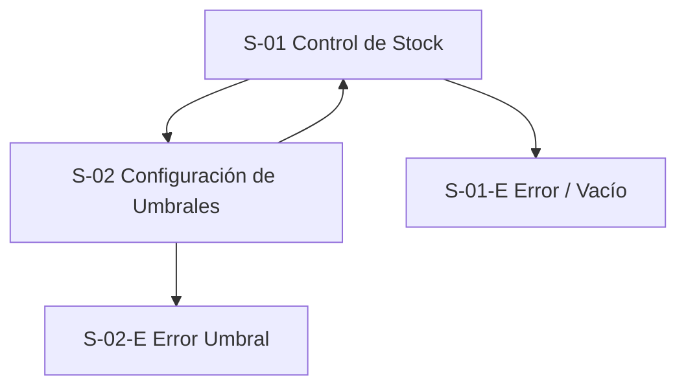

# WF-015 — Control de stock y disponibilidad

> **Fuentes normativas:** SPEC individual de esta funcionalidad (`../../specs/SPEC-015-control-stock-disponibilidad.md`), HU individual de esta funcionalidad (`../../hu/HU-015-control-stock-disponibilidad.md`), `../DESIGN.md` y `../INDEX.md`. Ante contradicción, prevalece SPEC → HU → WF. Los contratos de reservas y consumos con Ventas y Postventa son contratos asíncronos desacoplados mediante eventos **provisionales no homologados**; el prototipo no debe simular pagos realizados ni confirmaciones externas como si estuvieran implementadas. Las anotaciones, supuestos y referencias técnicas permanecen en este documento y no se muestran como elementos de la interfaz simulada.

## 0. Instrucciones para el agente

Genera un wireframe detallado, anotado y navegable para el control de stock y
disponibilidad descrito en este archivo.

Antes de diseñar:

1. Consulta ../../specs/SPEC-015-control-stock-disponibilidad.md.
2. Consulta ../../hu/HU-015-control-stock-disponibilidad.md.
3. Consulta ../DESIGN.md.
4. Consulta ../INDEX.md.
5. Usa este documento para la composición, interacción y estados del flujo.

Prioridad de fuentes:

1. La especificación define reglas de negocio y restricciones globales.
2. La historia de usuario define criterios de aceptación y escenarios.
3. Este documento define navegación y comportamiento de interfaz.
4. DESIGN.md define la representación visual.

Si las fuentes se contradicen o no resuelven una decisión, no inventes una
regla. Registra la cuestión en Preguntas y decisiones pendientes e identifica
la pantalla afectada.

Reglas de producción:

- La unidad operativa de inventario es el saldo por **`(sku, location_id)`**. El producto es agrupador comercial y no tiene stock propio; el inventario reside en los SKUs vendibles (incluido `sku_base` en producto simple).
- Se controlan tres magnitudes: stock físico (`on_hand`), unidades reservadas (`reserved`) y unidades disponibles para venta (`available = max(on_hand - reserved, 0)`).
- El stock **nunca puede quedar negativo** (`available >= 0`).
- Determinación de estados: `available = 0 → AGOTADO`; `0 < available <= umbral_resuelto → STOCK_BAJO`; `available > umbral_resuelto → DISPONIBLE`.
- Modelo de umbrales: existe un **umbral global por defecto** configurable a nivel de sistema (`umbral_stock_bajo_default`) y un **override opcional por SKU**. El umbral resuelto aplica `override SKU ?? umbral_global` (en ejemplos ilustrativos se usa 5 unidades, pero el valor contractual del sistema es configurable). No se definen umbrales por ubicación.
- Inventario provee capacidades internas idempotentes de movimiento: `reserve`, `release` y `consume` sobre `(sku, location_id)`. Los movimientos por venta se coordinan mediante eventos externos provisionales (`order.confirmed`, `order.cancelled`, `order.returned`); `order.created` por sí solo no reserva ni descuenta en el MVP salvo futura homologación de un contrato de reservas. Despacho no genera consumos adicionales ni modifica directamente el stock.
- Tras cada mutación persistida por eventos o carga masiva se emite el evento de dominio `inventory.stock.changed`.
- No elijas una librería de UI ni una estrategia CSS.
- Usa datos ficticios y no consumas APIs reales.
- Numera las anotaciones como A-01, A-02, A-03, etc.

### Formato del entregable

Genera un prototipo navegable con HTML, CSS y JavaScript estáticos:

- El punto de entrada debe ser index.html.
- Debe funcionar sin proceso de compilación.
- Usa rutas y recursos relativos.
- No uses React ni dependencias del frontend productivo.
- No requieras conexión a servicios externos.
- Simula únicamente las interacciones necesarias para validar el flujo.
- Implementa un diseño responsivo real para escritorio, tablet y móvil mediante CSS y cambios de viewport; no agregues controles internos de dispositivo.
- Documenta las anotaciones A-xx fuera de la interfaz simulada; no las renderices en el prototipo.
- Aplica el estilo monocromático y de baja fidelidad de DESIGN.md.

### Entregables esperados

1. Listado y consulta operativa de stock por SKU y ubicación (`on_hand`, `reserved`, `available`, umbral resuelto y estado).
2. Pantalla/modal de configuración de umbrales: umbral global por defecto y override por SKU con opción de eliminar override.
3. Filtros avanzados por SKU, producto, ubicación (`location_id`) y estado de stock.
4. Visualización reactiva ante eventos de consumo/reserva simulados.
5. Estados de carga, vacío, error y filtros sin resultados.
6. Navegación funcional entre los estados simulados.

---

## 1. Metadatos

| Campo | Valor |
|---|---|
| ID del wireframe | WF-015 |
| Nombre del flujo | Control de stock y disponibilidad |
| Versión | 0.5 |
| Estado | Borrador |
| Responsable | Miguel Ángel Taco Zavala |
| Fecha | 2026-09-17 |
| Última actualización | 2026-09-21 |

## 2. Trazabilidad

| Fuente | Identificador o sección | Aporte al flujo |
|---|---|---|
| Spec | SPEC-015-control-stock-disponibilidad.md, secciones 1–6 | Modelo `(sku, location_id)`, saldos `on_hand`/`reserved`/`available`, umbrales y consumo |
| Historia de usuario | HU-015-control-stock-disponibilidad.md, CA-01 a CA-10 | Criterios de aceptación y escenarios Gherkin |
| Diseño | DESIGN.md | Lenguaje visual monocromático de baja fidelidad |
| Backlog | No proporcionado | No se asignan IDs de backlog |

### Funcionalidades incluidas

- Consultar existencias por SKU y ubicación con desglose de `on_hand`, `reserved` y `available`.
- Determinar estado de stock (Disponible, Stock bajo, Agotado) según umbral resuelto.
- Configurar el umbral global por defecto (`umbral_stock_bajo_default`).
- Configurar y eliminar overrides de umbral de stock bajo por SKU.
- Reflejar la actualización automática de saldos y emisión reactiva de `inventory.stock.changed`.

### Fuera de alcance

- Dashboard analítico consolidado y alertas globales de stock: WF-016.
- Carga masiva y conteo inicial en lote: WF-001.
- Cobros, checkout y procesamiento de pedidos: canal de ventas / Pasarela / Postventa.
- Creación y edición de variantes: WF-004.
- CRUD manual backoffice de mermas y conteo físico desvinculado de carga masiva: fuera del alcance del módulo.

---

## 3. Usuario objetivo

| Aspecto | Definición |
|---|---|
| Persona | Responsable o gestor comercial / operativo de inventario |
| Rol en el sistema | Usuario autenticado con permisos de consulta y gestión de disponibilidad |
| Nivel técnico | Operativo básico/intermedio |
| Contexto de uso | Verificación de existencias por canal/almacén y parametrización de umbrales |
| Necesidad principal | Conocer la disponibilidad real de cada SKU por almacén y parametrizar alertas de reposición |
| Permisos relevantes | Consultar stock y configurar umbrales de inventario |
| Dispositivo principal | Escritorio para gestión global; tablet/móvil para consulta en ruta o piso |

---

## 4. Objetivo del flujo

El responsable de inventario debe poder consultar la disponibilidad de cada SKU
por almacén, parametrizar umbrales globales y específicos por SKU para la detección
de stock bajo, y verificar el impacto de los consumos y reservas en tiempo real.

### Resultado exitoso

El sistema mantiene actualizados los saldos `on_hand`, `reserved` y `available`
por `(sku, location_id)`, aplica las reglas de umbral (`override SKU ?? umbral_global`)
y notifica reactivamente los cambios de disponibilidad a los canales.

### Indicadores de finalización

- Configuración de umbral: mensaje de confirmación y badge/estado recalculado en pantalla.
- Consulta de disponibilidad: saldos y estados sincronizados con la base operativa.

---

## 5. Precondiciones y disparador

### Precondiciones

- El usuario tiene una sesión válida y permisos de inventario.
- Existen SKUs vendibles registrados en Catálogo (WF-003 / WF-004).
- Existen ubicaciones/almacenes habilitados (al menos `DEFAULT`).

### Puntos de entrada

- Ruta propuesta: `/inventario` o `/inventario/stock`.
- Entrada propuesta: opción "Control de Stock" dentro del módulo de Inventario.

### Salidas del flujo

| Resultado | Destino o comportamiento |
|---|---|
| Umbral guardado | S-01 con indicador de estado recalculado |
| Cancelación | Cierra modal/panel y regresa a S-01 sin mutar datos |
| Sin permisos | Muestra mensaje de acceso restringido |

---

## 6. Secuencia principal

### Flujo A — Consultar disponibilidad por SKU y Ubicación

1. El responsable accede al listado de stock (S-01).
2. Filtra por SKU, producto o almacén (`location_id`).
3. La tabla muestra `on_hand`, `reserved`, `available` y el estado calculado (Disponible, Stock bajo, Agotado).

### Flujo B — Configurar umbral global por defecto

1. El usuario pulsa "Configuración de Umbrales" (S-02).
2. En la sección "Umbral Global", modifica el valor de `umbral_stock_bajo_default` (ej. 5 unidades).
3. Guarda los cambios; el sistema actualiza el fallback global para todos los SKUs sin override.

### Flujo C — Configurar o eliminar override por SKU

1. En S-02 (o desde la acción de fila en S-01), abre la configuración del SKU.
2. Ingresa un valor numérico específico para establecer el override, o pulsa "Eliminar override" para volver al valor global.
3. Guarda; el sistema recalcula inmediatamente el estado del SKU según `umbral_efectivo`.

### Flujos alternativos

| ID | Condición | Comportamiento esperado | Retorno |
|---|---|---|---|
| ALT-01 | Override de SKU menor a 0 | Error: "El umbral debe ser un entero mayor o igual a 0" | S-02 |
| ALT-02 | Error de carga del listado | Mostrar estado de error con botón de reintento | S-01-E |
| ALT-03 | Filtro sin resultados | Mensaje contextual: "No se encontraron existencias con los filtros aplicados" | S-01 |

---

## 7. Inventario de pantallas y variantes

| ID | Pantalla o variante | Propósito | Ruta/presentación | Obligatoria |
|---|---|---|---|---|
| S-01 | Control de stock por SKU | Listado de existencias, saldos y estados por ubicación | `/inventario` | Sí |
| S-01-E | Vacío o error de stock | Manejar ausencia de registros o fallos de red | Variante de S-01 | Sí |
| S-02 | Configuración de umbrales | Administrar umbral global y overrides por SKU | Modal o `/inventario/umbrales` | Sí |
| S-02-E | Error en umbrales | Manejar rechazo de validación o fallo de guardado | Variante de S-02 | Sí |

---

## 8. Mapa de navegación

---

## 9. Especificación por pantalla

### S-01 — Control de stock por SKU y ubicación

#### Propósito
Consultar el saldo de inventario de cada variante vendible desglosado por almacén/ubicación y verificar el estado de disponibilidad.

#### Regiones y componentes
| Región | Componente neutral | Contenido | Comportamiento |
|---|---|---|---|
| Encabezado | Título + botones | "Control de Stock y Disponibilidad" + Botón "Configurar umbrales" | Encabezado principal |
| Filtros | Barra de filtros | Búsqueda por SKU/Producto, Selector de ubicación (`location_id`), Selector de estado | Actualiza tabla de saldos |
| Tabla | Tabla de inventario | SKU, Producto, Ubicación, Físico (`on_hand`), Reservado (`reserved`), Disponible (`available`), Umbral efectivo, Estado, Acciones | Muestra saldos vigentes |
| Acciones fila | Botones | "Configurar umbral" | Abre S-02 enfocado en el SKU seleccionado |

#### Anotaciones
| ID | Elemento | Anotación |
|---|---|---|
| A-01 | Unidad operativa | Control estricto por par `(sku, location_id)` |
| A-02 | Cálculo de disponible | `available = max(on_hand - reserved, 0)` |
| A-03 | Estado calculado | Badge monocromático: Disponible, Stock bajo o Agotado |
| A-04 | Umbral efectivo | Muestra el valor resuelto indicando si proviene de override SKU o global |

---

### S-02 — Configuración de umbrales de stock bajo

#### Propósito
Administrar el valor por defecto del sistema y los overrides específicos aplicables a SKUs individuales.

#### Regiones y componentes
| Región | Componente neutral | Contenido | Comportamiento |
|---|---|---|---|
| Umbral Global | Formulario | Campo `umbral_stock_bajo_default` + Botón "Guardar global" | Aplica a todos los SKUs sin override |
| Override por SKU | Formulario de búsqueda | Buscador de SKU + Campo de umbral específico + Botones "Establecer" / "Eliminar override" | Sobrescribe el valor global para el SKU |
| Resumen | Tabla de overrides | Listado de SKUs con override activo y su valor configurado | Permite editar o retirar override |

#### Anotaciones
| ID | Elemento | Anotación |
|---|---|---|
| A-05 | Jerarquía de umbral | `umbral_efectivo = override SKU ?? umbral_global` |
| A-06 | Eliminación de override | Al eliminar el override, el SKU vuelve inmediatamente a evaluar con el umbral global |
| A-07 | Ámbito del umbral | El umbral aplica a nivel de SKU y no por ubicación |

---

## 10. Estados de interfaz

| Estado | Aplica | Representación | Acciones | Recuperación |
|---|---|---|---|---|
| Listado cargando | Sí | Skeleton en tabla | Esperar | Reintento automático |
| Listado con datos | Sí | Tabla de saldos y badges de estado | Filtrar, configurar umbrales | N/A |
| Listado vacío | Sí | Mensaje: "No hay registros de inventario disponibles" | Orientación a crear variantes | Cargar catálogo |
| Modal guardando | Sí | Botones deshabilitados + indicador | Evitar doble envío | Esperar respuesta |
| Error de validación | Sí | Mensaje contextual en modal sin perder datos | Corregir o reintentar | Reintentar |
| Sin permisos | Sí | Mensaje de acceso denegado | Volver a pantalla principal | Solicitar permisos |

### Reglas para datos remotos

- Los saldos se actualizan reactivamente al recibir notificaciones de eventos (`inventory.stock.changed`).
- Las consultas de disponibilidad se resuelven atómicamente sobre los saldos persistidos.

---

## 11. Comportamiento responsivo

DESIGN.md define 12 columnas en escritorio y 4 en móvil.

| Aspecto | Escritorio | Tablet | Móvil |
|---|---|---|---|
| Navegación | Barra completa | Condensada | Patrón global móvil |
| Tabla de stock | Columnas completas con desgloses | Tabla compacta | Tarjetas apiladas por SKU/almacén |
| Modales | Diálogo centrado | Diálogo centrado | Pantalla completa con scroll |

### Condiciones críticas

- Funcional a 320 px sin scroll horizontal.
- Controles táctiles mínimos de 44x44 px.

---

## 12. Accesibilidad

- Cumplimiento WCAG 2.2 AA.
- Los estados de stock (Disponible, Stock bajo, Agotado) se identifican por texto e icono, no solo color.
- Modales con atrapamiento de foco y tecla `Escape`.
- Anuncios de actualización mediante `aria-live`.

---

## 13. Tono visual y contenido

Aplicar DESIGN.md como única fuente de representación visual monocromática.

### Microcopy crítica

| Contexto | Texto propuesto | Observación |
|---|---|---|
| Umbral actualizado | "Umbral configurado exitosamente para el SKU {sku}." | Confirmación |
| Override eliminado | "Override eliminado; el SKU {sku} utilizará el umbral global ({valor})." | Confirmación |
| Estado stock bajo | "Stock bajo: unidades disponibles en o por debajo del umbral." | Explicación de alerta |

---

## 14. Restricciones técnicas relevantes

- Aplicación objetivo: React, TypeScript, TanStack Query.
- Contratos HTTP: OpenAPI / Swagger.
- Eventos: AsyncAPI (`inventory.stock.changed`).

### Dependencias o contratos

| Componente / Servicio | Tipo de integración | Contrato / Evento | Estado del contrato | Descripción e impacto en Stock |
|---|---|---|---|---|
| Catálogo de productos y variantes (WF-003, WF-004) | Interna (dependencia) | API interna / datos de variantes | Interno / definido por SPEC | Provee SKUs vendibles válidos (`sku_base` en producto simple o SKU de variante). Sin SKU válido no opera inventario. |
| Ventas / Checkout | Externa (entrada asíncrona) | `order.confirmed` | **Provisional no homologado** | Solicita confirmación definitiva de consumo tras venta confirmada. Aplica débito ACID y registra Kardex. `order.created` no afecta stock en MVP mientras no exista homologación de reserva. |
| Ventas / Cancelaciones | Externa (entrada asíncrona) | `order.cancelled` | **Provisional no homologado** | Si la venta confirmada se cancela antes del despacho, compensa únicamente consumos previos exitosos no compensados. |
| Postventa / Devoluciones | Externa (entrada asíncrona) | `order.returned` | **Provisional no homologado** | Reintegra stock únicamente para unidades devueltas aceptadas y físicamente reintegrables en la ubicación de destino. |
| Despacho / Fulfillment | Externa (delimitación) | N/A | Regla de delimitación | No genera consumo adicional ni altera stock; únicamente entrega unidades de ventas previamente confirmadas. |
| Canales (Marketplace, Retail, Chatbot) y Dashboard (WF-016) | Externa / Interna (salida) | `inventory.stock.changed` | Contrato interno definido | Notificación asíncrona de cambio persistido de stock (consumo o ajuste) para actualizar proyecciones de disponibilidad y alertas. |

---

## 15. Privacidad, seguridad y acciones sensibles

- La parametrización de umbrales requiere permisos específicos de gestión de inventario.
- Cada modificación de umbral registra el identificador del usuario responsable y timestamp en UTC.

---

## 16. Criterios de aceptación del wireframe

- [x] Permite consultar saldos `on_hand`, `reserved` y `available` por `(sku, location_id)`.
- [x] Calcula deterministamente los estados Disponible, Stock bajo y Agotado.
- [x] Aplica la jerarquía de umbrales: `override SKU ?? umbral_global`.
- [x] Permite configurar el umbral global por defecto y overrides específicos por SKU.
- [x] Permite eliminar overrides y retornar al umbral global.
- [x] Es responsivo y consistente con DESIGN.md.

### Cobertura de la historia de usuario

| Criterio | Cobertura |
|---|---|
| CA-01 | S-01, consulta de saldos y disponibilidad por SKU y ubicación |
| CA-02 | S-01, estados Disponible, Stock bajo y Agotado |
| CA-03 | S-01 y S-02, cálculo con `umbral_stock_bajo_default` y override por SKU |
| CA-04 | S-01, actualización por eventos y prevención de stock negativo |
| CA-05 | S-01, validación de stock disponible frente a reservas |
| CA-06 | S-01, emisión y recepción reactiva de `inventory.stock.changed` |
| CA-07 | S-01, transición de estados tras consumo o reposición |
| CA-08 | S-01, soporte de `(sku, location_id)` con fallback a ubicación `DEFAULT` |
| CA-09 | S-02, administración y eliminación de overrides de umbral |
| CA-10 | S-01, persistencia desacoplada e inmutabilidad de registros |

---

## 17. Supuestos

| ID | Supuesto | Motivo | Impacto si es incorrecto | Validar |
|---|---|---|---|---|
| SUP-01 | WF-015 es el ID asignado en INDEX.md | Rama `taco` | Renombrar archivo | Sí |
| SUP-02 | La ruta propuesta es `/inventario` | Estandarización de rutas | Cambiar rutas | Sí |
| SUP-03 | La ubicación inicial es `DEFAULT` en despliegues monoalmacén | Regla de negocio de SPEC-015 | Ajustar vistas | Sí |

---

## 18. Preguntas y decisiones pendientes

| ID | Pregunta o decisión | Responsable | Bloquea | Estado |
|---|---|---|---|---|
| Q-01 | Resuelto: Unidad operativa es `(sku, location_id)` con magnitudes on_hand, reserved, available. | Specs/HU definitivos | No | Resuelta |
| Q-02 | Resuelto: Umbral se configura a nivel global con overrides opcionales por SKU. | Spec/HU | No | Resuelta |
| D-01 | Selección de librería UI y estrategia CSS | Frontend | Implementación | Pendiente |

### Alineación definitiva de Control de Stock

- La gestión de inventario garantiza atomicidad y prevención de saldos negativos sobre el par `(sku, location_id)`.
- El umbral de stock bajo aplica la jerarquía `override SKU ?? umbral_global`, notificando reactivamente cualquier cambio a través de `inventory.stock.changed`.

---

## 19. Registro de revisiones

| Versión | Fecha | Autor | Cambio | Aprobado por |
|---|---|---|---|---|
| 0.1 | 2026-09-17 | Asistente | Borrador inicial de gestión de inventario | Pendiente |
| 0.3 | 2026-09-18 | Asistente | Incorporación del modelo (sku, location_id) y eventos asíncronos | Pendiente |
| 0.4 | 2026-09-21 | Asistente | Reconstitución del wireframe con estructura canónica | Pendiente |
| 0.5 | 2026-09-21 | Asistente | Ajuste de alcance al requerimiento del curso (consulta, umbrales y actualización por consumo) | Aprobado |

---

## Lista de control antes de generar el HTML

- [x] Las fuentes funcionales están identificadas.
- [x] El alcance y fuera de alcance están claros.
- [x] Las pantallas y variantes están inventariadas (S-01 a S-02).
- [x] Los criterios CA-01 a CA-10 están cubiertos.
- [x] Los saldos on_hand, reserved, available y la regla de no saldo negativo están documentados.
- [x] El modelo de umbrales (global + override por SKU) está documentado.
- [x] Los supuestos y preguntas están registrados.
- [x] El formato HTML está definido.
- [ ] Confirmar el ID WF-015 contra INDEX.md.
- [ ] Confirmar rutas y permisos antes de implementar el frontend.
